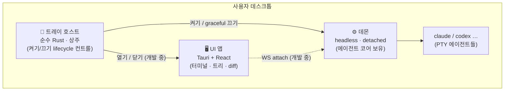

# Engram Dashboard

> ⚠️ **개발 중 (Work In Progress)** — 활발히 개발 중인 프로젝트입니다. 구조·API가 자주 바뀌며 일부 기능은 미완성입니다.

여러 **Claude(추후 Codex·API) 에이전트**를 PTY로 띄우고, 터미널·트리·diff를 한 화면에서 관리하는 **네이티브 데스크톱 대시보드**입니다. 에이전트를 백그라운드 데몬이 들고 있어 **창을 닫아도 작업이 살아있고**, 다시 열면 재연결됩니다(tmux 모델).

## 구조

세 프로세스로 나뉩니다 — **데몬이 에이전트를 소유**하고(트레이·UI가 죽어도 살아남음), 트레이와 UI는 거기에 붙는 클라이언트입니다.



- **트레이 호스트** — 시작프로그램에 상주하는 가벼운 트레이 유틸(WebView 없는 순수 Rust). 데몬을 켜고/끄고, UI를 열고/닫고, 상태를 아이콘으로 보여줍니다.
- **데몬** — 에이전트를 실제로 띄우고 보유하는 headless 엔진. 트레이/UI가 죽어도 살아남고(detached), 다시 붙으면 세션을 무손실 복원합니다.
- **UI 앱** — Tauri 창. 화면 표시와 입력만 담당하는 순수 I/O 레이어입니다.

### 설계 원칙

- **교체 가능성:** 모든 기능은 추상 인터페이스(`OutputSink`/`AgentTransport` 등) 위에 구현 — 특정 모델·전송 방식에 묶지 않습니다.
- **LLM-우선 제어:** 모든 메뉴·동작은 LLM이 프로그래밍으로 제어할 수 있게 설계합니다(사람의 UI 조작은 보조).

## 기술 스택

| 레이어 | 선택 |
|---|---|
| 앱 껍데기 | Tauri v2 (Rust 백엔드 + `portable-pty`) |
| 프론트엔드 | React 19 + TypeScript + Vite |
| 터미널 | xterm.js |
| Diff | Monaco DiffEditor |
| 전송 | WebSocket (데몬 ↔ 클라) |

## 빌드 · 실행

```bash
# 전체 앱(E2E) 개발 실행
npm install
npm run tauri dev

# Rust 워크스페이스 빌드·테스트
cargo build
cargo test
```

Windows 기준입니다(트레이·데몬 spawn에 Windows API 사용). 크로스플랫폼은 추후.

## 문서

설계·진행·결정 기록은 [`docs/`](docs/)에 있습니다:

- **[`docs/README.md`](docs/README.md)** — 전체 인덱스(구조·진행 상태·다음 작업)
- **`docs/decisions/`** — 설계 결정 기록(ADR, *왜* 그렇게 정했나 + 거부한 대안)
- **`docs/process/step-log.md`** — 진행 타임라인(*언제/무엇*)
