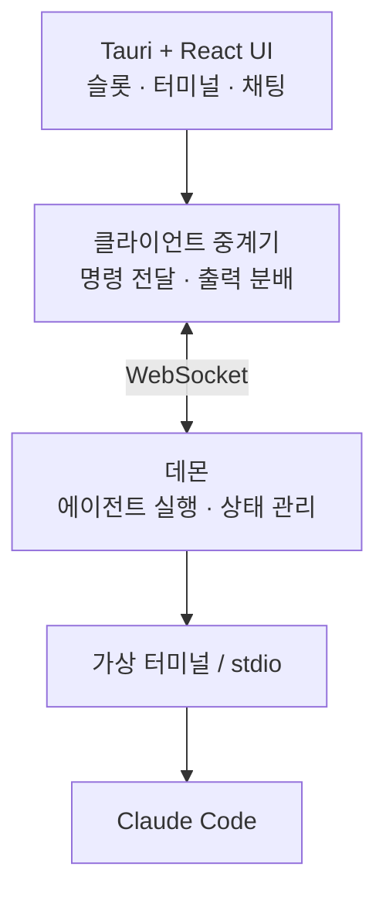

# Engram Dashboard

여러 AI 코딩 에이전트를 실행하고 모니터링하는 Windows 데스크톱 애플리케이션입니다.


> 현재 개발 중입니다. Windows와 Claude Code만 지원하며 내부 API는 변경될 수 있습니다.

<!-- TODO: 스크린샷 또는 짧은 시연 영상 추가 -->

## 주요 기능

- 여러 Claude Code 에이전트 실행 및 모니터링
- 슬롯 분할과 별도 창을 이용한 화면 구성
- UI를 닫아도 에이전트 실행을 유지하는 백그라운드 데몬
- 실행 중인 에이전트 재접속 및 출력 복원
- 터미널과 구조화된 채팅 출력
- 메뉴·단축키·에이전트 제어에서 같은 명령 사용
- 작업 경로를 프리셋으로 저장하고 재사용

## 구조

데몬이 에이전트 프로세스와 출력 상태를 관리하고, Tauri 클라이언트가 WebSocket으로 연결됩니다.



모델별 실행 방식은 공통 추상화 아래에서 분리했습니다. 현재는 Claude Code만 연결되어 있으며 Codex, Gemini, API 기반 모델은 추후 추가할 예정입니다.

## 요구 사항

- Windows 10 또는 11
- Node.js 20+
- Rust stable 툴체인
- Claude Code 설치 및 로그인
- `claude` 명령이 `PATH`에 등록된 환경

## 개발 실행

```bash
git clone https://github.com/kimsunzun/engram-dashboard.git
cd engram-dashboard
npm install
npm run tauri dev
```

Windows에서는 저장소 루트의 `run-dashboard.bat`도 사용할 수 있습니다.

### 테스트

```bash
cargo test --workspace
npm test
```

## 저장소 구성

```text
crates/
  engram-dashboard-protocol    데몬과 클라이언트가 공유하는 프로토콜
  engram-dashboard-core        에이전트 실행, 수명 및 출력 관리
  engram-dashboard-daemon      백그라운드 데몬과 WebSocket 서버
  engram-dashboard-discovery   데몬 탐색 및 실행
src-tauri/                     Tauri 앱 셸, 창 및 트레이
src/                           React 프론트엔드
docs/                          설계 결정, 조사 및 진행 기록
```

## 개발 현황

구현됨:

- Claude Code 에이전트 실행 및 관리
- 슬롯 기반 화면 분할과 다중 창
- 데몬 분리, 재접속 및 출력 복원
- UI와 에이전트 제어가 공유하는 명령 체계
- 터미널, 구조화된 채팅 및 diff 출력

예정:

- 에이전트 모니터링 개선
- 에이전트 간 작업 전달
- 세션이 바뀌어도 역할과 작업 내용을 유지하는 구조
- Codex, Gemini 및 API 기반 모델 연결
- macOS 및 Linux 지원

## 문서

- [문서 인덱스](docs/README.md)
- [아키텍처 개요](docs/reference/architecture-overview.md)
- [설계 결정 기록](docs/decisions/)
- [개발 진행 기록](docs/process/step-log.md)

## 기여

프로젝트 구조가 아직 자주 변경됩니다. 큰 변경을 시작하기 전에는 이슈에서 범위를 먼저 논의하고 관련 [설계 결정 기록](docs/decisions/)을 확인해 주세요.

버그 제보와 범위가 명확한 Pull Request를 환영합니다.

## 라이선스

아직 라이선스를 정하지 않았습니다. 라이선스가 추가되기 전까지 저장소 내용에는 기본 저작권 규칙이 적용됩니다.
