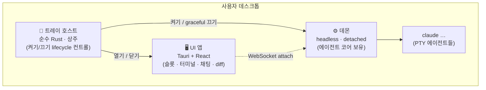

# Engram Dashboard

여러 AI 에이전트를 역할별로 구성하고 **한 화면에서 운영하는 네이티브 데스크톱 대시보드**.


> **Work in Progress** — 활발히 개발 중인 프로젝트입니다. 구조와 API가 자주 바뀌며, 현재는 **Windows + Claude Code** 조합만 동작합니다.

<!-- TODO: 스크린샷 / 시연 GIF -->

## 왜 만들었나

서브에이전트는 보통 현재 세션 안에서 일회성으로 호출하고 버려집니다. 역할별 작업 맥락을 메인 세션과 분리해 유지하거나, 여러 에이전트의 작업 상태를 한 화면에서 확인하고 제어하기는 어렵습니다.

Engram Dashboard는 "세션에서 잠시 호출하는 에이전트"가 아니라 **역할과 문맥을 가진 전용 에이전트**를 운영하는 것을 지향합니다.

- 제작 규칙과 사례가 쌓인 스킬 제작 전용 에이전트
- Unreal MCP 제어처럼 무거운 맥락을 전담해 메인 세션과 분리하는 에이전트
- 단순 작업은 Sonnet, 핵심 판단은 Opus — 역할별 모델 배정
- 생성 · 상태 확인 · 화면 배치 · 명령을 한곳에서

## 주요 기능

- **슬롯 기반 화면** — 빈 슬롯에 에이전트나 도구를 배치하고 가로·세로로 자유 분할. 프리셋으로 여러 에이전트를 빠르게 생성.
- **다중 창 모니터링** — 슬롯을 별도 창으로 분리하고, 같은 에이전트를 여러 화면에서 동시에 확인.
- **세션 유지 (tmux 모델)** — 에이전트를 백그라운드 데몬이 소유하므로 창을 닫아도 작업이 계속되고, 다시 열면 재접속·복원.
- **에이전트도 조작할 수 있는 UI** — 버튼·단축키·에이전트 요청이 같은 공통 명령을 실행. 사람이 할 수 있는 화면 조작(슬롯 분할, 배치, 탭·창 관리, 테마 변경)을 에이전트에게도 공개.
- **터미널 + 채팅 렌더링** — xterm.js 터미널과 구조화된 채팅 뷰, Monaco 기반 diff 뷰.
- **모델 교체를 고려한 구조** — 공통 추상화(`AgentTransport`/`OutputSink` 등) 아래 모델별 구현을 분리. 현재는 Claude만 연결되어 있고, Codex·Gemini·API 모델은 로드맵에 있습니다.

## 아키텍처

세 프로세스로 나뉩니다 — **데몬이 에이전트를 소유**하고(트레이·UI가 죽어도 살아남음), 트레이와 UI는 거기에 붙는 클라이언트입니다.



- **트레이 호스트** — 시작프로그램에 상주하는 가벼운 트레이 유틸(WebView 없는 순수 Rust). 데몬을 켜고 끄고, UI를 열고 닫고, 상태를 아이콘으로 표시.
- **데몬** — 에이전트를 실제로 띄우고 보유하는 headless 엔진. 클라이언트가 죽어도 살아남고, 다시 붙으면 세션을 복원.
- **UI 앱** — Tauri 창. 화면 표시와 입력만 담당하는 순수 I/O 레이어.

### 설계 원칙

- **교체 가능성** — 모든 기능은 추상 인터페이스 위에 구현. 특정 모델·전송 방식에 묶지 않습니다.
- **LLM-우선 제어** — 모든 메뉴·동작은 LLM이 프로그래밍으로 제어할 수 있게 설계합니다(사람의 UI 조작은 같은 명령의 또 다른 입구).

## 시작하기

### 요구 사항

- Windows 10/11 (트레이·데몬 spawn에 Windows API 사용 — 크로스플랫폼은 로드맵)
- [Node.js](https://nodejs.org/) 20+
- [Rust](https://rustup.rs/) stable 툴체인
- [Claude Code](https://claude.com/claude-code) CLI 설치 및 로그인 (`claude` 명령이 PATH에 있어야 합니다)

### 실행

```bash
git clone https://github.com/kimsunzun/engram-dashboard.git
cd engram-dashboard

npm install
npm run tauri dev
```

또는 저장소 루트의 `run-dashboard.bat`를 더블클릭해도 됩니다.

### 테스트

```bash
cargo test     # Rust 워크스페이스
npm test       # 프론트엔드 (vitest)
```

## 프로젝트 구조

```text
crates/
  engram-dashboard-protocol    # 데몬 ↔ 클라이언트 wire 계약 (커맨드·이벤트·버전)
  engram-dashboard-core        # 에이전트 코어 — PTY 스폰·수명·출력 관리 (UI 의존 0)
  engram-dashboard-daemon      # headless 데몬 실행 파일
  engram-dashboard-discovery   # 데몬 발견 — daemon.json으로 찾고, 없으면 띄운 뒤 접속 정보 회수
src-tauri/                     # Tauri 앱 셸 (창 · 트레이)
src/                           # React 프론트엔드 (슬롯 · 터미널 · 채팅 · 에이전트 트리)
docs/                          # 설계 결정(ADR) · 진행 기록 · 리서치 · 컨벤션
```

## 로드맵

- [x] 다중 에이전트 실행·관리 (Claude)
- [x] 슬롯 기반 화면 분할 · 다중 창
- [x] 데몬 분리 — 세션 유지·재접속
- [x] 공통 명령 — 에이전트의 화면 제어
- [x] 터미널 · 채팅 · diff 렌더링
- [ ] 에이전트 모니터링 화면 고도화
- [ ] 오케스트레이션 — 에이전트 간 작업 전달
- [ ] 에이전트 영속성 — 세션이 바뀌어도 역할과 작업 내용 유지
- [ ] Codex · Gemini · API 모델 연결
- [ ] 크로스플랫폼 (macOS · Linux)

## 개발 방식

코드는 AI 에이전트가 작성하고, 사람은 문제 정의 · 구조 설계 · 의사결정 · 검수를 담당하는 방식으로 개발합니다. 그 과정이 저장소에 그대로 남아 있습니다.

- 설계 결정과 거부한 대안 → [`docs/decisions/`](docs/decisions/) (ADR)
- 진행 타임라인 → [`docs/process/step-log.md`](docs/process/step-log.md)
- 전체 문서 인덱스 → [`docs/README.md`](docs/README.md)

## 라이선스

아직 라이선스를 정하지 않았습니다. 사용·기여 관련 문의는 이슈로 남겨주세요.
