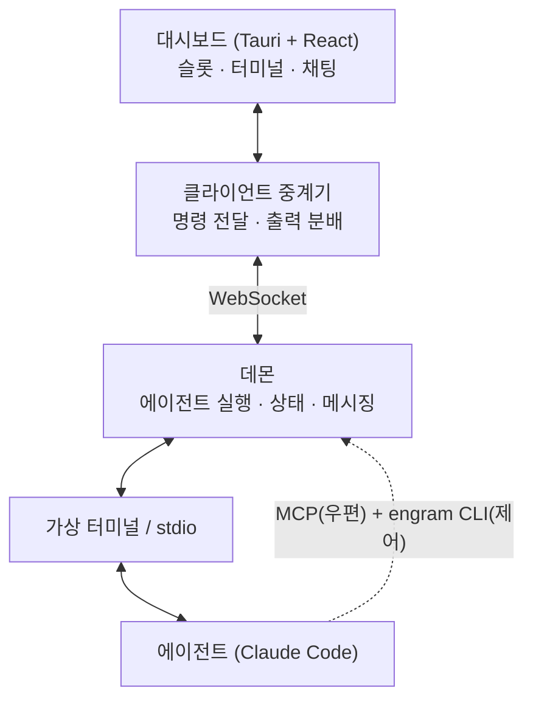
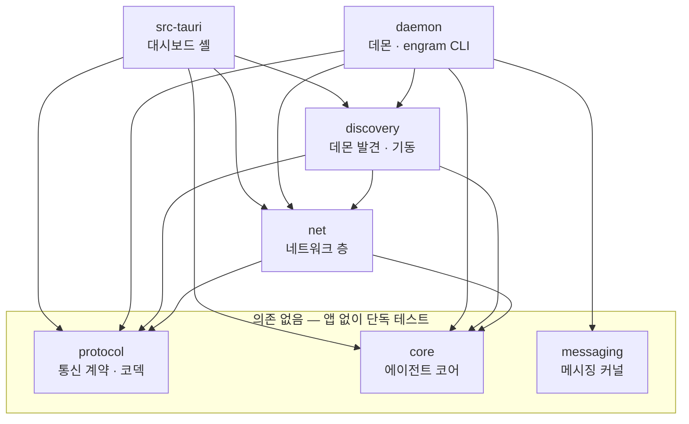

# Engram Dashboard

여러 Claude Code 에이전트를 한 화면에서 실행하고 관리하는 Windows 데스크톱 애플리케이션입니다.


> 개발 중입니다. Windows와 Claude Code만 지원하며 내부 API는 예고 없이 바뀔 수 있습니다.

<p align="center">
  <a href="https://www.youtube.com/watch?v=_tpWiXSIWFM">
    
  </a>
  <br>
  <em>▶ 시연 영상 보기 (YouTube)</em>
</p>

## 설치 및 실행

[Releases 페이지](https://github.com/kimsunzun/engram-dashboard/releases/latest)에서 `engram-dashboard-*-windows-x64.zip`을 받아 압축을 풀고 `engram-dashboard.exe`를 실행하면 됩니다. 설치 과정은 없습니다.

미리 준비해야 하는 것:

- Windows 10 또는 11 (x64)
- **Claude Code 설치 및 로그인** — `claude` 명령이 `PATH`에 있어야 합니다. 없으면 에이전트를 띄울 때 원인을 알기 어려운 오류가 납니다(안내 메시지가 아직 없습니다)
- **WebView2 런타임** — 최근 Windows에는 기본 포함되어 있지만, 설치 관리자를 쓰지 않으므로 없는 환경(LTSC·N 에디션 등)에서는 창이 뜨지 않습니다. [Microsoft 배포 페이지](https://developer.microsoft.com/microsoft-edge/webview2/)에서 받으세요

**압축을 푼 폴더의 내용물을 흩뜨리지 마세요.** 실행파일 셋과 `prompts/` 폴더가 서로를 파일 위치로 찾습니다 — `PATH`를 뒤지지 않습니다. 폴더째 옮기거나 바탕화면 바로가기를 만드는 것은 괜찮지만, 실행파일 하나만 따로 빼내면 데몬이나 제어 CLI를 못 찾고, 에이전트 간 메시징이 조용히 동작하지 않습니다.

코드 서명을 하지 않아서 첫 실행 때 Windows SmartScreen 경고가 뜰 수 있습니다.

에이전트 명부와 프리셋은 실행파일 옆에 만들어지는 `data\` 폴더에 저장됩니다. **이 폴더를 지우거나 옮기기 전에 앱을 완전히 종료하세요** — 앱이 켜져 있는 동안에는 데몬이 `data\daemon.json`(접속 정보 겸 중복 실행 방지 장치)을 붙들고 있어서 그 폴더의 삭제도 이동·이름 변경도 거부됩니다. 앱을 끈 뒤에는 앱 폴더째 지우면 데이터도 함께 사라지고, 폴더째 옮기면 따라옵니다. 쓰기 권한이 없는 곳(`C:\Program Files` 등)에 압축을 풀면 이 폴더를 만들 수 없어 데몬이 기동하지 않으니, 사용자 폴더처럼 쓸 수 있는 위치에 두세요.

클라우드 동기화 폴더(OneDrive·Dropbox·Google Drive 등) 안에 풀 때는 한 가지를 알아 두세요. 데몬은 켤 때마다 새 접속 토큰을 만들어 `daemon.json`에 쓰는데, 실행 중에는 이 파일을 지우거나 갈아끼울 수 없어 동기화 엔진은 **버전을 계속 쌓기만** 합니다. 즉 그동안 발급된 토큰이 전부 그 서비스의 버전 기록에 남습니다. 로컬 전용 폴더에 두는 쪽을 권합니다.

## 주요 기능

**여러 에이전트를 한 화면에서**

- Claude Code 에이전트를 여러 개 띄우고 화면을 가로·세로로 나눠 배치합니다. 칸은 우클릭 메뉴로 나누고 닫습니다
- 칸 하나를 별도 창으로 떼어낼 수 있습니다
- 탭으로 화면 구성을 여러 벌 두고 오갑니다
- 에이전트 출력은 터미널(xterm)과 구조화된 채팅 중 하나로 봅니다 — 만들 때 고르고 이후엔 바뀌지 않습니다

**에이전트 트리**

- 에이전트를 부모-자식으로 묶어 관리합니다(현재 한 단계까지). 드래그로 소속을 바꿉니다
- 아직 띄우지 않은 에이전트를 미리 등록해두고 필요할 때 깨웁니다. 종료된 에이전트도 목록에 남아 다시 깨울 수 있습니다
- 상태는 색이 아니라 모양으로 구분합니다(어두운 테마·전자잉크 대비)
- 자주 쓰는 작업 경로를 프리셋으로 등록해 목록으로 관리합니다

**사람과 LLM이 같은 핸들을 흔든다**

- 화면 조작은 전부 이름 붙은 명령으로 되어 있고, 메뉴와 단축키는 그 명령을 부르는 입구일 뿐입니다. 사람만 쓸 수 있는 조작을 따로 만들지 않는 것이 이 프로젝트의 설계 원칙입니다
- 에이전트는 `engram` CLI로 명부를 읽고, 동료를 깨우고, 새 에이전트를 만들고, 이름과 트리 소속까지 직접 바꿉니다. 이 창구는 띄워진 모든 에이전트에게 열려 있습니다
- 반대로 사람이 명령줄로 조작하는 경로는 지금 없습니다 — 사람은 화면으로, 에이전트는 CLI로 같은 기능에 닿습니다

**닫아도 죽지 않는 데몬**

- 창을 닫으면 트레이로 내려갈 뿐 에이전트는 계속 돕니다. 다시 열면 최근 출력이 되감겨 이어집니다
- 에이전트의 대화 세션 식별자를 보관해두어, 종료된 에이전트를 깨우면 하던 대화를 이어받습니다. 이어받기에 실패하면 새 대화를 임의로 만들지 않고 실패로 남깁니다 — 무엇을 할지는 사람이 정합니다

**에이전트 간 메시징**

- 에이전트가 다른 에이전트에게 직접 메시지를 보냅니다. 여러 명 동시 발송과 전체 발송(`@all`·`@here`)을 지원합니다
- 회신을 요구하는 메시지는 기한을 걸 수 있고, 기한이 지나면 보낸 쪽에 알려줍니다
- 상대가 작업 중이거나 잠들어 있으면 데몬이 맡아두었다가 손이 비는 시점에 한꺼번에 전달합니다

## 구조

### 실행 구성

실행파일 셋으로 나뉩니다. 데몬이 중심이고 나머지 둘은 붙었다 떨어지는 클라이언트입니다.

| 실행파일 | 역할 |
|---|---|
| `engram-dashboard.exe` | 창·트레이를 띄우는 GUI. 이걸 실행합니다 |
| `engram-dashboard-daemon.exe` | 에이전트 프로세스·출력 상태·메시징을 소유하는 상주 프로세스. 대시보드가 자동으로 띄웁니다 |
| `engram.exe` | 에이전트가 쓰는 우편·제어 CLI |

우편 채널은 에이전트를 띄울 때 하나로 정해집니다 — Claude는 MCP, MCP를 못 받는 백엔드는 CLI. 다른 채널로 들어온 우편은 데몬이 거절합니다. 에이전트 제어는 채널과 무관하게 CLI 전용입니다.

### 실행 흐름


```mermaid
graph TB
    UI["대시보드 (Tauri + React)<br/>슬롯 · 터미널 · 채팅"]
    Client["클라이언트 중계기<br/>명령 전달 · 출력 분배"]
    Daemon["데몬<br/>에이전트 실행 · 상태 · 메시징"]
    PTY["가상 터미널 / stdio"]
    Agent["에이전트 (Claude Code)"]

    UI <--> Client
    Client <-->|WebSocket| Daemon
    Daemon <--> PTY
    PTY <--> Agent
    Agent -.->|"MCP(우편) + engram CLI(제어)"| Daemon
```

### 코드 구조

Rust 워크스페이스 7개 crate입니다. 화살표는 의존 방향이며, 아래로 갈수록 의존이 적습니다.


```mermaid
graph TD
    tauri["src-tauri<br/>대시보드 셸"]
    daemon["daemon<br/>데몬 · engram CLI"]
    discovery["discovery<br/>데몬 발견 · 기동"]
    net["net<br/>네트워크 층"]

    subgraph base["의존 없음 — 앱 없이 단독 테스트"]
        protocol["protocol<br/>통신 계약 · 코덱"]
        core["core<br/>에이전트 코어"]
        messaging["messaging<br/>메시징 커널"]
    end

    tauri --> discovery
    tauri --> net
    tauri --> protocol
    tauri --> core

    daemon --> discovery
    daemon --> net
    daemon --> messaging
    daemon --> protocol
    daemon --> core

    discovery --> net
    discovery --> protocol
    discovery --> core

    net --> protocol
    net --> core
```

맨 아래 세 crate가 아무것도 의존하지 않는 것이 이 구조의 핵심입니다. `core`는 Tauri를 모르고 `messaging`은 같은 워크스페이스의 어떤 crate도 참조하지 않습니다 — 둘 다 컴파일러가 강제하는 벽이라 앱을 띄우지 않고 검증됩니다. 경계와 격리 게이트는 [아키텍처 개요](docs/reference/architecture-overview.md)에 있습니다.

### 지원 백엔드

에이전트가 띄우는 프로그램은 공통 추상화 아래로 분리해두어, 다른 CLI 에이전트나 API 기반 모델도 같은 인터페이스 위에 붙이는 구조입니다.

| 백엔드 | 상태 |
|---|---|
| Claude Code | 지원 |
| 셸 (`cmd`·`bash`) | 동작하지만 메뉴에 노출하지 않음 |
| Codex · Gemini | 골격만 있고 미연결 |
| API 기반 모델 (로컬 모델 포함) | 예정 |

macOS·Linux는 당장 계획에 없지만, Windows 전용 코드를 격리해두어 구조상 가능성은 열어두었습니다.

## 현재 한계

- **화면 배치가 저장되지 않습니다.** 대시보드를 다시 켜면 창·탭·분할이 초기화됩니다. 에이전트 명부와 프리셋은 데몬이 디스크에 보관하므로 남습니다
- **데몬을 재시작하면 에이전트가 자동으로 돌아오지 않습니다.** 명부에는 남아 있으니 직접 깨우면 대화를 이어받습니다
- **주고받던 우편이 데몬 재시작에 살아남지 않습니다.** 맡아둔 메시지와 미결 회신은 메모리에만 있습니다
- **메시징 화면이 없습니다.** 우편은 에이전트끼리만 오가고 대시보드에서 들여다볼 방법이 아직 없습니다
- **실행 중인 에이전트는 목록에서 지울 수 없습니다.** 먼저 종료한 뒤에 지워야 합니다
- **에이전트는 동료를 띄울 수는 있어도 멈추거나 지울 수는 없습니다.** 종료·삭제는 사람이 화면에서만 합니다
- **단축키는 두 개뿐이고 바꿀 수 없습니다** — `Ctrl+Shift+T`(테마 순환), `Ctrl+Tab`(다음 탭)
- **트레이의 「완전 종료」는 에이전트까지 함께 내립니다.** 창을 닫는 것과 결과가 다릅니다

## 개발

Node.js 20+와 Rust stable 툴체인이 필요합니다.

```bash
git clone https://github.com/kimsunzun/engram-dashboard.git
cd engram-dashboard
npm install
scripts\rebuild-run-debug.bat            # 데몬·클라이언트 빌드 + dev 서버 + 앱 실행까지 한 번에
```

**실행은 `scripts/`의 런처로 합니다**(Windows). 앱을 셸에서 직접 띄우지 않습니다 — 터미널의 자손으로 붙으면 앱 출력이 터미널로 거슬러 올라가고, 그 조합에서 터미널이 반복 크래시해 앱까지 함께 내려갑니다(실측). 런처는 작업 스케줄러로 앱을 프로세스 트리 밖에 띄우고 출력을 파일로만 보냅니다.

| 런처 | 하는 일 |
|---|---|
| `scripts\run-debug.bat` | 클라이언트만 빌드 + dev 서버 확인 + 실행 |
| `scripts\rebuild-run-debug.bat` | 데몬까지 재빌드(백엔드 수정 후) + 실행 |
| `scripts\run-release.bat` | 이미 빌드된 릴리즈 실행 |
| `scripts\rebuild-run-release.bat` | 릴리즈 새로 빌드 + 실행 |

```bash
# src-tauri만 제외(그 크레이트의 테스트 타깃이 Windows에서 크래시) · 실행 중인 데몬이 있으면 먼저 종료(파일 잠금)
# `-- --test-threads=4`도 빼지 말 것 — 근거·실측의 정본은 CLAUDE.md 「빌드·검증 명령」
cargo test --workspace --exclude engram-dashboard -- --test-threads=4
npm test
```

## 문서

- [아키텍처 개요](docs/reference/architecture-overview.md) — 전체 구조·crate 구성
- [문서 인덱스](docs/README.md)
- [설계 결정 기록](docs/decisions/)
- [개발 진행 기록](docs/process/step-log.md)

## 라이선스

Copyright © 2026 kimsunzun. All rights reserved.

오픈소스 라이선스는 정식 공개 시점에 부여할 예정입니다. 그 전까지 저장소 내용에는 기본 저작권 규칙이 적용되며, 외부 기여(PR)는 받지 않습니다.
