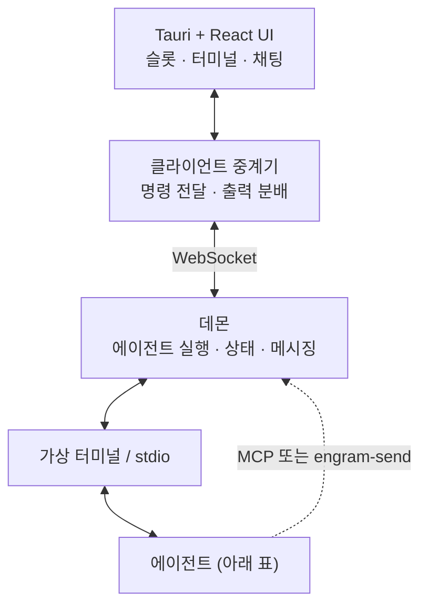

# Engram Dashboard

여러 AI 코딩 에이전트를 실행하고 모니터링하는 Windows 데스크톱 애플리케이션입니다.


> 현재 개발 중입니다. Windows와 Claude Code만 지원하며 내부 API는 변경될 수 있습니다.

<p align="center">
  <a href="https://www.youtube.com/watch?v=_tpWiXSIWFM">
    
  </a>
  <br>
  <em>▶ 시연 영상 보기 (YouTube)</em>
</p>

## 시작하기

배포판(Release)은 아직 제공하지 않습니다. 현재는 소스에서 실행합니다.

요구 사항:

- Windows 10 또는 11
- Node.js 20+
- Rust stable 툴체인
- Claude Code 설치 및 로그인, `claude` 명령이 `PATH`에 등록된 환경

```bash
git clone https://github.com/kimsunzun/engram-dashboard.git
cd engram-dashboard
npm install
cargo build -p engram-dashboard-daemon   # 데몬은 별도 바이너리 — 이게 없으면 에이전트를 못 띄웁니다
npm run tauri dev
```

Windows에서는 저장소 루트의 `run-dashboard-clean.bat`(데몬 빌드 포함 — 개발용 WebView 디버그 포트 9223도 엽니다)도 사용할 수 있습니다.

테스트:

```bash
# 멤버 열거형 사용(--workspace는 Windows에서 src-tauri 크래시) · 실행 중인 데몬이 있으면 먼저 종료(파일 잠금)
cargo test -p engram-dashboard-core -p engram-dashboard-protocol -p engram-dashboard-discovery -p engram-dashboard-daemon
npm test
```

## 주요 기능

- 여러 Claude Code 에이전트 실행 및 모니터링
- 슬롯 분할과 별도 창을 이용한 화면 구성
- UI를 닫아도 에이전트 실행을 유지하는 백그라운드 데몬
- 실행 중인 에이전트 재접속 및 출력 복원
- 에이전트 간 메시징(개발 중) — 회신 추적, 그룹 발송, 1:1 부재 시 데몬 메모리 보관 후 전달
- 터미널과 구조화된 채팅 출력
- 메뉴·단축키·에이전트 제어에서 같은 명령 사용
- 작업 경로를 프리셋으로 저장하고 재사용

## 구조

데몬이 에이전트 프로세스·출력 상태·에이전트 간 메시징을 관리하고, Tauri 클라이언트가 WebSocket으로 연결됩니다.


```mermaid
graph TB
    UI["Tauri + React UI<br/>슬롯 · 터미널 · 채팅"]
    Client["클라이언트 중계기<br/>명령 전달 · 출력 분배"]
    Daemon["데몬<br/>에이전트 실행 · 상태 · 메시징"]
    PTY["가상 터미널 / stdio"]
    Agent["에이전트 (아래 표)"]

    UI <--> Client
    Client <-->|WebSocket| Daemon
    Daemon <--> PTY
    PTY <--> Agent
    Agent -.->|MCP 또는 engram-send| Daemon
```

모델별 실행 방식은 공통 추상화 아래에서 분리되어 있어, Codex 같은 다른 CLI 에이전트나 API 기반 모델(로컬 모델 포함)도 같은 인터페이스 위에 백엔드로 추가하는 구조입니다.

| 백엔드 | 상태 |
|---|---|
| Claude Code | 지원 |
| Codex | 예정 |
| API 기반 모델 (로컬 모델 포함) | 예정 |

macOS·Linux는 당장 계획에 없지만, Windows 전용 코드가 격리되어 있어 구조상 가능성은 열어두었습니다.

## 문서

세부 구조·진행 상태는 아래 문서에서 추적합니다.

- [아키텍처 개요](docs/reference/architecture-overview.md) — 전체 구조·crate 구성
- [문서 인덱스](docs/README.md)
- [설계 결정 기록](docs/decisions/)
- [개발 진행 기록](docs/process/step-log.md)

## 라이선스

Copyright © 2026 kimsunzun. All rights reserved.

오픈소스 라이선스는 정식 공개 시점에 부여할 예정입니다. 그 전까지 저장소 내용에는 기본 저작권 규칙이 적용되며, 외부 기여(PR)는 받지 않습니다.
