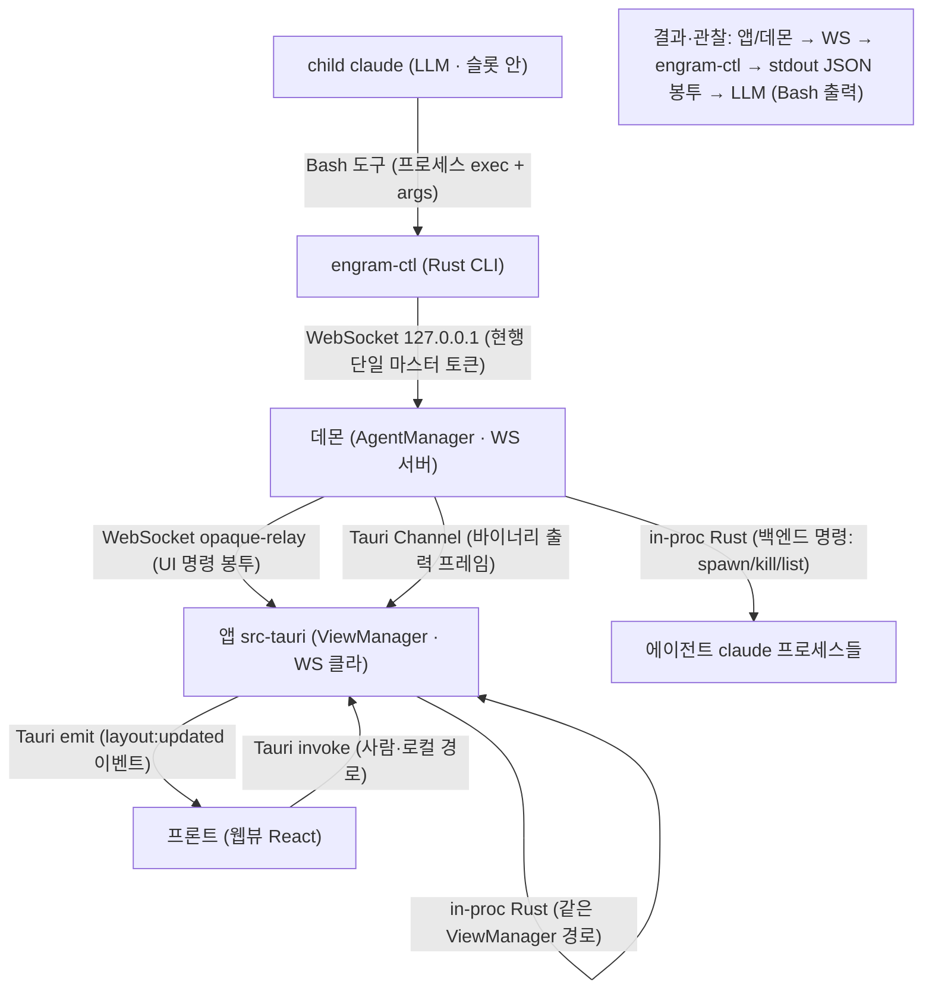

# PRD — LLM 제어 표면 (release-safe)

> 상태: **요구 확정 — `/review prd` full 통과(2026-07-14, 2인 blind 적대 3라운드).** 다음 = TRD. 아키텍처 결정 = ADR-0080.
> 무엇/왜만 담는다(어떻게 = TRD). 근거·거부대안은 ADR로 박제.

## 무엇 / 왜

release 빌드에서 LLM(스폰된 child claude)이 앱을 제어할 수 없다 — dev CDP·`window.__*` 경로가 release exe에서 죽기 때문. **§5(모든 기능 LLM 제어 가능)를 release에서 실현하는 정식 제어 표면**을 만든다.

**§5 전면 커버 ≠ MVP 완료 (측정 가능한 완료 상태).** §5는 "모든 기능 LLM 제어 가능"을 요구하나 이는 다단계 목표다. MVP는 §5를 *전면* 달성하지 않는다 — 혼동 방지를 위해 완료 기준을 측정 가능하게 못 박는다: **MVP 완료 = 아래 "MVP 명령 카탈로그"에 열거된 명령이 release 빌드에서 LLM(child claude Bash)으로 실제 동작.** §5 전면 커버는 후속 단계이고, 현재 보류분(테마 변경·레이아웃 저장/복원·트리 네비게이션·렌더모드 override)은 §5 갭으로 `docs/tracking.md` T-11(제약 레이어)·D-7(레이아웃 영속) 등으로 추적한다. 즉 MVP 통과가 §5를 "완료"로 주장하지 않는다.

**범위/전제 — MVP = 단일 클라이언트(앱) 인스턴스.** MVP는 데몬에 연결된 **앱(클라이언트) 인스턴스가 하나**임을 전제한다. 여러 앱 인스턴스 사이에서 "어느 앱을 대상으로 하나"를 고르는 타깃팅은 MVP 밖(보류) — 이 전제가 UI 명령의 대상 모호성을 MVP 범위에서 없앤다. 다중 앱 인스턴스 라우팅·식별은 후속(브로커 라우팅 미결 참조). (에이전트(child claude 프로세스)는 여러 개 = 정상 — 여기서 "단일"은 UI 권위를 쥔 앱 인스턴스를 말한다.)

## 배경 (문제)

- 현 임시 경로 = `scripts/cdp.mjs eval`(dev 전용 원격 디버깅 포트). release `tauri.conf.json`엔 그 포트가 없어 붕괴.
- 제어 핸들(`window.__engramLayout`·`__engramCmd`·`__ENGRAM_AGENT__`)은 **웹뷰 안** → 외부 프로세스(claude)는 못 닿음.
- 스파이크 `scripts/engram.mjs`(ADR-0014 방향)가 release-safe 경로(daemon.json portfile → 데몬 WS → AgentCommand)를 이미 증명. 단 THROWAWAY(Node·미번들·에러 삼킴·출력 폐기).

## 요구사항 (동작·정책 언어)

- **R1.** release 빌드에서 동작 — CDP/devtools 비의존.
- **R2.** 스폰된 child claude가 **자기 Bash 도구로** 제어(별도 통합·유저 설정 없이).
- **R3.** 백엔드(spawn/kill/list/preset)와 UI(split/tab/focus/move) **둘 다** 제어.
- **R4.** 명령은 **의미적**(논리 view-tree 연산) — 좌표 비노출. 기기별 **capability 게이트**(PC multi-window / mobile 단일 창).
- **R5.** **관찰**: 명령 결과 + 비동기 상태(출력·생사·목록 변화)를 유한 primitive로 확인 가능. + **상태 조회 primitive와 안정 주소지정** — 현재 view-tree를 읽어 "빈 슬롯에 넣어줘" 같은 의미적 상대 지정이 가능해야 한다. **공간 어휘 예시(주소지정 = 방향/이웃/순서, 좌표 금지):** "포커스된 슬롯의 오른쪽", "view X의 첫 빈 슬롯", "이 탭의 마지막 슬롯". (전체 어휘 = ADR-0068 정본, 여기선 판단 가능하게 최소 예시만.) **주소지정 2모드(별개 — 서로 섞지 않는다):** 대상 지정은 두 모드로 갈리고, staleness는 그중 하나에만 적용된다.
  - **(a) ID 지정:** LLM이 read로 얻은 **안정 ID**(`ViewId`·slot id·window label 등)를 그대로 넘긴다 → 그 ID에 결속. 실행 시점에 그 ID가 **닫혔거나 사라졌으면 명시적 stale 에러 코드로 실패**한다 — 조용히 다른 대상으로 리타깃하지 않는다(구현별 발산 방지). staleness는 이 모드에만 적용된다.
  - **(b) live-상대 지정:** "현재 포커스된 슬롯의 오른쪽"·"이 탭의 마지막 슬롯" 같은 **live 표현**은 **실행 순간의 상태로 해소**한다(항상 "지금" 기준). 이 모드엔 staleness 개념이 없다 — LLM은 대상이 "실행 시점의 현재 포커스·이웃·순서 기준"임을 받아들이고 지정한다. read→execute 사이 포커스·이웃이 바뀌었어도 그건 stale이 아니라 최신 상태로의 정상 해소다.

  두 모드는 별개다: ID를 넘겼는데 그 ID가 사라진 것(=stale, 실패)과, live 표현이 새 현재로 해소된 것(=정상)은 다른 사건이다. 정확한 코드·모드 판별 뉘앙스는 미결/TRD. (MVP 대부분 충족 — 아래 "MVP 명령 카탈로그" 참조.)
- **R6.** 결과는 **정직한 구조화 응답**(성공/실패/재시도 가능 여부) — 거짓 success 금지. **파괴적·상태변경 명령은 멱등하거나, "이미 적용됨"을 구분 가능한 결과로 돌려준다** — timeout 후 재시도가 조용히 이중 적용(예: split 중복 → 슬롯 2번 쪼개짐)되지 않도록. 이게 R6의 "거짓 success 금지"에 실효를 준다(전송됨을 성공으로, 재시도를 신규로 오인 금지). **재시도 identity (at-most-once):** 명령은 **클라이언트가 부여한 requestId**를 실어 보내고, **같은 requestId의 재시도는 at-most-once로 dedup**된다 — timeout 후 비멱등 명령(spawn·write 등)을 재시도해도 두 번째 agent가 생기거나 입력이 중복 전달되지 않는다. 이 dedup은 **세션 내 재연결을 넘어 유지**되어야 한다(연결이 끊겼다 붙어도 같은 requestId면 신규 아님). **유효 창(validity window) = 데몬 수명(= 한 세션) 이내.** dedup의 유효성은 데몬이 살아 있는 동안으로 한정된다 — **데몬 재시작은 dedup 상태를 리셋**하므로, 재시작 이후의 재시도는 best-effort(이중 적용 가능)이며 그 경우 LLM은 read 조회로 실제 반영을 확인해 재조정한다. 관찰 가능 계약(WHAT) = at-most-once 그 자체. 메커니즘(dedup 저장소·재연결 생존·정확한 보존 창 = 메모리 vs durable)은 TRD. 나머지 robustness 차원(부분적용 원자성·순서/동시성·버전 협상)은 아래 미결에서 구체화.
- **R7.** ~~**보안**: child별 권한 스코프(마스터 토큰 all-or-nothing 탈피).~~ → **보류(deferred) — MVP 밖, 알면서 수용한 위험.** 로컬 단일 PC = 단일 신뢰경계라 현행 마스터 토큰 전권을 허용한다(세밀 스코프 미착수). **수용한 위험(명시):** prompt-injection된 child 하나가 공유 마스터 토큰으로 형제 agent를 kill·write하고 전 UI를 조작(child↔child 횡이동)할 수 있다 — "single PC"는 외부 경계만 덮고 내부 오염된 child는 못 덮는다. 이를 알고도 보류를 유지한다(전제 = 로컬·신뢰 콘텐츠, 재도입 = 모바일/원격 데몬 단계). 상세·사용자 재확인 = `docs/tracking.md` **T-11**(2026-07-14 노트). **핵심 귀결:** R7을 보류하면 MVP가 세밀 인가를 아무도 하지 않으므로 "데몬 opaque-relay(UI 의미 무지) ↔ child별 스코프" 모순이 사라진다 — opaque-relay가 깨끗하게 유지된다. (이 모순이 `/review prd` BLOCK이었고, 보류로 해소.)

## MVP 명령 카탈로그 (범위 — MVP/보류 경계)

**원칙: MVP = "동작이 이미 권위에 존재하는 커맨드만" 노출.** S17은 새 백엔드/ViewManager 연산을 만들지 않는다 — release-safe한 *명령 경로*(engram-ctl → 데몬 relay → ViewManager)만 짓는다. 아래 둘 다 이미 dispatch/`#[tauri::command]`로 살아 있는 것들이다.

**카탈로그 = 닫힌 집합(closed set).** MVP 카탈로그는 **현재 dispatch되는 `AgentManager` wire 명령 전체 + `ViewManager`의 `#[tauri::command]` 전체**와 정확히 같다 — 즉 코드에 이미 존재하는 연산 집합이 곧 카탈로그이고, 새로 발명하지 않는다. 정확히 열거된 닫힌 목록은 **코드에서 뽑아 TRD에 박제**한다(그래서 완결성이 근사치가 아니라 검증 가능하다 — "빠진 게 없다"를 코드 대조로 확인). 아래 카테고리 분류·파일 참조는 방향잡기용으로 그대로 둔다.

**MVP *표면*의 구성 (A)+(B).** 위 "권위 명령"은 카탈로그의 (A) 부분이다. MVP가 노출하는 전체 *표면* = **(A) 위 권위 명령(그대로 노출)** + **(B) engram-ctl 관찰·발견 primitive**(`wait` · `events poll` · `output tail` · `list_commands`). (B)는 새 백엔드 연산이 아니라 **기존 Subscribe/epoch/seq/replay 프로토콜 + capability 데이터 위에 얹은 얇은 CLI 표면**이다(R5/관찰/AC에 정의). 따라서 "닫힌 집합"은 (A)와 (B) 둘 다 포함한다.

**테스트 가능성 요구(전 카탈로그):** **모든 MVP 카탈로그 명령은 경계·에러 케이스를 포함한 결과 계약을 가진다** — 성공 형태뿐 아니라 실패·경계 상황에서 무엇을 돌려주는지 정의되어야 테스트로 검증 가능하다. 대표 경계 예: 이미 종료된 agent를 kill, 비어 있지 않은 slot을 close, 순환이 되는 profile reparent(자기 자손을 부모로), 현재 기기에서 미지원인 명령(capability 게이트 밖). 각 명령별 정확한 에러 코드·계약 표는 TRD.

- **백엔드 `AgentManager` (현재 dispatch되는 wire 명령 전체, 닫힌 집합):** spawn / kill / interrupt / write(stdin) / resize / list + **input lease**(acquire/release) + **profile CRUD**(create/delete/rename/reparent/auto-restore/spawn) + **preset CRUD**(create/delete/rename/list) + snapshot. (정의: `crates/engram-dashboard-core/src/agent/manager.rs`, wire = `crates/engram-dashboard-daemon/src/connection_core.rs`. 정확한 열거 = TRD가 코드에서 pin.)
- **UI `ViewManager` (현재 `#[tauri::command]` 전체, 닫힌 집합):** tabs(create/switch/close/rename), windows(create/close), slots(split/close/focus), content(assign_agent/set_slot_content), popout(move_slot_to_window), **그리고 read 조회**(get_view/list_tabs/list_windows/snapshot). (정의: `src-tauri/src/layout/manager.rs`, 커맨드 = `src-tauri/src/commands/layout.rs`. 정확한 열거 = TRD가 코드에서 pin.)

### MVP 밖 (§5 갭 — 명시 보류)

동작(UI)은 있으나 **권위(ViewManager/backend)에 안 붙어 있어** release-safe 노출에 신규 배선이 필요한 것들. §5 갭을 숨기지 않고 명시한다:

- **테마 변경** — v1 사용자 명시 거절.
- **렌더모드 override** (슬롯별 렌더러 강제).
- **레이아웃 저장/복원** — 현재 미구현(`docs/tracking.md` D-7 참조).
- **트리 노드 네비게이션** — 현재 LLM read-only.

## 결정된 설계 방향

### 호출 (invocation)

`claude Bash 도구 → Rust engram-ctl(protocol crate 공유·컴파일 산출) → 데몬 WS(토큰 auth)`. 모델은 텍스트 또는 tool-use로만 세상에 작용하며, 여기선 **Bash 도구 = 구조화된 행동**이다.

- **MCP over HTTP 배제** — 로컬 부모-자식에 프로토콜 ceremony 과다.
- **로컬 stdio MCP = MVP 밖·금지 아님** — 명령 카탈로그가 커지거나 "넓은 Bash 대신 좁은 툴 권한"이 중요해지면 재검토(cross-family 리뷰 반론 기록).
- **chat-text 파싱 배제** — 취약·환각.

### 권위 2도메인 + 라우팅

- **백엔드 권위 = 데몬**(`AgentManager`). `engram-ctl → 데몬 WS` 직행. PC·모바일 이식.
- **UI/레이아웃 권위 = 앱**(`ViewManager`, ADR-0035). **데몬 opaque-relay**: 데몬은 UI payload를 **해석하지 않고** 대상 앱 연결로 전달 → 앱이 로컬 Tauri 명령과 **같은 ViewManager 경로**로 적용 → 결과 correlation으로 회수. 데몬은 UI 무지 유지(ADR-0035 보존), 역할만 "두 클라이언트(CLI↔앱) 사이 opaque 브로커"로 확장.

### 명령 모델 (2층)

- **도메인 층(이식):** agent·preset — 전 기기 동일 카탈로그.
- **표현 층(기기형):** 레이아웃 — 논리 트리 의미 연산(좌표 금지, ADR-0068 공간 어휘: 이웃·순서·방향) + capability 게이트. `list_commands`가 현재 기기 가용 명령을 반환(온디맨드 발견).

### 관찰 (observation)

셸 명령은 지속 스트림을 턴 간 못 잡음 → 유한 primitive: `wait --until running|exited`, `events poll --cursor`, `output tail --agent --epoch --after-seq --until message-done`. 기존 Subscribe/epoch/seq/replay 프로토콜 위에.

**턴 경계 계약(R5/관찰 — 요구):** LLM이 **child agent의 단일 응답 완료(턴 경계)를 신뢰성 있게 감지**할 수 있어야 한다. `output tail --until message-done`은 그 child의 한 응답이 끝나는 지점에서 멈춰야 한다 — 응답 도중에 임의로 끊거나, 다음 응답을 삼켜 이어 붙이지 않는다. **응답 결속(어느 턴인가):** tail은 **알려진 시작점(커서/start point)에서 시작하는 하나의 턴에 결속**한다 — 그래서 버퍼된 이전 출력 뒤의 임의 응답이 아니라 **명확히 정의된 그 응답**을 선택한다(시작 커서 없이 "다음에 오는 아무 done"에 붙지 않는다). **관찰 가능 결과(WHAT):** tail이 (a) 시간 제한 안에 턴 경계에 도달하면 "완료(done)" + 그 지점까지의 출력 + 이어받을 커서를 반환, (b) 시간 제한이 턴 경계 전에 걸리면 "미완(pending/timeout)" + 지금까지 출력 + **이어받기 가능한 커서**, (c) 커서 만료·데몬 재시작이면 "재개 불가(stale/reset)" 신호, (d) **tail 도중 child가 kill/exit되거나 interrupt되면 종결(terminal) 결과**(aborted/exited)를 반환 — 무기한 pending으로 남지 않는다. **어느 경우에도 조용한 잘림(silent truncation) 금지 · 무기한 대기 금지** — 결과는 서로 구분 가능하고 (b)는 재개 가능하며 (d)는 종결이어야 한다. 수용 기준(아래)은 "tail이 무언가 돌려줬다"가 아니라 "**턴 경계에서 멈췄다**"를 실제로 증명해야 한다.

**상태 조회(R5) = 기존 ViewManager read 조회로 대부분 충족.** `snapshot`(ADR-0068 방향-이웃 공간 메타 포함)·`list_tabs`·`list_windows`·`get_view`가 view-tree 상태 조회 primitive다. 안정 ID(`ViewId`·slot id·window label)가 이미 존재 → "빈 슬롯에 넣어줘" 식 의미적 상대 지정이 가능. **주소지정 2모드 스탠스(R5와 동일):** (a) **ID 지정** — read로 얻은 안정 ID를 넘기면 그 ID에 결속하고, 실행 시점에 그 ID가 닫혔거나 사라졌으면 명시적 stale 에러로 실패한다(조용한 재해석·리타깃 금지). (b) **live-상대 지정** — "포커스된 슬롯의 오른쪽" 같은 표현은 실행 시점 상태로 live 해소하며 staleness 개념이 없다. stale 에러는 (a)에만 적용 — R5 참조. 정확한 코드·모드 판별은 아래 미결.

### 결과 계약

안정 JSON 봉투 — `{v,ok:true,requestId,result}` / `{v,ok:false,error{code,message,retryable}}`. nonzero exit code. **UI 성공은 ViewManager 적용 후에만 확정**(전송됨 ≠ 적용됨).

**UI 명령 직렬화 (순서 직렬화 · 최신 상태 관찰):** UI 명령은 **단일 `ViewManager` 권위(ADR-0035, in-proc)가 순차 적용**한다 — 그래서 성공은 전송이 아니라 **ViewManager 적용 완료**를 뜻하고(전송됨 ≠ 적용됨 유지), **성공한 명령의 효과는 그 적용 시점에 실재**한다. 이후 read는 **그 시점 이후의 현재 상태**를 반환한다 — 다른 행위자(다른 child·사람)가 그 사이 추가로 상태를 바꿨을 수 있으므로, "read가 반드시 내 효과를 그대로 보여준다"고 보장하지는 않는다(단일 ViewManager가 *순서*는 직렬화하나, *관찰*은 최신 상태 기준). 동시 UI 연산이 MVP 범위에서 분산 경쟁이 아닌 이유가 이것이다: 순서대로 적용하는 권위가 하나뿐이다(단일 앱 인스턴스 전제 = 위 "범위/전제"). 따라서 두 UI 명령의 상대 순서는 도착 순서로 결정되고, 각 명령의 결과는 그 명령이 적용된 뒤의 상태를 반영한다.

**write ⟂ input lease:** `write`(stdin)는 **input lease 보유를 전제**한다 — lease 없이 write하면(예: 사람이 그 슬롯에 타이핑 중이거나 다른 보유자가 있음) **조용한 no-op이 아니라 구분 가능한 정직한 에러 코드로 실패**한다. 기존 `AcquireInput`/`ReleaseInput` lease(Zellij식 단일 writer)를 그대로 활용한다. 이로써 사람↔LLM의 stdin 경합이 관찰 가능·정의된 동작이 된다(누가 쥐고 있으면 write는 성공하지 않고 명시적으로 거부). **보유자 소실 시 자동 해제(좀비 lock 방지):** 보유 중인 input lease는 **보유자(연결)가 종료·연결해제·kill되면 자동으로 해제**된다 — 죽은 보유자가 이후의 write를 무기한 막지 못한다. (현행 데몬 동작 = 연결 cleanup 시 lease 자동 해제.)

### 산출물

Node 스파이크(`engram.mjs`) → **컴파일 Rust `engram-ctl`**(번들, protocol crate 공유). Node 런타임 의존·미번들 해소, per-call 스폰 비용↓.

## 수용 기준

- **(전제) discoverability(R2):** child claude의 Bash 셸이 **수동 PATH 설정 없이** `engram-ctl`을 이름으로 해석·실행한다(별도 통합·유저 설정 X). 아래 spawn/kill/list AC의 선행 조건 — 이게 안 되면 명령이 애초에 실행 안 됨. (메커니즘 = spawn 오버레이, 미결 참조.)
- release 빌드에서 child claude가 Bash로 `engram-ctl spawn/kill/list` 성공 + JSON 결과 회수.
- 앱 실행 중 `engram-ctl split/tab` → `ViewManager` 반영 확인 + 결과 correlation.
- **라우팅 실패 3종 구분(정직한 결과 코드):** UI 명령의 결과는 아래 셋을 서로 다른 정직한 코드로 구분한다 — (a) 처음부터 앱 미연결 = 명령이 앱에 닿지도 못함(`APP_OFFLINE`, 확정 미적용), (b) 데몬은 접수했으나 결과 correlation 전에 앱 연결이 끊김 = 적용 여부 불명(`APP_DISCONNECTED`/unknown, 확정 성공도 실패도 아님), (c) timeout — 응답 시한 초과, 그 사이 **뒤늦게 적용됐을 수 있음**(`TIMEOUT`, 적용 여부 불명). (a)만 "확정 미적용"이고 (b)(c)는 불명 상태임을 결과가 드러내야 한다. **재조정 스탠스:** 불명(b/c) 상태는 read 조회(snapshot 등)로 실제 반영 여부를 확인해 재조정한다 — 결과 코드가 "적용됨"을 거짓 주장하지 않는다(R6: 거짓 success 금지). 정확한 코드 집합·correlation/타임아웃 재조정 메커니즘은 TRD.
- 관찰 primitive로 spawn 성공·출력 tail 확인. **(턴 경계)** `output tail --until message-done`이 child의 한 응답 완료 지점에서 멈추는 것을 실증한다 — 두 번 응답을 시키고 첫 tail이 **첫 응답 경계에서 멈춰 done + 커서를 반환**(둘째 응답을 삼키지 않음), 이어서 그 커서로 둘째 응답을 회수. 시한이 경계 전에 걸리면 pending + 이어받기 커서(조용한 잘림 아님)를 확인. "무언가 돌려줬다"가 아니라 "경계에서 멈췄다"를 증명해야 통과.
- **상태 조회(R5):** `engram-ctl` read 명령(get_view/list_tabs/list_windows/snapshot)이 현재 view-tree(안정 ID + ADR-0068 공간 메타)를 JSON으로 반환 → 의미적 상대 지정("빈 슬롯")의 근거를 LLM이 회수.
- **경계·에러 계약(테스트 가능성):** 대표 경계 케이스가 조용한 실패·거짓 success 없이 구분 가능한 정직한 결과를 돌려준다 — 이미 종료된 agent kill(no-op/already-gone 구분), 비어 있지 않은 slot close, 순환 profile reparent 거부, 현재 기기 미지원 명령(capability 게이트 밖 거부). stale-ref 주소지정은 명시적 에러(리타깃 금지, R5 스탠스). 명령별 정확한 코드 = TRD.
- **멱등성/중복(R6):** 파괴적 명령을 timeout 후 재시도해도 이중 적용되지 않는다 — 예: 같은 의도의 split을 재시도하면 슬롯이 두 번 쪼개지지 않고 멱등 성공 또는 "이미 적용됨"으로 구분 반환. **재시도 identity(at-most-once):** 같은 requestId로 spawn을 재시도하면 두 번째 agent가 생기지 않고 dedup된 단일 결과가 온다(비멱등 명령의 at-most-once, R6).
- **다대상 non-blocking 감시(events poll):** agent A를 spawn한 뒤, `events poll --cursor`로 A의 죽음·agent-list 변화를 **블로킹 대기 없이** 커서 델타로 감지한다. 이것이 다중 agent 병렬 감독 경로다 — 단일 대상을 블로킹으로 기다리는 `wait`와 구분된다(한 대상에 매여 다른 agent를 못 보는 상황을 피한다).
- **write→tail 왕복(다른 claude 대화 구동, end-to-end):** child agent에게 `write`(stdin)로 프롬프트를 넣고, 이어서 `output tail --until message-done`이 **바로 그 한 응답**을 회수하고 그 경계에서 멈춘다 — 이것이 "다른 claude를 대화로 구동하는" 루프의 처음부터 끝까지 실증이다(write가 lease를 전제로 성공한 뒤 tail이 그 응답에 결속).
- **backend↔UI 조인(join key):** 백엔드 `snapshot`/list(agent 생사·목록)와 UI `snapshot`(slot↔agent 매핑)이 **안정적 조인 키**(agentId ↔ slot이 참조하는 agent)를 공유해, LLM이 "지금 죽은 agent가 있던 슬롯을 찾아 거기서 respawn"을 답할 수 있다. 두 도메인이 조인 가능한 안정 키를 노출함을 실증한다.
- **list_commands 부트스트랩(온디맨드 발견):** LLM의 첫 턴 `list_commands`가 **현재 기기에서 가용한 명령 집합**을 반환한다(온디맨드 발견) — mobile 프로파일 기기에서는 표현 층 명령이 capability 게이트에 따라 달라진다(도메인 명령은 동일).
- (모바일 가정) 도메인 명령 동일, 표현 명령은 capability 게이트로 상이.

## 거부한 대안 (→ ADR-0080 거부 대안)

- **MCP over HTTP:** 로컬 부모-자식에 HTTP/JSON-RPC/핸드셰이크 ceremony 과다.
- **chat-text 파싱:** 취약·환각, tool-use 대비 열등.
- **CDP-in-release:** 디버깅 포트 = 보안 노출 + WebView2 실측 미검증(Chrome 136 근거는 WebView2에 미적용).
- **UI용 앱-소유 별도 엔드포인트:** 2차 엔드포인트·discovery·auth 중복 → 데몬 relay 대비 비용↑(모바일에선 원격 데몬이 유일 경로라 relay가 이식성도 우위).

## 미결 (TRD로)

- 제어 토큰 주입: `profile.env` 금지(agents.json 평문) → ephemeral spawn 오버레이(상속 핸들). (child별 스코프 자체는 R7 보류 = `docs/tracking.md` T-11 — MVP는 현행 단일 마스터 토큰 전권.)
- **engram-ctl discoverability(R2):** child claude의 Bash 셸이 `engram-ctl`을 이름으로 해석할 수 있어야 한다("유저 설정 없이"). 방향 = 데몬이 child 스폰 시 그 프로세스 환경(PATH 또는 전용 env var)에 번들된 engram-ctl 경로를 주입 — 위 제어 토큰 주입과 **같은 spawn 오버레이 훅**. 정확한 형태(PATH prepend vs env var)는 TRD. (순수 내부 메커니즘 — 사용자 체감 X.)
- event journal(durable cursor) vs `ListAgents` 재조정.
- 명령 카탈로그 노출 형태·발견(`list_commands`) — 대상 연산은 위 "MVP 명령 카탈로그"로 확정, 어휘·인자·게이트 표현은 TRD.
- 데몬 브로커 라우팅: 앱 identity/lease, 다중 창(main+popout), offline 정책, request→result 타임아웃.
- **stale-ref 의미론(R5) — 스탠스 결정(R5 2모드: ID 지정 = stale 에러·리타깃 금지 / live-상대 = 실행 시점 해소·staleness 없음), 메커니즘 TRD:** 정확한 에러 코드 집합, live 해소의 구현(어느 시점 상태로 해소하나), 자동 재해석 예외(있다면)의 조건 — TRD.
- **재시도 identity(at-most-once) — 스탠스 결정(R6: 같은 requestId 재시도 = 신규 아님·세션 내 재연결 넘어 생존, 단 유효 창 = 데몬 수명 이내·데몬 재시작 시 리셋), 메커니즘 TRD:** dedup 저장소 형태·재연결 생존 방식·정확한 보존 창(메모리 vs durable)·requestId 수명 — TRD.
- **순서/동시성 — 스탠스 결정(결과 계약: 단일 ViewManager 권위가 순차 적용 → 순서 직렬화; 관찰은 최신 상태 기준 = 엄격 read-your-writes 아님), 메커니즘 TRD:** 순차 적용 큐/락 형태, 동시 도착 명령의 순서 확정 지점 — TRD.
- **R6 robustness — 진짜 미결(hard):** 멱등성·재시도 identity·순서는 위에서 스탠스 확정. 여기 남는 진짜 열린 hard 차원 = **다중 명령 의도의 부분적용 원자성**(하나의 논리적 의도가 여러 명령으로 쪼개졌을 때 중간 실패 시 원자성), **mixed-version 협상**(engram-ctl↔데몬↔앱 버전 불일치 시 협상). — TRD.

## 메시지 흐름 (전송수단별)

- **claude ↔ engram-ctl:** Bash 도구(프로세스 exec) — tool-use.
- **engram-ctl ↔ 데몬:** WebSocket(127.0.0.1, 현행 단일 마스터 토큰 — per-child 스코프 = T-11 보류). 명령↑ · 결과·이벤트↓.
- **데몬 → 백엔드:** in-proc(AgentManager 직접).
- **데몬 → 앱(UI):** WebSocket opaque-relay(기존 데몬↔앱 연결 재사용).
- **앱(src-tauri) → ViewManager:** in-proc(로컬 Tauri 명령과 동일 경로).
- **src-tauri ↔ 프론트:** `emit`(이벤트 하행) · `invoke`(사람·로컬 명령 상행).
- **데몬 → 앱:** Tauri Channel(바이너리 출력 프레임).

## 링크

- 근거: `docs/research/control-surface-and-fleet.md`, `command-control-surface-survey-2026-06-28.md`, `llm-control-surface-message-command-scope-2026-06-28.md`.
- 방향 앵커: ADR-0014(데몬 CLI-via-Bash) · 권위: ADR-0035(레이아웃=src-tauri) · 공간어휘: ADR-0068 · 스파이크: `scripts/engram.mjs`.
- 다음: ADR-0080(제어표면 아키텍처) + `/review prd` + TRD.
