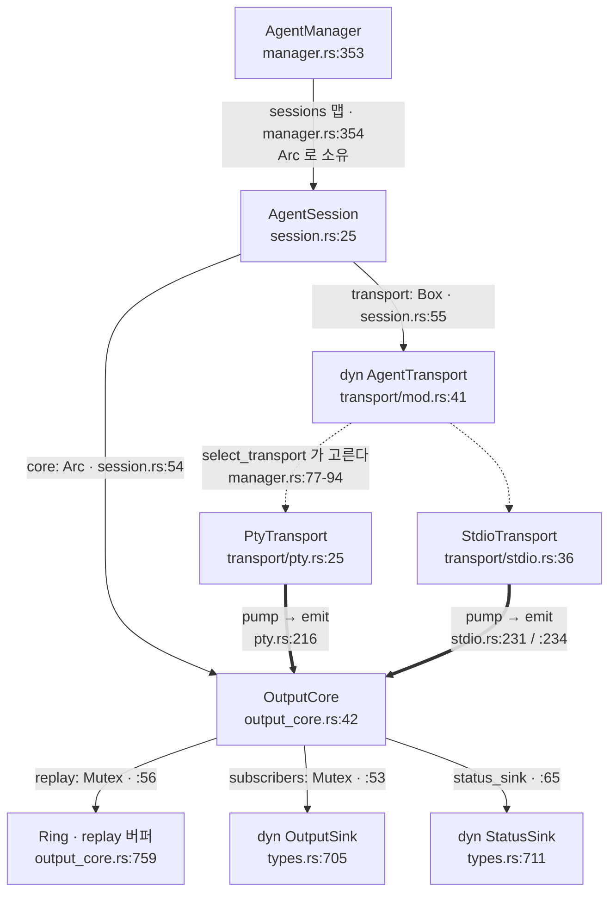
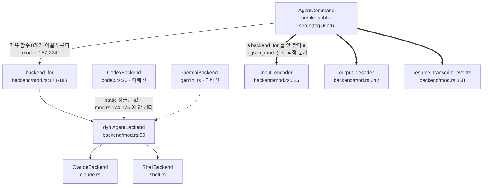
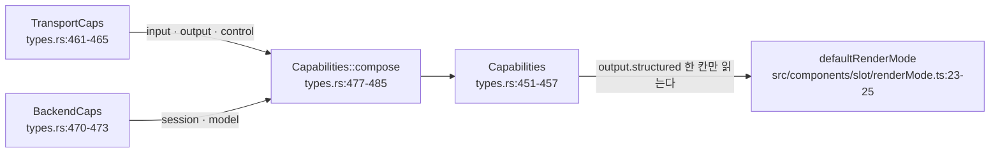
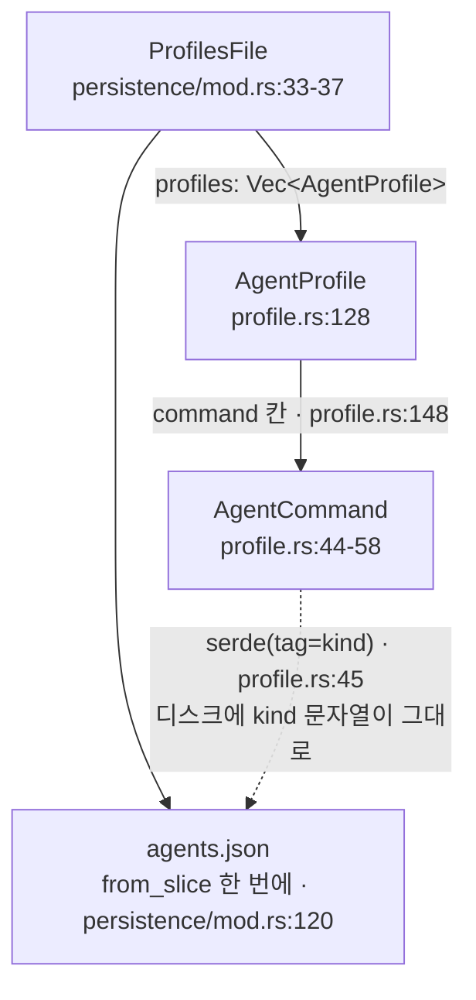
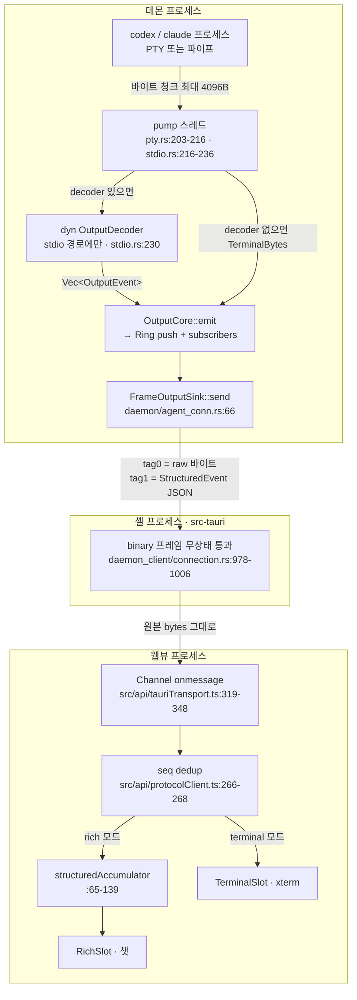
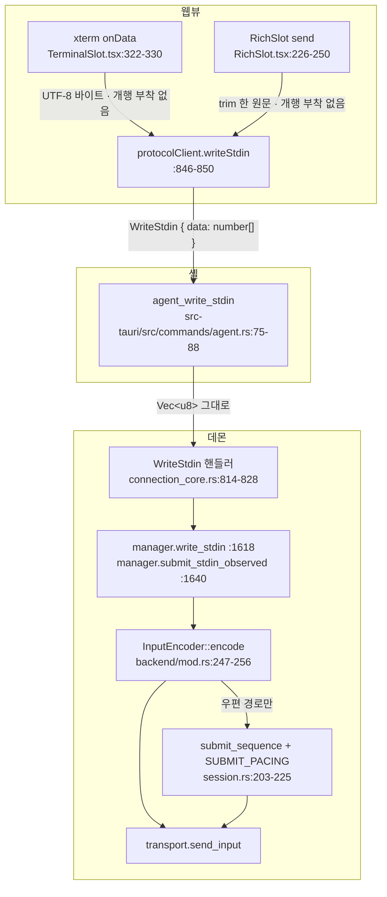
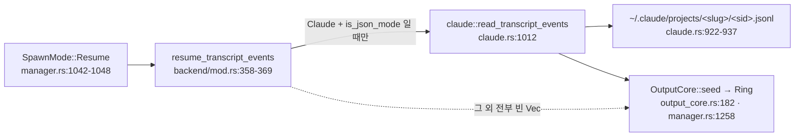

# TRD — codex 백엔드 Phase 0 · Phase 1 (S21)

> 상태: **초판(2026-09-07).** 승인된 설계 브리핑(`briefing.html`)이 확정한 3단계 중 **앞의 둘**만 다룬다. 브리핑의 「상시」 항목이던 백엔드 계약 시험대는 **Phase 0으로 앞당겨져 배선보다 먼저 선다**(사용자 결정 2026-09-07) — 그 자리에서 우리가 `--help` 텍스트로만 아는 사실들을 실제 실행으로 확정한 뒤에야 Phase 1 배선이 시작된다.
>
> **읽는 법:** 이 문서는 codex 동작에 관한 모든 주장에 **출처 등급**을 붙인다 — `[실측]`(이 PC에서 실제로 돌려 본 것) · `[도움말]`(`--help` 텍스트를 읽었을 뿐 돌려 보지 않은 것) · `[미확인]`(어느 쪽도 아닌 것). 등급 없는 codex 주장은 이 문서에 없어야 한다.
>
> **★사용자 결정 대기 항목은 §6에 모아 두었고 이 문서는 그중 어느 것도 고르지 않는다★** — CLAUDE.md 「개발 스텝」의 순서 불변(선택지 → 사용자 결정 → 구현)에 따른다.
>
> 앵커: **ADR-0004**(백엔드 지식 격리 — 이 작업 전체의 근거) · **ADR-0058**(spawn_into 명시 backend fail-loud — ★Phase 1이 폐기해야 한다, §4-6★) · ADR-0099(채널 capability 트립와이어) · ADR-0113(턴 신호 분류자) · ADR-0044(입력 인코딩·출력 정제) · ADR-0002/0030(capability 산출) · ADR-0019(reaper 등록 순서) · ADR-0001(kill 인과) · ADR-0012(모듈 격리·테스트 하네스) · ADR-0155(명령 버스 선언) · CLAUDE.md 「백엔드 확장」·「핵심 불변식」·「세션 복원」·「LLM-우선 제어」.

---

## 0. 범위

### 이 문서가 정하는 것

- **Phase 0** — 백엔드 계약 시험대를 세우고, codex를 **실제로 띄워** 지금 `--help`로만 아는 것을 확정한다. 시험대는 이번 한 번 쓰고 버리는 스크립트가 아니라 **백엔드가 늘 때마다 줄이 하나 늘어나는 터전**이다.
- **Phase 1** — codex를 **PTY 대화형 TUI**로 띄워 기존 xterm 경로에 그린다. 증명할 것은 넷뿐이다: **스폰된다 · 명부에 오른다 · wire 칸이 백엔드를 고른다 · 화면에 그려진다.**

### 이 문서가 정하지 않는 것 (범위 밖 — 재론 금지)

| 항목 | 어디로 | 이유 |
|---|---|---|
| 상주 JSON 서버(`codex app-server`) · 번역기(decoder) | Phase 2 | 브리핑 확정. Phase 1은 **번역기 0줄**이다 |
| 세션 복원(`--resume`) | Phase 2 | Phase 1은 sid를 통제할 수 없다(§2 실측) → capability 자체를 안 신고한다 |
| 우편(에이전트 간 메시징) 수신 | Phase 2 | Phase 1은 **끄고 간다**(§4-3) |
| 프론트에 샌 claude 스키마 해석 회수 | Phase 3 | claude 쪽 정리라 codex와 독립 |
| 프로세스 모델 선택(대화마다 하나) | 브리핑에서 이미 확정 | 지금 구조가 그대로 산다 |
| MCP 주입 · 시스템 프롬프트 주입 | Phase 2 이후 | 경로는 있으나(§2) Phase 1은 제어 채널을 안 쓴다 |

### 다른 세션이 쥐고 있는 파일 — 손대지 않는다

병렬 진행 중인 transport 리팩터가 아래를 소유한다. **Phase 0·1의 어느 변경도 여기 들어가지 않는다.**

- `src-tauri/src/daemon_client/**`
- `crates/engram-dashboard-net/**`
- 워크스페이스 루트 `Cargo.toml`의 members 목록

브리핑도 같은 경계를 적는다 — 「1단계의 대부분은 저쪽 transport 작업과 파일이 하나도 안 겹친다. 접합부(wire 칸·데몬 스폰·프론트 스폰)만 겹친다」. §5의 손대는 곳 표는 그 세 접합부에서 멈춘다.

---

## 1. 단계 배치 — 왜 시험대가 먼저인가

```
Phase 0  터전 + 실측        시험대를 세우고 실 codex 를 띄워 도움말 근거 가정을 확정
   ↓     게이트: §3-5 의 「설계를 뒤집는 결과」가 안 나왔을 때만 통과
Phase 1  배선              variant · dispatch · wire 칸 · 프론트 · 트립와이어
   ↓
Phase 2  상주 서버 + 번역기 (범위 밖)
Phase 3  프론트 해석 회수   (범위 밖)
```

★**Phase 0을 앞에 두는 값어치는 「먼저 안다」가 아니라 「틀렸을 때 배선을 안 짓는다」다**★. Phase 1의 결정 중 최소 셋이 `--help` 텍스트 위에 서 있고(§2 도움말 등급), 그 셋이 틀리면 배선의 모양 자체가 달라진다 — 배선을 먼저 지으면 그 셋을 재는 시점이 GUI 실측이 되고, 거기서 나온 반증은 이미 지은 것을 되짚어야 한다.

★**옛 codex stub이 정확히 그 실패의 화석이다**★ — `crates/engram-dashboard-agent/src/backend/codex.rs`는 「CLI spike 완료 후 확정한다」고 적힌 채 **추측값으로 테스트까지 달아 두었다**(`codex_fresh_uses_session_flag_best_guess`, `codex.rs:143`). 그 추측 셋은 오늘 전부 틀린 것으로 판명됐다(§4-2 표). 시험대는 그 자리를 **추측이 못 들어가는 자리**로 바꾼다.

---

## 2. codex에 대해 우리가 아는 것 — 출처 등급별

대상: **codex-cli 0.153.4 (실측 당시 0.151.0 에서 codex 자체 자동 업데이트로 상승), 이 PC, 인증된 상태.** 아래 등급은 이 문서 전체에서 그대로 유효하다.

### `[실측]` — 실제로 돌려서 확인한 것

| # | 사실 | Phase 1에 미치는 영향 |
|---|---|---|
| M1 | 파이프로 stdin을 주면 `Error: stdin is not a terminal`, exit 1 | **PTY가 유일한 대화형 경로**다 — transport 선택 여지가 없다 |
| M2 | 호출자가 세션 id를 정할 수 없다. `--session-id`류 플래그가 **없다** | `needs_session()` = **false**(§4-2). 「세션 복원」 절의 claude 계약(sid를 우리가 통제)이 codex엔 성립하지 않는다 |
| M3 | 재개는 플래그가 아니라 **하위 명령 + 위치 인자**다(`codex resume <id>` / `--last`) | stub의 `--resume <uuid>` 조립이 문법부터 틀렸다 |
| M4 | Windows에서 PATH의 `codex`는 `codex.cmd → node → codex.exe` 사슬. 실 바이너리는 **버전이 박힌 `node_modules` 벤더 경로** 아래 | 하드코딩 불가. shim을 건너뛰려면 탐색·폴백이 따로 필요하다(§4-10 · §6-H) |
| M5 | 호출마다 MCP를 끼우는 길은 있다 — 전역 TOML 오버라이드 `-c mcp_servers.<name>={...}`. `--mcp-config <file>` 같은 플래그는 **없다** | Phase 1은 안 쓴다. Phase 2가 쓸 때 claude와 **모양이 다른** 주입이라는 사실만 기록 |

### `[도움말]` — `--help` 텍스트를 읽었을 뿐, 그 동작을 돌려 본 적 없음

| # | 도움말이 말하는 것 | 왜 위험한가 |
|---|---|---|
| H1 | 대화형 호출은 맨 `codex`. 플래그 `-C/--cd <DIR>` · `-s/--sandbox <read-only\|workspace-write\|danger-full-access>` · `-a/--ask-for-approval <on-request\|never>` · `-m/--model <MODEL>` | 플래그가 **존재한다**는 것과 그것이 우리가 만든 PTY 안에서 **의도대로 먹는다**는 것은 다른 주장이다 |
| H2 | `--no-alt-screen` = "Disable alternate screen mode. Runs the TUI in inline mode, preserving terminal scrollback history" | 우리 xterm에서 무엇이 나아지는지는 **텍스트가 말해 주지 않는다**(§4-11) |
| H3 | 대화형 경로에는 `--skip-git-repo-check`가 **없다**(그 플래그는 `exec` 쪽에만 보인다) | cwd가 git repo가 아닐 때 대화형이 **무엇을 하는지**는 도움말에 없다 — 거부인지, 경고인지, 그냥 뜨는지 미상 |
| H4 | 시스템 프롬프트 주입에 CLI 플래그가 없다 — 기제는 `AGENTS.md` 프로젝트 문서 관례와 `model_instructions_file` 설정 키 | Phase 2 사안. Phase 1은 안 건드린다 |

### `[미확인]` — 어느 등급도 못 붙이는 것

- **codex를 대화형으로 한 번도 띄워 보지 않았다.** 화면이 무엇을 그리는지, 우리 PTY 크기에서 어떻게 도는지 전부 미상.
- codex가 자기 세션 id를 UUIDv7로 발급한다는 서술 — **문서·2차 자료 근거이고 우리가 관측한 값이 아니다.** Phase 1은 이 값을 쓰지 않으므로 무해하지만, "우리가 확인했다"고 적지 않는다.
- 본문 + CR 두 번 쓰기(`SUBMIT_PACING` 계약)가 codex TUI 컴포저에서 **제출로 읽히는지**. claude TUI에서만 실측된 계약이다.
- 여러 줄 본문을 통째로 넣었을 때 codex 컴포저가 **한 덩이로 받는지 줄마다 쪼개는지**. ★우리 주입 경로 어디에도 bracketed-paste 표식이 없다★(`rg "200~"` → 0줄, 실측 2026-09-07) — 즉 codex가 LF를 무엇으로 읽든 우리는 거기에 아무 힌트도 주지 않는다.

### 피어 선례

- **octoally**가 임베디드 터미널 안의 리사이즈·리플로 문제를 고치려고 정확히 `--no-alt-screen`을 쓴다. 근거로서의 무게 = "같은 문제를 만난 피어가 이 스위치를 골랐다"이지 "우리 화면에서 낫다"가 아니다(ADR-0038의 「참조 구현」 규율 — 매직넘버 대신 선례, 단 선례도 실측으로 확인).

---

## 2.5. 구조도 — 타입·소유권 · 코드·데이터 흐름

> **왜 이 절이 여기 있나:** §3의 질문표와 §4의 결정 전부가 아래 타입들 위에 서 있다. 그림 없이 읽으면 "어느 칸이 누구 소유인가"를 매번 코드로 되짚어야 하는데, ★**그 되짚기가 실제로 한 번 틀렸다**★ — 승인된 설계 브리핑이 `output.structured`를 backend 칸으로 잘못 적었다(§4-8). 이 절은 그 소유권 경계를 **타입 정의 줄로** 못 박는다.
>
> ★**여기 그린 것은 전부 코드에서 확인한 것뿐이다**★ — 확인하지 못한 것은 그리지 않고 **미확인**으로 적었다. 줄 번호는 §5와 같은 규율(2026-09-07 판독)이고, 코더는 앵커 주변을 다시 읽고 들어간다.

### 2.5-1. 타입·소유권 구조도

#### (가) 데이터 흐름 척추 — 누가 무엇을 든다



**★소유권 분할 — CLAUDE.md 「핵심 불변식」의 그 줄을 코드 줄로 옮긴 것★**

| 소유자 | 드는 것 | file:line |
|---|---|---|
| `AgentSession` | `id` · `cwd` · `epoch` · `cols` · `rows` | `session.rs:26-30` |
| (같은 자리, 불변식 문장엔 없는 것) | `intent` · `backend_caps` · `encoder` · `reads_messages` · `submit_pacing` · `sleeper` | `session.rs:32`·`:35`·`:38`·`:45`·`:50`·`:53` |
| `OutputCore` | `subscribers` · `replay`(Ring) · `seq` · `status` · `finalized` · `drain_handle` | `output_core.rs:53`·`:56`·`:48`·`:49`·`:50`·`:68` |
| (같은 자리, 불변식 문장엔 없는 것) | `diagnostics` · `status_sink` · `on_terminal` · `turn`(턴 관측 배선) | `output_core.rs:62`·`:65`·`:73`·`:77` |
| `PtyTransport` | `master` · `writer` · `child` · `shutdown` · `reader` · `job_handle` | `transport/pty.rs:28-35` |
| `StdioTransport` | `child` · `stdin` · `stdout` · `stderr` · `shutdown` · `structured` · `decoder` | `transport/stdio.rs:39-53` |

★**이 표에서 Phase 1이 읽어야 할 한 줄**★ — **decoder 칸을 드는 transport는 `StdioTransport` 하나뿐이다**(`stdio.rs:53`). `PtyTransport`에는 그 칸이 **없다**(`pty.rs:25-36`). 결과는 §2.5-2 (다)에서 다시 나온다.

#### (나) 백엔드 dispatch — ★trait을 타는 것과 안 타는 것★



**`AgentBackend` trait의 메서드 — 필수와 기본값**

| 메서드 | 종류 | 기본값 | file:line |
|---|---|---|---|
| `needs_session()` | **필수** | — | `mod.rs:52` |
| `supports_control_channel()` | **필수** | — | `mod.rs:62` |
| `accepts_mcp_config()` | **필수** | — | `mod.rs:81` |
| `build_spec(...)` | **필수** | — | `mod.rs:88-96` |
| `capabilities(&command)` → `BackendCaps` | **필수** | — | `mod.rs:106` |
| `turn_classifier()` | 기본값 있음 | `no_turn_signals`(침묵) | `mod.rs:121-123` · 기본 함수 `:168-170` |
| `resume_failure_kind(evidence)` | 기본값 있음 | `None`(모름) | `mod.rs:140-142` |
| `reads_messages()` | 기본값 있음 | ★**`true`(fail-open)**★ | `mod.rs:153-155` |

trait은 `pub` 이지만 **바깥에서 쓰는 표면은 자유 함수 8개다** — `needs_session`(`:187`) · `supports_control_channel`(`:191`) · `accepts_mcp_config`(`:195`) · `build_command_spec`(`:199`) · `backend_caps`(`:210`) · `turn_classifier`(`:214`) · `resume_failure_kind`(`:218`) · `reads_messages`(`:222`). 전부 `backend_for(c).<메서드>()` 한 줄이다.

★**그런데 backend 지식을 나르는 함수 셋은 그 dispatch를 안 탄다**★ — Phase 2를 설계할 때 이것을 모르면 자리를 못 찾는다.

| 함수 | 무엇을 하나 | 어떻게 고르나 | file:line |
|---|---|---|---|
| `input_encoder` | `InputEncoder` 태그 선택 | `c.is_json_mode()` **직접 검사** | `mod.rs:326-332` |
| `output_decoder` | `Option<Box<dyn OutputDecoder>>` | `c.is_json_mode()` **직접 검사** → `ClaudeStreamDecoder` 하드코딩 | `mod.rs:342-348` |
| `resume_transcript_events` | 과거 대화 seed | `AgentCommand::Claude` + json 모드 match | `mod.rs:358-369` |

★**이 셋은 `AgentBackend` 메서드가 아니다**★ — 즉 **`CodexBackend`에 메서드를 하나 더 구현해도 여기 안 걸린다.** codex 번역기(Phase 2)를 붙이려면 `impl AgentBackend`가 아니라 **이 자유 함수들의 분기를 고쳐야 한다.** `output_decoder`의 doc 주석(`mod.rs:340-341`)이 그 자리를 이미 지목한다 — 「새 backend(codex 등)는 자기 decoder 를 여기 분기에 추가하면 된다」.

#### (다) capability 합성 — ★소유권이 타입으로 박혀 있다★



| 영역 | 출처 | 어디서 만들어지나 |
|---|---|---|
| `input` · **`output`** · `control` | ★**transport**★ | `AgentTransport::capabilities()` — `transport/mod.rs:56`. PTY 구현 = `pty.rs:312-333` |
| `session` · `model` | ★**backend**★ | `AgentBackend::capabilities(&command)` — `mod.rs:106`. claude 구현 = `claude.rs:263-277`, shell = `shell.rs:62` |

**★브리핑이 틀린 자리를 줄로 못 박는다★**

- `BackendCaps`에는 **`session`과 `model` 두 칸뿐이다** — `types.rs:470-473`. 그 바로 위 doc(`types.rs:467-468`)이 이유를 적는다: 「input/output/control 이 여기 없는 건 의도다 — backend 는 그걸 만들 수 없다(**소유권을 타입으로 강제**)」.
- `TransportCaps`에는 **`input`·`output`·`control` 세 칸뿐이다** — `types.rs:461-465`. 대칭 doc(`types.rs:459`): 「session/model 이 여기 없는 건 의도다」.
- `output.structured`는 **`OutputCaps`의 칸**이고(`types.rs:501`), `OutputCaps`는 `TransportCaps.output`에 들어간다(`types.rs:463`). ★따라서 **backend는 이 값을 신고할 수 없다**★ — `BackendCaps`에 `output` 칸 자체가 없어 컴파일이 막는다.
- 합성 지점은 **한 곳뿐이다** — `AgentSession::capabilities()`(`session.rs:257-259`)가 `Capabilities::compose(self.transport.capabilities(), self.backend_caps.clone())`을 부른다. `compose`가 「유일한 정상 생성 경로」라고 doc이 적는다(`types.rs:476`).

**그래서 codex(PTY)의 `structured`는 자동으로 false다:** `is_json_mode()`가 codex에 false(`profile.rs:61-69` — `AgentCommand::Claude` + `StreamJson`일 때만 true) → `select_transport`가 `PtyTransport`를 고르고(`manager.rs:84-92`) → `PtyTransport::capabilities()`가 `structured: false` **고정**(`pty.rs:321`) → 프론트가 `'terminal'`을 고른다(`renderMode.ts:23-25`). **§4-8의 "렌더러 코드 변경 0줄" 결론이 이 사슬이다.**

#### (라) `AgentCommand`와 디스크 · `OutputEvent`와 링



`AgentCommand`의 오늘 변형은 둘뿐이다 — `Claude { extra_args, output_format }`(`profile.rs:49-53`, `output_format`은 `#[serde(default)]`)과 `Shell { program, args }`(`:54-57`). §4-6의 위험이 서는 자리가 위 점선이다: **`kind` 문자열이 디스크에 적히고, 파일은 `serde_json::from_slice` 한 번으로 통째 파싱된다**(`persistence/mod.rs:120`).

**`OutputEvent` — 링에 실제로 남는 것**(`types.rs:37-69`)

| variant | 필드 | file:line | 누가 만드나 |
|---|---|---|---|
| `TerminalBytes(Vec<u8>)` | 콘솔 raw 바이트 | `types.rs:39` | PTY pump(`pty.rs:216`) · decoder 없는 stdio pump(`stdio.rs:234`) |
| `TextDelta` | `text`·`turn_id`·`message_id` | `types.rs:40-44` | decoder |
| `ToolCall` | `name`·`args_json`·`id`·`turn_id`·`message_id` | `types.rs:46-53` | decoder |
| `Usage` | `input_tokens`·`output_tokens`·`turn_id` | `types.rs:54-58` | decoder |
| `MessageDone` | `turn_id`·`message_id` | `types.rs:60-63` | decoder |
| `Error(String)` | 스트림 내부 오류(종료 아님) | `types.rs:65` | decoder |
| `Structured { kind, json }` | ★백엔드별 탈출구 — **core는 내용을 해석하지 않는다**★ | `types.rs:66-68` | decoder · 입력 에코(`mod.rs:279-282`) |

`Ring`(`output_core.rs:759-764`)은 `StoredOutput { seq, event, cost_bytes }`(`:707-712`)를 담고 **상한이 둘**이다 — `max_bytes = 2MB`(`:771`)와 `max_events = 4096`(`:774`), **둘 중 하나만 넘어도 앞부터 evict**(`:789-797`). `cost_bytes`는 정확한 wire 크기가 아니라 payload 문자열 길이 합의 **근사**다(`estimate_cost_bytes`, `:721-745`) — 코어는 직렬화를 못 하기 때문(`:716-717`). ★**메모리 전용이다**★ — 디스크 영속 경로가 이 타입에 없다(`Ring`은 `VecDeque` 하나, `:760`). 최신 1건은 상한을 넘겨도 항상 남긴다(`:789` `len() > 1` 가드).

#### (마) 둘째 백엔드가 더하는 것 · ★건드리지 않는 것★

| 더하는 것 | 어디 | 근거 절 |
|---|---|---|
| `AgentCommand::Codex` 변형 하나 | `profile.rs:44-58` | §4-1 |
| `static CODEX_BACKEND` + `backend_for` 팔 하나 | `backend/mod.rs:174-175` · `:178-183` | §4-2 |
| `impl AgentBackend for CodexBackend`의 값들 | `backend/codex.rs` | §4-2 표 |
| 트립와이어 match 팔·배열 길이 | `backend/mod.rs` 테스트 · `commands.rs` | §4-4 |
| wire 선택 칸 하나 + 데몬 변환 갈래 | `protocol/messages.rs:99` · `daemon/connection_core.rs:963-980` | §4-5 |

| ★건드리지 않는 것★ | 왜 안 건드리는가 | 근거 |
|---|---|---|
| `AgentSession` · `OutputCore` · `Ring` | 백엔드를 모르는 타입들이다 — 필드 하나도 백엔드 지식이 아니다 | `session.rs:25-56` · `output_core.rs:42-78` |
| `AgentTransport` trait과 두 구현체 | codex는 PTY를 그대로 탄다(`[실측 M1]` PTY가 유일 경로) | `transport/mod.rs:41-57` |
| `Capabilities` / `compose` / `TransportCaps` | 소유권 분할을 무너뜨리는 변경이다 — §4-8이 명시로 금지 | `types.rs:451-486` |
| `OutputEvent` 변형 목록 | Phase 1은 번역기 0줄이라 새 변형이 필요 없다 | §0 범위 밖 표 |
| 프론트 렌더 분기 | `structured` 한 칸이 이미 맞게 돈다 | `renderMode.ts:23-25` · §4-8 |
| `input_encoder` · `output_decoder` 분기 | Phase 1은 `Raw` + `None`으로 충분하다(터미널) | `mod.rs:326-348` · §4-2 |

★**마지막 줄이 Phase 2의 청구서다**★ — Phase 1이 저 둘을 안 건드리는 것은 **터미널 모드라 안 건드려도 되기 때문**이지 codex가 그 분기에 안 들어가서가 아니다. Phase 2가 상주 JSON 서버를 켜는 순간 `output_decoder`(`mod.rs:342`)와 `select_transport`(`manager.rs:77-94`) 둘 다 열린다 — 후자는 **decoder를 PTY 갈래에서 버리기 때문**이다(`manager.rs:89-91`).

---

### 2.5-2. 코드·데이터 흐름도

세 프로세스를 지난다 — **데몬**(`AgentManager` 소유) · **셸**(`src-tauri`, 데몬 클라이언트) · **웹뷰**(React). 각 홉에 **[중립]**(백엔드를 모른다) / **[claude 전용]**(claude 지식이 산다)을 붙인다.

#### (가) 출력 한 덩이 — CLI 프로세스에서 픽셀까지



| # | 홉 | 그 지점의 데이터 모양 | 해석하나 | 등급 |
|---|---|---|---|---|
| 1 | CLI 프로세스 → pump `read` | 임의 크기 바이트 청크(라인·문자 경계 무시) | 아니오 | **[중립]** |
| 2 | decoder `decode(&[u8]) -> Vec<OutputEvent>` (`transport/mod.rs:35`) | 한 청크가 **N개 이벤트로 갈라진다**. 미완성 꼬리는 내부 버퍼에 남아 다음 청크와 합쳐진다(`ClaudeStreamDecoder.buffer`, `claude.rs:594`) | ★**예 — 여기가 유일한 해석 지점이다**★ | **[claude 전용]** — 오늘 있는 구현체는 `ClaudeStreamDecoder` 하나(`claude.rs:586`) |
| 3 | pump → `core.emit` (`pty.rs:216` · `stdio.rs:231`/`:234`) | `OutputEvent`. decoder가 `None`이면 `TerminalBytes`로 **그대로 통과** | 아니오 | **[중립]** |
| 4 | `emit` → `Ring` + subscribers | `StoredOutput { seq, event, cost_bytes }`. seq 부여·finalize 재확인이 여기 | 아니오 | **[중립]** |
| 5 | `FrameOutputSink::send` (`agent_conn.rs:66-...`) | `Bytes`→tag0 terminal frame(`:74-76`), `Event`→`output_event_to_wire` 뒤 JSON→tag1(`:80-...`) | 아니오 — **1:1 미러**(`connection_core.rs:504-553`, `Structured{kind,json}`은 `:548-551`에서 필드 복사뿐) | **[중립]** |
| 6 | codec (`protocol/codec.rs:48-64`) | `[tag 1B][agent_id 16B][epoch 4B][seq 8B][payload]`. payload는 `&[u8]` — ★**스키마 무지**★ | 아니오 | **[중립]** |
| 7 | 셸 relay (`daemon_client/connection.rs:978-1006`) | **헤더만 읽는다**(agent_id·epoch). epoch 필터 통과분을 `send_to_windows(registry, &labels, &bytes)`로 **원본 바이트 그대로** 보낸다(`:1002`) | 아니오 | **[중립]** |
| 8 | 웹뷰 수신 (`tauriTransport.ts:319-348`) | `decodeOutputFrame`(`src/api/wsFrame.ts:25-48`) → `InboundMessage`의 output 갈래 `{ kind, tag, agentId, epoch, seq, bytes }`(`src/api/transport.ts:20`) | 아니오 | **[중립]** |
| 9 | seq dedup (`protocolClient.ts:266-268`) | `f.seq <= st.lastDeliveredSeq`면 버린다(`SubState.lastDeliveredSeq`, `:94`). flush 재정렬분도 같은 가드(`:388-390`) | 아니오 | **[중립]** |
| 10a | terminal 렌더 | 바이트를 xterm에 그대로 write(`TerminalSlot.tsx`) | 아니오 | **[중립]** |
| 10b | rich 렌더 — accumulator (`structuredAccumulator.ts:65-139`) | `StructuredEvent` JSON을 접어 `StructuredItem`(`:21-29`, `text｜tool｜usage｜error｜structured｜separator`) 배열로 | ★**부분적으로 예**★ — `kind === 'user'`일 때만 `extractUserUuid`(`:174-187`)가 claude의 `{"type":"text","uuid":…}`를 파싱한다. 나머지 `kind`는 불투명 문자열로 통과(`:126`) | **[claude 전용]** — §0의 「Phase 3 프론트에 샌 claude 스키마 해석 회수」가 바로 이 줄 |
| 11 | 렌더러 선택 (`renderMode.ts:23-25` → `ViewLayoutRenderer.tsx:209-220`) | `capabilities.output.structured` 한 칸으로 `'rich'`(RichSlot) / `'terminal'`(TerminalSlot) | 아니오 | **[중립]** |

★**Phase 1 codex는 2·10b를 아예 안 지난다**★ — PTY라 decoder가 `None`이고(§2.5-1 (나)) `structured: false`라 xterm으로 간다. **즉 출력 방향에서 codex가 무는 claude 전용 홉은 0개다.** 이것이 「번역기 0줄」의 실물이다.

> **주의 — 코드 주석 하나가 낡았다:** `agent_conn.rs:71-72`가 「구조화 이벤트 생산자(B3 decoder→pump 배선)는 아직 미배선이라 런타임엔 Bytes 만 흐른다」고 적는데, `stdio.rs:228-231`이 그 배선이다. 이 절의 판정은 코드를 따랐다.

#### (나) 입력 한 덩이 — 되돌아가는 길



| # | 홉 | 그 지점의 데이터 모양 | 감싸나 | 등급 |
|---|---|---|---|---|
| 1 | 프론트 입력 | ★**평문 UTF-8 바이트뿐 — 프론트는 아무것도 감싸지 않고 개행도 안 붙인다**★. xterm은 Enter를 이미 `\r`로 준다(`TerminalSlot.tsx:322-330`); RichSlot은 `trim()`한 원문만 보내고 주석이 그 금지를 명시한다(`RichSlot.tsx:227-228`) | 아니오 | **[중립]** |
| 2 | `writeStdin` (`protocolClient.ts:846-850`) | `WriteStdin { agent_id, data: Array.from(bytes), request_id }` — wire 타입은 `Vec<u8>`/`number[]`(`protocol/messages.rs:43-49`) | 아니오 | **[중립]** |
| 3 | 셸 `agent_write_stdin` (`src-tauri/src/commands/agent.rs:75-88`) | `Vec<u8>`를 봉투에 넣어 데몬으로 릴레이할 뿐 | 아니오 | **[중립]** |
| 4 | 데몬 핸들러 (`connection_core.rs:814-828`) | lease 확인 후 `manager.write_stdin(agent_id, &data)`(`:821`) | 아니오 | **[중립]** |
| 5 | `InputEncoder::encode` (`backend/mod.rs:247-256`) | `Raw` → `bytes.to_vec()` **바이트 동일**(`:249`) · `ClaudeStreamJson` → `wrap_user_turn`이 `{"type":"user",…}` **JSON 한 줄 + `\n`**(`claude.rs:508-540`, 종단은 `:537-539`) | ★**여기서만 감싼다**★ | **[claude 전용]** — 스키마는 `claude.rs` 단독 |
| 6 | 입력 에코 (`mod.rs:272-284`) | `Raw`는 `None`(PTY가 이미 로컬 에코) · `ClaudeStreamJson`은 `Structured{kind:"user",…}`를 즉시 `core.emit` | — | **[claude 전용]** |
| 7 | 제출 — **경로가 둘로 갈린다** | 아래 표 | — | — |
| 8 | `transport.send_input(InputEvent::Raw(...))` | 바이트를 PTY writer/파이프 stdin에 그대로 | 아니오 | **[중립]** |

**★제출(턴 시작)이 갈리는 두 경로 — 여기를 헷갈리면 codex 탭이 읽기 전용이 된다★**

| 경로 | 부르는 동사 | 제출 바이트를 쓰나 | 실호출자 |
|---|---|---|---|
| **사람이 직접 타이핑** | `write_input` → `write_input_observed`(`session.rs:142`·`:156`) | ★**안 쓴다**★ — `submit_sequence`를 아예 안 부른다. 사람이 Enter를 직접 치기 때문(`mod.rs:299-301`) | 데몬 WriteStdin 핸들러(`connection_core.rs:821`) |
| **우편(에이전트 간 메시지) 주입** | `submit_input_observed`(`session.rs:203-225`) | **쓴다** — 본문 write → `SUBMIT_PACING`(500ms, `mod.rs:324`)만큼 자고(`session.rs:208`) → 제출 바이트를 **별도 write**(`:214`) | `messaging_host.rs:130` → `manager.submit_stdin_observed`(`manager.rs:1640`) |

`submit_sequence`(`mod.rs:303-308`)의 값: **`Raw` → `b"\r"`**(터미널 Enter = CR, `:305`) · **`ClaudeStreamJson` → `None`**(`encode`가 붙인 종단 `\n`이 그 프로토콜의 제출이라, CR을 더하면 페이로드가 오염된다 — `:297-298`).

★**Phase 0 Q4가 재는 것이 정확히 이 표의 아랫줄이다**★ — codex의 `InputEncoder`는 Phase 1에서 `Raw`이므로 제출 = `\r` + 500ms 간격이고, 그 계약은 **claude TUI에서만 실측됐다**(§2 미확인 목록). Phase 1이 우편을 끄기 때문에(§4-3) **Phase 1 codex는 아랫줄을 아예 안 탄다** — 하지만 §3-5 게이트가 그것을 미리 재는 이유는, Q4가 아니오면 Phase 2에서 `InputEncoder`에 변형이 하나 더 필요해져 **배선의 모양이 달라지기 때문**이다.

#### (다) 복원(resume) — ★claude 전용이 가장 굵은 자리★



| 홉 | 내용 | 등급 |
|---|---|---|
| dispatch (`mod.rs:358-369`) | `AgentCommand::Claude { .. } if c.is_json_mode()`일 때만 읽는다. 그 외는 빈 `Vec`(`:367`) | **[중립]** — 분기 자체는 중립 |
| 경로 조립 (`claude.rs:922-937`) | ★**claude가 만드는 디렉터리 규칙을 우리가 재현한다**★ — cwd를 비영숫자→`-`로 슬러그화(`claude.rs:907-918`)해 `~/.claude/projects/<slug>/<sid>.jsonl` | ★**[claude 전용]**★ |
| 파싱 (`claude.rs:1012`) | claude의 `.jsonl` transcript 포맷 | ★**[claude 전용]**★ |
| seed (`output_core.rs:182` · `manager.rs:1251-1258`) | 링에 push. ★**sessions 맵 insert 전에 끝낸다**★(`manager.rs:1241-1250` — empty-ring replay와 seq interleave 두 창을 원천 차단) | **[중립]** |

★**codex는 이 그림 전체를 안 탄다**★ — 두 이유가 겹친다: `[실측 M2]` 호출자가 sid를 못 정하고, Phase 1이 `session.resume = false`를 신고한다(§4-2). **codex 쪽 transcript가 어디 어떤 형식으로 있는지는 미확인이고**(§2), Phase 2가 그것을 열 때 위 표의 가운데 두 줄과 **같은 모양의 claude 전용 코드가 codex 몫으로 하나 더 생긴다** — `backend/codex.rs` 안에.

---

## 3. Phase 0 — 백엔드 계약 시험대

### 3-1. 어디 사는가 · 이름 · 어떻게 부르는가

**제안 위치:** `crates/engram-dashboard-agent/tests/backend_contract.rs`
**제안 타깃 이름:** `backend_contract` (→ `cargo test -p engram-dashboard-agent --test backend_contract -- --test-threads=4 --ignored`)

근거 셋:

1. **`agent` crate의 통합 테스트 자리가 이미 그 규약을 쓴다.** 실 자식 프로세스를 띄우는 스위트가 그 crate의 `tests/`에 모여 있고(`headless.rs`·`reaper.rs`·`transport_smoke.rs`·`session_smoke.rs` — 전부 실 셸 spawn), CLAUDE.md 「빌드·검증 명령」이 그 crate 줄에 **`-- --test-threads=4`를 붙이는 이유를 이미 적어 두었다**(실 PTY = 실 자식 프로세스). 새 자리를 만들면 그 플래그 규율을 다시 설명해야 한다.
2. **백엔드 지식의 집이 이 crate다**(ADR-0004 · CLAUDE.md 「백엔드 확장」). 백엔드가 무엇을 약속하는지 재는 시험대가 다른 crate에 있으면 그 crate가 백엔드를 알게 된다.
3. **한 파일 = 한 질문표.** 백엔드가 셋째로 늘면 **행이 하나 느는 것**이지 파일이 느는 것이 아니다(§3-3).

★`-- --test-threads=4`를 붙인다★ — 실 `codex`(그리고 그 뒤 다른 CLI)를 띄우므로 CLAUDE.md의 판정 규칙("실 자식 프로세스를 띄우는 crate")에 그대로 든다. **CI는 이 플래그를 쓰지 않으며 그것이 의도다** — 같은 문서의 그 예외 항목이 정본이고 여기서 다시 정하지 않는다.

### 3-2. 바이너리가 없을 때 — **기본 skip, 명시 레인에서 fail**

**결정: `#[ignore]`로 묶어 기본 회귀에서 아예 빠지게 하고, 부를 때만 돈다.** 바이너리 부재는 그 `--ignored` 레인 안에서 **fail**이다(조용한 skip 없음).

이유는 **선례가 이미 깨져 있기 때문**이다. 오늘 실 claude를 띄우는 6건은 `#[ignore]`가 아니라 런타임 가드(`skip_no_claude`, `crates/engram-dashboard-daemon/tests/control_send.rs:85-98`)로 스스로 빠지게 돼 있는데, **CI 러너에서 그 가드가 작동하지 않는다.** 워크플로 주석이 그 실패를 직접 적는다(`.github/workflows/ci.yml:117-125`):

> 그 가드는 ① spawn 호출 성공 ② 5초 내 목록 등장 만 보는데, claude 부재 시에도 프로세스는 일단 떠서 목록에 잠깐 잡히고 곧 죽는다 → 가드 통과 후 "잠듦" 상태에서 단언이 깨진다.

그래서 CI는 결국 **fn 이름 6개를 그대로 박아 `--skip` 목록**을 관리한다(`.github/workflows/ci.yml:126-135`). ★**codex는 그 실패를 더 크게 겪는다**★ — Windows에서 `codex`는 `cmd.exe /c codex`로 감싸져 뜨므로(§4-10), codex가 없어도 **`cmd.exe`는 반드시 성공적으로 뜬다.** "스폰이 됐나"로는 바이너리 유무를 영영 못 가른다.

**따라서:**

- 시험대의 모든 실행 항목에 `#[ignore = "실 codex 필요 — cargo test -p engram-dashboard-agent --test backend_contract -- --ignored"]`를 단다. 기본 워크스페이스 회귀·CI에서 **선택이 아니라 구조적으로** 빠진다.
- `--ignored` 레인 안에서는 **바이너리 부재 = 실패**다. 그 레인을 부른 사람은 "재겠다"고 말한 것이므로 조용히 초록을 돌려주면 안 된다(위 사고의 정확한 재발 방지).
- **CI의 `--skip` 이름 목록을 늘리지 않는다** — `#[ignore]`는 이름을 손으로 관리하지 않아도 되는 유일한 형태다. 그 목록이 낡는 것이 지금 6건의 미결 사항이다.
- ★단 `#[ignore]`에는 대가가 있다★: 스위트가 통째로 증발해도 초록이다(CLAUDE.md의 `lib_unit` 줄이 같은 함정을 적는다). 그래서 **컴파일되는 것만 확인하는 비-ignore 항목 하나**를 같은 파일에 남긴다 — 질문표를 순회하되 실행 없이 **표가 채워져 있는가**만 단언하는 항목(§3-3 표의 「선언」 열). 이건 자식 프로세스를 안 띄우므로 CI에서 그대로 돈다.

### 3-3. 모양 — 백엔드마다 같은 질문표

시험대는 백엔드마다 **같은 질문 집합**을 묻는다. 백엔드가 늘면 열이 하나 는다.

| # | 질문 | claude(기존) | codex(Phase 0이 채운다) | 판정 방식 |
|---|---|---|---|---|
| Q1 | 실 PTY 아래서 **뜨는가** — 창을 얻고 첫 바이트를 내는가 | 예(실측) | ? | 자동 |
| Q2 | 실 PTY 아래서 **살아 있는가** — 첫 출력 뒤 N초간 종료하지 않는가 | 예 | ? | 자동 |
| Q3 | 파이프(비-TTY)로 주면 어떻게 되는가 | 뜬다(json 모드) | 죽는다 `[실측 M1]` — **재확인** | 자동 |
| Q4 | **본문 write + 간격 + CR**이 컴포저에서 **제출**로 읽히는가(`SUBMIT_PACING` 계약) | 예(실측 2026-08-17) | ? | 자동(간접 — 아래) |
| Q5 | **여러 줄 본문**이 통째로 들어가는가, 줄마다 쪼개져 여러 번 제출되는가 | 미측정 | ? | 자동(간접) |
| Q6 | `--no-alt-screen`이 우리 PTY에서 **바이트 수준으로 다른가**(alt-screen 진입 시퀀스 유무) | 해당 없음 | ? | 자동 |
| Q7 | `--no-alt-screen`이 우리 xterm에서 **보기에 낫는가**(리사이즈·스크롤백) | 해당 없음 | ? | **사람 눈**(§3-4) |
| Q8 | cwd가 **git repo가 아닐 때** 무엇을 하는가 | 그냥 뜬다 | ? `[도움말 H3]` | 자동 |
| Q9 | 세션 id를 우리가 정할 수 있는가 | 예(`--session-id`) | 아니오 `[실측 M2]` — **재확인** | 자동(플래그 부재 확인) |
| Q10 | 종료 인과 — `shutdown()` 뒤 프로세스 트리가 **실제로** 사라지는가(shim 사슬 포함) | 예 | ? | 자동 |
| — | **선언** — 이 백엔드의 capability 표가 채워져 있는가 | 채워짐 | 채워져야 함 | 자동(실행 없음, CI에서 돈다) |

**Q4·Q5의 "간접"이 무슨 뜻인가:** 컴포저 내부 상태를 우리가 볼 수는 없다. 볼 수 있는 것은 **PTY가 되돌려 주는 바이트**뿐이다. 그래서 판정은 이렇게 선다 — 표식이 될 만한 짧은 본문을 넣고, ① CR을 보내기 **전**의 출력에 그 텍스트가 에코되어 있고 ② CR 뒤 일정 시간 안에 **그 텍스트가 아닌 새 출력**(모델 응답의 시작이든 스피너든)이 온다면 제출된 것으로 본다. ③ CR 뒤에도 화면이 정적이면 미제출로 본다. 여러 줄(Q5)은 같은 관측을 **CR을 보내기 전에** 한다 — 본문에 LF가 든 채로 이미 응답이 시작됐다면 그 LF가 제출로 읽힌 것이다.

★**이 판정은 정확도가 아니라 방향을 준다**★ — "제출됐다"의 반증(③)은 신뢰할 만하고, 긍정(②)은 타이밍에 흔들린다. 그래서 Q4·Q5의 결과는 **§3-4의 사람 눈 단계에서 한 번 더 확인된다.**

### 3-4. 자동 단언 · 사람 눈 — 갈라 적는다

| 자동으로 단언되는 것 | 사람 눈으로만 판정되는 것 |
|---|---|
| 프로세스가 뜨고(Q1) 살아 있고(Q2) 죽는다(Q10) | **우리 xterm에서 화면이 제대로 그려지는가** — 프레임이 깨지지 않는가, 리사이즈 후 리플로가 맞는가(Q7) |
| 비-TTY에서 거부한다(Q3) | 스크롤백이 쓸 만한가(`--no-alt-screen`이 파는 바로 그 성질) |
| 출력 바이트에 alt-screen 진입 시퀀스가 있나 없나(Q6) | 색·박스 문자·유니코드 폭이 우리 폰트에서 무너지지 않는가 |
| git repo 아닌 cwd에서 뜨는가/죽는가 + 종료 코드(Q8) | 제출 후 **응답이 사람이 읽을 형태로** 흐르는가(Q4·Q5의 재확인) |
| `--session-id` 부재(Q9) | 입력 커서·컴포저가 우리 크기(80×24 기본)에서 잘리지 않는가 |

★**시험대가 Q7을 덮는다고 적지 않는다**★ — Q6(바이트에 alt-screen 시퀀스가 있나)은 잴 수 있지만 "그래서 우리 화면에서 나은가"는 잴 수 없다. 두 질문을 한 줄로 합치면 없는 커버리지를 주장하게 된다.

**사람 눈 단계의 절차:** CLAUDE.md 「GUI 실측」의 규율을 그대로 탄다 — 앱을 셸에서 직접 띄우지 않고 `scripts/`의 런처나 `scripts/launch-detached.ps1`로 띄운다(프로세스 트리 밖 + 출력은 파일로만). 구체 절차는 `/qa` 바인딩 §full이 갖고 여기 되올리지 않는다. **Phase 0의 사람 눈 단계는 아직 codex 탭이 없으므로**, 임시로 `AgentCommand::Shell { program: "cmd.exe", args: ["/c", "codex", ...] }` 프로필로 띄워 렌더만 본다 — ★이 우회는 Phase 0 한정이고 Phase 1이 정식 경로를 열면 폐기한다★.

### 3-5. 게이트 — 어떤 결과가 나오면 Phase 1 설계가 틀린 것인가

Phase 0이 아래 중 **하나라도** 관측하면 배선을 시작하지 않고 설계를 다시 연다.

| 관측 | 무너지는 Phase 1 결정 | 왜 배선 전에 멈춰야 하나 |
|---|---|---|
| **Q4 = 아니오** — 본문 + 간격 + CR이 제출되지 않는다 | `InputEncoder::Raw` + `SUBMIT_PACING` 재사용(§4-2) | 제출이 안 되면 codex 탭은 **읽기 전용 화면**이다. Phase 1의 "화면에 붙는다"는 성공 기준이 절반만 참이 되고, 제출 기제가 백엔드별로 갈린다는 뜻이라 `InputEncoder`에 변형이 하나 더 필요해진다 — 그건 배선의 모양을 바꾸는 결정이다 |
| **Q5 = 줄마다 쪼개진다** | 우편을 나중에 켤 수 있다는 전제(§4-3) · 여러 줄 입력이 그냥 된다는 암묵 전제 | 봉투 본문은 LLM 자유 텍스트라 여러 줄이 정상이다. 줄마다 제출되면 한 봉투가 **여러 턴**이 된다 — Phase 2에서 켤 우편이 그 위에 설 수 없다. bracketed-paste 표식을 주입 경로에 들이는 별건 설계가 선행돼야 한다 |
| **Q1 = 아니오** — 우리 PTY 조합에서 안 뜬다 | Phase 1 전체 | 더 말할 것이 없다 |
| **Q8 = 거부한다** — git repo 아닌 cwd에서 죽는다 | `cwd`를 그대로 넘기는 spawn 경로(§4-4) · `spawn_into`의 임의 cwd | 우리 스폰 입구는 **임의 폴더**를 받는다. codex가 그걸 거부하면 wire 칸을 열어 놓고도 대부분의 스폰이 실패한다 — cwd 정책(거부 안내 / 자동 검사 / 다른 플래그)이 배선보다 먼저 결정돼야 한다 |
| **Q10 = 아니오** — shim 사슬 뒤 손자 프로세스가 남는다 | 「핵심 불변식」 kill 인과가 그대로 성립한다는 §4-10의 판정 | 남는 프로세스는 회귀가 아니라 **불변식 위반**이다. Job Object 배치를 다시 봐야 하고 그건 배선이 아니라 transport 사안이다 |

★**Q6·Q7(alt-screen)은 이 표에 없다**★ — 어느 쪽으로 나오든 Phase 1의 *모양*이 아니라 *기본값 하나*가 갈릴 뿐이다(§4-11 · §6-F).

---

## 4. Phase 1 결정 — 각각 근거

### 4-1. `AgentCommand::Codex` variant

**어디 사는가:** `crates/engram-dashboard-agent/src/profile.rs:44-58`. 기존 두 변형과 나란히 셋째로 선다.

```
#[derive(Debug, Clone, PartialEq, Serialize, Deserialize)]
#[serde(tag = "kind")]
pub enum AgentCommand {
    Claude { extra_args, #[serde(default)] output_format },
    Shell  { program, args },
    Codex  { … }   ← 신설
}
```

**직렬화 형태:** `#[serde(tag = "kind")]` internally-tagged를 그대로 쓴다 — 형제 둘과 같은 모양이어야 `agents.json`이 한 종류의 파일로 남는다. 디스크에 `{"kind":"Codex", …}`로 적힌다.

**필드:** ★**이 문서가 정하지 않는다 — 사용자 결정 §6-C.**★ 갈림은 셋이다.

- (가) **`extra_args: Vec<String>` 하나만** — claude 변형과 대칭이고 지금 당장 가장 적다. 모든 codex 플래그가 사용자 입력 문자열로 흘러 들어간다. 대가: `--sandbox`·`--ask-for-approval` 같은 **안전에 걸리는 값이 타입 없이** 지나간다.
- (나) **타입 있는 칸 몇 개 + `extra_args`** — 예: `sandbox`·`approval`·`model`·`no_alt_screen`을 enum/bool로 두고 나머지는 문자열. 대가: `[도움말 H1]` 등급인 플래그들을 **지금 타입으로 굳힌다** — Phase 0이 그 의미를 확정하기 전에 계약이 박힌다.
- (다) **(가)로 시작하되 `#[serde(default)]` 칸을 나중에 더한다** — `ClaudeOutputFormat`이 실제로 그렇게 들어왔다(`profile.rs:47-48`의 「옛 프로필·기존 호출자는 Terminal로 흡수돼 동작 불변」). 앞으로 칸을 더할 때 **디스크 하위호환 비용이 0**이라는 것이 이미 이 저장소에서 실증됐다.

★**어느 쪽을 고르든 `--no-alt-screen`을 켤 자리는 필요하다**★(§4-11) — (가)를 고르면 그것이 `extra_args`의 기본값이 되고, (나)를 고르면 칸이 된다. 이 종속을 §6-C와 §6-F가 함께 물어야 한다.

### 4-2. `backend_for` dispatch + `CodexBackend`

**dispatch:** `crates/engram-dashboard-agent/src/backend/mod.rs:178-183`. 정적 싱글턴 `static CODEX_BACKEND: CodexBackend = CodexBackend;`를 `:174-175` 옆에 세우고 match 팔을 하나 더한다. **와일드카드를 넣지 않는다** — `:177`의 주석이 그 이유를 이미 적었고, §4-4의 트립와이어가 그 위에 선다.

★**trait이 나르지 않는 백엔드 지식 셋이 따로 있다 — §2.5-1 (나)**★. `input_encoder`(`mod.rs:326`) · `output_decoder`(`mod.rs:342`) · `resume_transcript_events`(`mod.rs:358`)는 **`backend_for` dispatch를 안 타고** `is_json_mode()`를 직접 본다. 즉 `CodexBackend`에 메서드를 아무리 채워도 저 셋은 안 바뀐다 — Phase 1은 셋 다 기본값(`Raw`·`None`·빈 `Vec`)으로 충분하지만, **Phase 2가 번역기를 켤 때 열리는 자리가 저기다.**

**각 trait 메서드가 Phase 1에 무엇을 돌려줘야 하는가:**

| 메서드 | Phase 1 값 | 근거 |
|---|---|---|
| `needs_session()` | **false** | `[실측 M2]` sid를 우리가 못 정한다. true면 manager가 sid를 발급하고 watcher를 붙이는데(`manager.rs:1068-1072`), 그 sid는 codex가 쓰지 않는 값이라 추적기가 영영 못 찾는 파일을 폴링한다 |
| `supports_control_channel()` | **false** | Phase 1은 제어 채널을 소비하지 않는다. ★이 값이 false면 manager가 provision을 **아예 안 부른다**★(`mod.rs:56-58`) — config-write 실패가 MCP 필요 없던 스폰을 막는 회귀를 애초에 안 만든다 |
| `accepts_mcp_config()` | **false** | `[실측 M5]` codex는 MCP를 지원하지만 그 주입 모양이 `-c mcp_servers.<name>={…}` 전역 오버라이드다 — **claude의 `--mcp-config <path>`와 다른 기제**다. 이 플래그는 "MCP를 쓸 수 있나"가 아니라 "**이 mcp-config 파일을 먹일 수 있나**"를 묻는 칸이고 그 답은 아니오다. Phase 2가 다시 연다 |
| `build_spec(...)` | `codex` + 대화형 인자. **세션 플래그 조립 전부 삭제** | `[실측 M2·M3]` `--session`도 `--resume <uuid>`도 존재하지 않는다 |
| `capabilities(_)` | `session { resume: false, snapshot: false, cwd_env: true }` · `model { select: false, temperature: false, max_tokens: false }` | `resume: false`는 **stub과 우연히 같지만 이유가 달라졌다** — "미측정이라 보수적으로"에서 "**호출자가 sid를 못 정하므로 무손실 복원이 성립하지 않는다**"로. 주석이 그 이유를 바꿔 적어야 한다. `model.select`는 `[도움말 H1]`의 `-m`이 있으나 **Phase 1이 그 칸을 노출하지 않으므로** false다(있는 능력이 아니라 **이 스폰이 쓰는 능력**을 신고하는 칸) |
| `turn_classifier()` | 선언하지 않는다(기본값 = `no_turn_signals`) | 터미널 모드엔 구조화 이벤트가 없다 — 낼 신호가 없다. ★기본값이 침묵인 것은 의도★(`mod.rs:116-118`) |
| `resume_failure_kind(_)` | 선언하지 않는다(기본값 = `None`) | resume 경로 자체가 없다 |
| `reads_messages()` | **false — 명시 선언** | §4-3 |

**★stub의 어느 값이 지금 틀린 것으로 판명됐나★** (`crates/engram-dashboard-agent/src/backend/codex.rs`)

| 자리 | stub이 말하는 것 | 실제 | 대체 |
|---|---|---|---|
| `:19-20` | 「바이너리명이 "codex"인지 확인 필요」 | `[실측]` "codex"가 맞다 | 주석의 확인 요청을 지우고 실측 표기로 |
| `:26-30` `needs_session` | `true` — 「세션 개념이 있다고 가정」 | `[실측 M2]` 호출자가 sid를 못 정한다 | **false** |
| `:61-69` build_spec 세션 플래그 | `--session <uuid>` / `--resume <uuid>` | `[실측 M2·M3]` 전자는 없고 후자는 하위 명령 + 위치 인자 | **조립 전체 삭제** |
| `:71-89` command match | `AgentCommand::Claude` 팔을 소비하고 `Shell` 팔에서 shell 인자를 codex에 넘긴다 | 자기 variant가 없어서 남의 것을 흉내 낸 자리 | `AgentCommand::Codex` 팔만 남기고 나머지는 `unreachable!`(ShellBackend의 `shell.rs:54-56` 형태) |
| `:92` `CommandSpec { program: CODEX_PROGRAM, … }` | 프로그램명을 **날것으로** 넣는다 | ★Windows에서 안 뜬다★ — `console_command` 래핑이 빠졌다(§4-10) | `console_command(CODEX_PROGRAM, args)`를 태운다(`claude.rs:242`가 그 형태) |
| `:143·:151` 테스트 | `codex_fresh_uses_session_flag_best_guess` · `codex_resume_uses_resume_flag_best_guess` | 존재하지 않는 문법을 고정하고 있다 | **삭제** |
| `:158` 테스트 | `needs_session_is_true` | 반대다 | `needs_session_is_false`로 뒤집기 |
| `:99-100` capabilities 주석 | 「CLI spike 전이라 실제 능력 미상 → 전부 false」 | 값은 대체로 맞고 **이유가 낡았다** | 이유를 실측 근거로 갈아 쓴다 |

★`crates/engram-dashboard-agent/src/backend/gemini.rs`도 같은 모양의 미배선 stub이다★ — 이 작업이 건드리지 않는다. 다만 §4-4의 트립와이어가 **배선된 variant만** 세므로, gemini는 그 그물 밖에 그대로 남는다는 사실을 여기 기록한다.

### 4-3. 우편은 Phase 1에서 끈다

**무엇이 문제인가:** `reads_messages()`의 기본값이 **true(fail-open)**다(`backend/mod.rs:150-155`). 그리고 턴 관측의 기본값도 **침묵**이다(`turn_classifier` 기본 = `no_turn_signals`, `mod.rs:116-123`). 둘이 곱해지면 — **턴 신호를 선언하지 않은 백엔드는 "바쁘지 않음"으로 읽히고, 수신자 자격은 자동으로 얻는다.** 즉 아무것도 안 하면 **생각 중인 codex에 편지가 즉시 꽂힌다.** 브리핑의 「주의」 절이 이것을 첫째로 적는다.

**어떻게 끄는가:** `CodexBackend`가 `reads_messages()`를 **false로 명시 선언**한다.

**선례:** `ShellBackend`가 정확히 같은 일을 한다 — `crates/engram-dashboard-agent/src/backend/shell.rs:31-36`. 그 주석이 판정 기준까지 적어 두었다("입력을 **읽고 해석하는** 에이전트면 true, 입력을 **실행**하는 채널이면 false. 판단이 서지 않으면 false로 두고 사용자에게 올린다" — `mod.rs:544-548`의 트립와이어 주석).

★**분류 사유가 shell과 다르다는 것을 주석에 적는다**★ — shell이 false인 이유는 **입력이 명령으로 실행되기 때문**이고, codex가 false인 이유는 **턴을 관측할 수 없어 바쁜 때를 못 가리기 때문**이다. 같은 값에 다른 사유이고, Phase 2가 여는 것은 codex 쪽 사유뿐이다. 사유를 shell에서 복붙하면 Phase 2 세션이 "이건 실행 채널이 아닌데?"로 읽고 근거 없이 켠다.

### 4-4. 트립와이어 — 일부러 빌드를 깬다

variant를 하나 더하면 아래가 **컴파일 에러 또는 단언 실패**로 무너진다. 그것이 설계다 — 「갱신이 컴파일로 강제되는 목록은 rot하지 않는다」(`backend/mod.rs:378-380`).

| 자리 | 무엇이 깨지나 | 무엇을 채워야 하나 |
|---|---|---|
| `backend/mod.rs:389-395` `expected_channel_matrix` | 와일드카드 없는 match → **컴파일 에러** | `AgentCommand::Codex { .. } => (false, false)` — §4-2의 두 값. ★이 자리는 "값을 적는 곳"이 아니라 `:382-388`의 체크리스트 넷을 **강제로 방문하게 하는 문**이다★ |
| `backend/mod.rs:399-409` 순회용 `variants` Vec | 손으로 채우는 목록 — 안 늘리면 **codex가 한 번도 안 불린다**(조용한 통과) | `AgentCommand::Codex` 샘플 추가 |
| `backend/mod.rs:552` `BACKEND_VARIANTS = 2` | 값 자체는 안 깨지지만, `variant_slot`(`:554`)이 컴파일 에러 → 슬롯을 3으로 늘리면 `mail_eligibility_samples`(`:569`)의 **배열 길이가 안 맞아 다시 컴파일 에러** | `3`으로. 그리고 샘플 배열에 codex 한 줄 |
| `backend/mod.rs:561-566` `expected_reads_messages` | 와일드카드 없는 match → **컴파일 에러** | `AgentCommand::Codex { .. } => false` (§4-3) |
| `backend/mod.rs:588-603` `mail_eligibility_is_consciously_declared_for_every_backend` | 위 셋을 다 통과해도 샘플을 안 채우면 `covered` 단언이 **런타임 실패** | 세 관문 중 하나는 반드시 걸린다 — 그것이 이 테스트의 설계(`:576-580`) |
| **`agent/src/commands.rs:1478-1485`** `declared_backend` | ★브리핑에 없던 다섯째 그물★ — `AgentCommand`를 훑는 **역방향** match라 **컴파일 에러**. 「코어가 늘었는데 선언이 좁은 채로 남는 것」을 잡는 유일한 자리(`commands.rs:261-263`) | `Codex` 팔을 `Some(AgentBackend::Codex)`로 열지 `None`으로 닫을지 — **§6-G 사용자 결정** |
| **`agent/src/commands.rs:1511-1531`** `new_accepts_the_claude_backend_and_refuses_the_rest` | 거부 목록에 **문자열 `"Codex"`가 이미 박혀 있다**(`:1523`). 명령 버스 어휘를 넓히면 이 단언이 **런타임 실패** | 같은 §6-G 결정에 매달린다 |

★**앞의 다섯은 「값을 채우면 통과」지만 뒤의 둘은 그렇지 않다**★ — 뒤의 둘은 **LLM 제어 표면이 codex를 만들 수 있게 할 것인가**라는 정책 질문을 강제로 꺼낸다. Phase 1이 그 표면을 열지 않기로 하면 `None` + 거부 목록 유지로 통과하지만, 그러면 CLAUDE.md 「LLM-우선 제어」의 "새 UI 기능엔 LLM 호출 경로를 함께 만든다"와 어긋난다. §6-G가 그 갈림이다.

### 4-5. wire 칸

**오늘의 경로:** 프론트 `spawn_by_cwd` → `SpawnByCwd { cwd, request_id }`(`crates/engram-dashboard-protocol/src/messages.rs:99`) → 데몬이 **claude·StreamJson을 박아 넣는다**(`crates/engram-dashboard-daemon/src/connection_core.rs:963-973`). 백엔드를 고를 칸이 wire에 없다.

**제안:** `SpawnByCwd`에 **`#[serde(default)]`가 붙은 선택 칸 하나**를 더한다.

**★이름·모양·기본값은 §6-B 사용자 결정★.** 갈림:

- 모양 — `Option<String>`(느슨함 · 프론트가 이미 문자열을 보낸다) vs 전용 wire enum(엄격함 · 오탈자가 `INVALID_ARGUMENT`로 잡힌다 · 대신 값이 늘 때마다 wire 어휘가 는다).
- 기본값 — `None` = 오늘의 고정 대상(claude·StreamJson)을 그대로 뜻하게 할 것인가, 아니면 wire에 명시적 `Claude`를 두고 `None`을 별도로 다룰 것인가.
- 이름 — `backend` / `backend_kind` / `command` 중. ★`command`는 피하는 것이 좋다★ — 이 저장소에서 그 낱말은 이미 세 뜻이다(`protocol::AgentCommand` = wire 명령 · `agent::AgentCommand` = 실행 명령 · 명령 버스). `messages.rs:24`와 `profile.rs:41-43`이 그 충돌을 이미 경고한다.

> ★**아래 네 문단은 논파됐다(2026-09-08 · 리뷰 두 건).**★ 결론은 뒤집혔다 — **`PROTOCOL_VERSION`은 3 → 4로 올린다**(정본 = §6-1 표의 뒤집힌 행 + `crates/engram-dashboard-protocol/src/lib.rs`의 v4 항목). 무엇이 틀렸는지는 아래 원문 바로 뒤에 적는다. **원문을 지우지 않는다** — 이 저장소는 결정과 그 번복을 함께 남긴다.

~~**★`PROTOCOL_VERSION`을 올리지 않는다★** — 근거는 같은 저장소의 선례다.~~

- `CreateProfile.output_format`이 **정확히 이 일을 했다**: `crates/engram-dashboard-protocol/src/messages.rs:113-114`에 `#[serde(default)]`가 붙어 있고, 바로 위 `:111-112` 주석이 「이 필드 없는 옛 프론트/wire는 Terminal로 흡수(기존 동작 불변, **PROTOCOL_VERSION 유지**)」라고 적는다. 같은 패턴이 `domain.rs`에도 셋 더 있다(`AgentProfile.display_name` `:300` · `AgentProfile.parent_id` `:305-306` · `AgentSpawnCommand::Claude.output_format` `:174`).
- bump 규칙은 `crates/engram-dashboard-protocol/src/lib.rs:47-59` — 「깨지는 변경(필드 의미 변경·제거)에서만 +1」. 현재 값은 `:60`의 `3`.
- ★**v3으로 올린 그 사례가 오히려 경계선을 정확히 그린다**★(`lib.rs:55-59`): 그때 올린 이유는 **새 enum variant**를 더한 것이었다 — externally-tagged 봉투에서 모르는 키는 옛 데몬이 **거부**한다. 즉 **봉투에 변형을 더하면 bump, 기존 변형 안에 `#[serde(default)]` 칸을 더하면 유지**다. 우리는 후자다.

**★조용한 실패의 대가 — 명시해 둔다★:** 새 클라이언트가 codex를 지정해 **옛 데몬**에 보내면, 그 데몬은 모르는 칸을 버리고 **claude를 대신 띄운다.** 오류도 경고도 없다. 이것은 버전을 안 올리기로 한 선택의 **직접적 대가**이고, 브리핑의 「주의」 절 셋째 항이 그것을 적는다. ★게다가 그 claude는 **StreamJson**이라 rich 렌더러로 그려진다★ — 요청한 codex 터미널 화면과 겉보기부터 다르므로, 사용자가 "다른 것이 떴다"는 것 자체는 알아본다(원인은 모른다).

**★위 판정이 어디서 틀렸나(2026-09-08)★** — 셋째 항목의 경계선 자체는 맞는데 **우리가 선 쪽을 잘못 짚었다.**

- 이번 변경은 「기존 변형 안에 `#[serde(default)]` 칸을 더한 것」에 **그치지 않는다** — `AgentSpawnCommand`에 **`Codex` 변형을 더했다**(`crates/engram-dashboard-protocol/src/domain.rs`). 그 enum은 `#[serde(tag = "kind")]`라 모르는 `kind`는 관용되는 미지 필드가 아니라 **역직렬화 실패**다. 즉 우리는 셋째 항목이 「bump」라고 적어 둔 **전자**다.
- 그래서 실패 모드가 위 「대가」 한 줄보다 크다. **신데몬 + 구셸**에서 `ProfileList`는 실패 단위가 응답 전체라, 구셸이 codex 행 하나가 아니라 **명부를 통째로** 잃는다.
- **구데몬 + 신셸**의 조용한 claude 대치(위 「대가」)도 그대로 남는데, 그것은 `AgentBackendKind`가 기본값을 두지 않기로 한 결정이 **막으려던 바로 그 실패**다. 그 결정은 그 결정을 아는 데몬에만 닿는다.
- **「출시 전이라 지켜 줄 상대가 없다」가 이 축에서는 성립하지 않는다** — 데몬은 설계상 셸 재빌드보다 오래 산다(셸을 다시 지어도 떠 있던 데몬에 그대로 붙는다). 두 조합은 출시 뒤가 아니라 **로컬 개발 중에** 일상적으로 만들어진다.
- bump가 둘 다 시끄럽게 만든다: auth의 version check(`crates/engram-dashboard-net/src/ws.rs`) + discovery의 version-mismatch 거부가 짝이 안 맞는 데몬을 재사용하지 않고 거부/재기동한다. 회귀망은 이미 있다 — discovery의 `version_mismatch_live_daemon_errors_without_spawn`.

**데몬 쪽 변환:** `connection_core.rs:963-980`의 갈래가 그 칸을 읽어 `CoreSpawnCommand`를 고른다. **선례가 바로 아래에 있다** — `CreateProfile` 갈래(`:1006-1028`)가 이미 wire enum → core enum 변환을 손으로 match한다(`:1015-1018`). 같은 모양으로 쓴다.

★**이 갈래가 프로필을 명부에 올린다는 사실을 놓치지 말 것**★ — ad-hoc 스폰도 `manager.spawn_agent` → `register_for_spawn`(`agent/src/manager.rs:875-899`)을 타고 `profiles.upsert_preserving_hierarchy`로 **디스크에 저장된다.** 즉 codex를 **한 번만 띄워도** `agents.json`에 `{"kind":"Codex"}`가 적힌다. §4-6의 위험이 가설이 아니라 첫 스폰에서 바로 발생한다는 뜻이다.

### 4-6. ★가장 큰 위험★ — `agents.json` 앞뒤 호환

**정확한 실패 모드(코드로 확인):**

1. `AgentCommand`는 `#[serde(tag = "kind")]`라 디스크에 `kind` 문자열이 그대로 적힌다(`agent/src/profile.rs:44-46`).
2. 파일 전체가 **한 번의 serde 호출**로 파싱된다 — `serde_json::from_slice::<ProfilesFile>(&bytes)`(`agent/src/persistence/mod.rs:120`). `ProfilesFile { schema_version, profiles: Vec<AgentProfile> }`(`:33-37`). **per-entry 폴백이 없다.**
3. 옛 빌드가 모르는 `kind`를 만나면 `Err` 갈래로 떨어지고(`:130-133`), `preserve_corrupt`가 파일을 `agents.json.corrupt-<ts>`로 밀어낸 뒤(`:86-94`) **빈 명부로 부팅한다.**
4. 다음 save가 그 빈 목록을 덮어쓴다 — 프로필·세션 id·트리 부모가 통째로 사라진다(`profile.rs:176-181`의 같은 취지 경고).

★이 실패는 코드 주석이 **이미 예언해 두었다**★ — `agent/src/commands.rs:45-49`:

> 넓히는 것은 「변형 하나 더」가 아니라 **디스크 호환을 깨는 이주**다 … 새 빌드가 새 kind를 쓴 프로필을 저장하고 나면 옛 빌드는 그 파일을 **한 덩이로** 파싱하다 실패해 `.corrupt`로 밀어내고 **빈 명부로 뜬다** — 그 빌드에서 에이전트가 전부 사라진다.

**★그런데 그 시나리오를 고정하는 테스트가 없다★** — `unknown variant` 재현 테스트는 워크스페이스에 0건이다(실측). 있는 것은 JSON 문법 깨짐(`corrupt_is_preserved_and_empty`, `persistence/mod.rs:232-247`)과 스키마 버전 불일치(`version_mismatch_keeps_file`, `:249-263`)뿐이다. **어느 접근을 고르든 그 회귀 테스트를 함께 만든다.**

**★접근 셋 — 이 문서가 고르지 않는다. §6-A 사용자 결정.★**

| # | 접근 | 얻는 것 | 잃는 것 · 대가 |
|---|---|---|---|
| **A1** | **관용적 per-profile 파싱** — 파일을 `Vec<serde_json::Value>`로 먼저 받고 프로필마다 따로 역직렬화, 실패한 항목만 건너뛰고 로그 | 다운그레이드해도 **claude 프로필은 살아남는다**. 오늘의 "전부 아니면 전무"가 없어진다 | ① **옛 빌드에 이 로직이 없다** — 오늘 나가 있는 빌드는 여전히 통째로 죽는다. 즉 **미래의 다운그레이드만** 구한다 ② 건너뛴 항목을 **다음 save가 지운다** — 조용한 데이터 손실이 되지 않게 "모르는 항목은 원문 그대로 보존해 다시 쓴다"까지 해야 진짜 해결이고, 그건 파일 모델을 바꾸는 일이다 ③ 파싱이 관용적이 되면 **오탈자도 조용히 통과**한다 |
| **A2** | **`SCHEMA_VERSION` bump**(`persistence/mod.rs:21`, 현재 `1` → `2`) | 옛 빌드가 **`.corrupt` 경로가 아니라 버전 불일치 경로**로 떨어진다 — `:121-129`가 파일을 **보존하고** 빈 목록만 돌려준다. **파일이 안 지워진다**는 것이 A1과의 결정적 차이 | ① 옛 빌드는 여전히 **빈 명부로 뜬다**(claude 프로필도 못 읽는다) ② ★그리고 다음 save가 그 보존된 파일을 덮어쓸 수 있다★ — 「보존」이 실제로 무엇을 보장하는지 코드로 다시 확인해야 한다. 확인 없이 이 안을 고르면 A1보다 나을 것이 없다 ③ 새 kind를 안 쓰는 사용자까지 전원 다운그레이드가 깨진다 |
| **A3** | **다운그레이드 손실을 받아들인다** — 아무것도 안 하고, 대신 **경고와 회귀 테스트만** 남긴다 | 코드가 안 는다. 오늘 배선이 가장 빠르다 | codex를 **한 번이라도 띄운** 사용자가 옛 빌드로 되돌리면 **명부가 빈다**(§4-5 마지막 항 — 첫 스폰에서 바로 적힌다). 되돌아갈 일이 얼마나 있나에 전적으로 달린 도박이고, 그 빈도는 우리가 모른다 |

★**세 안이 서로 배타적이지 않다**★ — A2 + A3(버전을 올려 파일만 지키고 손실은 받아들임)이나 A1 + A2 조합이 가능하다. 그리고 **어느 조합도 "이미 나가 있는 옛 빌드"를 구하지 못한다** — 그것을 구하는 유일한 길은 codex 프로필을 **옛 빌드가 읽을 수 있는 모양**으로 적는 것(예: `kind:"Shell"`로 위장)인데, 그건 위장이라 §4-2의 dispatch가 그것을 codex로 되읽을 수 없다. **거부한 대안으로 기록하고 다시 꺼내지 않는다.**

### 4-7. `spawn_into`의 fail-loud 거부 — ADR-0058이 낡는다

**오늘:** `src-tauri/src/layout/apply.rs:459-468`이 **명시된 모든 backend 값을 스폰 전에 거부**한다. `"claude"`조차 거부한다 — 근거는 `:439-447`의 주석: 「요청이 데몬까지 흐르지 않으므로 승낙은 지킬 수 없는 약속」.

**★그 근거는 §4-5가 칸을 여는 순간 사실이 아니게 된다.★** 요청이 데몬까지 흐르므로, 거부는 지킬 수 있는 약속을 거절하는 것이 된다.

**필요한 조치:** **ADR-0058을 폐기(supersede)하는 새 ADR이 필요하다.** ★이 문서는 그 ADR을 쓰지 않는다★ — 거부한 대안과 근거는 사용자가 주고, 채번·인덱스·폐기 도장은 `/adr` 스킬이 한다(CLAUDE.md 「설계 결정 기록」). 폐기 도장은 **ADR-0058 본문에** 박힌다(같은 절 — 새 ADR에만 적는 단방향이면 옛 ADR만 읽는 세션이 죽은 결정을 따라간다).

**새 동작(제안 — 새 ADR이 확정한다):** pre-spawn 게이트는 **없애는 것이 아니라 뜻이 바뀐다.**

- 알려진 값(`claude` · `codex`) → 통과. 데몬으로 흘려보낸다.
- 미지정 → 통과. 데몬의 기본값(오늘 claude·StreamJson).
- **모르는 값 → 여전히 fail-loud 거부.** ★거부를 통째로 걷지 않는 이유★ — 오탈자(`codx`)가 조용히 claude를 띄우는 것은 옛 결함과 같은 모양의 사고다. ADR-0058이 지키려던 성질("호출자가 원한 것과 다른 에이전트를 조용히 받지 않는다")은 **살아 있고**, 폐기되는 것은 그 성질을 지키던 *수단*(전량 거부)뿐이다.
- ★**단 이 셸 쪽 allowlist가 데몬 어휘와 갈릴 수 있다**★ — 셸이 통과시킨 값을 옛 데몬이 모르면 §4-5의 조용한 claude가 그대로 난다. 셸의 통과 판정은 **약속이 아니라 오탈자 그물**이라는 것을 주석에 박는다.

### 4-8. 렌더러 — ★브리핑·지시서와 코드가 어긋나는 자리★

**지시서가 말한 것:** 「`capabilities().output.structured`를 false로 두면 렌더러가 terminal을 고른다」.

**★코드는 그렇지 않다.★** `AgentBackend::capabilities()`는 `BackendCaps`를 돌려주고, 그 타입에는 `session`·`model` **두 영역뿐**이다(`agent/src/types.rs:470-473`). `output.structured`는 **`TransportCaps`의 칸**이다(`OutputCaps.structured` = `types.rs:501`, 주석 `:498-500`: 「프론트 `defaultRenderMode`가 이 값 하나로 렌더러를 가른다」 — `OutputCaps`는 `TransportCaps.output`에 실린다, `:463`). 최종 `Capabilities`는 `compose(transport_caps, backend_caps)`로 합쳐진다(`types.rs:477-485`, 유일한 합성 지점 = `session.rs:257-259`).

★**소유권 경계의 전체 그림은 §2.5-1 (다)**★ — 두 타입의 doc 주석이 「소유권을 타입으로 강제」한다고 적는 자리(`types.rs:459`·`:467-468`)까지 거기서 인용한다.

**그래서 실제로 무슨 일이 일어나는가 — 우리가 아무것도 안 해도 맞는다:**

```
profile.command.is_json_mode()          profile.rs:61-69 — Claude+StreamJson 일 때만 true
   → codex 는 false
select_transport(json_mode=false, …)    manager.rs:1229-1230
   → PtyTransport
PtyTransport::capabilities()             transport/pty.rs:321 — structured: false 고정
   → compose → capabilities.output.structured = false
defaultRenderMode(agent)                 src/components/slot/renderMode.ts:23-25
   → 'terminal' (xterm)
```

**결론: 렌더러 선택에 필요한 코드 변경이 0줄이다.** codex는 json 모드가 아니므로 PTY를 타고, PTY는 `structured: false`를 고정으로 신고하며, 프론트는 그 한 칸에서 xterm을 고른다.

★**이 어긋남을 기록해 두는 이유**★ — 지시서의 문장을 그대로 따르면 `BackendCaps`에 `output` 영역을 더하려 들게 되고, 그건 **transport/backend 소유권 분할을 무너뜨리는 변경**이다(`types.rs`의 compose 주석과 `mod.rs:98-105`의 「type split 유지 — output/control은 여전히 transport 소관」). 하지 않는다.

### 4-9. 프론트

**`spawn_into` 쪽은 이미 열려 있다.** `src/commands/tabCommands.ts:195-217`의 `agent.spawnInto`가 **이미 `backend` 인자를 받아 그대로 넘긴다**(`:208`, `:213`). 프론트에 새로 만들 것이 없다 — 오늘 그 값이 죽는 자리는 Rust 쪽 게이트(§4-7)다.

**`SpawnByCwd` 쪽은 칸이 없다.** `src/api/protocolClient.ts:835-837`의 `spawnAgent(cwd)`가 봉투를 짓는다. §4-5의 칸이 서면 여기에 선택 인자가 하나 는다. 인터페이스 선언은 `src/api/agentClient.ts:178`.

**배너 — 「표시 전용, 렌더 분기를 몰지 않는다」:**

- **오늘 백엔드 종류를 화면에서 알 방법이 없다.** `AgentInfo`에는 그 칸이 없다(`src/api/types.ts:63-80` — `id/name/cwd/status/cols/rows/epoch/capabilities`뿐). 백엔드 종류는 `AgentCommand` 미러(`types.ts:102-104`)에만 있고 그건 **스폰 요청 타입**이지 런타임 상태가 아니다. `AgentList.tsx`의 `kind`는 `'running' | 'reserved'`로 **전혀 다른 축**이다.
- 즉 배너를 만들려면 **`AgentInfo`에 칸이 하나 늘어야 하고 그건 wire 변경**이다. ★그 칸을 열지 말지가 §6-E 사용자 결정★ — Phase 1의 성공 기준 넷("스폰·명부·wire 칸·렌더")에 배너는 들어 있지 않다.
- 열기로 한다면 **규율은 브리핑이 이미 못 박았다**: 그 값은 **표시 전용**이고 렌더 분기를 몰지 않는다. 렌더 분기는 §4-8의 `capabilities.output.structured` 한 칸이 전부이고 거기 손대지 않는다. ★위반의 모양이 뭔지 적어 둔다★ — `if (agent.backendKind === 'codex')`로 시작하는 줄이 프론트에 하나라도 생기면 그것이 위반이다. 브리핑의 표현으로 「화면은 "codex"라는 낱말을 평생 못 본다」.

**LLM 제어 경로:** CLAUDE.md 「LLM-우선 제어」의 "새 UI 기능엔 LLM 호출 경로를 함께 만든다"는 **이미 충족돼 있다** — `agent.spawnInto`가 그 표면이고 `backend` 인자를 이미 받는다. **새 전역 핸들을 만들지 않는다.**

### 4-10. Windows shim 깊이 — kill 인과는 그대로다

**사실:** claude는 `claude.cmd`(npm shim) 한 겹, codex는 `codex.cmd → node → codex.exe` **한 겹 더 깊다**`[실측 M4]`.

**우리 구조가 그 깊이를 어떻게 다루는가:**

1. **띄우기** — `console_command`(`agent/src/backend/mod.rs:34-47`)가 Windows에서 `cmd.exe /c <prog> …`로 감싼다. 이유는 ConPTY의 `CreateProcessW`가 확장자 없는 shim을 직접 못 띄우기 때문(error 193). **codex도 같은 이유로 같은 래핑이 필요하고, 지금 stub은 그것을 안 한다**(§4-2 표의 `:92` 행 — Phase 1이 고친다).
2. **PID** — Job Object에 배정되는 것은 **직속 자식의 PID**, 즉 `cmd.exe`다(`transport/pty.rs:71-79`). 실 codex는 그 손자·증손자다.
3. **죽이기** — 그래서 kill은 PID가 아니라 **Job 전체를 끝낸다**(`pty.rs:302-305`, `TerminateJobObject`). 「핵심 불변식」 kill 인과(ADR-0001)의 2동사가 그대로 성립한다: `transport.shutdown()`(child.kill+wait → TerminateJobObject → master drop) → `core.join_pump(5s)`. **Job은 트리를 통째로 잡으므로 한 겹이 더 깊은 것이 인과를 바꾸지 않는다.**
4. **PID 추적** — `child_pid`의 유일한 소비자는 claude 세션 추적기다(`manager.rs:1068-1072`), 그리고 그 부착은 **`needs_session()`이 true일 때만** 일어난다. Phase 1의 codex는 false(§4-2)라 **이 경로에 아예 안 들어온다.**

**판정: Phase 1은 아무 변경도 필요 없다. 필요한 것은 확인 한 줄이다** — 시험대의 **Q10**(§3-3): shutdown 뒤 프로세스 트리가 실제로 비는가. ★이것을 "당연히 된다"로 넘기지 않는 이유★ — Job Object는 **자식이 자기 Job을 이탈할 수 있는 경우**가 있고(`node`가 그렇게 하는지 우리는 모른다), 이탈하면 남는 것은 회귀가 아니라 불변식 위반이다. 그래서 §3-5의 게이트 표에 들어 있다.

### 4-11. `--no-alt-screen`

**권고: 켠다(기본으로 붙인다).** ★단 이것은 기본값이므로 §6-F 사용자 결정이고, 이 권고는 Phase 0의 관측 앞에서 뒤집힐 수 있다.★

권고의 근거 둘:

1. **피어 선례** — octoally가 **임베디드 터미널 안의 리사이즈·리플로를 고치려고** 정확히 이 스위치를 쓴다. 우리 xterm도 임베디드 터미널이고 리사이즈가 있다(`resize debounce 50ms`, CLAUDE.md 「통합 micro-rules」).
2. **구조적 이유** — alt-screen은 화면을 통째로 바꿔치기하고 나갈 때 되돌린다. 우리는 그 위에 **replay 버퍼**를 얹는다(재접속 시 되뿌리기). 되뿌려지는 바이트에 alt-screen 진입/이탈이 섞이면 재부착 시점의 화면 상태가 그 시퀀스 순서에 의존하게 된다 — inline 모드는 그 의존을 없앤다.

**무엇을 관측해야 확정되는가** (§3-3 Q6·Q7):

- **자동(Q6)** — 두 모드의 PTY 출력 바이트를 비교해 alt-screen 진입 시퀀스(`ESC [ ? 1049 h` 계열)의 유무가 실제로 갈리는지. ★이것만으로는 권고가 확정되지 않는다★ — 플래그가 먹는다는 것이지 나은지는 아니다.
- **사람 눈(Q7)** — 우리 xterm에서 ① 창을 줄였다 늘렸을 때 화면이 깨지지 않는가 ② 스크롤백이 남는가 ③ 재부착(replay) 후 화면이 온전한가. **셋 다 자동으로 못 잰다.**

★**alt-screen 기본이 더 나은 것으로 나오면 그냥 뒤집는다**★ — §3-5 게이트 표에 이 항목이 없는 이유가 그것이다. 배선의 모양이 아니라 인자 하나가 갈릴 뿐이다.

---

## 5. 손대는 곳

★**아래는 Phase 1의 접합 지도이지 구현 지시가 아니다**★ — 줄 번호는 이 문서를 쓴 시점(2026-09-07)의 것이고, 코더는 앵커 주변을 다시 읽고 들어간다.

### Phase 0 — 새로 만드는 것 하나

| 파일 | 무엇 |
|---|---|
| `crates/engram-dashboard-agent/tests/backend_contract.rs` | **신설.** §3의 질문표. `#[ignore]` + 실행 없는 선언 항목 하나 |

### Phase 1 — 코어(백엔드 지식)

| 파일:줄 | 무엇 | 절 |
|---|---|---|
| `crates/engram-dashboard-agent/src/profile.rs:44-58` | `AgentCommand::Codex` variant 신설 | §4-1 |
| `crates/engram-dashboard-agent/src/backend/mod.rs:174-175` | `static CODEX_BACKEND` 추가 | §4-2 |
| `crates/engram-dashboard-agent/src/backend/mod.rs:178-183` | `backend_for` match 팔 추가(와일드카드 금지) | §4-2 |
| `crates/engram-dashboard-agent/src/backend/codex.rs` 전면 | stub → 실측 기반. 표의 8개 자리 교체 | §4-2 |
| `crates/engram-dashboard-agent/src/backend/codex.rs` (`reads_messages`) | **false 명시 선언**(오늘 없음 = 기본 true) | §4-3 |

### Phase 1 — 트립와이어(일부러 깨지는 것)

| 파일:줄 | 무엇 | 절 |
|---|---|---|
| `crates/engram-dashboard-agent/src/backend/mod.rs:389-395` | `expected_channel_matrix` 팔 추가 → `(false, false)` | §4-4 |
| `crates/engram-dashboard-agent/src/backend/mod.rs:399-409` | 순회 `variants` Vec에 샘플 추가 | §4-4 |
| `crates/engram-dashboard-agent/src/backend/mod.rs:552` | `BACKEND_VARIANTS` 2 → 3 | §4-4 |
| `crates/engram-dashboard-agent/src/backend/mod.rs:554-559` | `variant_slot` 팔 추가 | §4-4 |
| `crates/engram-dashboard-agent/src/backend/mod.rs:561-566` | `expected_reads_messages` 팔 → `false` | §4-4 |
| `crates/engram-dashboard-agent/src/backend/mod.rs:569-575` | `mail_eligibility_samples` 배열 길이·항목 | §4-4 |
| `crates/engram-dashboard-agent/src/commands.rs:1478-1485` | `declared_backend` 팔 — ★§6-G에 매달림★ | §4-4 |
| `crates/engram-dashboard-agent/src/commands.rs:1511-1531` | 거부 목록에서 `"Codex"` 제거 여부 — ★§6-G★ | §4-4 |
| `crates/engram-dashboard-agent/src/commands.rs:40-52` | 명령 버스 `AgentBackend` 어휘 — ★§6-G★ | §4-4 |
| `crates/engram-dashboard-agent/src/persistence/mod.rs` | 미지 `kind` 회귀 테스트 **신설**(오늘 0건) | §4-6 |

### Phase 1 — wire · 데몬

| 파일:줄 | 무엇 | 절 |
|---|---|---|
| `crates/engram-dashboard-protocol/src/messages.rs:99` | `SpawnByCwd`에 `#[serde(default)]` 선택 칸 — ★§6-B★ | §4-5 |
| `crates/engram-dashboard-protocol/src/lib.rs:60` | ★**손대지 않는다**★ — `PROTOCOL_VERSION`은 3으로 유지 | §4-5 |
| `crates/engram-dashboard-daemon/src/connection_core.rs:963-980` | 박아 넣은 claude·StreamJson → 칸에 따른 분기 | §4-5 |
| `crates/engram-dashboard-protocol/bindings/AgentCommand.ts` | 생성물 — `cargo test -p engram-dashboard-protocol`이 다시 굽는다. ★CI sync 게이트가 본다★ | §7 |
| `crates/engram-dashboard-agent/src/persistence/mod.rs:21` | `SCHEMA_VERSION` — ★§6-A가 A2를 고를 때만★ | §4-6 |

### Phase 1 — 셸 · 프론트

| 파일:줄 | 무엇 | 절 |
|---|---|---|
| `src-tauri/src/layout/apply.rs:439-468` | fail-loud 전량 거부 → allowlist. ★ADR-0058 폐기 ADR 선행★ | §4-7 |
| `src/api/protocolClient.ts:835-837` · `src/api/agentClient.ts:178` | `spawnAgent`에 선택 인자 | §4-9 |
| `src/commands/tabCommands.ts:195-217` | ★**변경 없음**★ — 이미 `backend`를 넘긴다 | §4-9 |
| `src/components/slot/renderMode.ts:23-25` | ★**변경 없음**★ — 이미 맞게 돈다 | §4-8 |
| `src/api/types.ts:102-104` · `:63-80` | 배너를 열 때만 — ★§6-E★ | §4-9 |

### 손대지 않는 것 (명시)

`src-tauri/src/daemon_client/**` · `crates/engram-dashboard-net/**` · 워크스페이스 루트 `Cargo.toml` members. 병렬 세션 소유(§0).

---

## 6. 사용자 결정이 필요한 항목

★**이 문서는 아래 중 어느 것도 고르지 않는다.**★ CLAUDE.md 「개발 스텝」 — 구현 갈림길(저장 위치·네이밍·기본값)도 사용자 선택이고, 굵은 결정은 결정 즉시 ADR로 박는다.

| # | 항목 | 갈림 | 매달린 것 |
|---|---|---|---|
| ~~**A**~~ | ~~`agents.json` 하위호환~~ — **결정됨 2026-09-07** | ★**A3 손실 수용**★ — 코드 변경 0 | §6-1 · `docs/tracking.md` T-33 |
| **B** | wire 칸의 **이름 · 모양 · 기본값** | `Option<String>` vs 전용 enum · `backend`/`backend_kind` · `None`의 뜻 | §4-5. C와 어휘가 갈리면 안 된다 |
| **C** | `AgentCommand::Codex`의 **필드 구성** | (가) `extra_args`만 / (나) 타입 있는 칸 + extra / (다) (가)로 시작해 `#[serde(default)]`로 증축 | §4-1. **F가 여기 매달린다** — `--no-alt-screen`이 인자 문자열인가 칸인가 |
| **D** | Phase 0 시험대의 **위치·타깃 이름** | §3-1 제안(`agent/tests/backend_contract.rs`)을 쓸지 | §3-1 |
| **E** | 백엔드 종류 **배너를 Phase 1에 넣을지** | 넣는다(= `AgentInfo`에 wire 칸 추가) / Phase 2로 미룬다 | §4-9. Phase 1 성공 기준 넷에는 없다 |
| **F** | `--no-alt-screen` **기본값** | 켠다(권고) / 끈다 / Phase 0 관측 후 결정 | §4-11. **C에 매달린다** |
| **G** | ★**LLM 제어 표면이 codex를 만들 수 있게 할 것인가**★ | 명령 버스 `AgentBackend` 어휘에 `Codex`를 넣는다 / Phase 1은 안 넣는다 | §4-4의 뒤 두 그물. 넣으면 `catalog_version`(`commands.rs:29`, 현재 2) 처리도 함께 |
| **H** | codex 프로그램 해석 | shim 경유 고정(`cmd.exe /c codex`) / 실 바이너리 탐색 + 폴백 | §4-10. `[실측 M4]`가 벤더 경로 하드코딩을 배제했다 |

### 6-1. 결정된 것 (2026-09-07 · 사용자)

★**아래 셋은 「출시 전이라 지켜 줄 상대가 없다」는 같은 근거 하나에서 나온다.**★ 릴리스가 한 번 나가면 셋 다 근거가 죽는다 — 그 시점이 T-33 의 재도입 트리거다.

> ★**단 그 근거는 셋 중 하나에서 이미 죽었다(2026-09-08).**★ `PROTOCOL_VERSION` 행은 뒤집혀 **3 → 4** 다 — 「지켜 줄 상대」가 릴리스된 빌드만이 아니라 **지금 떠 있는 데몬**이기도 했기 때문이다(데몬이 셸 재빌드보다 오래 사는 것은 설계다). 나머지 둘(A3 · 범위 확장)은 그 축을 안 타서 그대로 산다 — A3 은 **디스크 파일**의 앞뒤 호환이고 그쪽은 릴리스만이 상대다.

| 결정 | 무엇을 | 근거 |
|---|---|---|
| **A → A3** | `agents.json` 하위호환을 **지금은 수용**한다(코드 변경 0). 구버전이 미지 `kind` 를 만나 명부를 잃어도 받아들인다 | 개발 중이라 명부를 새로 만들면 된다. 재도입 시점·선택지 셋은 `docs/tracking.md` T-33 |
| ~~**PROTOCOL_VERSION**~~ → ★**뒤집혔다: 3 → 4로 올린다**★(2026-09-08 · 사용자) | ~~올리지 않는다~~ → **올린다.** 값·근거의 정본 = `crates/engram-dashboard-protocol/src/lib.rs`의 v4 항목 | ~~출시 전이라 호환 대상이 없다. 실제 영향은 「낡은 데몬 + 새 셸이면 둘 다 다시 띄운다」 하나뿐~~ ★**이 근거가 사실관계에서 틀렸다**★ — 이번 변경은 `#[serde(default)]` 칸 추가에 그치지 않고 `#[serde(tag="kind")]` enum에 **`Codex` 변형을 더했다.** 모르는 변형은 관용되는 미지 필드가 아니라 **역직렬화 실패**라, 신데몬+구셸에서 구셸이 codex 행 하나가 아니라 **명부를 통째로** 잃는다. 그리고 「출시 전」이 이 축을 덮지 못한다 — **데몬이 셸 재빌드보다 오래 사는 것은 설계**라 두 조합은 **로컬 개발 중에** 온다. 논파 상세 = §4-5 끝 |
| **범위 확장** | ★**벤더 이름 누수를 2 단계로 미루지 않고 이번에 걷는다**★ | 미루면 릴리스 뒤에 같은 일이 다시 온다. 그리고 A3 덕에 **지금이 가장 싸다** — 이행 비용이 0 인 창이 열려 있다(~~버전 미승격~~ 은 이 근거에서 빠졌다 — 위 행에서 뒤집혔다. 남은 근거만으로도 결론은 같다) |

**Phase 0 실측이 만든 결정 둘 (2026-09-07 · 사용자):**

- ★**첫 방문 폴더의 신뢰 확인 창은 그대로 둔다**★ — codex 가 원래 띄우는 것이고 우리 화면에 그대로 보인다. 폴더마다 한 번, 사람이 지나간다. **우리가 미리 신뢰를 심어 우회하지 않는다** — 그건 codex 가 그 확인을 두는 이유를 사용자 대신 넘기는 것이다. 나중에 자동 승인 모드를 기본값으로 둘지는 별건으로 미룬다. ★**그 상태에서 LLM 이 codex 를 띄우는 경로는 반만 동작한다**★ — LLM 은 그 창을 못 지난다(키를 넣어도 안 먹는다). §6-G 와 붙어 있는 사실이다.
- **`--no-alt-screen` 결정(§6-F)은 소멸했다** — 실측에서 두 모드의 제어 시퀀스 집합이 **완전히 동일**했고 어느 쪽도 alt-screen 계열(1049/1047/47)을 내지 않는다. 이 버전 TUI 는 플래그 없이 이미 inline 이라 고를 것이 없다.

**범위 확장이 무엇을 포함하고 무엇을 포함하지 않나 — 선을 긋는다:**

- **걷는다(범용 개념에 벤더 이름이 붙은 것):** `claude_session_id` → **`backend_session_id`**(확정 2026-09-07 — 이 저장소가 그 축을 이미 `backend` 로 부르고, **누가 뽑는지를 말하지 않아** claude(우리가 건넨다)와 codex(자기가 뽑아 알린다) 양쪽에 똑같이 읽힌다. 맨 `session_id` 는 데몬 연결 세션·tracker 와 충돌한다) · `is_json_mode()` → 백엔드가 선언하는 전송 축 · 갈림길이 `claude::` 를 직접 부르는 넷 → 계약 메서드 · `session_tracker.rs` 488 줄 → `backend/claude/` 안.
- ★**안 걷는다(식별자 그 자체):**★ `AgentCommand::Claude` · `AgentSpawnCommand::Claude` 의 **variant 이름**. 백엔드를 고르는 칸에 백엔드 이름이 드는 것은 누수가 아니라 그 칸의 존재 이유다. 여기서 이름을 지우면 무엇을 띄울지 못 고른다.
- **`ClaudeOutputFormat` 은 반만 걷는다** — 터미널/stream-json 은 **실제로 claude 의 축**이고 codex 엔 대응이 없다(codex 는 TUI/상주서버라 축이 다르다). 타입은 Claude variant 의 payload 로 남기고, **claude 아닌 코드가 그 이름을 부르는 호출부만** 걷는다.
- **프론트의 claude 스키마 해석은 이번에 안 걷는다** — 이름 문제가 아니라 **번역기가 덜 채워져서** 원본 JSON 이 화면까지 가는 것이다. 중립 낱말을 정하는 것은 codex 번역기를 짜는 2 단계이고, 지금 claude 만 먼저 하면 낱말을 두 번 정하게 된다(사용자도 「클라 쪽에서 처리해야 되는 건 어쩔 수 없다」로 이 갈래를 열어 뒀다).

**Phase 1 범위 확정 (2026-09-07 · 사용자): 「그냥 딱 codex 띄우는 정도만」**

| 결정 | 무엇을 | 근거 |
|---|---|---|
| **G → 안 연다** | 명령 버스 `AgentBackend` 어휘를 `Claude` 하나로 **그대로 둔다**. LLM 이 codex 를 만드는 경로는 **Phase 2** | ★신뢰 확인 창을 그대로 두기로 했으므로(위) **LLM 은 그 창을 못 지난다**★ — 지금 열면 「LLM 이 만들 수는 있는데 쓸 수는 없는 에이전트」가 생긴다. 신뢰 창 처리가 정해질 때 함께 연다. ~~`commands.rs:1511-1531` 의 거부 목록에 `"Codex"` 가 이미 박혀 있으므로 **할 일이 없다**~~ ★**이 문장은 틀렸다(2026-09-07 실증)**★ — 문이 **둘**이었다. `agent.new` 는 그 그물이 막았지만 `agent.spawnInto` 는 열려 있었고, Phase 1 배선이 「모든 명시값 거부」를 「모르는 낱말만 거부」로 좁히면서 codex 가 그리로 통과했다. ~~지금은 `agent` crate 의 정책 표 하나가 **두 문**을 같이 정하고~~ ★**그 「둘」도 틀렸다(2026-09-08 리뷰)**★ — 문은 **셋**이었다. 프론트 `agentlist.createCodex`(`src/commands/agentCommands.ts`)가 `registry.register` 로 오르는 LLM 호출 가능 command 인데 wire `CreateProfile` 까지 닿고 그 핸들러는 정책을 하나도 안 본다. LLM 을 막고 있던 것은 네이티브 폴더 다이얼로그뿐이었다(게이트가 아니라 사고). ★셋째 문은 **사람 메뉴와 같은 문**이라 백엔드 낱말이 아니라 **호출자 축**으로 닫았다★ — 사람 클릭(`dispatch.fireAndForget` → `registry.runAsHuman`)은 그대로 지나고 LLM 경로(`registry.run`)만 `humanOnly` 로 반려된다. 사유의 정본은 여전히 `LLM_BACKEND_POLICY` 다. 재는 자리 셋 = `agent` 의 `commands::tests::new_creates_exactly_what_the_llm_backend_policy_opens` · `layout_apply.rs::every_creation_door_reads_one_backend_policy` · `src/commands/agentCommands.test.ts` |
| **E → 안 넣는다** | 백엔드 종류 배너를 Phase 1 에 넣지 않는다. `AgentInfo` 에 wire 칸을 더하지 않는다 | 같은 범위 판정 — 띄우는 데 필요하지 않다. Phase 2 로 |

★**그래도 wire 의 백엔드 선택 칸(§6-B)은 Phase 1 에 필요하다**★ — 사람이 프론트에서 codex 를 고르는 경로도 그 칸을 탄다(`SpawnByCwd` 핸들러가 claude 를 하드코딩한다). **LLM 표면을 닫는 것과 wire 칸을 여는 것은 다른 축이다** — 전자는 명령 버스 어휘, 후자는 스폰 패킷이다.

**미결로 남은 것:** B · C · D · H (아래 표). ~~E~~ · ~~F~~ · ~~G~~ 는 위에서 닫혔다.

★**질문 순서에 묶임이 있다**★ — **A가 먼저**다(그 답이 「A2 스키마 버전」이면 §5의 손대는 곳이 하나 늘고, 「A1 관용 파싱」이면 persistence의 파일 모델 자체를 다시 봐야 해서 Phase 1의 크기가 달라진다). 그 다음이 **C → F**(묶임), 그 다음 **B**, 그 다음 **G**. D·E·H는 독립이다.

---

## 7. 검증 계획

### Phase 0

| # | 무엇 | 명령 · 방법 | 통과 기준 |
|---|---|---|---|
| 0-1 | 시험대가 **컴파일되고 표가 채워져 있다** | `cargo test -p engram-dashboard-agent --test backend_contract` (ignore 제외분) | 초록. ★이건 CI에서도 돈다★ |
| 0-2 | **실 codex 관측** | `cargo test -p engram-dashboard-agent --test backend_contract -- --test-threads=4 --ignored` | §3-3 Q1~Q6·Q8~Q10 전부 값이 채워진다. **바이너리 부재 = 실패**(§3-2) |
| 0-3 | **사람 눈** — 화면 · 리사이즈 · 스크롤백(Q7) | CLAUDE.md 「GUI 실측」 규율. 임시 shell 프로필로 codex를 띄워 렌더만 본다 | §3-4 오른쪽 열 다섯 항목을 눈으로 확인 |
| 0-4 | ★**게이트**★ | §3-5 표를 하나씩 대조 | **어느 행도 발동하지 않아야** Phase 1 시작 |

### Phase 1

CLAUDE.md 「빌드·검증 명령」의 게이트를 그대로 탄다. **이 문서가 그 목록을 베끼지 않는다** — 아래는 이번 변경이 특별히 건드리는 것만.

| # | 무엇 | 왜 이번에 특별한가 |
|---|---|---|
| 1-1 | `cargo test -p engram-dashboard-agent -- --test-threads=4` | §4-4의 트립와이어 전부가 여기서 판정된다 |
| 1-2 | `cargo test -p engram-dashboard-protocol` | ts-rs 바인딩이 다시 구워진다 → ★**CI 생성물 sync 게이트가 `crates/engram-dashboard-protocol/bindings/`를 본다**★. drift를 남긴 채 밀면 CI가 빨개진다 |
| 1-3 | `cargo test --workspace -- --test-threads=4` | 데몬·셸까지 회귀. ★Phase 0의 `#[ignore]` 항목은 여기 안 든다★(설계 — §3-2) |
| 1-4 | `cargo test -p engram-dashboard --test layout_commands` · `--test layout_apply` | §4-7이 `apply.rs`를 고치므로 이 둘이 회귀망 |
| 1-5 | 프론트 `npm test` + `npx tsc --noEmit` | §4-9가 API 시그니처를 건드릴 때만 |
| 1-6 | **미지 `kind` 회귀 테스트** (신설) | §4-6 — 오늘 0건이라 새로 만들어야 이 축에 그물이 생긴다 |
| 1-7 | **GUI 실측** — codex 탭이 실제로 뜨고·명부에 오르고·화면이 그려진다 | ★Phase 1의 성공 기준 넷이 여기서만 판정된다★. CI가 못 하는 것(창이 필요하다) |
| 1-8 | **다운그레이드 실측** — codex 프로필이 적힌 `agents.json`을 §6-A가 고른 방식으로 옛 빌드에 물린다 | A1·A2를 고르면 그 안이 **실제로 무엇을 구하는지** 여기서만 확인된다. A3을 고르면 손실 크기를 여기서 확인한다 |

★**1-7 없이 완료를 주장하지 않는다**★ — CLAUDE.md 「구현 실행 규약」: 테스트·타입체크 통과 ≠ 완료.

---

## 8. 무엇이 검증되지 않았나

★**codex를 대화형으로 한 번도 띄워 보지 않았다.**★ 이 문서의 Phase 1 설계 전부가 그 사실 위에 서 있고, Phase 0이 존재하는 이유가 그것이다.

| 항목 | 상태 | 어디서 닫히나 |
|---|---|---|
| 대화형 codex가 우리 PTY에서 **뜨는가** | 미확인 | Phase 0 Q1 |
| 엔터(CR)가 **진짜 제출인가** | 미확인 — claude에서만 실측된 계약 | Phase 0 Q4 → ★게이트★ |
| 여러 줄 본문이 **통째로 들어가는가** | 미확인. ★우리 주입 경로에 bracketed-paste 표식이 0개★(실측) | Phase 0 Q5 → ★게이트★ |
| `--no-alt-screen`이 우리 화면에서 **나은가** | 미확인 — 피어 선례와 구조적 추론뿐 | Phase 0 Q6(자동) + Q7(사람 눈) |
| git repo 아닌 cwd에서 무엇을 하는가 | 미확인 — 도움말에 그 플래그가 없다는 것만 안다 | Phase 0 Q8 → ★게이트★ |
| shim 사슬 뒤 **Job Object가 손자까지 잡는가** | 미확인 — 구조상 그래야 하고 claude에선 된다 | Phase 0 Q10 → ★게이트★ |
| codex의 세션 id가 **UUIDv7인가** | 미확인 — 2차 자료. **Phase 1이 안 쓰므로 무해** | Phase 2 |
| `-c mcp_servers.…` 주입이 **실제 턴에서 먹는가** | 미확인 — 인자를 받는다는 것까지만 `[실측]` | Phase 2 |
| `codex app-server`의 **실제 턴** | 미확인 — 대화를 만들어 id를 받는 데까지만 실행 | Phase 2 |
| 프로세스 N개의 **메모리** | 미측정 — 공개 baseline도 없다. 선례를 따르기로 해 생략(브리핑) | 열린 채 |
| §6-A가 **A2를 고를 때** — 「파일 보존」이 다음 save에서도 유지되나 | ★미확인 — 그 안을 고르기 **전에** 코드로 확인해야 한다★ | §6-A 결정 전 |
| A1·A2 어느 쪽도 **이미 나가 있는 옛 빌드**는 못 구한다 | 확인됨(§4-6) — 미확인이 아니라 **닫힌 한계**다 | 해당 없음 |

**이 문서가 근거로 삼은 것:** codex-cli 0.153.4 (실측 당시 0.151.0 에서 codex 자체 자동 업데이트로 상승) CLI 스파이크(이 PC, 인증됨) · 이 저장소의 코드·주석·ADR 정적 판독(줄 번호는 2026-09-07) · 브리핑 `briefing.html`. **실행하지 않은 것:** 빌드·테스트·앱 기동 — 이 작업은 문서 하나만 쓴다.
