# 아키텍처 조감도 — 클라이언트 ~ 서버 전체

> 이 문서는 **코드 지도(orientation)**다. 단일 출처는 언제나 코드·grep(`// ADR-` 앵커) — 여기 line 번호를 안 박는 건 rot 방지다. 결정의 *왜*는 `decisions/` ADR, *언제/무엇*은 `process/step-log.md`.
>
> **두 부분이다.** [PART 1](#part-1--5분-조감도-처음-오는-사람용)은 처음 오는 사람용 5분 조감도, [PART 2](#part-2--심화-레퍼런스-유지보수자용)는 유지보수자용 심화 레퍼런스. 신규자는 **PART 1만 읽어도 시스템 형태가 잡힌다**. 세부를 고치러 왔으면 PART 1의 "읽기 경로"가 PART 2의 해당 지점으로 안내한다.
>
> 기준: S16(ADR-0046, 미러 버퍼 제거·뷰 직결 replay) 반영. 2026-07 스냅샷.
>
> 다이어그램은 전부 Mermaid다 — 렌더 뷰 전제(GitLab·IDE 미리보기).

---

# PART 1 — 5분 조감도 (처음 오는 사람용)

## 먼저 알 용어 5개

이것만 알면 아래 그림이 읽힌다. (풀 사전은 PART 2 끝 [§용어 사전](#용어-사전-혼동쌍-고정))

- **에이전트(agent)** = claude 프로세스. 우리가 띄우고 관리하는 대상. "에이전트 재시작" = epoch 교체.
- **클라이언트(client)** = 앱 실행파일(`engram-dashboard.exe`, src-tauri 셸). 데몬에 붙는 손님.
- **데몬(daemon)** = 에이전트 호스팅 서버(`engram-dashboard-daemon.exe`). 생사·출력·상태의 진짜 주인.
- **웹뷰(webview)** = 창(WebView2) · **슬롯(slot)** = 그 창 안 레이아웃 한 칸.
- **replay** = 데몬이 보관한 출력 되감기(리로드·신규 구독 때 과거 복원). **epoch** = 에이전트 재시작 카운터(낡은 프레임 거르는 기준).

## 5분 요약 — 핵심 5문장

1. **앱은 클라이언트 셸일 뿐이다** — 화면을 그리고 명령을 중계할 뿐, 에이전트를 소유·저장하지 않는다.
2. **데몬이 진짜 주인이다** — 에이전트 생사·출력 버퍼(replay)·상태의 단일 출처.
3. **프론트가 뷰별 진도를 소유한다** — replay·중복제거(dedup) 상태는 슬롯마다 프론트가 갖고, 그 사이 Rust 클라이언트는 무상태 프레임 라우터다.
4. **손발/두뇌를 나눈다** — 프론트는 렌더링만(두뇌 아님). 모든 제어는 백엔드측이 쥐고 사람 클릭은 보조다. (불변 원칙 = CLAUDE.md §5)
5. **"왜"의 출처는 여기가 아니다** — 근거·거부한 대안은 코드의 `// ADR-` 앵커와 `decisions/` ADR에 있다. 이 문서는 지도지 진실의 출처가 아니다.

## 큰 그림 — 3 프로세스 + 2 exe

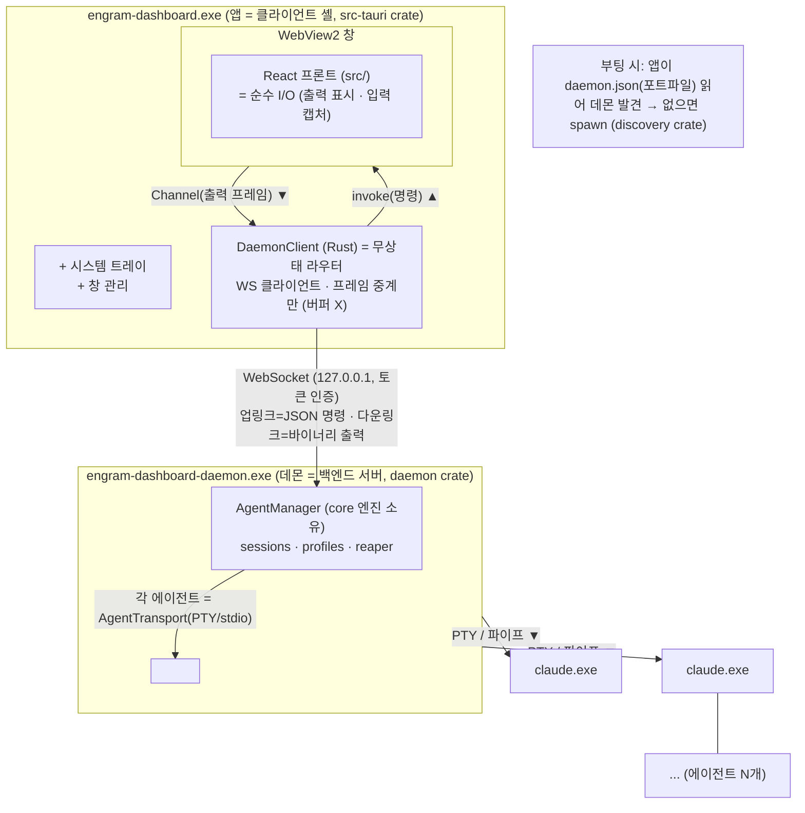

결정: DaemonClient 무상태·데몬 단일 주인 = ADR-0029 / ADR-0046.

## 상태는 누가 갖나 — 소유권 지도

시스템을 이해하는 가장 빠른 길: **"이 상태는 누구 것인가"**. 헷갈리면 흐름을 못 따라간다.

| 상태 | 소유자 | 비고 |
|------|--------|------|
| 에이전트 생사·세션 | 데몬 `AgentManager` | 단일 출처 |
| 출력 버퍼(replay) | 데몬 `OutputCore` 링 | 클라이언트는 미러 안 함 |
| 프로필 영속(session-id·epoch) | 데몬 `ProfileRegistry` → agents.json | 세이브데이터 |
| 데몬 발견 정보(포트·토큰) | daemon.json 포트파일 | 휘발(매 기동 재발행) |
| replay 진도·dedup·gen | **프론트 뷰(viewId)** | Rust는 무상태 |
| 레이아웃·테마 | 프론트 Zustand(+장차 localStorage) | 백엔드 불가지 |

결정: 미러 제거 = ADR-0046 · 레이아웃 권위 = ADR-0035 · data_dir 단일결정 = ADR-0024.

## 읽기 경로 — 뭘 고치러 왔나

세부는 PART 2에 있다. 목적별 진입점:

- **출력이 안 나온다/깨진다** → PART 2 [출력 흐름](#출력-흐름-메인-claude--앱) + [프론트 상태기계](#프론트-제어표면--protocolclient-상태기계) + E2E [출력 시나리오](#출력-에이전트--여러-슬롯)
- **리로드하면 이력이 안 돌아온다** → PART 2 [replay 상태기계](#프론트-제어표면--protocolclient-상태기계) + E2E [리로드 시나리오](#리로드--재구독--전체-replay)
- **스폰/kill 생사가 이상하다** → PART 2 [죽음 흐름](#죽음-흐름-종료--정리) + [핵심 불변식](#핵심-불변식-서버--클라이언트) + E2E [스폰 시나리오](#스폰-ui-클릭--에이전트-생성)
- **새 백엔드/전송을 붙인다** → PART 2 [4대 seam](#4대-seam-교체점) + [crate 계층](#crate-계층-의존-아래위)

**여기까지가 조감도다.** 아래 PART 2는 필요할 때 찾아보는 레퍼런스다.

---

# PART 2 — 심화 레퍼런스 (유지보수자용)

> **범례.** ★ = **seam(교체점)** — trait로 구현된 경계, 코어는 이 뒤를 절대 안 본다. Mermaid 다이어그램의 화살표만 "방향"을 뜻한다(산문·표에선 안 쓴다).

## 프로세스 경계와 통신 수단

**경계마다 통신 수단이 다르다.** 이걸 헷갈리면 흐름을 못 따라간다.

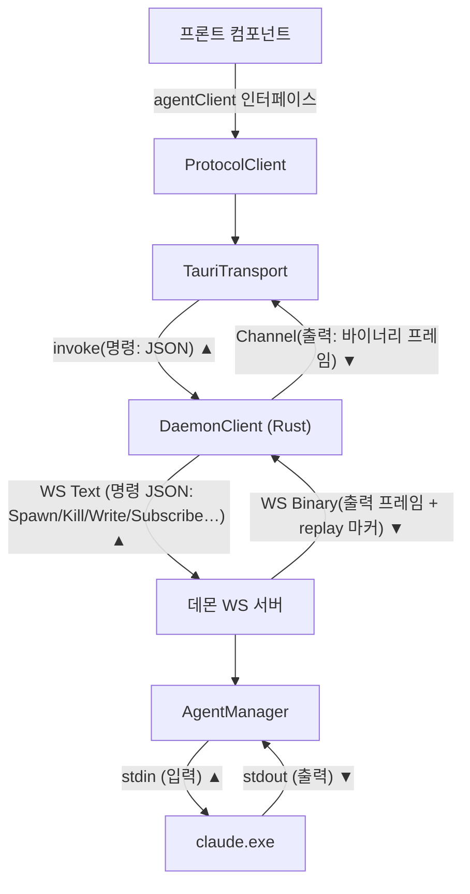

| 경계 | 수단 | 방향 | 싣는 것 |
|------|------|------|---------|
| 컴포넌트 ↔ agentClient | 함수 호출(TS 인터페이스) | 양방향 | 제어표면 |
| 프론트 ↔ 클라이언트(Rust) | `invoke` / Tauri `Channel` | 명령↑ · 출력↓ | JSON 명령 / 바이너리 프레임 |
| 클라이언트 ↔ 데몬 | WebSocket | Text↑ · Binary↓ | 명령 JSON / 출력·마커 |
| 데몬 ↔ 에이전트 | PTY(ConPTY) 또는 파이프 | stdin↑ · stdout↓ | raw 바이트 / (json)NDJSON |

결정: 제어표면 단일화 = ADR-0011.

## 서버측 — 데몬 + core 엔진

### crate 계층 (의존 아래→위)

**실행 산출은 `daemon.exe` 하나**, 나머지는 그것이 쓰는 라이브러리다.

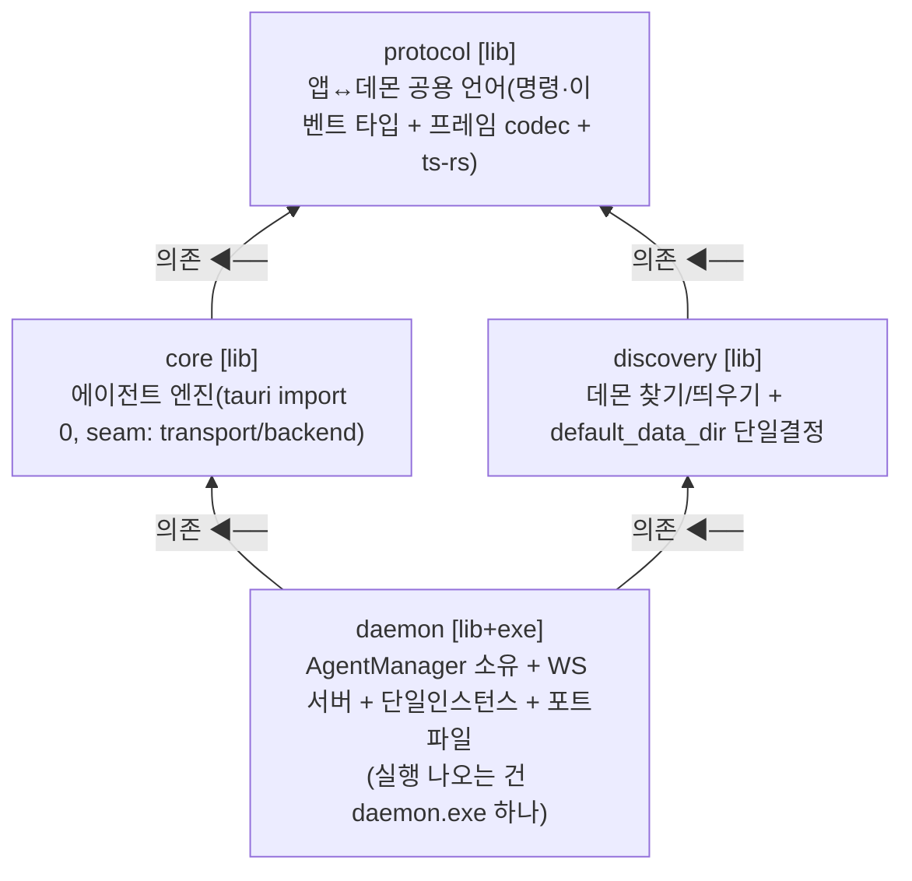

### core 클래스 구조 (소유 관계)

**데몬이 `AgentManager` 하나를 소유하고, 그 아래 에이전트마다 세션 조립체가 달린다.**

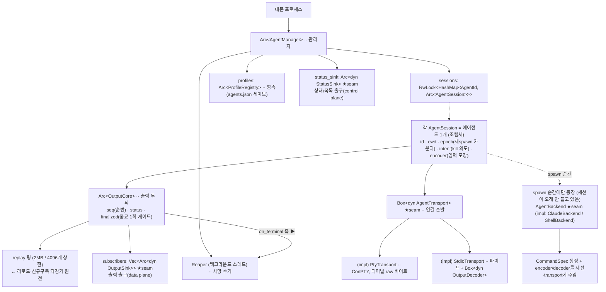

★ seam(교체점) 4종: `AgentTransport`(전송) · `AgentBackend`(모델) · `OutputSink`/`StatusSink`(UI). 코어는 이 뒤를 절대 안 본다 → tauri-free · 교체 가능 · headless 테스트. 상세는 아래 [4대 seam](#4대-seam-교체점).

### 출력 흐름 (메인: claude → 앱)

**claude stdout → 펌프 → OutputCore → sink → 앱.** 코어는 raw만 알고 wire는 모른다.

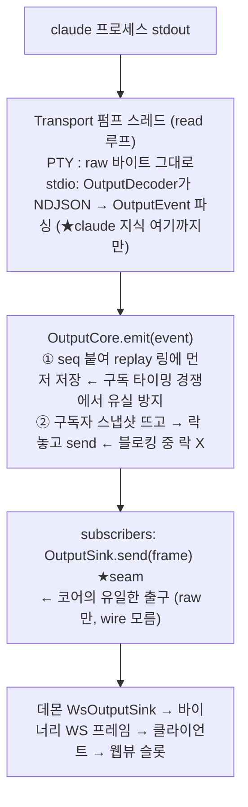

결정: 락 순서 = ADR-0006 · OutputSink wire 무지 = ADR-0003.

### 입력 흐름 (사용자/LLM → claude)

**입력은 세션이 encoder로 포장해 transport로만 나간다.**

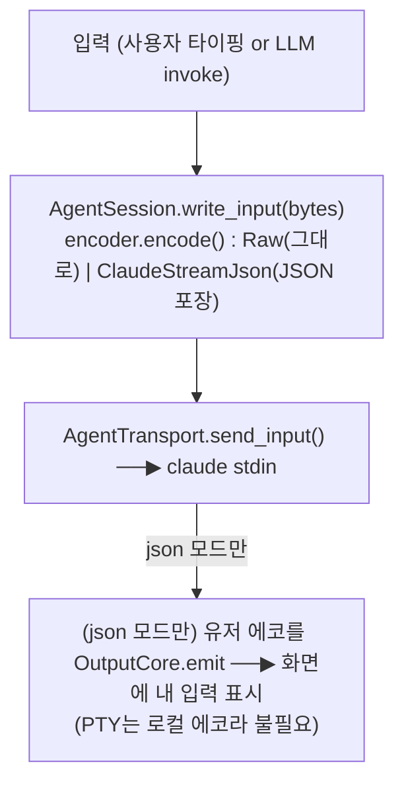

결정: json 모드 배선 = ADR-0044.

### 죽음 흐름 (종료 → 정리)

**종료는 딱 한 번만 확정되고(finalize 1회), 수거는 Reaper 단일 소비자가 한다.**

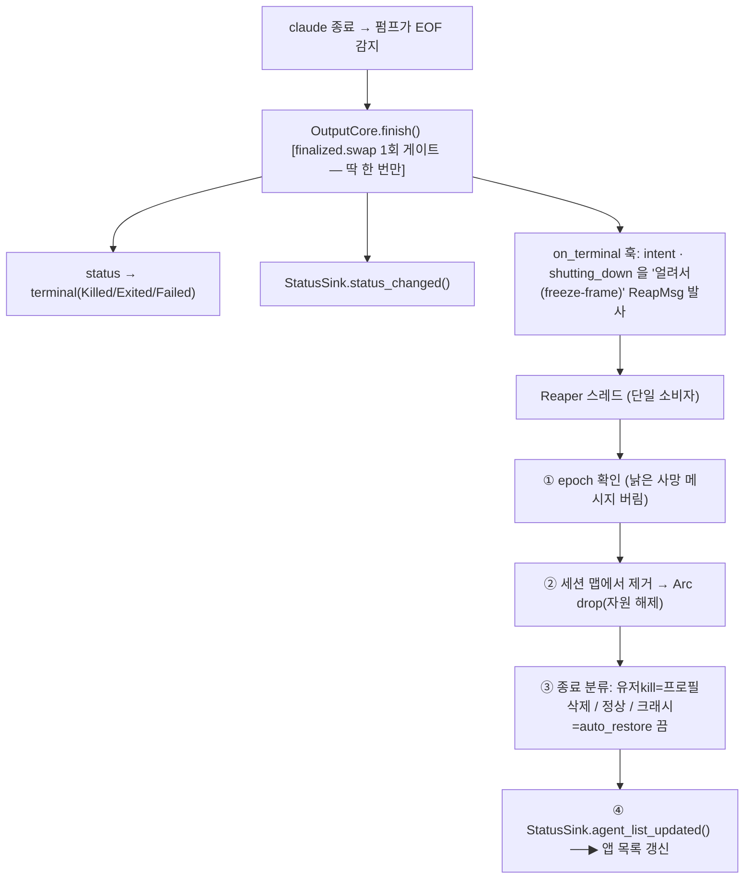

결정: finalize 1회·freeze-frame 수거 = ADR-0019.

## 클라이언트측 — src-tauri 셸 + 프론트

### 프론트 레이어 스택 + 컴포넌트 트리 (상→하)

> 프론트(웹뷰 안 React)를 위에서 아래로 3겹으로 본다: **UI → 상태 → 제어 표면**, 그 아래가 무상태 라우터(다음 절).

**레이어 스택** — 아래로 갈수록 좁아져 `ProtocolClient` 하나로 모이고, 그 밑 `TauriTransport`만 갈면 전송 경로가 바뀐다. 프론트는 렌더링만(두뇌 아님), 제어는 백엔드측이 쥔다(§5).

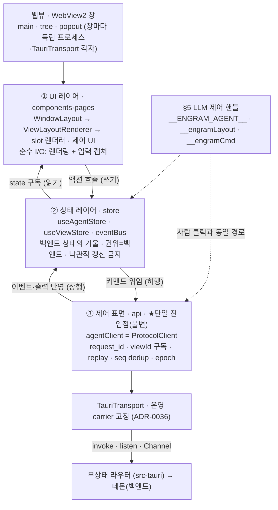

**UI 컴포넌트 트리** — 라우트별 페이지에서 창 레이아웃(`WindowLayout`)을 거쳐 슬롯 렌더러까지. 슬롯은 에이전트 capability로 렌더러를 고른다(출력 종류 가정 안 함).

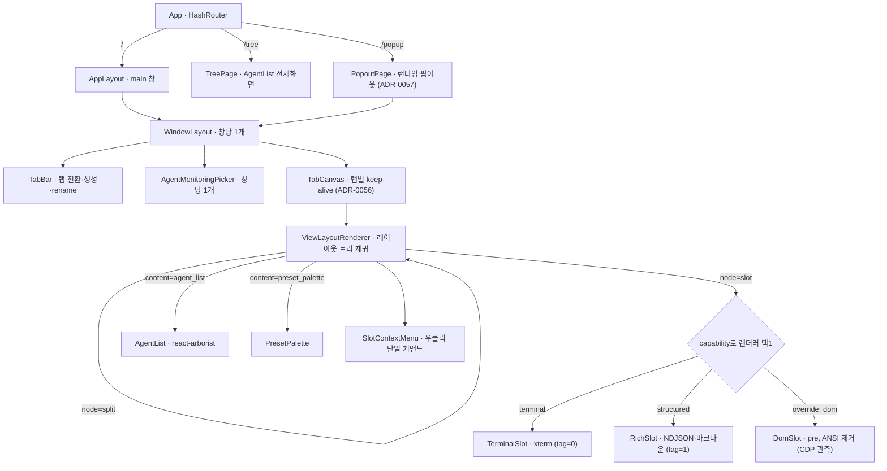

- **렌더러 선택:** `agent.capabilities.output.structured`면 `RichSlot`, 아니면 `TerminalSlot`. `renderModeOverride`로 `dom` 강제 가능. (ADR-0044)
- **구독 키 = viewId(슬롯 id)**, agentId 아님 — 같은 에이전트를 두 슬롯에 띄우면 독립 진도 2개. 상세 상태기계는 아래 [protocolClient 상태기계](#프론트-제어표면--protocolclient-상태기계). (ADR-0046)
- **권위는 백엔드** — 스토어는 거울, 낙관적 갱신 금지(예외: `renderModeOverride`·`chatStyleStore`는 프론트 전용). (ADR-0035)

결정: 제어표면 단일(agentClient) = ADR-0011 · carrier 고정 = ADR-0036 · 렌더 분기 = ADR-0044 · 뷰 직결 replay = ADR-0046.

### src-tauri = 무상태 라우터

**미러 버퍼·per-view 커서는 전부 제거됐다.** Rust는 프레임 헤더만 보고 창별 Channel로 중계한다.

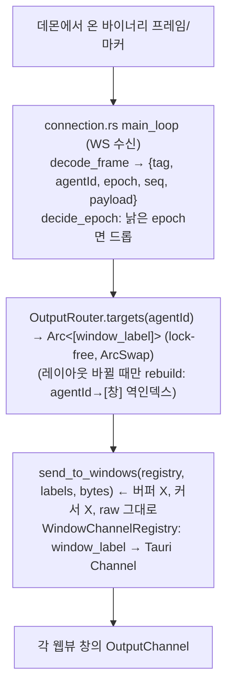

- **상태 없음:** 진도·dedup·replay는 전부 웹뷰(프론트)가 소유. Rust는 "누구 프레임을 어느 창으로" 라우팅 + single-flight replay 세대만 관리.
- **replay 세대(single-flight):** 프론트가 `request_replay(agentId)` invoke → Rust가 데몬에 Subscribe 발사(진행 중이면 병합) → 완료 시 **tag=255 마커**를 프레임과 **같은 Channel 경로로** 보냄(순서 보존).
- **프론트 직접 Subscribe 금지:** `forward_daemon_command`가 Subscribe/Unsubscribe를 차단(BLOCK-1). 구독은 layout/replay 경로로만.

결정: 무상태 라우터 = ADR-0046 · 프론트 직접 Subscribe 금지 = ADR-0041.

### 프론트 제어표면 + protocolClient 상태기계

**컴포넌트는 `agentClient` 인터페이스에만 의존하고, 구독 키는 agentId가 아니라 viewId(슬롯 id)다.**

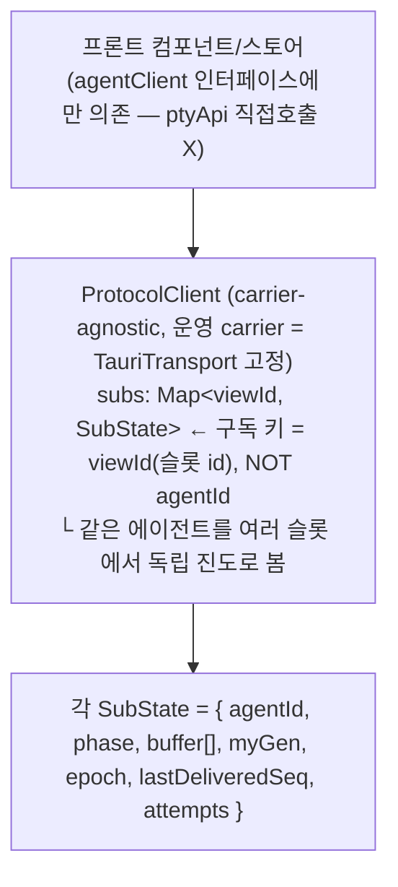

**뷰별 replay 상태기계 (phase):**

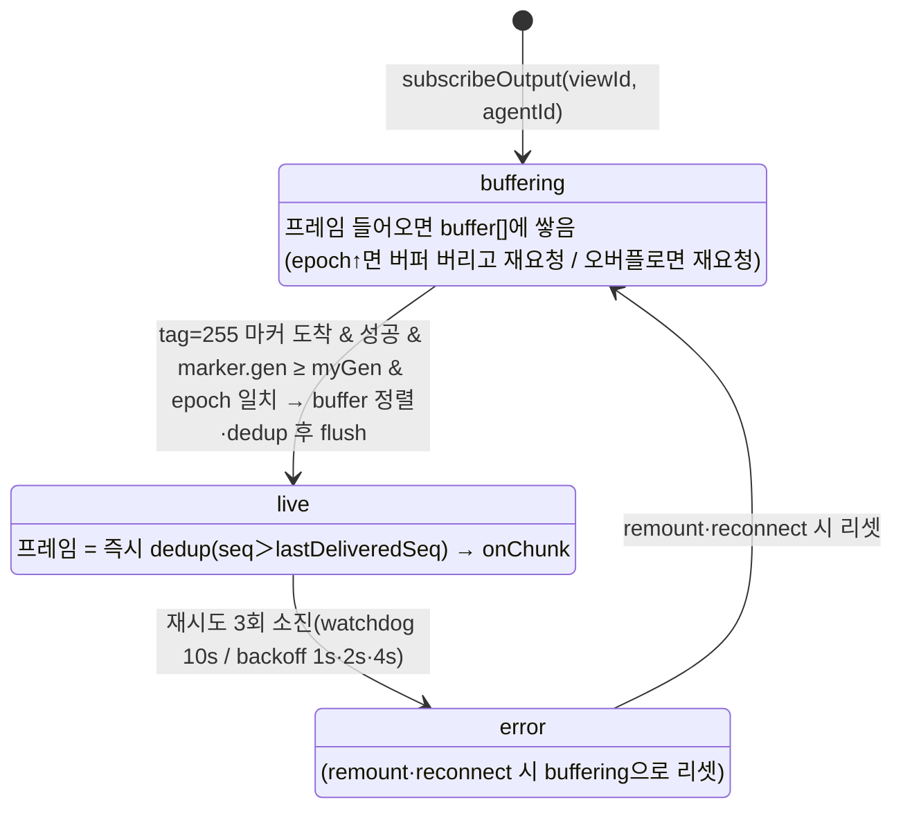

- **gen 펜스(핵심):** replay 요청마다 고유 `myGen`(BigInt) 발급. 도착한 마커의 `gen`이 내 `myGen`보다 작으면 **무시**(옛/남의 replay가 dedup 하한선을 오염시키는 것 차단). `gen ≥ myGen`이고 epoch 맞을 때만 buffering→live 전환.
- **팬아웃:** 한 agentId 프레임 → 그 agentId를 보는 **모든 viewId**에 각자 dedup 후 전달.

결정: 구독 키=viewId·gen 펜스 = ADR-0046 · carrier 고정 = ADR-0036 · 제어표면 단일 = ADR-0011.

### 슬롯 렌더 분기

**슬롯은 에이전트 capability를 보고 렌더러를 고른다** — 출력 종류를 가정하지 않는다.

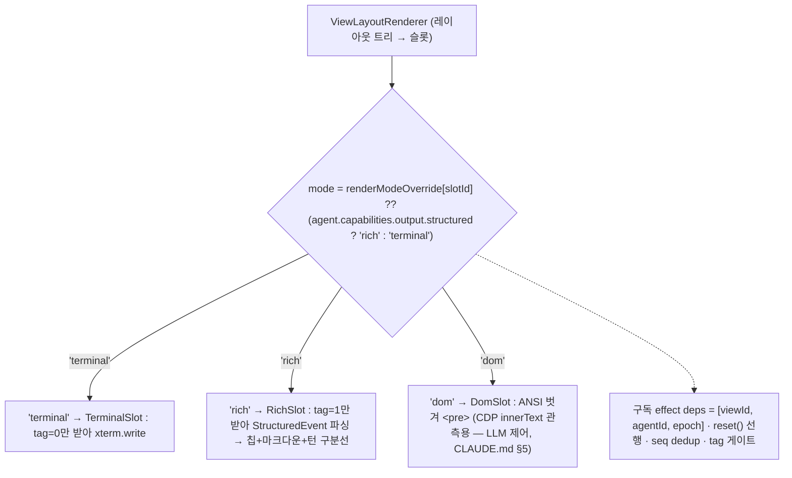

## 엔드투엔드 흐름 (3 시나리오)

### 스폰 (UI 클릭 → 에이전트 생성)

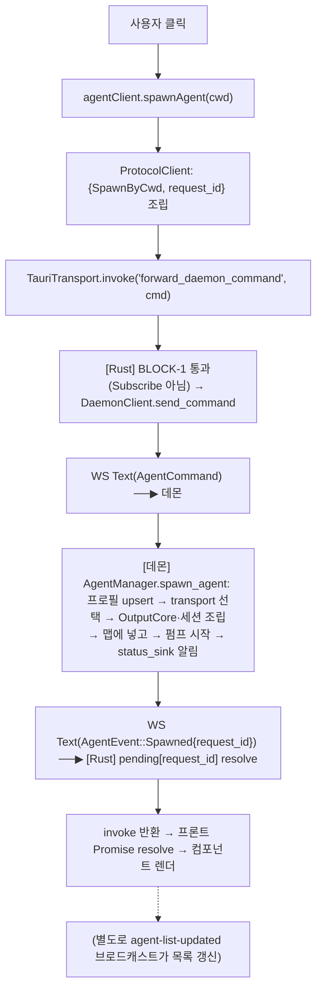

### 출력 (에이전트 → 여러 슬롯)

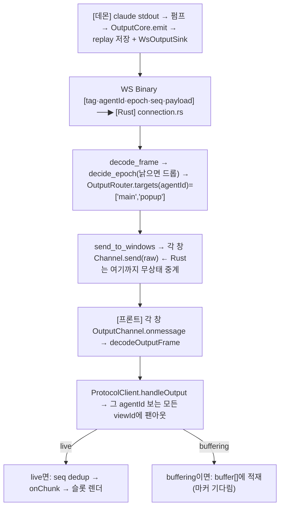

### 리로드 → 재구독 + 전체 replay

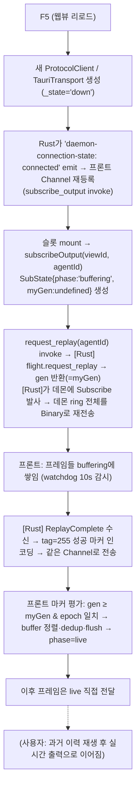

> **⚠ 알려진 열린 이슈(다음 세션):** 리로드 시 새 창 Channel로 데몬 replay 재전송이 아직 완전치 않음(Rust측 미검증). 우회 = 에이전트 재배정. (step-log 참조)

## 4대 seam (교체점)

**seam = trait로 끊은 교체 경계.** 코어는 이 뒤를 안 보므로 구현만 갈아끼우면 새 전송·백엔드가 흡수된다. 아래 표의 **위 4개가 코어 seam(★)**, 맨 아래 `(프론트) transport`는 프론트측 carrier 교체점(코어 밖·별개)이다.

| seam(trait) | 무엇을 끊나 | 현재 구현 | 미래 확장 |
|-------------|-------------|-----------|-----------|
| `AgentTransport` | 전송 방식(물리) | PtyTransport / StdioTransport | API transport(껍데기만) |
| `AgentBackend` | 백엔드 프로그램(claude 인자·스키마) | ClaudeBackend / ShellBackend | codex/gemini variant |
| `OutputSink` | 출력이 나가는 wire | 데몬 WsOutputSink / 테스트 sink | 새 전송 경로 |
| `StatusSink` | 상태·목록 알림 | 데몬 broadcast | — |
| (프론트) transport | carrier | TauriTransport 고정 | WsTransport(테스트/직결) |

**설계 지향(LLM-우선 제어 = CLAUDE.md §5):** UI 컴포넌트는 store 액션 호출만, 그 액션을 LLM도 동일하게 부르는 단일 control surface로 모은다. 현 갭 — UI/레이아웃은 아직 프론트(Zustand) 전용, LLM 제어 표면 미비.

## 핵심 불변식 (서버 + 클라이언트)

**변경 금지.** 근거·거부 대안은 각 ADR에 있다.

- **kill 2동사:** `transport.shutdown()`(child.kill+wait → Job terminate → master drop) → `core.join_pump(5s)`. master drop이 reader EOF를 부르고, 그게 pump break → finish로 이어진다. **순서 뒤집으면 hang.** (ADR-0001)
- **finalize 1회:** `finalized.swap`로 종료 전이·알림·수거를 정확히 1회. (ADR-0019)
- **락 순서:** emit은 replay·subscribers 락을 동시 보유 안 함(스냅샷 후 락 놓고 send). subscribe만 예외로 두 락을 순서대로(subscribers→replay) 잡아 replay→live 역전 방지(C4). (ADR-0006)
- **sink 2평면:** `OutputSink`(고빈도·구독단위 출력=data plane) ≠ `StatusSink`(저빈도·전역 상태/목록=control plane). 프론트는 종료를 `status_changed` 아닌 `agent_list_updated`로 판정. (ADR-0005)
- **freeze-frame 수거:** 사망 순간의 intent·shutting_down을 얼려 판정 → 크래시↔kill 오분류 경쟁 차단. (ADR-0019)
- **epoch:** 같은 AgentId 재시작마다 +1. reaper가 낡은 사망 메시지를, 프론트가 낡은 프레임을 거르는 기준. (ADR-0007)
- **백엔드 격리:** claude 전용 인자·JSON 스키마는 `backend/claude.rs`에만. session=encoder 태그만, transport=스키마 모르는 "바보 파이프". (ADR-0004)
- **capability 합성:** `Capabilities::compose(transport, backend)` — input/output/control은 transport, session/model은 backend가 소유(타입으로 강제). (ADR-0030)

## ADR 근거 맵 (더 파려면 여기)

- **0001** kill 2동사 · **0005** finalize/알림 분담 · **0006** 락 순서 · **0007** epoch
- **0002/0030** capability 합성(transport ⊕ backend) · **0003** OutputSink wire 무지
- **0004** 백엔드 격리 · **0044** json 모드 배선 · **0045** 출력 구조화(decoder)
- **0012** 모듈 격리·TDD · **0019** reaper freeze-frame 수거
- **0029** embedded 제거(데몬 단일) · **0036** transport 단일화 · **0035** 레이아웃 권위=src-tauri
- **0011** 제어표면 단일(agentClient) · **0041** 프론트 직접 Subscribe 금지
- **0046** 미러 버퍼 제거·뷰 직결 replay·gen 펜스 (0040 supersede)
- **0024** data_dir 단일 결정

## 용어 사전 (혼동쌍 고정)

- **에이전트(agent)** = claude(추후 codex/API) 프로세스. "에이전트 재시작" = epoch 교체.
- **클라이언트(client)** = src-tauri 셸(앱 exe). 데몬에 붙는 손님. "클라이언트 재시작" = 앱 창 재실행.
- **데몬(daemon)** = 에이전트 호스팅 서버(daemon.exe). "데몬 재시작" = 서버 프로세스 교체.
- **웹뷰(webview)** = 창(WebView2). **프론트 컴포넌트** = 웹뷰 안 React 부품. **슬롯(slot)** = 레이아웃 한 칸(viewId).
- **transport(전송)** = 물리 연결(PTY/파이프/WS). **backend(백엔드)** = 프로그램 지식(claude 인자).
- **OutputSink**(출력 출구, 고빈도) ≠ **StatusSink**(상태 출구, 저빈도).
- **replay** = 데몬 ring 되감기(리로드·신규구독 복원). **gen 펜스** = 옛/남의 replay 무시하는 세대 검사.
- **epoch** = 같은 AgentId 재시작 카운터. 낡은 프레임·사망메시지 거르는 기준.
- **freeze-frame** = 사망 순간의 판정 재료(intent·shutting_down)를 얼려 나중 오분류 차단.
