# 아키텍처 조감도 — 클라이언트 ~ 서버 전체

> 이 문서는 **코드 지도(orientation)**다. 단일 출처는 언제나 코드·grep(`// ADR-` 앵커) — 여기 line 번호를 안 박는 건 rot 방지다. 결정의 *왜*는 `decisions/` ADR, *언제/무엇*은 `process/step-log.md`.
>
> **두 부분이다.** [PART 1](#part-1--5분-조감도-처음-오는-사람용)은 처음 오는 사람용 5분 조감도, [PART 2](#part-2--심화-레퍼런스-유지보수자용)는 유지보수자용 심화 레퍼런스. 신규자는 **PART 1만 읽어도 시스템 형태가 잡힌다**. 세부를 고치러 왔으면 PART 1의 "읽기 경로"가 PART 2의 해당 지점으로 안내한다.
>
> **용어가 막히면 맨 아래 [§용어 사전](#용어-사전-혼동쌍-고정)**을 본다 — 이 문서의 모든 혼동쌍(에이전트/클라이언트/데몬 등)이 거기 고정돼 있다. PART 1 앞머리엔 최소 5개만 먼저 깐다.
>
> 기준: **S17**(제어 채널 — 에이전트 간 메시지 최소 전송까지 구현. ADR-0086/0087) · 생명주기 개정(resume 전용·시체 보존 — ADR-0082/0083/0084) 반영. 2026-07 스냅샷.
>
> 다이어그램은 전부 Mermaid다 — 렌더 뷰 전제(GitLab·IDE 미리보기). **화살표 = 데이터 흐름 방향**(라벨의 "A→B"가 그 방향을 다시 못박는다).

---

# PART 1 — 5분 조감도 (처음 오는 사람용)

## 먼저 알 용어 5개

이것만 알면 아래 그림이 읽힌다. (풀 사전은 맨 아래 [§용어 사전](#용어-사전-혼동쌍-고정) — 혼동쌍까지 거기 다 있다.)

- **에이전트(agent)** = claude 프로세스. 우리가 띄우고 관리하는 대상. "에이전트 재시작" = epoch 교체.
- **클라이언트(client)** = 앱 실행파일(`engram-dashboard.exe`, src-tauri 셸). 데몬에 붙는 손님.
- **데몬(daemon)** = 에이전트 호스팅 서버(`engram-dashboard-daemon.exe`). 생사·출력·상태의 진짜 주인.
- **웹뷰(webview)** = 창(WebView2) · **슬롯(slot)** = 그 창 안 레이아웃 한 칸.
- **replay** = 데몬이 보관한 출력 되감기(리로드·신규 구독 때 과거 복원). **epoch** = 에이전트 재시작 카운터(낡은 프레임 거르는 기준).

## 5분 요약 — 핵심 6문장

1. **앱은 클라이언트 셸일 뿐이다** — 화면을 그리고 명령을 중계할 뿐, 에이전트를 소유·저장하지 않는다.
2. **데몬이 진짜 주인이다** — 에이전트 생사·출력 버퍼(replay)·상태의 단일 출처.
3. **프론트가 뷰별 진도를 소유한다** — replay·중복제거(dedup) 상태는 슬롯마다 프론트가 갖고, 그 사이 Rust 클라이언트는 무상태 프레임 라우터다.
4. **손발/두뇌를 나눈다** — 프론트는 렌더링만(두뇌 아님). 모든 제어는 백엔드측이 쥐고 사람 클릭은 보조다. (불변 원칙 = CLAUDE.md §5)
5. **에이전트끼리도 말을 건넨다** — S17에서 에이전트(또는 그 안의 LLM)가 데몬을 통해 다른 에이전트에게 메시지를 보내는 **제어 채널**이 생겼다(현재 "보내기"까지 구현, 영속 장부는 예정). 이것도 데몬이 소유한다.
6. **"왜"의 출처는 여기가 아니다** — 근거·거부한 대안은 코드의 `// ADR-` 앵커와 `decisions/` ADR에 있다. 이 문서는 지도지 진실의 출처가 아니다.

## 큰 그림 — 3 프로세스 + 실행파일 3개(앱·데몬·engram-send)

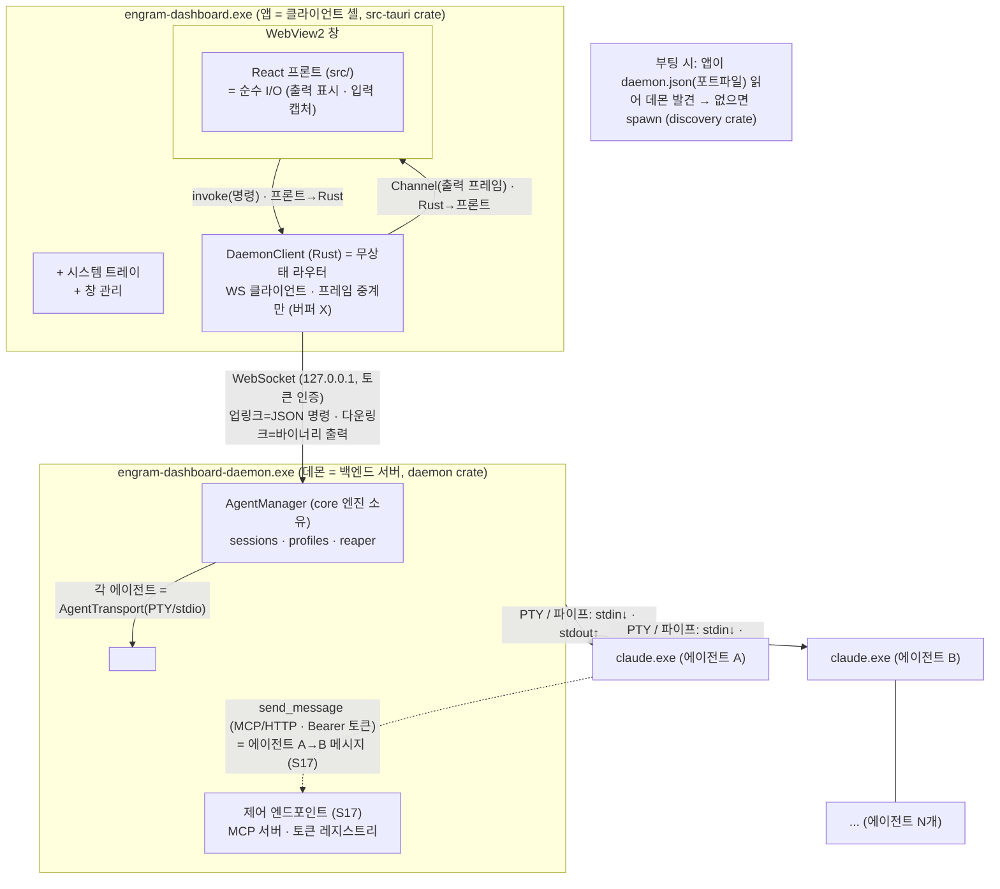

결정: DaemonClient 무상태·데몬 단일 주인 = ADR-0029 / ADR-0046 · 제어 엔드포인트 = ADR-0086.

**점선 화살표(A→CTL)가 S17의 새 흐름이다** — 에이전트가 데몬 안 제어 엔드포인트로 되전화를 걸어 형제 에이전트에게 메시지를 넣는다. 실선(WS·PTY)은 기존 뼈대.

## 상태는 누가 갖나 — 소유권 지도

시스템을 이해하는 가장 빠른 길: **"이 상태는 누구 것인가"**. 헷갈리면 흐름을 못 따라간다.

| 상태 | 소유자 | 비고 |
|------|--------|------|
| 에이전트 생사·세션 | 데몬 `AgentManager` | 단일 출처 |
| 출력 버퍼(replay) | 데몬 `OutputCore` 링 | 클라이언트는 미러 안 함 |
| 프로필 영속(session-id·epoch) | 데몬 `ProfileRegistry` → agents.json | 세이브데이터 · **종료해도 보존(시체)**, ADR-0083 |
| 제어 토큰((AgentId,epoch)별) | 데몬 `ControlRegistry` | 스폰 시 발급 · epoch 교체/kill 시 폐기 (S17) |
| 에이전트 간 메시지 장부 | (예정) 데몬 SQLite 메일박스 | **아직 미구현** — 현재는 즉시 relay만 |
| 데몬 발견 정보(포트·토큰) | daemon.json 포트파일 | 휘발(매 기동 재발행) |
| replay 진도·dedup·gen | **프론트 뷰(viewId)** | Rust는 무상태 |
| 레이아웃·테마 | 프론트 Zustand(+장차 localStorage) | 백엔드 불가지 |

결정: 미러 제거 = ADR-0046 · 레이아웃 권위 = ADR-0035 · data_dir 단일결정 = ADR-0024 · 시체 보존 = ADR-0083 · 제어 토큰 = ADR-0086.

## 읽기 경로 — 뭘 고치러 왔나

세부는 PART 2에 있다. 목적별 진입점:

- **출력이 안 나온다/깨진다** → PART 2 [출력 흐름](#출력-흐름-메인-claude--앱) + [프론트 상태기계](#프론트-제어표면--protocolclient-상태기계) + E2E [출력 시나리오](#출력-에이전트--여러-슬롯)
- **리로드하면 이력이 안 돌아온다** → PART 2 [replay 상태기계](#프론트-제어표면--protocolclient-상태기계) + E2E [리로드 시나리오](#리로드--재구독--전체-replay)
- **스폰/kill 생사가 이상하다** → PART 2 [죽음 흐름](#죽음-흐름-종료--정리) + [핵심 불변식](#핵심-불변식-서버--클라이언트) + E2E [스폰 시나리오](#스폰-ui-클릭--에이전트-생성)
- **에이전트끼리 메시지가 안 간다** → PART 2 [제어 채널](#제어-채널-에이전트-간-메시지--s17) + E2E [메시지 시나리오](#메시지-에이전트-a--에이전트-b--s17)
- **새 백엔드/전송을 붙인다** → PART 2 [5대 seam](#5대-seam-교체점) + [crate 계층](#crate-계층-의존-아래위)

**여기까지가 조감도다.** 아래 PART 2는 필요할 때 찾아보는 레퍼런스다.

---

# PART 2 — 심화 레퍼런스 (유지보수자용)

> **범례.** ★ = **seam(교체점)** — trait로 구현된 경계, 코어는 이 뒤를 절대 안 본다. Mermaid 화살표는 데이터 흐름 방향(산문·표에선 화살표 기호를 안 쓴다).

## 프로세스 경계와 통신 수단

**경계마다 통신 수단이 다르다.** 이걸 헷갈리면 흐름을 못 따라간다.

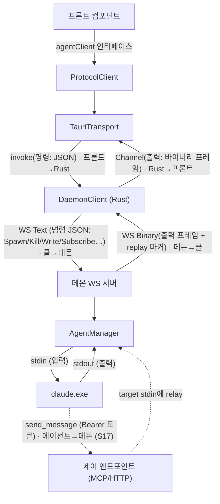

| 경계 | 수단 | 방향 | 싣는 것 |
|------|------|------|---------|
| 컴포넌트 ↔ agentClient | 함수 호출(TS 인터페이스) | 양방향 | 제어표면 |
| 프론트 ↔ 클라이언트(Rust) | `invoke` / Tauri `Channel` | 명령 프론트→Rust · 출력 Rust→프론트 | JSON 명령 / 바이너리 프레임 |
| 클라이언트 ↔ 데몬 | WebSocket | 명령 클→데몬 · 출력 데몬→클 | 명령 JSON / 출력·마커 |
| 데몬 ↔ 에이전트 (기존) | PTY(ConPTY) 또는 파이프 | stdin↓ · stdout↑ | raw 바이트 / (json)NDJSON |
| **에이전트 → 데몬 (S17)** | **MCP(Streamable HTTP) 또는 CLI HTTP** | 에이전트→데몬 (업링크) | **send_message(Bearer 토큰 인증)** |

결정: 제어표면 단일화 = ADR-0011 · 제어 채널 = ADR-0086.

> **주의 — 통신선이 두 개다.** 기존 PTY(데몬이 에이전트를 *부리는* 선)와, S17 제어선(에이전트가 데몬으로 *되전화하는* 선)은 물리적으로 다르다. 전자는 데몬→에이전트 stdin, 후자는 에이전트→데몬 MCP/HTTP. 헷갈리면 흐름을 반대로 읽는다.

## 서버측 — 데몬 + core 엔진

### crate 계층 (의존 아래→위)

**실행 산출 = `daemon.exe` + `engram-send`(제어 채널 CLI 입구 bin, S17)** — 나머지는 그것들이 쓰는 라이브러리다. (앱 exe는 src-tauri crate 산출 — 그래서 우리 실행파일은 앱·데몬·engram-send 3개.)

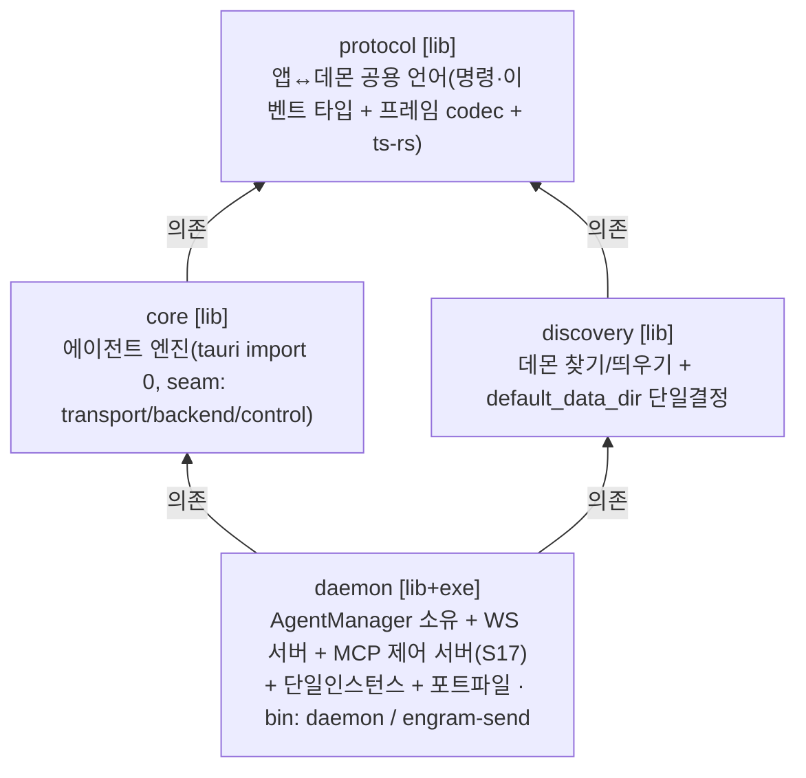

- 여전히 **5 멤버**(protocol·core·discovery·daemon·src-tauri). S17 제어 채널은 새 crate가 아니라 **core에 seam(`ControlChannel`) 정의 + daemon에 구현(MCP 서버·토큰 레지스트리·`engram-send` bin)** 으로 들어갔다. 새 의존성 = `rmcp`(공식 Rust MCP SDK) + `axum`(daemon 한정).

### core 클래스 구조 (소유 관계)

**데몬이 `AgentManager` 하나를 소유하고, 그 아래 에이전트마다 세션 조립체가 달린다.**

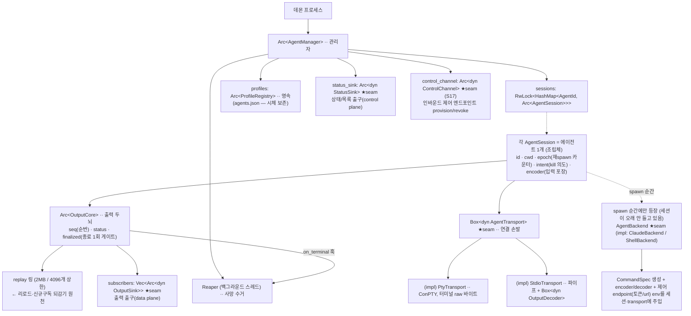

★ **코어 seam 5종**: `AgentTransport`(전송) · `AgentBackend`(모델) · `OutputSink`/`StatusSink`(출력·상태 출구) · `ControlChannel`(인바운드 제어, S17). 코어는 이 뒤를 절대 안 본다 → tauri-free · 교체 가능 · headless 테스트. 상세는 아래 [5대 seam](#5대-seam-교체점).

### 출력 흐름 (메인: claude → 앱)

**claude stdout → 펌프 → OutputCore → sink → 앱.** 코어는 raw만 알고 wire는 모른다.

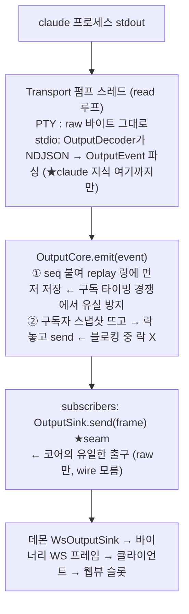

결정: 락 순서 = ADR-0006 · OutputSink wire 무지 = ADR-0003.

### 입력 흐름 (사용자/LLM → claude)

**입력은 세션이 encoder로 포장해 transport로만 나간다.** 두 진입 경로가 같은 `write_input`으로 합류한다:

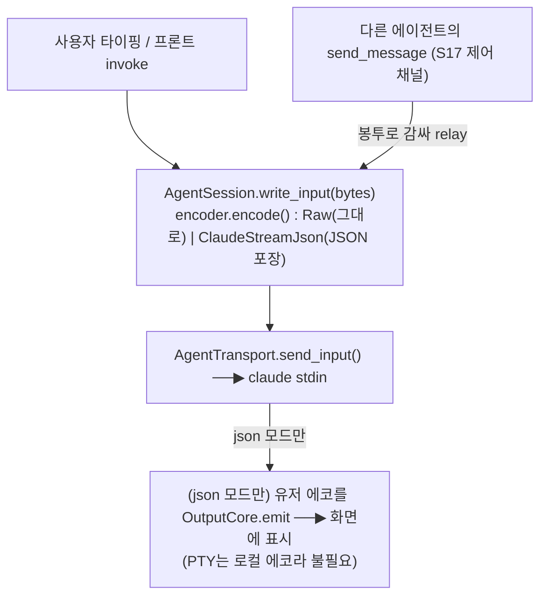

결정: json 모드 배선 = ADR-0044 · 메시지 relay = ADR-0087.

### 죽음 흐름 (종료 → 정리)

**종료는 딱 한 번만 확정되고(finalize 1회), 수거는 Reaper 단일 소비자가 한다. 그리고 이제 시체는 안 지운다(ADR-0083).**

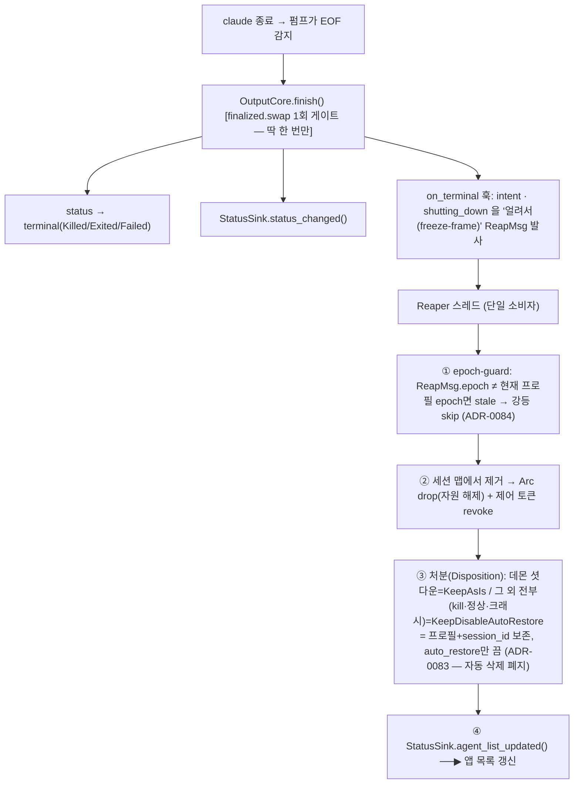

- **핵심 변경(ADR-0083):** 옛 reaper는 "유저 의도 kill이면 프로필 삭제"를 했으나, 이제 **어떤 종료도 프로필을 지우지 않는다.** 모든 종료가 "시체"(session_id 보존 · auto_restore off)로 남는다. 진짜 삭제는 사용자의 명시적 `DeleteProfile` 명령으로만. → 목록에 종료된 에이전트가 쌓이는 게 정상(의도).
- **epoch-guard(ADR-0084):** 재활성화(resume)로 epoch이 바뀐 뒤 늦게 도착한 옛 사망 메시지가 산 세션을 강등하지 못하게, 처분 적용 전 epoch 일치를 확인한다.

결정: finalize 1회·freeze-frame 수거 = ADR-0019 · 시체 보존 = ADR-0083 · epoch-guard = ADR-0084.

### 세션 복원 / 활성화 (resume 전용 — ADR-0082)

**spawn 시 `--session-id`로 sid를 우리가 통제 → `--resume` 무손실 복원.** 복원 정확성은 이 sid에만 의존한다(추적 파일은 best-effort).

- **활성화(activate) = 이어받기(resume) 전용이다 (ADR-0082).** 종료된 에이전트를 다시 켜면 그 session_id로 resume한다.
- **fresh fallback 폐지:** 옛 설계는 "resume 실패 시 새 대화(fresh)를 만든다"였으나 이제 **하지 않는다.** resume가 실패/조기종료하면 → 종점(Exited/Failed)으로 직행 + 시체 보존 + 실패 원인 로그. 복구는 사람/LLM 판단(자동으로 새 세션을 파지 않는다 — 무손실 원칙 우선).
- **재활성화도 맵 교체 = epoch++ (ADR-0084):** resume respawn은 같은 AgentId의 세션 객체를 갈아끼우므로 epoch을 올린다 → 프론트가 낡은 프레임을 거른다.

결정: resume 전용·fresh 폐지 = ADR-0082(Supersedes 0077, Amends 0008) · sid 통제 = ADR-0008.

## 제어 채널 (에이전트 간 메시지 — S17)

**S17에서 에이전트(그 안의 LLM)가 다른 에이전트에게 메시지를 보내는 길이 뚫렸다.** 이건 기존 출력/입력 흐름과 별개의 인바운드 경로다 — 에이전트가 데몬으로 *되전화*해서 형제의 stdin에 글을 넣는다.

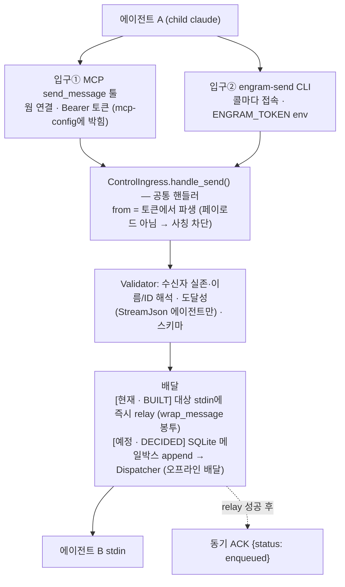

### 무엇이 되고(BUILT) 무엇이 아직인가(PLANNED) — 정확히

정확성이 중요하다. **아래 "예정"을 "이미 있다"로 읽지 말 것.**

- **BUILT (구현·QA 통과, 2026-07):**
  - 토큰 레지스트리(`ControlRegistry`, daemon) — (AgentId, epoch)별 발급·검증·폐기, 세션 바인딩.
  - 데몬 MCP 서버(`rmcp`+`axum`) — `engram_ping`·`send_message` 툴, Bearer 인증 미들웨어.
  - 스폰 시 에이전트별 `mcp-config` 파일 생성·주입 + env(`ENGRAM_TOKEN`/`ENGRAM_CONTROL_URL`/`ENGRAM_SEND_EXE`).
  - `send_message` **최소 전송** — Validator + 대상 stdin 즉시 relay + 동기 ACK.
  - CLI 입구 `engram-send`(daemon bin) — env 토큰으로 `/control/send` POST.
  - `ControlChannel` seam(core) + `DeliveryObservation` 계측 seam(ADR-0088).
- **DECIDED (설계 확정, 미구현):** SQLite 메일박스(장부 append = source of truth) · Dispatcher(오프라인 배달·재주입 방지) · UI relay 명령(ADR-0081) · 확장 CLI 명령(agent list/write 등 — `engram-ctl` 이름은 폐기됨, ADR-0086).
- **미결(다음 단계 순서):** 봉투 최종 포맷은 아직 **정해지지 않았다**(현재 placeholder `wrap_message`가 임시). 순서 = ① ADR-0088 배달 정확성 계측·테스트 → ② 봉투 포맷 실측 스파이크(XML vs 텍스트·escaping) → ③ SQLite 메일박스.
- **DEFERRED (사용자 선결):** SQLite 메일박스(위 ③)는 **사용자가 설계를 학습·판단한 뒤** 착수.

> ACK가 "enqueued"(장부에 실림)인 건 **미래 메일박스와의 forward-compat** 때문이다 — 현재는 실제로 즉시 relay지만, 시맨틱은 "접수됨"이지 "읽음"이 아니다(two-level ACK, ADR-0087).

### 인증 — 신원은 토큰에서만 나온다

- **토큰 단위 = (AgentId, epoch).** 같은 에이전트라도 epoch이 다르면 다른 토큰. **epoch 회전(재활성화/재시작)·kill = 구 토큰 즉시 폐기** → 죽은/낡은 신원으로는 메시지 못 보냄 (ADR-0007/0084 연동).
- **`from`은 항상 토큰에서 파생.** 페이로드의 발신자 필드는 무시한다 → 프롬프트 주입/오작동 에이전트의 사칭 차단(같은 OS 유저라 하드 격리는 불가 — 최종 방어는 Validator).
- MCP = mcp-config에 토큰을 박아 연결 시 1회 바인딩(`Mcp-Session-Id`↔신원 고정). CLI = 콜마다 env 토큰 제시.

결정: 채널 아키텍처 = ADR-0086 · send_message 시맨틱 = ADR-0087 · 배달 관측 seam = ADR-0088.

## 클라이언트측 — src-tauri 셸 + 프론트

### 프론트 레이어 스택 + 컴포넌트 트리 (상→하)

> 프론트(웹뷰 안 React)를 위에서 아래로 3겹으로 본다: **UI → 상태 → 제어 표면**, 그 아래가 무상태 라우터(다음 절).

**레이어 스택** — 아래로 갈수록 좁아져 `ProtocolClient` 하나로 모이고, 그 밑 `TauriTransport`만 갈면 전송 경로가 바뀐다. 프론트는 렌더링만(두뇌 아님), 제어는 백엔드측이 쥔다(§5).

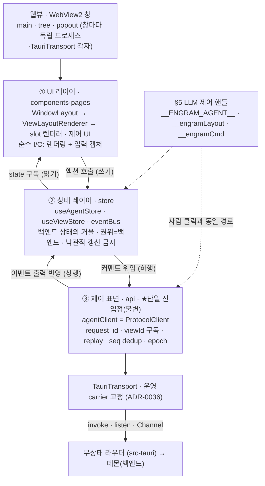

**UI 컴포넌트 트리** — 라우트별 페이지에서 창 레이아웃(`WindowLayout`)을 거쳐 슬롯 렌더러까지. 슬롯은 에이전트 capability로 렌더러를 고른다(출력 종류 가정 안 함).

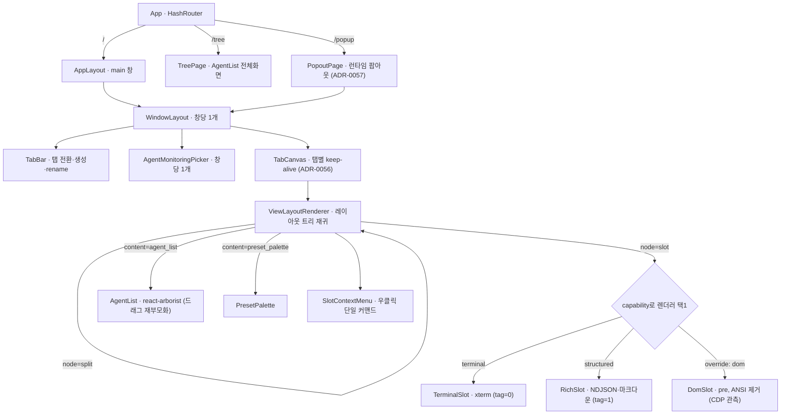

- **렌더러 선택:** `agent.capabilities.output.structured`면 `RichSlot`, 아니면 `TerminalSlot`. `renderModeOverride`로 `dom` 강제 가능. (ADR-0044)
- **구독 키 = viewId(슬롯 id)**, agentId 아님 — 같은 에이전트를 두 슬롯에 띄우면 독립 진도 2개. (ADR-0046)
- **권위는 백엔드** — 스토어는 거울, 낙관적 갱신 금지(예외: `renderModeOverride`·`chatStyleStore`는 프론트 전용). (ADR-0035)

결정: 제어표면 단일(agentClient) = ADR-0011 · carrier 고정 = ADR-0036 · 렌더 분기 = ADR-0044 · 뷰 직결 replay = ADR-0046.

### src-tauri = 무상태 라우터

**미러 버퍼·per-view 커서는 전부 제거됐다.** Rust는 프레임 헤더만 보고 창별 Channel로 중계한다.

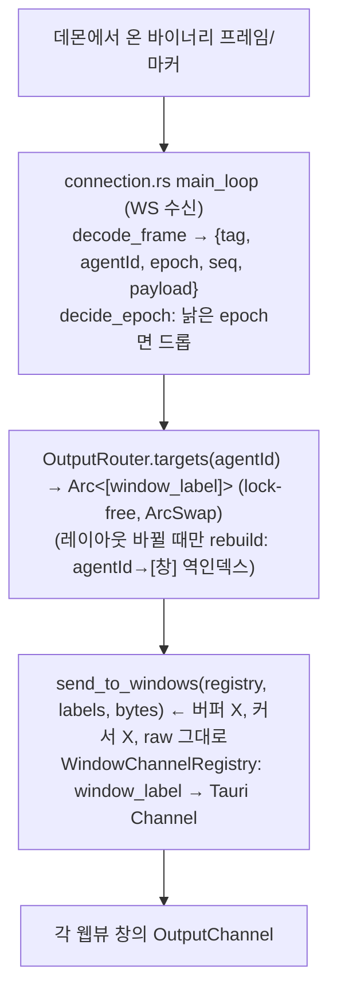

- **상태 없음:** 진도·dedup·replay는 전부 웹뷰(프론트)가 소유. Rust는 "누구 프레임을 어느 창으로" 라우팅 + single-flight replay 세대만 관리.
- **replay 세대(single-flight):** 프론트가 `request_replay(agentId)` invoke → Rust가 데몬에 Subscribe 발사(진행 중이면 병합) → 완료 시 **tag=255 마커**를 프레임과 **같은 Channel 경로로** 보냄(순서 보존).
- **프론트 직접 Subscribe 금지:** `forward_daemon_command`가 Subscribe/Unsubscribe를 차단(BLOCK-1). 구독은 layout/replay 경로로만.

결정: 무상태 라우터 = ADR-0046 · 프론트 직접 Subscribe 금지 = ADR-0041.

### 프론트 제어표면 + protocolClient 상태기계

**컴포넌트는 `agentClient` 인터페이스에만 의존하고, 구독 키는 agentId가 아니라 viewId(슬롯 id)다.**

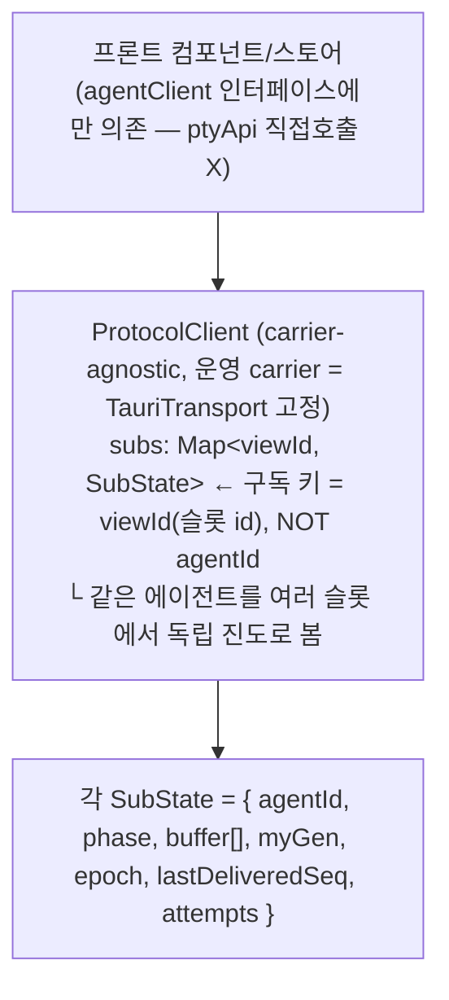

**뷰별 replay 상태기계 (phase):**

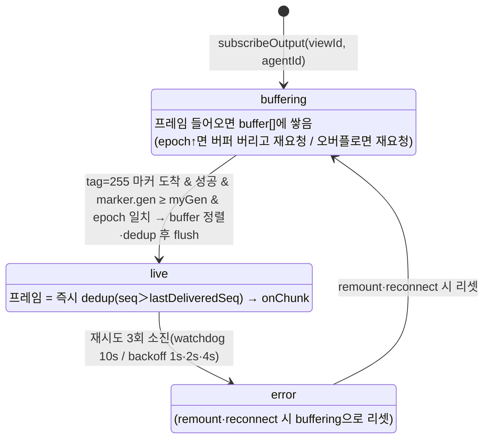

- **gen 펜스(핵심):** replay 요청마다 고유 `myGen`(BigInt) 발급. 도착한 마커의 `gen`이 내 `myGen`보다 작으면 **무시**(옛/남의 replay가 dedup 하한선을 오염시키는 것 차단). `gen ≥ myGen`이고 epoch 맞을 때만 buffering→live 전환.
- **팬아웃:** 한 agentId 프레임 → 그 agentId를 보는 **모든 viewId**에 각자 dedup 후 전달.

결정: 구독 키=viewId·gen 펜스 = ADR-0046 · carrier 고정 = ADR-0036 · 제어표면 단일 = ADR-0011.

### 슬롯 렌더 분기

**슬롯은 에이전트 capability를 보고 렌더러를 고른다** — 출력 종류를 가정하지 않는다.

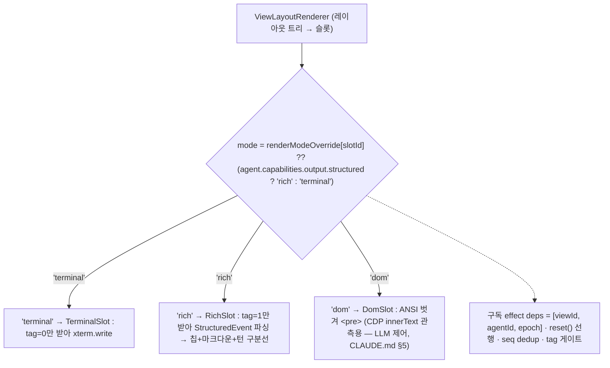

## 엔드투엔드 흐름 (4 시나리오)

### 스폰 (UI 클릭 → 에이전트 생성)

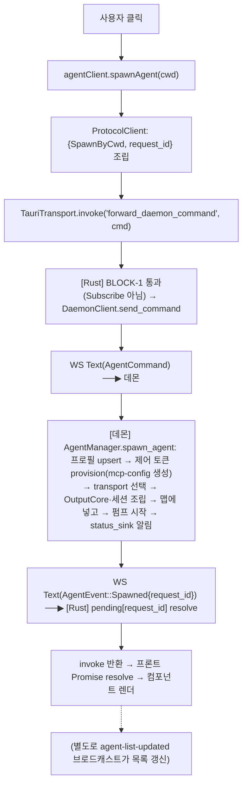

### 출력 (에이전트 → 여러 슬롯)

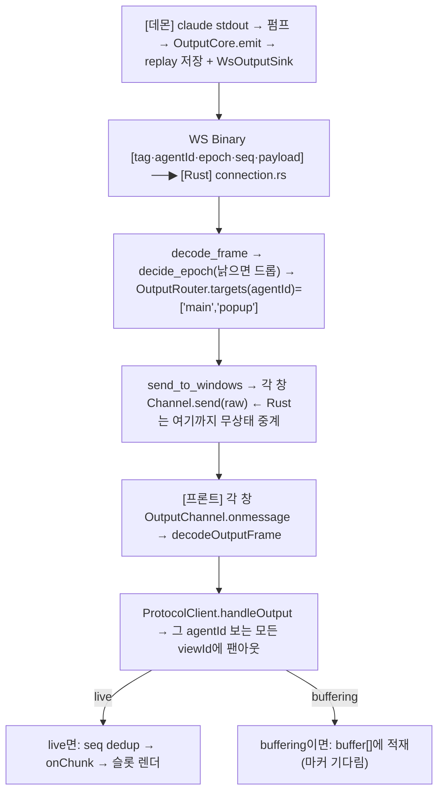

### 리로드 → 재구독 + 전체 replay

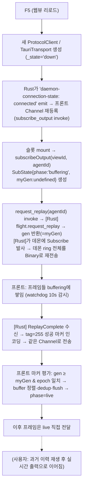

> S16의 "리로드 시 새 창 replay 미검증" 열린 이슈는 **해소됐다** — StrictMode 이중구독 버퍼 유실 수정(`ca3f325`) + 뷰 직결 replay(ADR-0046) 구현·QA 통과로 원인이 제거됐다.

### 메시지 (에이전트 A → 에이전트 B — S17)

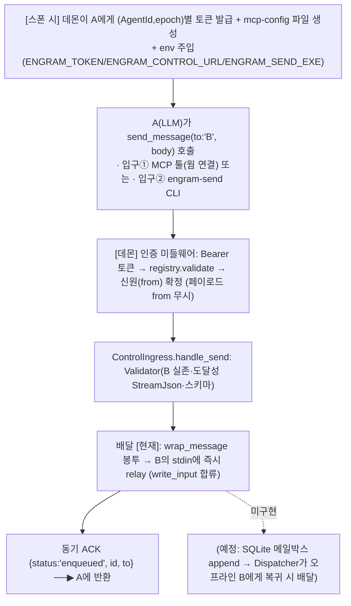

> **읽는 법:** M1·M2·M3·M4·M5·M6은 **구현됨**. M7(영속 장부·오프라인 배달)은 **설계만 됨** — 현재 B가 죽어 있으면 메시지는 그냥 relay 실패/유실이다(장부가 없어서). 그래서 이 채널은 아직 "온라인 상대에게 즉시 전달"까지다.

## 5대 seam (교체점)

**seam = trait로 끊은 교체 경계.** 코어는 이 뒤를 안 보므로 구현만 갈아끼우면 새 전송·백엔드·제어 경로가 흡수된다. 위 5개가 **코어 seam(★)**, 맨 아래 `(프론트) transport`는 프론트측 carrier 교체점(코어 밖·별개)이다.

| seam(trait) | 무엇을 끊나 | 성격 | 현재 구현 | 미래 확장 |
|-------------|-------------|------|-----------|-----------|
| `AgentTransport` | 전송 방식(물리) | 출력·입력 손발 | PtyTransport / StdioTransport | API transport(껍데기만) |
| `AgentBackend` | 백엔드 프로그램(claude 인자·스키마) | spawn 순간 | ClaudeBackend / ShellBackend | codex/gemini variant |
| `OutputSink` | 출력이 나가는 wire | data plane 출구 | 데몬 WsOutputSink / 테스트 sink | 새 전송 경로 |
| `StatusSink` | 상태·목록 알림 | control plane 출구 | 데몬 broadcast | — |
| `ControlChannel` (S17) | 인바운드 제어 엔드포인트 | spawn=provision · terminal=revoke | DaemonControlChannel(MCP) / NoopControlChannel | 새 입구·명령 |
| (프론트) transport | carrier | 프론트 밖·별개 | TauriTransport 고정 | WsTransport(테스트/직결) |

- **`ControlChannel`의 성격이 다른 이유:** 나머지 코어 seam이 *출력·상태를 코어 밖으로 흘리는* 출구라면, `ControlChannel`은 *에이전트가 되전화할 인바운드 엔드포인트를 스폰 때 세우고 종료 때 거두는* 생명주기 seam이다. 코어는 `ControlEndpoint`(url·token·config 경로 문자열)만 나르고 rmcp/axum/HTTP를 모른다(ADR-0003 idiom 동형).

**설계 지향(LLM-우선 제어 = CLAUDE.md §5):** UI 컴포넌트는 store 액션 호출만, 그 액션을 LLM도 동일하게 부르는 단일 control surface로 모은다.
- **백엔드 제어 — "누가" 제어하나로 갈린다.** ① 스폰·kill·write 등은 **클라이언트 제어 표면(invoke)** 으로 LLM 제어 가능(앱을 부리는 주체 경로). ② 워커(child 에이전트)끼리는 **least-privilege** — S17 제어 채널로 **`send_message`만** 노출된다(형제 스폰·kill 권한 없음, ADR-0086).
- **UI/레이아웃 제어** = ADR-0081로 **아키텍처는 확정**(앱이 데몬 명령을 받는 WS peer로 등록 → `UiCommand` → 공유 `ViewCommand` 적용 서비스, 사람 경로와 단일 경로). **코드 구현은 대기 중**(diff 0). 즉 갭이 "미비"에서 "확정·구현 대기"로 좁혀졌다.

## 핵심 불변식 (서버 + 클라이언트)

**변경 금지.** 근거·거부 대안은 각 ADR에 있다.

- **kill 2동사:** `transport.shutdown()`(child.kill+wait → Job terminate → master drop) → `core.join_pump(5s)`. master drop이 reader EOF를 부르고, 그게 pump break → finish로 이어진다. **순서 뒤집으면 hang.** (ADR-0001)
- **finalize 1회:** `finalized.swap`로 종료 전이·알림·수거를 정확히 1회. (ADR-0019)
- **락 순서:** emit은 replay·subscribers 락을 동시 보유 안 함(스냅샷 후 락 놓고 send). subscribe만 예외로 두 락을 순서대로(subscribers→replay) 잡아 replay→live 역전 방지(C4). (ADR-0006)
- **sink 2평면:** `OutputSink`(고빈도·구독단위 출력=data plane) ≠ `StatusSink`(저빈도·전역 상태/목록=control plane). 프론트는 종료를 `status_changed` 아닌 `agent_list_updated`로 판정. (ADR-0005)
- **freeze-frame 수거:** 사망 순간의 intent·shutting_down을 얼려 판정 → 크래시↔kill 오분류 경쟁 차단. (ADR-0019)
- **시체 보존:** 종료된 에이전트 프로필을 reaper가 자동 삭제하지 않는다 — 모든 종료가 `KeepDisableAutoRestore`(session_id 보존·auto_restore off). 삭제는 명시적 `DeleteProfile` 명령으로만. (ADR-0083)
- **활성화=resume 전용:** fresh fallback 폐지. resume 실패 시 새 세션을 만들지 않고 종점 + 시체 보존 + 로그. (ADR-0082)
- **epoch:** 같은 AgentId 맵 교체(재시작·**재활성화(resume respawn)**)마다 +1. reaper가 낡은 사망 메시지를(**epoch-guard**), 프론트가 낡은 프레임을 거르는 기준. (ADR-0007/0084)
- **제어 토큰 수명 = (AgentId, epoch):** epoch 회전·kill = 즉시 폐기. `from`은 토큰에서만 파생(사칭 차단). stale revoke는 현재 epoch 일치할 때만. (ADR-0086/0084)
- **백엔드 격리:** claude 전용 인자·JSON 스키마는 `backend/claude.rs`에만. session=encoder 태그만, transport=스키마 모르는 "바보 파이프". (ADR-0004)
- **capability 합성:** `Capabilities::compose(transport, backend)` — input/output/control은 transport, session/model은 backend가 소유(타입으로 강제). (ADR-0030)

## ADR 근거 맵 (더 파려면 여기)

- **0001** kill 2동사 · **0005** finalize/알림 분담 · **0006** 락 순서 · **0007** epoch
- **0002/0030** capability 합성(transport ⊕ backend) · **0003** OutputSink wire 무지 · seam idiom
- **0004** 백엔드 격리 · **0044** json 모드 배선 · **0045** 출력 구조화(decoder)
- **0012** 모듈 격리·TDD · **0019** reaper freeze-frame 수거
- **0029** embedded 제거(데몬 단일) · **0036** transport 단일화 · **0035** 레이아웃 권위=src-tauri
- **0011** 제어표면 단일(agentClient) · **0041** 프론트 직접 Subscribe 금지
- **0046** 미러 버퍼 제거·뷰 직결 replay·gen 펜스 (0040 supersede)
- **0024** data_dir 단일 결정 · **0056** 탭 keep-alive · **0057** 런타임 팝아웃
- **생명주기(S17):** **0082** resume 전용·fresh 폐지 · **0083** 시체 보존·자동삭제 폐지 · **0084** 재활성화 epoch++·epoch-guard
- **제어 채널(S17):** **0080**(폐기→0085) LLM 제어표면 · **0081** UI relay(확정·구현대기) · **0085**(폐기→0086) in-band 마커 · **0086** 듀얼 입구+SQLite 메일박스 · **0087** send_message 시맨틱 · **0088** 배달 관측 seam

## 용어 사전 (혼동쌍 고정)

이 문서(및 프로젝트)에서 자주 뒤섞이는 이름을 못박는다. 헷갈리면 여기로 돌아온다.

**프로세스·창 3층 (맨 자주 헷갈림):**
- **에이전트(agent)** = claude(추후 codex/API) 프로세스. 우리가 관리하는 대상. "에이전트 재시작" = epoch 교체.
- **클라이언트(client)** = src-tauri 셸(앱 exe). 데몬에 붙는 손님. "클라이언트 재시작" = 앱 창 재실행.
- **데몬(daemon)** = 에이전트 호스팅 서버(daemon.exe). 생사·출력·상태의 주인. "데몬 재시작" = 서버 프로세스 교체.
- **웹뷰(webview)** = 창(WebView2). **프론트 컴포넌트** = 웹뷰 안 React 부품. **슬롯(slot)** = 레이아웃 한 칸(viewId).

**전송·백엔드:**
- **transport(전송)** = 물리 연결(PTY/파이프/WS). **backend(백엔드)** = 프로그램 지식(claude 인자).
- **OutputSink**(출력 출구, 고빈도) ≠ **StatusSink**(상태 출구, 저빈도).
- **`ControlChannel`(제어 seam, S17)** = 에이전트가 되전화할 인바운드 엔드포인트를 세우고 거두는 seam. 위 두 출구 sink와 방향이 반대(인바운드).

**출력·복원:**
- **replay** = 데몬 ring 되감기(리로드·신규구독 복원). **gen 펜스** = 옛/남의 replay 무시하는 세대 검사.
- **epoch** = 같은 AgentId 재시작(재활성화 포함) 카운터. 낡은 프레임·사망메시지 거르는 기준.
- **freeze-frame** = 사망 순간의 판정 재료(intent·shutting_down)를 얼려 나중 오분류 차단.

**생명주기(S17):**
- **활성화(activate)** = 종료된 에이전트를 그 session_id로 **resume(이어받기)** 하는 것. fresh(새 대화)는 안 만든다(ADR-0082).
- **시체(corpse)** = 종료됐지만 프로필·session_id가 보존된 에이전트(auto_restore off). 목록에 남는 게 정상(ADR-0083).

**제어 채널(S17):**
- **제어 채널(control channel)** = 에이전트↔에이전트 메시지 경로(에이전트→데몬 MCP/HTTP). 기존 출력/입력 경로와 별개의 인바운드.
- **send_message** = 그 채널의 (현재 유일한) 명령. 입구 = MCP 툴 또는 `engram-send` CLI.
- **토큰((AgentId,epoch))** = 발신자 신원의 단일 출처. 페이로드 from은 무시(사칭 차단).
- **메일박스(mailbox)** = 메시지 영속 장부(SQLite). **아직 미구현** — 현재는 즉시 relay만.
