# 아키텍처 조감도 — 클라이언트 ~ 서버 전체

> 이 문서는 **코드 지도(orientation)**다. 단일 출처는 언제나 코드·grep(`// ADR-` 앵커) — 여기 line 번호를 안 박는 건 rot 방지다. 결정의 *왜*는 `decisions/` ADR, *언제/무엇*은 `process/step-log.md`.
>
> **두 부분이다.** [PART 1](#part-1--5분-조감도-처음-오는-사람용)은 처음 오는 사람용 5분 조감도, [PART 2](#part-2--심화-레퍼런스-유지보수자용)는 유지보수자용 심화 레퍼런스. 신규자는 **PART 1만 읽어도 시스템 형태가 잡힌다**. 세부를 고치러 왔으면 PART 1의 "읽기 경로"가 PART 2의 해당 지점으로 안내한다.
>
> **용어가 막히면 맨 아래 [§용어 사전](#용어-사전-혼동쌍-고정)**을 본다 — 이 문서의 모든 혼동쌍(에이전트/클라이언트/데몬 등)이 거기 고정돼 있다. PART 1 앞머리엔 최소 5개만 먼저 깐다.
>
> 기준: **S18**(에이전트 간 메시징 v1 — 보관함·회신 장부·그룹까지 구현 + 메시징 커널 lib 분리. ADR-0103/0104/0110) · S17 제어 채널 입구(ADR-0086/0087) · 생명주기 개정(resume 전용·시체 보존 — ADR-0082/0083/0084) 반영. 2026-07 스냅샷.
>
> 다이어그램은 전부 Mermaid다 — 렌더 뷰 전제(GitLab·IDE 미리보기). **화살표 = 데이터 흐름 방향**(라벨의 "A→B"가 그 방향을 다시 못박는다).

---

# PART 1 — 5분 조감도 (처음 오는 사람용)

## 먼저 알 용어 5개

이것만 알면 아래 그림이 읽힌다. (풀 사전은 맨 아래 [§용어 사전](#용어-사전-혼동쌍-고정) — 혼동쌍까지 거기 다 있다.)

- **에이전트(agent)** = claude 프로세스. 우리가 띄우고 관리하는 대상. "에이전트 재시작" = epoch 교체.
- **클라이언트(client)** = 앱 실행파일(`engram-dashboard.exe`, src-tauri 셸). 데몬에 붙는 손님.
- **데몬(daemon)** = 에이전트 호스팅 서버(`engram-dashboard-daemon.exe`). 생사·출력·상태의 진짜 주인.
- **웹뷰(webview)** = 창(WebView2) · **슬롯(slot)** = 그 창 안 레이아웃 한 칸.
- **replay** = 데몬이 보관한 출력 되감기(리로드·신규 구독 때 과거 복원). **epoch** = 에이전트 재시작 카운터(낡은 프레임 거르는 기준).

## 5분 요약 — 핵심 6문장

1. **앱은 클라이언트 셸일 뿐이다** — 화면을 그리고 명령을 중계할 뿐, 에이전트를 소유·저장하지 않는다.
2. **데몬이 진짜 주인이다** — 에이전트 생사·출력 버퍼(replay)·상태의 단일 출처.
3. **프론트가 뷰별 진도를 소유한다** — replay·중복제거(dedup) 상태는 슬롯마다 프론트가 갖고, 그 사이 Rust 클라이언트는 무상태 프레임 라우터다.
4. **손발/두뇌를 나눈다** — 프론트는 렌더링만(두뇌 아님). 모든 제어는 백엔드측이 쥐고 사람 클릭은 보조다. (불변 원칙 = CLAUDE.md §5)
5. **에이전트끼리도 말을 건넨다** — 에이전트(그 안의 LLM)가 데몬을 통해 다른 에이전트에게 메시지를 보낸다. S17이 입구(**제어 채널**)를 뚫었고, S18이 그 뒤에 **브로커**(보관함·회신 장부·그룹)를 붙여 상대가 바쁘거나 없어도 배달이 이어진다. 이것도 데몬이 소유한다 — 단 **데몬이 사는 동안만**(영속화 없음).
6. **"왜"의 출처는 여기가 아니다** — 근거·거부한 대안은 코드의 `// ADR-` 앵커와 `decisions/` ADR에 있다. 이 문서는 지도지 진실의 출처가 아니다.

## 큰 그림 — 3 프로세스 + 실행파일 3개(앱·데몬·engram-send)

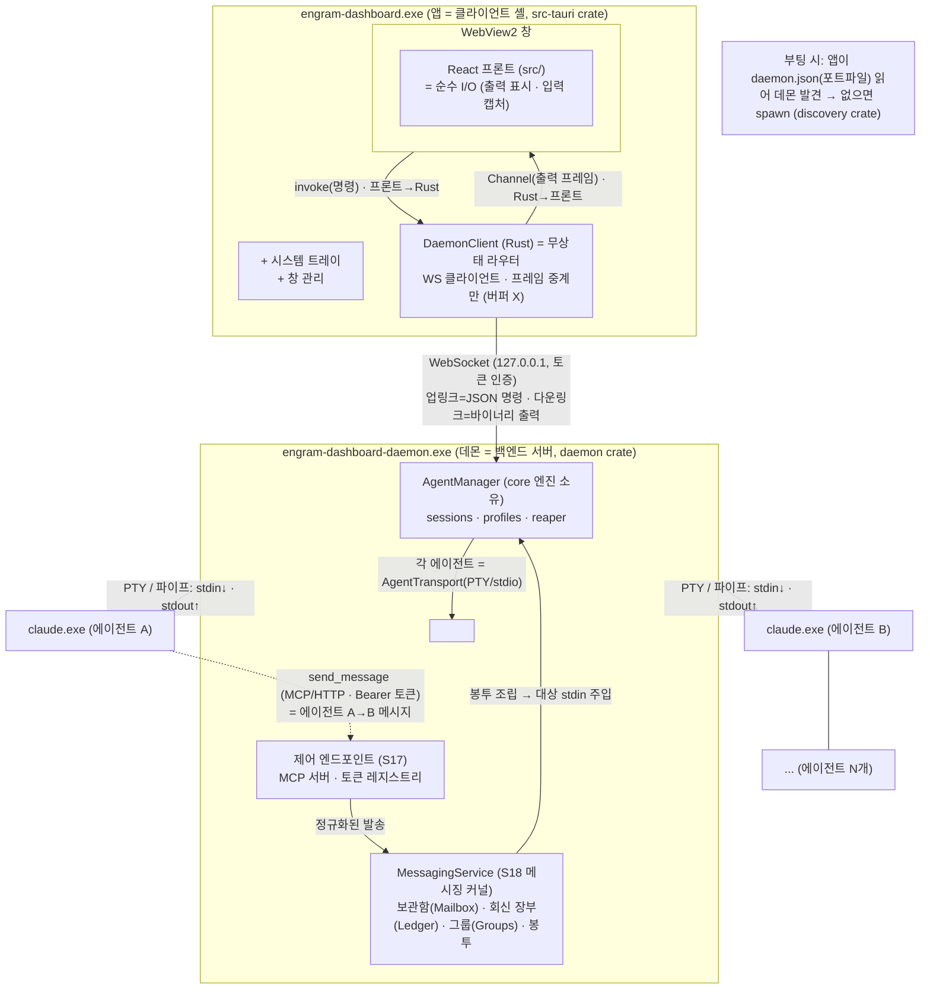
```mermaid
flowchart TD
  subgraph APP["engram-dashboard.exe (앱 = 클라이언트 셸, src-tauri crate)"]
    direction TB
    subgraph WV["WebView2 창"]
      WVc["React 프론트 (src/)<br/>= 순수 I/O (출력 표시 · 입력 캡처)"]
    end
    EXTRA["+ 시스템 트레이<br/>+ 창 관리"]
    DC["DaemonClient (Rust) = 무상태 라우터<br/>WS 클라이언트 · 프레임 중계만 (버퍼 X)"]
    WV -->|"invoke(명령) · 프론트→Rust"| DC
    DC -->|"Channel(출력 프레임) · Rust→프론트"| WV
  end

  subgraph DAEMON["engram-dashboard-daemon.exe (데몬 = 백엔드 서버, daemon crate)"]
    direction TB
    AM["AgentManager (core 엔진 소유)<br/>sessions · profiles · reaper"]
    CTL["제어 엔드포인트 (S17)<br/>MCP 서버 · 토큰 레지스트리"]
    MSGK["MessagingService (S18 메시징 커널)<br/>보관함(Mailbox) · 회신 장부(Ledger) · 그룹(Groups) · 봉투"]
    CTL -->|"정규화된 발송"| MSGK
    MSGK -->|"봉투 조립 → 대상 stdin 주입"| AM
    AM -->|"각 에이전트 = AgentTransport(PTY/stdio)"| TR[" "]
  end

  DC -->|"WebSocket (127.0.0.1, 토큰 인증)<br/>업링크=JSON 명령 · 다운링크=바이너리 출력"| AM
  DAEMON -->|"PTY / 파이프: stdin↓ · stdout↑"| A1["claude.exe (에이전트 A)"]
  DAEMON -->|"PTY / 파이프: stdin↓ · stdout↑"| A2["claude.exe (에이전트 B)"]
  A2 --- AN["... (에이전트 N개)"]
  A1 -.->|"send_message (MCP/HTTP · Bearer 토큰)<br/>= 에이전트 A→B 메시지"| CTL

  BOOT["부팅 시: 앱이 daemon.json(포트파일) 읽어 데몬 발견 → 없으면 spawn (discovery crate)"]
```

결정: DaemonClient 무상태·데몬 단일 주인 = ADR-0029 / ADR-0046 · 제어 엔드포인트 = ADR-0086 · 메시징 커널 = ADR-0103 / ADR-0110.

**점선 화살표(A→CTL)가 에이전트 간 메시징 흐름이다** — 에이전트가 데몬 안 제어 엔드포인트로 되전화를 걸면, 데몬이 그 메시지를 브로커에 넘겨 형제 에이전트에게 넣는다(못 넣으면 맡아 뒀다가 나중에). 실선(WS·PTY)은 기존 뼈대.

## 상태는 누가 갖나 — 소유권 지도

시스템을 이해하는 가장 빠른 길: **"이 상태는 누구 것인가"**. 헷갈리면 흐름을 못 따라간다.

| 상태 | 소유자 | 비고 |
|------|--------|------|
| 에이전트 생사·세션 | 데몬 `AgentManager` | 단일 출처 |
| 출력 버퍼(replay) | 데몬 `OutputCore` 링 | 클라이언트는 미러 안 함 |
| 프로필 영속(session-id·epoch) | 데몬 `ProfileRegistry` → agents.json | 세이브데이터 · **종료해도 보존(시체)**, ADR-0083 |
| 제어 토큰((AgentId,epoch)별) | 데몬 `ControlRegistry` | 스폰 시 발급 · epoch 교체/kill 시 폐기 (S17) |
| 에이전트 간 메시지(보관함·회신 장부·그룹 명단) | 데몬 메시징 커널 `MessagingService` (S18) | **인메모리** — 데몬 재시작 시 소실(영속화 없음, ADR-0103) |
| 데몬 발견 정보(포트·토큰) | daemon.json 포트파일 | 휘발(매 기동 재발행) |
| replay 진도·dedup·gen | **프론트 뷰(viewId)** | Rust는 무상태 |
| 레이아웃·테마 | 프론트 Zustand(+장차 localStorage) | 백엔드 불가지 |

결정: 미러 제거 = ADR-0046 · 레이아웃 권위 = ADR-0035 · data_dir 단일결정 = ADR-0024 · 시체 보존 = ADR-0083 · 제어 토큰 = ADR-0086 · 메시징 인메모리 = ADR-0103.

## 읽기 경로 — 뭘 고치러 왔나

세부는 PART 2에 있다. 목적별 진입점:

- **출력이 안 나온다/깨진다** → PART 2 [출력 흐름](#출력-흐름-메인-claude--앱) + [프론트 상태기계](#프론트-제어표면--protocolclient-상태기계) + E2E [출력 시나리오](#출력-에이전트--여러-슬롯)
- **리로드하면 이력이 안 돌아온다** → PART 2 [replay 상태기계](#프론트-제어표면--protocolclient-상태기계) + E2E [리로드 시나리오](#리로드--재구독--전체-replay)
- **스폰/kill 생사가 이상하다** → PART 2 [죽음 흐름](#죽음-흐름-종료--정리) + [핵심 불변식](#핵심-불변식-서버--클라이언트) + E2E [스폰 시나리오](#스폰-ui-클릭--에이전트-생성)
- **에이전트끼리 메시지가 안 간다** → PART 2 [제어 채널](#제어-채널-에이전트-간-메시지--s17)(입구·인증) + [에이전트 간 메시징](#에이전트-간-메시징-브로커--s18)(배달·장부·그룹) + E2E [메시지 시나리오](#메시지-에이전트-a--에이전트-b)
- **새 백엔드/전송을 붙인다** → PART 2 [5대 seam](#5대-seam-교체점) + [crate 계층](#crate-계층-의존-아래위)

**여기까지가 조감도다.** 아래 PART 2는 필요할 때 찾아보는 레퍼런스다.

---

# PART 2 — 심화 레퍼런스 (유지보수자용)

> **범례.** ★ = **seam(교체점)** — trait로 구현된 경계, 코어는 이 뒤를 절대 안 본다. Mermaid 화살표는 데이터 흐름 방향(산문·표에선 화살표 기호를 안 쓴다).

## 프로세스 경계와 통신 수단

**경계마다 통신 수단이 다르다.** 이걸 헷갈리면 흐름을 못 따라간다.

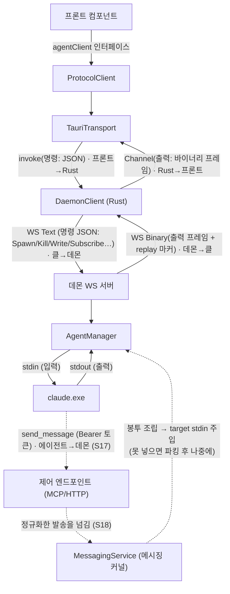
```mermaid
flowchart TD
  FC["프론트 컴포넌트"]
  PC["ProtocolClient"]
  TT["TauriTransport"]
  DC["DaemonClient (Rust)"]
  WSS["데몬 WS 서버"]
  AM["AgentManager"]
  CTL["제어 엔드포인트 (MCP/HTTP)"]
  MSGK["MessagingService (메시징 커널)"]
  CL["claude.exe"]

  FC -->|"agentClient 인터페이스"| PC
  PC --> TT
  TT -->|"invoke(명령: JSON) · 프론트→Rust"| DC
  DC -->|"Channel(출력: 바이너리 프레임) · Rust→프론트"| TT
  DC -->|"WS Text (명령 JSON: Spawn/Kill/Write/Subscribe…) · 클→데몬"| WSS
  WSS -->|"WS Binary(출력 프레임 + replay 마커) · 데몬→클"| DC
  WSS --> AM
  AM -->|"stdin (입력)"| CL
  CL -->|"stdout (출력)"| AM
  CL -.->|"send_message (Bearer 토큰) · 에이전트→데몬 (S17)"| CTL
  CTL -.->|"정규화한 발송을 넘김 (S18)"| MSGK
  MSGK -.->|"봉투 조립 → target stdin 주입<br/>(못 넣으면 파킹 후 나중에)"| AM
```

| 경계 | 수단 | 방향 | 싣는 것 |
|------|------|------|---------|
| 컴포넌트 ↔ agentClient | 함수 호출(TS 인터페이스) | 양방향 | 제어표면 |
| 프론트 ↔ 클라이언트(Rust) | `invoke` / Tauri `Channel` | 명령 프론트→Rust · 출력 Rust→프론트 | JSON 명령 / 바이너리 프레임 |
| 클라이언트 ↔ 데몬 | WebSocket | 명령 클→데몬 · 출력 데몬→클 | 명령 JSON / 출력·마커 |
| 데몬 ↔ 에이전트 (기존) | PTY(ConPTY) 또는 파이프 | stdin↓ · stdout↑ | raw 바이트 / (json)NDJSON |
| **에이전트 → 데몬 (S17)** | **MCP(Streamable HTTP) 또는 CLI HTTP** | 에이전트→데몬 (업링크) | **send_message·messages·group(Bearer 토큰 인증)** |

결정: 제어표면 단일화 = ADR-0011 · 제어 채널 = ADR-0086 · 메시징 브로커 = ADR-0103.

> **주의 — 통신선이 두 개다.** 기존 PTY(데몬이 에이전트를 *부리는* 선)와, S17 제어선(에이전트가 데몬으로 *되전화하는* 선)은 물리적으로 다르다. 전자는 데몬→에이전트 stdin, 후자는 에이전트→데몬 MCP/HTTP. 헷갈리면 흐름을 반대로 읽는다.

## 서버측 — 데몬 + core 엔진

### crate 계층 (의존 아래→위)

**실행 산출 = `daemon.exe` + `engram-send`(제어 채널 CLI 입구 bin — 발송·조회·그룹 서브커맨드)** — 나머지는 그것들이 쓰는 라이브러리다. (앱 exe는 src-tauri crate 산출 — 그래서 우리 실행파일은 앱·데몬·engram-send 3개.)

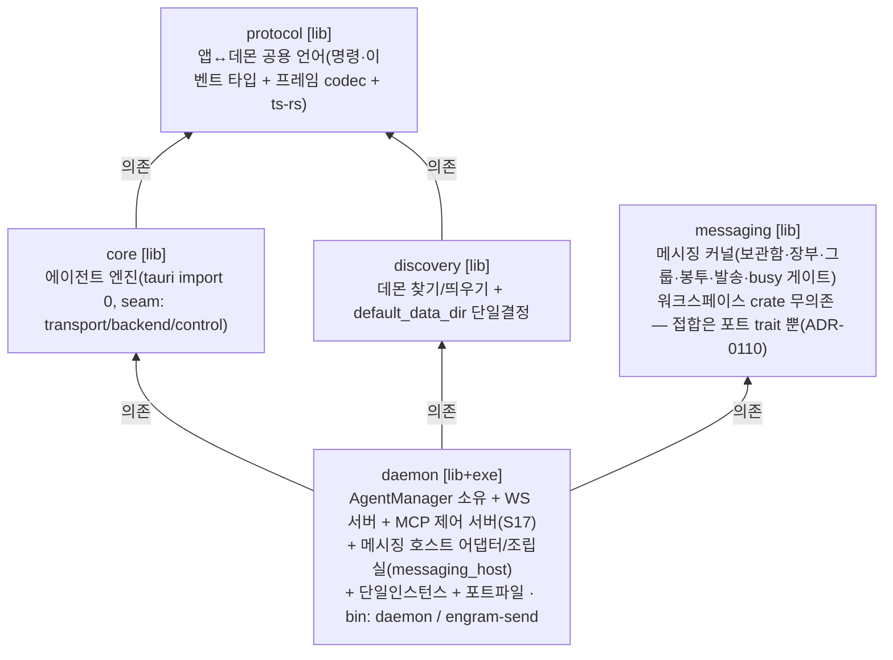
```mermaid
flowchart BT
  protocol["protocol [lib]<br/>앱↔데몬 공용 언어(명령·이벤트 타입 + 프레임 codec + ts-rs)"]
  core["core [lib]<br/>에이전트 엔진(tauri import 0, seam: transport/backend/control)"]
  discovery["discovery [lib]<br/>데몬 찾기/띄우기 + default_data_dir 단일결정"]
  messaging["messaging [lib]<br/>메시징 커널(보관함·장부·그룹·봉투·발송·busy 게이트)<br/>워크스페이스 crate 무의존 — 접합은 포트 trait 뿐(ADR-0110)"]
  daemon["daemon [lib+exe]<br/>AgentManager 소유 + WS 서버 + MCP 제어 서버(S17)<br/>+ 메시징 호스트 어댑터/조립실(messaging_host)<br/>+ 단일인스턴스 + 포트파일 · bin: daemon / engram-send"]

  core -->|"의존"| protocol
  daemon -->|"의존"| core
  discovery -->|"의존"| protocol
  daemon -->|"의존"| discovery
  daemon -->|"의존"| messaging
```

- **6 멤버**(protocol·core·discovery·messaging·daemon·src-tauri). S17 제어 채널은 새 crate가 아니라 **core에 seam(`ControlChannel`) 정의 + daemon에 구현(MCP 서버·토큰 레지스트리·`engram-send` bin)** 으로 들어갔다. 새 의존성 = `rmcp`(공식 Rust MCP SDK) + `axum`(daemon 한정).
- **messaging(6번째 멤버, 2026-07-28 · ADR-0110)** 은 위 그래프에서 **화살표가 나가지 않는 유일한 lib** 이다 — core 조차 의존하지 않는다(컴파일러 강제 벽). 데몬만 그쪽으로 의존하고, `AgentManager`·`OutputSink`·`ControlRegistry` 를 커널 포트에 꽂는 어댑터는 데몬 `messaging_host.rs` 가 소유한다. 안에서 무슨 정책이 도는지는 [에이전트 간 메시징](#에이전트-간-메시징-브로커--s18).

### core 클래스 구조 (소유 관계)

**데몬이 `AgentManager` 하나를 소유하고, 그 아래 에이전트마다 세션 조립체가 달린다.**

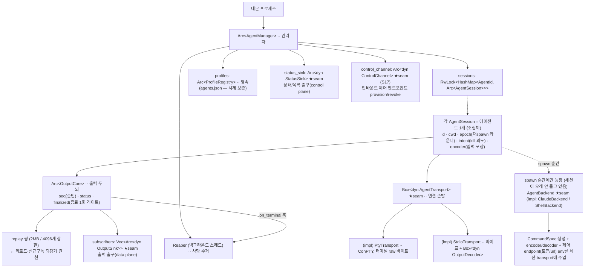
```mermaid
flowchart TD
  DP["데몬 프로세스"]
  AM["Arc&lt;AgentManager&gt; ·· 관리자"]
  DP --> AM
  AM --> SES["sessions: RwLock&lt;HashMap&lt;AgentId, Arc&lt;AgentSession&gt;&gt;&gt;"]
  AM --> PR["profiles: Arc&lt;ProfileRegistry&gt; ·· 영속(agents.json — 시체 보존)"]
  AM --> SS["status_sink: Arc&lt;dyn StatusSink&gt; ★seam<br/>상태/목록 출구(control plane)"]
  AM --> CC["control_channel: Arc&lt;dyn ControlChannel&gt; ★seam (S17)<br/>인바운드 제어 엔드포인트 provision/revoke"]
  AM --> RP["Reaper (백그라운드 스레드) ·· 사망 수거"]

  AS["각 AgentSession = 에이전트 1개 (조립체)<br/>id · cwd · epoch(재spawn 카운터) · intent(kill 의도) · encoder(입력 포장)"]
  SES -.-> AS

  AS --> OC["Arc&lt;OutputCore&gt; ·· 출력 두뇌<br/>seq(순번) · status · finalized(종료 1회 게이트)"]
  OC --> RING["replay 링 (2MB / 4096개 상한)<br/>← 리로드·신규구독 되감기 원천"]
  OC --> SUB["subscribers: Vec&lt;Arc&lt;dyn OutputSink&gt;&gt; ★seam<br/>출력 출구(data plane)"]
  OC -->|"on_terminal 훅"| RP

  AS --> TRANS["Box&lt;dyn AgentTransport&gt; ★seam ·· 연결 손발"]
  TRANS --> PTY["(impl) PtyTransport ·· ConPTY, 터미널 raw 바이트"]
  TRANS --> STDIO["(impl) StdioTransport ·· 파이프 + Box&lt;dyn OutputDecoder&gt;"]

  BK["spawn 순간에만 등장 (세션이 오래 안 들고 있음)<br/>AgentBackend ★seam (impl: ClaudeBackend / ShellBackend)"]
  BK --> BKspec["CommandSpec 생성 + encoder/decoder + 제어 endpoint(토큰/url) env를 세션·transport에 주입"]
  AS -.->|"spawn 순간"| BK
```

★ **코어 seam 5종**: `AgentTransport`(전송) · `AgentBackend`(모델) · `OutputSink`/`StatusSink`(출력·상태 출구) · `ControlChannel`(인바운드 제어, S17). 코어는 이 뒤를 절대 안 본다 → tauri-free · 교체 가능 · headless 테스트. 상세는 아래 [5대 seam](#5대-seam-교체점).

### 출력 흐름 (메인: claude → 앱)

**claude stdout → 펌프 → OutputCore → sink → 앱.** 코어는 raw만 알고 wire는 모른다.

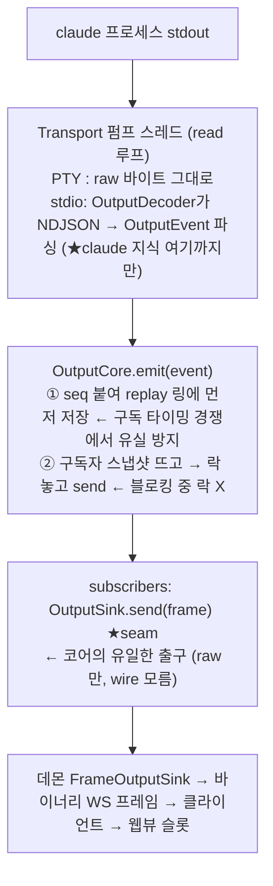
```mermaid
flowchart TD
  SO["claude 프로세스 stdout"]
  PUMP["Transport 펌프 스레드 (read 루프)<br/>PTY : raw 바이트 그대로<br/>stdio: OutputDecoder가 NDJSON → OutputEvent 파싱 (★claude 지식 여기까지만)"]
  EMIT["OutputCore.emit(event)<br/>① seq 붙여 replay 링에 먼저 저장 ← 구독 타이밍 경쟁에서 유실 방지<br/>② 구독자 스냅샷 뜨고 → 락 놓고 send ← 블로킹 중 락 X"]
  SUB["subscribers: OutputSink.send(frame) ★seam<br/>← 코어의 유일한 출구 (raw만, wire 모름)"]
  WSSINK["데몬 FrameOutputSink → 바이너리 WS 프레임 → 클라이언트 → 웹뷰 슬롯"]

  SO --> PUMP --> EMIT --> SUB --> WSSINK
```

결정: 락 순서 = ADR-0006 · OutputSink wire 무지 = ADR-0003.

### 입력 흐름 (사용자/LLM → claude)

**입력은 세션이 encoder로 포장해 transport로만 나간다.** 두 진입 경로가 같은 `write_input`으로 합류한다:

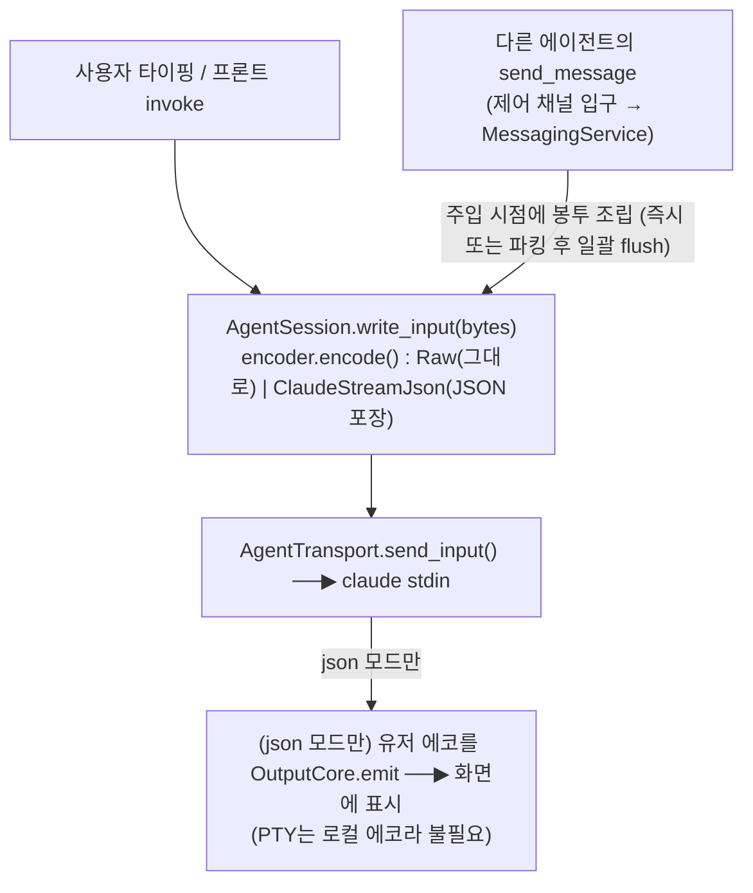
```mermaid
flowchart TD
  IN1["사용자 타이핑 / 프론트 invoke"]
  IN2["다른 에이전트의 send_message<br/>(제어 채널 입구 → MessagingService)"]
  WI["AgentSession.write_input(bytes)<br/>encoder.encode() : Raw(그대로) | ClaudeStreamJson(JSON 포장)"]
  SI["AgentTransport.send_input() ──▶ claude stdin"]
  ECHO["(json 모드만) 유저 에코를 OutputCore.emit ──▶ 화면에 표시<br/>(PTY는 로컬 에코라 불필요)"]

  IN1 --> WI
  IN2 -->|"주입 시점에 봉투 조립 (즉시 또는 파킹 후 일괄 flush)"| WI
  WI --> SI
  SI -->|"json 모드만"| ECHO
```

결정: json 모드 배선 = ADR-0044 · 메시지 시맨틱 = ADR-0087 · 주입 타이밍(idle 게이트·일괄 flush) = ADR-0104.

### 죽음 흐름 (종료 → 정리)

**종료는 딱 한 번만 확정되고(finalize 1회), 수거는 Reaper 단일 소비자가 한다. 그리고 이제 시체는 안 지운다(ADR-0083).**

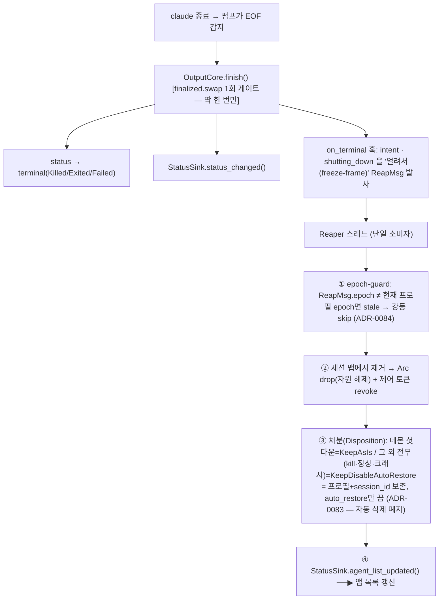
```mermaid
flowchart TD
  DIE["claude 종료 → 펌프가 EOF 감지"]
  FIN["OutputCore.finish() [finalized.swap 1회 게이트 — 딱 한 번만]"]
  ST["status → terminal(Killed/Exited/Failed)"]
  SC["StatusSink.status_changed()"]
  HOOK["on_terminal 훅: intent · shutting_down 을 '얼려서(freeze-frame)' ReapMsg 발사"]
  REAPER["Reaper 스레드 (단일 소비자)"]
  R1["① epoch-guard: ReapMsg.epoch ≠ 현재 프로필 epoch면 stale → 강등 skip (ADR-0084)"]
  R2["② 세션 맵에서 제거 → Arc drop(자원 해제) + 제어 토큰 revoke"]
  R3["③ 처분(Disposition): 데몬 셧다운=KeepAsIs / 그 외 전부(kill·정상·크래시)=KeepDisableAutoRestore<br/>= 프로필+session_id 보존, auto_restore만 끔 (ADR-0083 — 자동 삭제 폐지)"]
  R4["④ StatusSink.agent_list_updated() ──▶ 앱 목록 갱신"]

  DIE --> FIN
  FIN --> ST
  FIN --> SC
  FIN --> HOOK
  HOOK --> REAPER
  REAPER --> R1 --> R2 --> R3 --> R4
```

- **핵심 변경(ADR-0083):** 옛 reaper는 "유저 의도 kill이면 프로필 삭제"를 했으나, 이제 **어떤 종료도 프로필을 지우지 않는다.** 모든 종료가 "시체"(session_id 보존 · auto_restore off)로 남는다. 진짜 삭제는 사용자의 명시적 `DeleteProfile` 명령으로만. → 목록에 종료된 에이전트가 쌓이는 게 정상(의도).
- **epoch-guard(ADR-0084):** 재활성화(resume)로 epoch이 바뀐 뒤 늦게 도착한 옛 사망 메시지가 산 세션을 강등하지 못하게, 처분 적용 전 epoch 일치를 확인한다.

결정: finalize 1회·freeze-frame 수거 = ADR-0019 · 시체 보존 = ADR-0083 · epoch-guard = ADR-0084.

### 세션 복원 / 활성화 (resume 전용 — ADR-0082)

**spawn 시 `--session-id`로 sid를 우리가 통제 → `--resume` 무손실 복원.** 복원 정확성은 이 sid에만 의존한다(추적 파일은 best-effort).

- **활성화(activate) = 이어받기(resume) 전용이다 (ADR-0082).** 종료된 에이전트를 다시 켜면 그 session_id로 resume한다.
- **fresh fallback 폐지:** 옛 설계는 "resume 실패 시 새 대화(fresh)를 만든다"였으나 이제 **하지 않는다.** resume가 실패/조기종료하면 → 종점(Exited/Failed)으로 직행 + 시체 보존 + 실패 원인 로그. 복구는 사람/LLM 판단(자동으로 새 세션을 파지 않는다 — 무손실 원칙 우선).
- **재활성화도 맵 교체 = epoch++ (ADR-0084):** resume respawn은 같은 AgentId의 세션 객체를 갈아끼우므로 epoch을 올린다 → 프론트가 낡은 프레임을 거른다.

결정: resume 전용·fresh 폐지 = ADR-0082(Supersedes 0077, Amends 0008) · sid 통제 = ADR-0008.

## 제어 채널 (에이전트 간 메시지 — S17)

**S17에서 에이전트(그 안의 LLM)가 다른 에이전트에게 메시지를 보내는 길이 뚫렸다.** 이건 기존 출력/입력 흐름과 별개의 인바운드 경로다 — 에이전트가 데몬으로 *되전화*해서 형제의 stdin에 글을 넣는다. 이 절은 그 **입구와 신원**만 다룬다. 입구를 통과한 뒤의 배달·보관·장부는 다음 절 [에이전트 간 메시징](#에이전트-간-메시징-브로커--s18)이다.

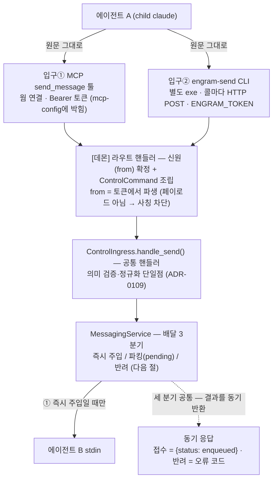
```mermaid
flowchart TD
  A["에이전트 A (child claude)"]
  MCP["입구① MCP send_message 툴<br/>웜 연결 · Bearer 토큰 (mcp-config에 박힘)"]
  CLI["입구② engram-send CLI<br/>별도 exe · 콜마다 HTTP POST · ENGRAM_TOKEN"]
  CI["[데몬] 라우트 핸들러 — 신원(from) 확정 + ControlCommand 조립<br/>from = 토큰에서 파생 (페이로드 아님 → 사칭 차단)"]
  VAL["ControlIngress.handle_send() — 공통 핸들러<br/>의미 검증·정규화 단일점 (ADR-0109)"]
  DELIV["MessagingService — 배달 3분기<br/>즉시 주입 / 파킹(pending) / 반려 (다음 절)"]
  B["에이전트 B stdin"]
  ACK["동기 응답<br/>접수 = {status: enqueued} · 반려 = 오류 코드"]

  A -->|"원문 그대로"| MCP --> CI
  A -->|"원문 그대로"| CLI --> CI
  CI --> VAL --> DELIV
  DELIV -->|"① 즉시 주입일 때만"| B
  DELIV -.->|"세 분기 공통 — 결과를 동기 반환"| ACK
```

- **입구는 원문을 나르고, 계약은 데몬이 만든다.** MCP 툴과 CLI(`engram-send` — 별도 exe라 HTTP로 붙는다)는 요청을 **그대로** 넘기고, `ControlCommand` 조립과 **의미 검증·정규화**(수신자 · 회신 계약 인자 · 멤버명 분해·트림)는 데몬 공유 핸들러 한 곳에서만 한다. 그래서 두 입구의 응답 JSON이 바이트 동일하고, 그 아래는 어느 입구로 들어왔는지 모른다(entrance-agnostic — ADR-0109). 입구별 인자 표면은 `crates/engram-dashboard-daemon/src/bin/engram-send.rs`.
- **노출 표면 = 메시징 3툴(`send_message` 발송 · `messages` 상태·미결 조회 · `group` 그룹 명단) + 진단 `engram_ping`.** 이름이 닮은 Claude Code 내장 `SendMessage` 툴은 메시징 스폰에서 deny로 막는다(오발 방지 — ADR-0106).
- **스폰 때 입구를 깔아 준다:** 에이전트별 `mcp-config`와 `--settings` 조각(전역 차단 설정을 세션 한정으로 우회 — 인라인 JSON이 아니라 **파일 경로**)을 만들어 주고, **프라이밍**이 "너는 팀의 한 명이고 이 툴로 동료에게 말을 건다"를 시스템 프롬프트에 얹는다(ADR-0092/0099/0109).

> ACK가 "enqueued"(접수됨)인 건 **읽음이 아니라 접수**라는 뜻이다(two-level ACK, ADR-0087) — 지금은 그 어휘가 실제와 맞는다. 접수된 메시지가 즉시 갈지 보관함에서 기다릴지는 다음 절의 3분기가 정한다.

### 인증 — 신원은 토큰에서만 나온다

- **토큰 단위 = (AgentId, epoch).** 같은 에이전트라도 epoch이 다르면 다른 토큰. **epoch 회전(재활성화/재시작)·kill = 구 토큰 즉시 폐기** → 죽은/낡은 신원으로는 메시지 못 보냄 (ADR-0007/0084 연동).
- **`from`은 항상 토큰에서 파생.** 페이로드의 발신자 필드는 무시한다 → 프롬프트 주입/오작동 에이전트의 사칭 차단(같은 OS 유저라 하드 격리는 불가 — 최종 방어는 데몬측 검증 단일점).
- MCP = mcp-config에 토큰을 박아 연결 시 1회 바인딩(`Mcp-Session-Id`↔신원 고정). CLI = 콜마다 env 토큰 제시.

결정: 채널 아키텍처 = ADR-0086 · send_message 시맨틱 = ADR-0087 · 배달 관측 seam = ADR-0088.

## 에이전트 간 메시징 (브로커 — S18)

**S17이 입구를 뚫었다면 S18은 그 뒤에 브로커를 놓았다.** 예전엔 "지금 살아 있고 지금 한가한" 상대에게만 글이 들어갔지만, 이제 데몬이 못 넣는 메시지를 **맡아 뒀다가** 받을 수 있게 될 때 넣는다. 목표는 *데몬이 살아 있는 동안 메시지는 확실히 간다*(ADR-0103)이되, 그 "확실히"에는 경계가 있다 — 자리가 없으면 **반려**하고, 오래 못 나간 파킹분은 TTL로 **만료**되며, 그룹 발송에서 못 받는 멤버는 **skip**된다. 접수돼 보관된 것이 데몬 생존 중 조용히 사라지지 않는다는 뜻이지, 모든 발송이 반드시 도달한다는 뜻이 아니다.

### 배달 3분기 — 즉시 / 파킹 / 반려

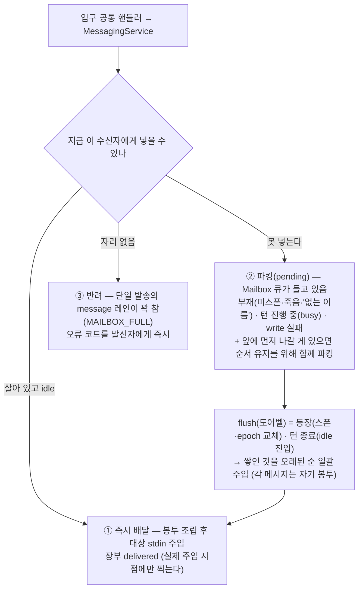
```mermaid
flowchart TD
  SEND["입구 공통 핸들러 → MessagingService"]
  Q1{"지금 이 수신자에게 넣을 수 있나"}
  D1["① 즉시 배달 — 봉투 조립 후 대상 stdin 주입<br/>장부 delivered (실제 주입 시점에만 찍는다)"]
  D2["② 파킹(pending) — Mailbox 큐가 들고 있음<br/>부재(미스폰·죽음·'없는 이름') · 턴 진행 중(busy) · write 실패<br/>+ 앞에 먼저 나갈 게 있으면 순서 유지를 위해 함께 파킹"]
  D3["③ 반려 — 단일 발송의 message 레인이 꽉 참(MAILBOX_FULL)<br/>오류 코드를 발신자에게 즉시"]
  FL["flush(도어벨) = 등장(스폰·epoch 교체) · 턴 종료(idle 진입)<br/>→ 쌓인 것을 오래된 순 일괄 주입 (각 메시지는 자기 봉투)"]

  SEND --> Q1
  Q1 -->|"살아 있고 idle"| D1
  Q1 -->|"못 넣는다"| D2
  Q1 -->|"자리 없음"| D3
  D2 --> FL --> D1
```

- **파킹(parking)** = "지금 못 넣는 메시지를 데몬이 들고 있는 것". 부재·busy·write 실패가 **같은 `pending` 어휘**를 쓴다(상태 발명 금지). 존재하지 않는 이름도 파킹한다 — 스폰 전 선지시를 지원하고, 오타는 **TTL 24h**가 걷어낸다(ADR-0105).
- **주입 타이밍 = idle 게이트 + 일괄 flush**(ADR-0104). 턴 진행 중에 stdin으로 밀면 CLI 내부 큐로 넘어가 데몬이 순서·시점을 잃는다. 대신 턴이 끝나는 순간 쌓인 것을 **한꺼번에** 넣어, 수신 LLM이 메일함 열듯 전체를 보고 우선순위·모순을 스스로 정리한다(한 건씩 드리블 = 메시지당 턴 하나 = N배 비용).
- **busy는 관측된 사실일 때만 참이다**(positive-knowledge-only) — 모르면 idle = 즉시 주입. 반대로 하면 관측 불가 백엔드·관측이 아직 시작되지 않은 창에서 배달이 영구 대기한다("늦게 가는 것"보다 "안 가는 것"이 나쁘다).
- **잠든 수신자를 깨우지 않는다**(v1) — 부재와 똑같이 파킹한다(wake 연기, ADR-0104).
- **주기 sweep은 배달 재시도가 아니다.** sweep이 하는 일은 TTL 지난 파킹분을 `expired`로 걷어내고 기한 넘긴 request의 notice를 발행하는 것뿐이다 — 부재 수신자 앞 메일은 **그가 등장할 때** 나가거나 TTL로 만료되지, 주기적으로 재시도되지 않는다. 타이머가 도어벨을 울리는 경로는 busy 관측이 비정상적으로 오래 남았을 때 그 주인을 깨우는 fail-open 안전 밸브 하나뿐이다 — 그때도 **공용 관측 표는 건드리지 않는다**(`TurnFacts`는 읽기 전용). 커널이 자기 상한 판정 장부에 "잔해"로 적고 도어벨만 울린다(ADR-0127 결정 4 — 상한이 공용 표를 지우면 그 결정 위반).
- **반려는 한 레인의 이야기다.** 위 ③은 **단일 발송의 message 레인**에만 해당한다. 통지(notice) 레인은 꽉 차면 가장 오래된 통지를 은퇴시키고 새 것을 받아 **반려하지 않고**(ADR-0107), 그룹 발송에서 자리가 없는 멤버는 반려가 아니라 그 멤버만 `skipped`로 기록된다.

### 회신 계약(request) + 장부

- **request** — 발송을 `request`로 표시하면 데몬 `Ledger`에 **회신 빚**이 열린다. 봉투에 `id`와 `reply-by`(기한)가 실려 수신 LLM이 무엇에 답해야 하는지 본다. 계약은 배달이든 파킹이든 **접수되는 순간** 열린다.
- **회신 판정 = `in_reply_to` 필드의 엄격 매칭** — 타입이 아니다. 그 id를 정확히 가리킬 때만 닫힌다(관대 매칭 = 우연 닫힘 오발이라 거부).
- **기한 초과 ≠ 종결**(ADR-0108) — 기한이 지나면 데몬이 **발신자에게** `<notice>`를 보내지만(수신자 재촉이 아니다) 계약은 회신이 올 때까지 열려 있고 미결 조회에 계속 보인다. 전역 상한이 차면 "발신자에게 알릴 약속이 안 남은" 계약 중 최고령부터 은퇴시킨다.
- **장부는 이력도 갖는다** — 전 메시지의 상태 전이(`pending → delivered → replied` / `expired` / `skipped`)와 시각. 그룹 발송은 메시지 1건 : 배달기록 N건.

### 그룹(@) 발송

- 주소가 `@`로 시작하면 그룹이다 — `Groups`가 이름을 멤버 목록으로 펼치고 **발송 순간 스냅샷**으로 fan-out한다(그 뒤 명단이 바뀌어도 이미 나간 것엔 무영향 — 회수 기능 없음).
- **멤버별 결과가 갈린다(3갈래).** 살아 있고 한가하면 주입, 턴 중이면 그 멤버 앞에 파킹, 그리고 **받을 수 없는 멤버는 `skipped`** 다 — 부재·죽음·자리 부족·write 실패는 그룹 발송에선 파킹도 반려도 아니고 장부에 skip으로 남는다. 그래서 장부가 메시지 1건 : 배달기록 N건인 것이다.
- 명단은 런타임 등록(인메모리) + 내장 `@all`. **암묵 생성** — create 동사가 없고, 없는 그룹에 멤버를 add하면 생긴다. v1은 **누구나 아무 그룹을 고칠 수 있다**(ACL·조작자 기록 없음 — ADR-0109).
- 그룹 해석은 **seam**이다(`GroupSource`) — 폴더 같은 새 소스가 생겨도 발송 파이프라인은 안 건드린다(ADR-0104). 살아있음 판정·죽은 멤버 skip은 해석기가 아니라 발송 쪽 몫이다.

### 봉투는 "주입 시점"에 딱 한 곳에서 조립한다

수신 LLM이 실제로 보는 텍스트(`<message …>` / 데몬 전용 `<notice>`)는 `envelope`의 `wrap_message`/`wrap_notice` **두 함수에서만** 만들어진다(단일 wrap point — ADR-0086 §7이 원류, ADR-0096/0103이 이어받음). 조립 시점은 park이 아니라 **주입**이다: 파킹은 감싸지 않은 본문 + 재료만 들고 있다가 넣는 순간 *현재* 포맷으로 감싼다 → 즉시 배달과 늦은 배달의 봉투가 같다. `<notice>`는 데몬만 만들 수 있고 발신 인자에 타입 문자열 자체가 없어서, 에이전트는 어느 입구로도 통지를 사칭할 수 없다(구조적 차단).

### 구조 — 커널 lib + 데몬 어댑터 (ADR-0110)

**정책은 커널에, 실물은 데몬에.** 메시징 커널은 워크스페이스의 어떤 crate에도 의존하지 않는 독립 lib이라 `AgentManager`·`TurnObservations`·`ControlRegistry`를 **타입으로도 모른다**. 접합은 커널이 소유한 포트 trait으로만 뚫리고, 그 구멍에 실물을 꽂는 어댑터는 데몬 `messaging_host.rs`가 소유한다.

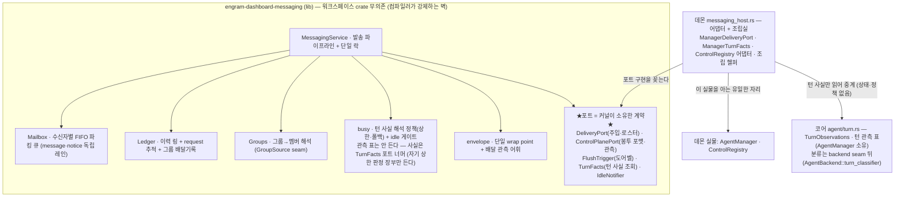
```mermaid
flowchart TD
  subgraph K["engram-dashboard-messaging (lib) — 워크스페이스 crate 무의존 (컴파일러가 강제하는 벽)"]
    SVC["MessagingService · 발송 파이프라인 + 단일 락"]
    MB["Mailbox · 수신자별 FIFO 파킹 큐 (message·notice 독립 레인)"]
    LG["Ledger · 이력 링 + request 추적 + 그룹 배달기록"]
    GR["Groups · 그룹→멤버 해석 (GroupSource seam)"]
    BZ["busy · 턴 사실 해석 정책(상한·폴백) + idle 게이트<br/>관측 표는 안 든다 — 사실은 TurnFacts 포트 너머 (자기 상한 판정 장부만 든다)"]
    EN["envelope · 단일 wrap point + 배달 관측 어휘"]
    PORT["★포트 = 커널이 소유한 계약★<br/>DeliveryPort(주입·로스터) · ControlPlanePort(봉투 포맷·관측)<br/>FlushTrigger(도어벨) · TurnFacts(턴 사실 조회) · IdleNotifier"]
    SVC --> MB
    SVC --> LG
    SVC --> GR
    SVC --> BZ
    SVC --> EN
    SVC --> PORT
  end

  HOST["데몬 messaging_host.rs — 어댑터 + 조립실<br/>ManagerDeliveryPort · ManagerTurnFacts · ControlRegistry 어댑터 · 조립 헬퍼"]
  REAL["데몬 실물: AgentManager · ControlRegistry"]
  CORE["코어 agent/turn.rs — TurnObservations · 턴 관측 표(AgentManager 소유)<br/>분류는 backend seam 뒤(AgentBackend::turn_classifier)"]

  HOST -->|"포트 구현을 꽂는다"| PORT
  HOST -->|"이 실물을 아는 유일한 자리"| REAL
  HOST -->|"턴 사실만 읽어 중계 (상태·정책 없음)"| CORE
```

- **규약이 아니라 벽인 이유:** 이 코드베이스는 작업마다 다른 코더 세션이 짜므로, 경계를 문서·리뷰로만 지키면 세션이 갈릴 때마다 부식될 수 있다. crate 경계는 컴파일러가 강제하므로 커널에서 `AgentManager`를 부르려는 시도는 컴파일 에러가 된다 — 그 멈춤이 "포트를 새로 정의하거나 설계 판단을 받아야 한다"는 신호로 설계됐다(ADR-0110).
- **백엔드 지식의 자리:** "어떤 출력 이벤트가 턴 진행이고 어떤 게 턴 종료인가"는 claude stream-json 지식이라 커널이 아니라 **코어의 `backend/` seam 뒤**가 안다(`AgentBackend::turn_classifier` — ADR-0004와 같은 결, ADR-0127 결정 2). 데몬 어댑터는 얇게, 정책은 커널에 — busy 불변식을 어댑터에서 재구현하지 않는다.
- **격리 게이트:** `rg "engram_dashboard_(core|daemon|protocol|discovery)" crates/engram-dashboard-messaging/src/` → 0줄.
- **부수 이득:** `cargo test -p engram-dashboard-messaging` 하나로 claude 바이너리·실 PTY 없이 3분기·flush·sweep·계약을 결정적으로 단언한다 — 가짜 포트를 끼우고, `mailbox`·`ledger`·`groups`는 로직 안에서 현재 시각을 직접 읽지 않고 시계를 **인자로 주입**받는다(그 세 모듈의 순수성 불변식). `busy`도 **시계를 읽지 않는다** — 상한 비교는 `now`를 인자로 받는 sweep 안에서만 하고 조회(`is_busy`)는 그 판정 장부를 볼 뿐이다. 그래서 판정 시점이 sweep 주기에 고정돼 **관측 가능한 동작이 결정적이다**.

### v1 경계 — 정직하게

- **영속화 없음.** 보관함·장부·그룹 명단이 전부 인메모리다 — **데몬을 재시작하면 파킹된 메시지·미결 계약·그룹이 통째로 사라진다.** 영속화는 에이전트 시스템 메모리 설계 때로 유예됐다(ADR-0103).
- **UI 표면 없음.** 대시보드에 메시지함·미결 목록 화면이 없다. 관측 수단은 에이전트가 부르는 조회 툴(`messages`)과 데몬 로그뿐이다.
- **개발 중(S18).** 실사용 실측이 아직 얇다 — 남은 측정·비채택 항목은 spec과 step-log 백로그가 추적한다.

구현 계약 정본(필드·에러 어휘·수용 기준)은 `docs/process/S18-messaging-v1/spec/messaging-v1-spec.md`. 관련 ADR 목록은 [ADR 근거 맵](#adr-근거-맵-더-파려면-여기).

## 클라이언트측 — src-tauri 셸 + 프론트

### 프론트 레이어 스택 + 컴포넌트 트리 (상→하)

> 프론트(웹뷰 안 React)를 위에서 아래로 3겹으로 본다: **UI → 상태 → 제어 표면**, 그 아래가 무상태 라우터(다음 절).

**레이어 스택** — 아래로 갈수록 좁아져 `ProtocolClient` 하나로 모이고, 그 밑 `TauriTransport`만 갈면 전송 경로가 바뀐다. 프론트는 렌더링만(두뇌 아님), 제어는 백엔드측이 쥔다(§5).

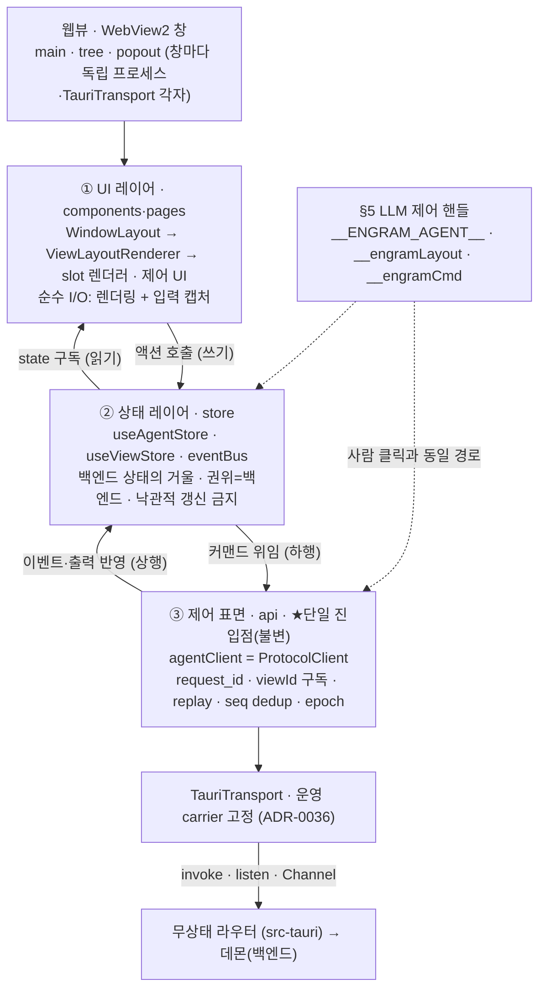
```mermaid
flowchart TD
  WV["웹뷰 · WebView2 창<br/>main · tree · popout (창마다 독립 프로세스·TauriTransport 각자)"]
  UI["① UI 레이어 · components·pages<br/>WindowLayout → ViewLayoutRenderer → slot 렌더러 · 제어 UI<br/>순수 I/O: 렌더링 + 입력 캡처"]
  ST["② 상태 레이어 · store<br/>useAgentStore · useViewStore · eventBus<br/>백엔드 상태의 거울 · 권위=백엔드 · 낙관적 갱신 금지"]
  CS["③ 제어 표면 · api · ★단일 진입점(불변)<br/>agentClient = ProtocolClient<br/>request_id · viewId 구독 · replay · seq dedup · epoch"]
  TT["TauriTransport · 운영 carrier 고정 (ADR-0036)"]
  BE["무상태 라우터 (src-tauri) → 데몬(백엔드)"]
  LLM["§5 LLM 제어 핸들<br/>__ENGRAM_AGENT__ · __engramLayout · __engramCmd"]

  WV --> UI
  UI -->|"액션 호출 (쓰기)"| ST
  ST -->|"state 구독 (읽기)"| UI
  ST -->|"커맨드 위임 (하행)"| CS
  CS -->|"이벤트·출력 반영 (상행)"| ST
  CS --> TT
  TT -->|"invoke · listen · Channel"| BE
  LLM -.->|"사람 클릭과 동일 경로"| CS
  LLM -.-> ST
```

**UI 컴포넌트 트리** — 라우트별 페이지에서 창 레이아웃(`WindowLayout`)을 거쳐 슬롯 렌더러까지. 슬롯은 에이전트 capability로 렌더러를 고른다(출력 종류 가정 안 함).

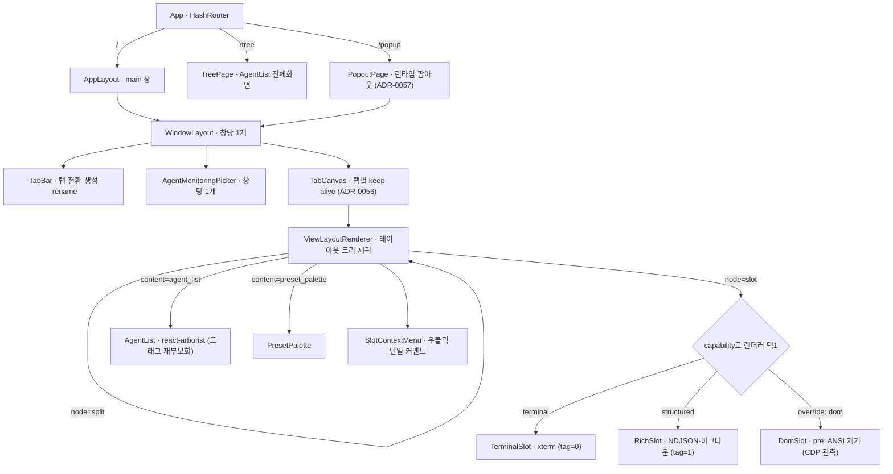
```mermaid
flowchart TD
  App["App · HashRouter"]
  App -->|"/"| AL0["AppLayout · main 창"]
  App -->|"/tree"| TP["TreePage · AgentList 전체화면"]
  App -->|"/popup"| PO["PopoutPage · 런타임 팝아웃 (ADR-0057)"]

  AL0 --> WLnode["WindowLayout · 창당 1개"]
  PO --> WLnode
  WLnode --> TB["TabBar · 탭 전환·생성·rename"]
  WLnode --> AMP["AgentMonitoringPicker · 창당 1개"]
  WLnode --> TC["TabCanvas · 탭별 keep-alive (ADR-0056)"]
  TC --> VLR["ViewLayoutRenderer · 레이아웃 트리 재귀"]
  VLR -->|"node=split"| VLR
  VLR -->|"node=slot"| CAP{"capability로 렌더러 택1"}
  CAP -->|"terminal"| TS["TerminalSlot · xterm (tag=0)"]
  CAP -->|"structured"| RS["RichSlot · NDJSON·마크다운 (tag=1)"]
  CAP -->|"override: dom"| DS["DomSlot · pre, ANSI 제거 (CDP 관측)"]
  VLR -->|"content=agent_list"| ALa["AgentList · react-arborist (드래그 재부모화)"]
  VLR -->|"content=preset_palette"| PP["PresetPalette"]
  VLR --> SCM["SlotContextMenu · 우클릭 단일 커맨드"]
```

- **렌더러 선택:** `agent.capabilities.output.structured`면 `RichSlot`, 아니면 `TerminalSlot`. `renderModeOverride`로 `dom` 강제 가능. (ADR-0044)
- **구독 키 = viewId(슬롯 id)**, agentId 아님 — 같은 에이전트를 두 슬롯에 띄우면 독립 진도 2개. (ADR-0046)
- **권위는 백엔드** — 스토어는 거울, 낙관적 갱신 금지(예외: `renderModeOverride`·`chatStyleStore`는 프론트 전용). (ADR-0035)

결정: 제어표면 단일(agentClient) = ADR-0011 · carrier 고정 = ADR-0036 · 렌더 분기 = ADR-0044 · 뷰 직결 replay = ADR-0046.

### src-tauri = 무상태 라우터

**미러 버퍼·per-view 커서는 전부 제거됐다.** Rust는 프레임 헤더만 보고 창별 Channel로 중계한다.

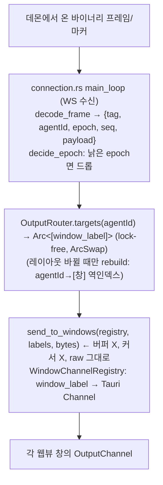
```mermaid
flowchart TD
  IN["데몬에서 온 바이너리 프레임/마커"]
  ML["connection.rs main_loop (WS 수신)<br/>decode_frame → {tag, agentId, epoch, seq, payload}<br/>decide_epoch: 낡은 epoch면 드롭"]
  RT["OutputRouter.targets(agentId) → Arc&lt;[window_label]&gt; (lock-free, ArcSwap)<br/>(레이아웃 바뀔 때만 rebuild: agentId→[창] 역인덱스)"]
  STW["send_to_windows(registry, labels, bytes) ← 버퍼 X, 커서 X, raw 그대로<br/>WindowChannelRegistry: window_label → Tauri Channel"]
  OUT["각 웹뷰 창의 OutputChannel"]

  IN --> ML --> RT --> STW --> OUT
```

- **상태 없음:** 진도·dedup·replay는 전부 웹뷰(프론트)가 소유. Rust는 "누구 프레임을 어느 창으로" 라우팅 + single-flight replay 세대만 관리.
- **replay 세대(single-flight):** 프론트가 `request_replay(agentId)` invoke → Rust가 데몬에 Subscribe 발사(진행 중이면 병합) → 완료 시 **tag=255 마커**를 프레임과 **같은 Channel 경로로** 보냄(순서 보존).
- **프론트 직접 Subscribe 금지:** `forward_daemon_command`가 Subscribe/Unsubscribe를 차단(BLOCK-1). 구독은 layout/replay 경로로만.

결정: 무상태 라우터 = ADR-0046 · 프론트 직접 Subscribe 금지 = ADR-0041.

### 프론트 제어표면 + protocolClient 상태기계

**컴포넌트는 `agentClient` 인터페이스에만 의존하고, 구독 키는 agentId가 아니라 viewId(슬롯 id)다.**

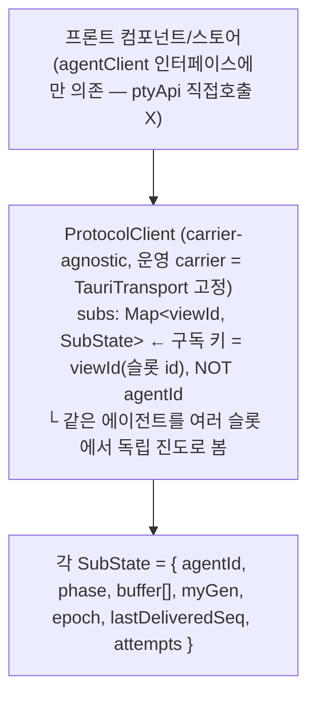
```mermaid
flowchart TD
  FC["프론트 컴포넌트/스토어<br/>(agentClient 인터페이스에만 의존 — ptyApi 직접호출 X)"]
  PC["ProtocolClient (carrier-agnostic, 운영 carrier = TauriTransport 고정)<br/>subs: Map&lt;viewId, SubState&gt; ← 구독 키 = viewId(슬롯 id), NOT agentId<br/>└ 같은 에이전트를 여러 슬롯에서 독립 진도로 봄"]
  SS["각 SubState = { agentId, phase, buffer[], myGen, epoch, lastDeliveredSeq, attempts }"]

  FC --> PC --> SS
```

**뷰별 replay 상태기계 (phase):**

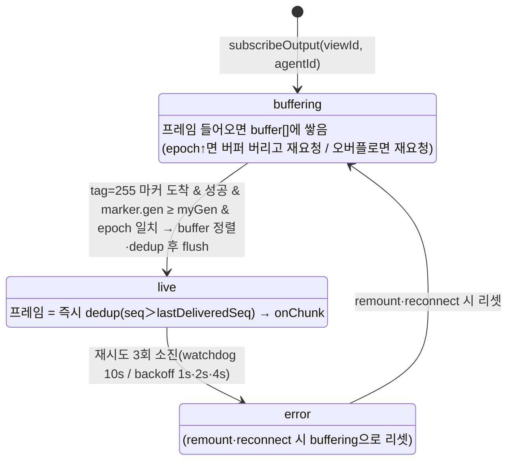
```mermaid
stateDiagram-v2
  [*] --> buffering : subscribeOutput(viewId, agentId)
  buffering : buffering
  buffering : 프레임 들어오면 buffer[]에 쌓음
  buffering : (epoch↑면 버퍼 버리고 재요청 / 오버플로면 재요청)
  live : live
  live : 프레임 = 즉시 dedup(seq＞lastDeliveredSeq) → onChunk
  error : error
  error : (remount·reconnect 시 buffering으로 리셋)

  buffering --> live : tag=255 마커 도착 & 성공 & marker.gen ≥ myGen & epoch 일치 → buffer 정렬·dedup 후 flush
  live --> error : 재시도 3회 소진(watchdog 10s / backoff 1s·2s·4s)
  error --> buffering : remount·reconnect 시 리셋
```

- **gen 펜스(핵심):** replay 요청마다 고유 `myGen`(BigInt) 발급. 도착한 마커의 `gen`이 내 `myGen`보다 작으면 **무시**(옛/남의 replay가 dedup 하한선을 오염시키는 것 차단). `gen ≥ myGen`이고 epoch 맞을 때만 buffering→live 전환.
- **팬아웃:** 한 agentId 프레임 → 그 agentId를 보는 **모든 viewId**에 각자 dedup 후 전달.

결정: 구독 키=viewId·gen 펜스 = ADR-0046 · carrier 고정 = ADR-0036 · 제어표면 단일 = ADR-0011.

### 슬롯 렌더 분기

**슬롯은 에이전트 capability를 보고 렌더러를 고른다** — 출력 종류를 가정하지 않는다.

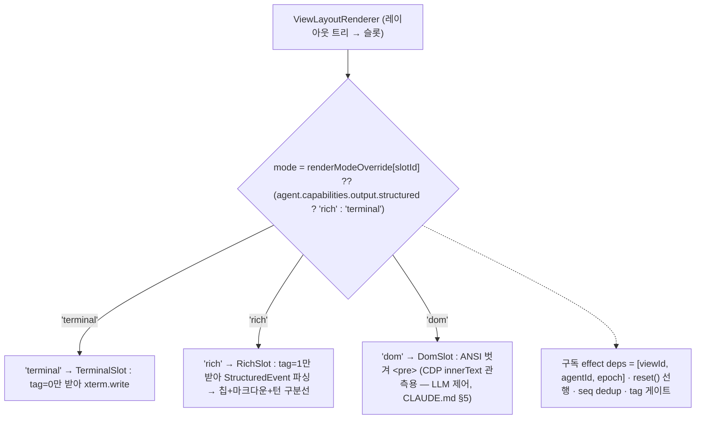
```mermaid
flowchart TD
  VLR["ViewLayoutRenderer (레이아웃 트리 → 슬롯)"]
  MODE{"mode = renderModeOverride[slotId] ?? (agent.capabilities.output.structured ? 'rich' : 'terminal')"}
  TS["'terminal' → TerminalSlot : tag=0만 받아 xterm.write"]
  RS["'rich' → RichSlot : tag=1만 받아 StructuredEvent 파싱 → 칩+마크다운+턴 구분선"]
  DS["'dom' → DomSlot : ANSI 벗겨 &lt;pre&gt; (CDP innerText 관측용 — LLM 제어, CLAUDE.md §5)"]
  NOTE["구독 effect deps = [viewId, agentId, epoch] · reset() 선행 · seq dedup · tag 게이트"]

  VLR --> MODE
  MODE -->|"'terminal'"| TS
  MODE -->|"'rich'"| RS
  MODE -->|"'dom'"| DS
  MODE -.-> NOTE
```

## 엔드투엔드 흐름 (4 시나리오)

### 스폰 (UI 클릭 → 에이전트 생성)

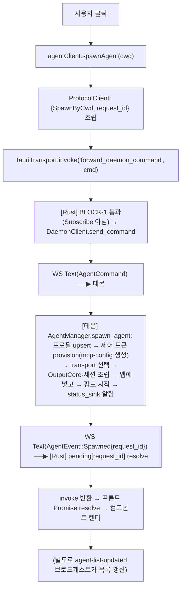
```mermaid
flowchart TD
  S1["사용자 클릭"]
  S2["agentClient.spawnAgent(cwd)"]
  S3["ProtocolClient: {SpawnByCwd, request_id} 조립"]
  S4["TauriTransport.invoke('forward_daemon_command', cmd)"]
  S5["[Rust] BLOCK-1 통과(Subscribe 아님) → DaemonClient.send_command"]
  S6["WS Text(AgentCommand) ──▶ 데몬"]
  S7["[데몬] AgentManager.spawn_agent: 프로필 upsert → 제어 토큰 provision(mcp-config 생성)<br/>→ transport 선택 → OutputCore·세션 조립 → 맵에 넣고 → 펌프 시작 → status_sink 알림"]
  S8["WS Text(AgentEvent::Spawned{request_id}) ──▶ [Rust] pending[request_id] resolve"]
  S9["invoke 반환 → 프론트 Promise resolve → 컴포넌트 렌더"]
  S10["(별도로 agent-list-updated 브로드캐스트가 목록 갱신)"]

  S1 --> S2 --> S3 --> S4 --> S5 --> S6 --> S7 --> S8 --> S9
  S9 -.-> S10
```

### 출력 (에이전트 → 여러 슬롯)

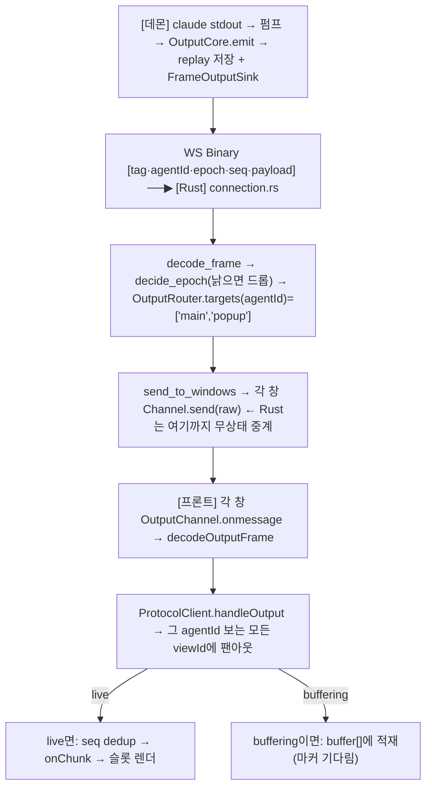
```mermaid
flowchart TD
  O1["[데몬] claude stdout → 펌프 → OutputCore.emit → replay 저장 + FrameOutputSink"]
  O2["WS Binary [tag·agentId·epoch·seq·payload] ──▶ [Rust] connection.rs"]
  O3["decode_frame → decide_epoch(낡으면 드롭) → OutputRouter.targets(agentId)=['main','popup']"]
  O4["send_to_windows → 각 창 Channel.send(raw) ← Rust는 여기까지 무상태 중계"]
  O5["[프론트] 각 창 OutputChannel.onmessage → decodeOutputFrame"]
  O6["ProtocolClient.handleOutput → 그 agentId 보는 모든 viewId에 팬아웃"]
  OL["live면: seq dedup → onChunk → 슬롯 렌더"]
  OB["buffering이면: buffer[]에 적재(마커 기다림)"]

  O1 --> O2 --> O3 --> O4 --> O5 --> O6
  O6 -->|"live"| OL
  O6 -->|"buffering"| OB
```

### 리로드 → 재구독 + 전체 replay

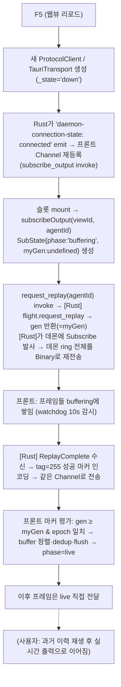
```mermaid
flowchart TD
  R1["F5 (웹뷰 리로드)"]
  R2["새 ProtocolClient / TauriTransport 생성 (_state='down')"]
  R3["Rust가 'daemon-connection-state: connected' emit → 프론트 Channel 재등록(subscribe_output invoke)"]
  R4["슬롯 mount → subscribeOutput(viewId, agentId)<br/>SubState{phase:'buffering', myGen:undefined} 생성"]
  R5["request_replay(agentId) invoke → [Rust] flight.request_replay → gen 반환(=myGen)<br/>[Rust]가 데몬에 Subscribe 발사 → 데몬 ring 전체를 Binary로 재전송"]
  R6["프론트: 프레임들 buffering에 쌓임 (watchdog 10s 감시)"]
  R7["[Rust] ReplayComplete 수신 → tag=255 성공 마커 인코딩 → 같은 Channel로 전송"]
  R8["프론트 마커 평가: gen ≥ myGen & epoch 일치 → buffer 정렬·dedup·flush → phase=live"]
  R9["이후 프레임은 live 직접 전달"]
  R10["(사용자: 과거 이력 재생 후 실시간 출력으로 이어짐)"]

  R1 --> R2 --> R3 --> R4 --> R5 --> R6 --> R7 --> R8 --> R9
  R9 -.-> R10
```

> S16의 "리로드 시 새 창 replay 미검증" 열린 이슈는 **해소됐다** — StrictMode 이중구독 버퍼 유실 수정(`ca3f325`) + 뷰 직결 replay(ADR-0046) 구현·QA 통과로 원인이 제거됐다.

### 메시지 (에이전트 A → 에이전트 B)

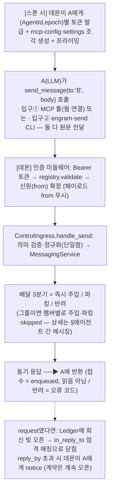
```mermaid
flowchart TD
  M1["[스폰 시] 데몬이 A에게 (AgentId,epoch)별 토큰 발급 + mcp-config·settings 조각 생성 + 프라이밍"]
  M2["A(LLM)가 send_message(to:'B', body) 호출<br/>· 입구① MCP 툴(웜 연결) 또는 · 입구② engram-send CLI — 둘 다 원문 전달"]
  M3["[데몬] 인증 미들웨어: Bearer 토큰 → registry.validate → 신원(from) 확정 (페이로드 from 무시)"]
  M4["ControlIngress.handle_send: 의미 검증·정규화(단일점) → MessagingService"]
  M5["배달 3분기 = 즉시 주입 / 파킹 / 반려<br/>(그룹이면 멤버별로 주입·파킹·skipped — 상세는 §에이전트 간 메시징)"]
  M6["동기 응답 ──▶ A에 반환 (접수 = enqueued, 읽음 아님 / 반려 = 오류 코드)"]
  M7["request였다면: Ledger에 회신 빚 오픈 → in_reply_to 엄격 매칭으로 닫힘<br/>reply_by 초과 시 데몬이 A에게 notice (계약은 계속 오픈)"]

  M1 --> M2 --> M3 --> M4 --> M5 --> M6
  M6 -.-> M7
```

> **읽는 법:** M1~M7 **전부 구현돼 있다**. B가 죽어 있거나 턴 중이면 메시지는 보관함에서 기다렸다가 B가 받을 수 있게 될 때 들어간다 — 단 자리가 없으면 반려되고, 오래 못 나가면 TTL로 만료되며, **데몬이 재시작하면 보관분은 사라진다**(인메모리). M5의 분기 규칙·그룹 fan-out은 [에이전트 간 메시징](#에이전트-간-메시징-브로커--s18)에 한 번만 적혀 있다.

## 5대 seam (교체점)

**seam = trait로 끊은 교체 경계.** 코어는 이 뒤를 안 보므로 구현만 갈아끼우면 새 전송·백엔드·제어 경로가 흡수된다. 위 5개가 **코어 seam(★)**, 맨 아래 `(프론트) transport`는 프론트측 carrier 교체점(코어 밖·별개)이다.

| seam(trait) | 무엇을 끊나 | 성격 | 현재 구현 | 미래 확장 |
|-------------|-------------|------|-----------|-----------|
| `AgentTransport` | 전송 방식(물리) | 출력·입력 손발 | PtyTransport / StdioTransport | API transport(껍데기만) |
| `AgentBackend` | 백엔드 프로그램(claude 인자·스키마) | spawn 순간 | ClaudeBackend / ShellBackend | codex/gemini variant |
| `OutputSink` | 출력이 나가는 wire | data plane 출구 | 데몬 FrameOutputSink(`agent_conn`) / 테스트 sink | 새 전송 경로 |
| `StatusSink` | 상태·목록 알림 | control plane 출구 | 데몬 broadcast | — |
| `ControlChannel` (S17) | 인바운드 제어 엔드포인트 | spawn=provision · terminal=revoke | DaemonControlChannel(MCP) / NoopControlChannel | 새 입구·명령 |
| (프론트) transport | carrier | 프론트 밖·별개 | TauriTransport 고정 | WsTransport(테스트/직결) |

- **`ControlChannel`의 성격이 다른 이유:** 나머지 코어 seam이 *출력·상태를 코어 밖으로 흘리는* 출구라면, `ControlChannel`은 *에이전트가 되전화할 인바운드 엔드포인트를 스폰 때 세우고 종료 때 거두는* 생명주기 seam이다. 코어는 `ControlEndpoint`(url·token·config 경로 문자열)만 나르고 rmcp/axum/HTTP를 모른다(ADR-0003 idiom 동형).
- **메시징 포트는 이 표에 없다 — 다른 가문이다.** 위 5종은 *코어*가 소유한 seam이고, `DeliveryPort`·`ControlPlanePort`·`FlushTrigger`·`TurnFacts`·`IdleNotifier`는 *메시징 커널 lib*이 소유한 포트다(구현은 데몬 `messaging_host.rs`). 방향은 같은 idiom(정책이 실물을 모른다)이지만 소유자와 crate가 다르므로 섞지 않는다. 상세는 [에이전트 간 메시징](#에이전트-간-메시징-브로커--s18).

**설계 지향(LLM-우선 제어 = CLAUDE.md §5):** UI 컴포넌트는 store 액션 호출만, 그 액션을 LLM도 동일하게 부르는 단일 control surface로 모은다.
- **백엔드 제어 — "누가" 제어하나로 갈린다.** ① 스폰·kill·write 등은 **클라이언트 제어 표면(invoke)** 으로 LLM 제어 가능(앱을 부리는 주체 경로). ② 워커(child 에이전트)끼리는 **least-privilege** — 제어 채널로 **메시징 3툴(`send_message`·`messages`·`group`) + 진단 `engram_ping`만** 노출된다(형제 스폰·kill 권한 없음, ADR-0086).
- **UI/레이아웃 제어** = ADR-0081로 **아키텍처는 확정**(앱이 데몬 명령을 받는 WS peer로 등록 → `UiCommand` → 공유 `ViewCommand` 적용 서비스, 사람 경로와 단일 경로). **코드 구현은 대기 중**(diff 0). 즉 갭이 "미비"에서 "확정·구현 대기"로 좁혀졌다.

## 핵심 불변식 (서버 + 클라이언트)

**변경 금지.** 근거·거부 대안은 각 ADR에 있다.

- **kill 2동사:** `transport.shutdown()`(child.kill+wait → Job terminate → master drop) → `core.join_pump(5s)`. master drop이 reader EOF를 부르고, 그게 pump break → finish로 이어진다. **순서 뒤집으면 hang.** (ADR-0001)
- **finalize 1회:** `finalized.swap`로 종료 전이·알림·수거를 정확히 1회. (ADR-0019)
- **락 순서:** emit은 replay·subscribers 락을 동시 보유 안 함(스냅샷 후 락 놓고 send). subscribe만 예외로 두 락을 순서대로(subscribers→replay) 잡아 replay→live 역전 방지(C4). (ADR-0006)
- **sink 2평면:** `OutputSink`(고빈도·구독단위 출력=data plane) ≠ `StatusSink`(저빈도·전역 상태/목록=control plane). 프론트는 종료를 `status_changed` 아닌 `agent_list_updated`로 판정. (ADR-0005)
- **freeze-frame 수거:** 사망 순간의 intent·shutting_down을 얼려 판정 → 크래시↔kill 오분류 경쟁 차단. (ADR-0019)
- **시체 보존:** 종료된 에이전트 프로필을 reaper가 자동 삭제하지 않는다 — 모든 종료가 `KeepDisableAutoRestore`(session_id 보존·auto_restore off). 삭제는 명시적 `DeleteProfile` 명령으로만. (ADR-0083)
- **활성화=resume 전용:** fresh fallback 폐지. resume 실패 시 새 세션을 만들지 않고 종점 + 시체 보존 + 로그. (ADR-0082)
- **epoch:** 같은 AgentId 맵 교체(재시작·**재활성화(resume respawn)**)마다 +1. reaper가 낡은 사망 메시지를(**epoch-guard**), 프론트가 낡은 프레임을 거르는 기준. (ADR-0007/0084)
- **제어 토큰 수명 = (AgentId, epoch):** epoch 회전·kill = 즉시 폐기. `from`은 토큰에서만 파생(사칭 차단). stale revoke는 현재 epoch 일치할 때만. (ADR-0086/0084)
- **봉투 단일 wrap point:** 봉투 조립은 `wrap_message`/`wrap_notice` 두 함수에만 있고, 조립 시점은 park이 아니라 **주입**이다 — 즉시 배달과 늦은 배달의 봉투가 같아야 한다. (ADR-0086/0096/0103)
- **`delivered` = 실제 주입 시점:** busy 중에 stdin으로 선주입하고 delivered를 찍으면 장부 신뢰가 깨진다(idle 게이트 우회 금지). busy는 **관측된 사실**일 때만 참(모르면 idle = 즉시 주입). (ADR-0104)
- **메시징 커널은 워크스페이스 crate를 모른다:** 접합은 커널 소유 포트 trait으로만. 벽을 뚫고 싶어지는 건 "포트를 파야 한다"는 신호다(컴파일 에러 = 설계된 멈춤). (ADR-0110)
- **백엔드 격리:** claude 전용 인자·JSON 스키마는 `backend/claude.rs`에만. session=encoder 태그만, transport=스키마 모르는 "바보 파이프". (ADR-0004)
- **capability 합성:** `Capabilities::compose(transport, backend)` — input/output/control은 transport, session/model은 backend가 소유(타입으로 강제). (ADR-0030)

## ADR 근거 맵 (더 파려면 여기)

- **0001** kill 2동사 · **0005** finalize/알림 분담 · **0006** 락 순서 · **0007** epoch
- **0002/0030** capability 합성(transport ⊕ backend) · **0003** OutputSink wire 무지 · seam idiom
- **0004** 백엔드 격리 · **0044** json 모드 배선 · **0045** 출력 구조화(decoder)
- **0012** 모듈 격리·TDD · **0019** reaper freeze-frame 수거
- **0029** embedded 제거(데몬 단일) · **0036** transport 단일화 · **0035** 레이아웃 권위=src-tauri
- **0011** 제어표면 단일(agentClient) · **0041** 프론트 직접 Subscribe 금지
- **0046** 미러 버퍼 제거·뷰 직결 replay·gen 펜스 (0040 supersede)
- **0024** data_dir 단일 결정 · **0056** 탭 keep-alive · **0057** 런타임 팝아웃
- **생명주기(S17):** **0082** resume 전용·fresh 폐지 · **0083** 시체 보존·자동삭제 폐지 · **0084** 재활성화 epoch++·epoch-guard
- **제어 채널(S17):** **0080**(폐기→0085) LLM 제어표면 · **0081** UI relay(확정·구현대기) · **0085**(폐기→0086) in-band 마커 · **0086** 듀얼 입구 · **0087** send_message 시맨틱 · **0088** 배달 관측 seam · **0092** 프라이밍 seam · **0096** 봉투 wrap seam · **0099** mcp-config 발급 · **0101** WYSIWYA 이름 주소
- **메시징(S18):** **0103** 메시징 v1 본체(XML 봉투·회신 계약·그룹·인메모리 보관함) · **0104** 그룹 해석 seam·wake 연기·idle 게이트 · **0105** 파킹 TTL 24h · **0106** 내장 SendMessage deny · **0107** 보관함 용량 모델 · **0108** request 계약 수명 · **0109** 그룹·듀얼 입구 계약 · **0110** 메시징 커널 lib 분리(완전 상호무지·포트 소유)

## 용어 사전 (혼동쌍 고정)

이 문서(및 프로젝트)에서 자주 뒤섞이는 이름을 못박는다. 헷갈리면 여기로 돌아온다.

**프로세스·창 3층 (맨 자주 헷갈림):**
- **에이전트(agent)** = claude(추후 codex/API) 프로세스. 우리가 관리하는 대상. "에이전트 재시작" = epoch 교체.
- **클라이언트(client)** = src-tauri 셸(앱 exe). 데몬에 붙는 손님. "클라이언트 재시작" = 앱 창 재실행.
- **데몬(daemon)** = 에이전트 호스팅 서버(daemon.exe). 생사·출력·상태의 주인. "데몬 재시작" = 서버 프로세스 교체.
- **웹뷰(webview)** = 창(WebView2). **프론트 컴포넌트** = 웹뷰 안 React 부품. **슬롯(slot)** = 레이아웃 한 칸(viewId).

**전송·백엔드:**
- **transport(전송)** = 물리 연결(PTY/파이프/WS). **backend(백엔드)** = 프로그램 지식(claude 인자).
- **OutputSink**(출력 출구, 고빈도) ≠ **StatusSink**(상태 출구, 저빈도).
- **`ControlChannel`(제어 seam, S17)** = 에이전트가 되전화할 인바운드 엔드포인트를 세우고 거두는 seam. 위 두 출구 sink와 방향이 반대(인바운드).

**출력·복원:**
- **replay** = 데몬 ring 되감기(리로드·신규구독 복원). **gen 펜스** = 옛/남의 replay 무시하는 세대 검사.
- **epoch** = 같은 AgentId 재시작(재활성화 포함) 카운터. 낡은 프레임·사망메시지 거르는 기준.
- **freeze-frame** = 사망 순간의 판정 재료(intent·shutting_down)를 얼려 나중 오분류 차단.

**생명주기(S17):**
- **활성화(activate)** = 종료된 에이전트를 그 session_id로 **resume(이어받기)** 하는 것. fresh(새 대화)는 안 만든다(ADR-0082).
- **시체(corpse)** = 종료됐지만 프로필·session_id가 보존된 에이전트(auto_restore off). 목록에 남는 게 정상(ADR-0083).

**제어 채널(S17) · 메시징(S18):**
- **제어 채널(control channel)** = 에이전트↔에이전트 메시지의 **입구**(에이전트→데몬 MCP/HTTP). 기존 출력/입력 경로와 별개의 인바운드.
- **send_message** = 발송 명령(조회는 `messages`, 그룹 관리는 `group`). 입구 = MCP 툴 또는 `engram-send` CLI.
- **토큰((AgentId,epoch))** = 발신자 신원의 단일 출처. 페이로드 from은 무시(사칭 차단).
- **보관함(Mailbox)** = 지금 못 넣는 메시지를 데몬이 들고 있는 수신자별 FIFO 큐(인메모리).
- **파킹(parking)** = 그 큐에 넣어 두는 것(상태 = `pending`).
- **flush(도어벨)** = 파킹분을 오래된 순 일괄 주입하는 것. 방아쇠 = 등장·턴 종료(idle 진입) — 주기 sweep은 여기 안 든다.
- **sweep** = TTL 만료분을 걷고 기한 넘긴 request의 notice를 발행하는 주기 작업(배달 재시도가 아니다).
- **idle 게이트** = 수신자가 턴 중이면 주입을 미루는 규칙(busy는 관측된 사실일 때만 참).
- **장부(Ledger)** = 메시지 이력 + request 회신 빚 + 그룹 배달기록.
- **봉투(envelope)** = 수신 LLM이 보는 `<message>` / `<notice>` 텍스트.
- **그룹(@이름)** = 발송 순간 스냅샷으로 펼쳐지는 멤버 목록.
- **skipped** = 그룹 발송에서 그 멤버가 못 받아 파킹도 반려도 없이 장부에만 남은 결과.
- **메시징 커널** = `engram-dashboard-messaging` lib(정책). 데몬 `messaging_host.rs` = 그 포트에 실물을 꽂는 어댑터·조립실.
