# 아키텍처 조감도 — 클라이언트 ~ 서버 전체

> 이 문서는 **코드 지도(orientation)**다. 단일 출처는 언제나 코드·grep(`// ADR-` 앵커) — 여기 line 번호를 안 박는 건 rot 방지다. 결정의 *왜*는 `decisions/` ADR, *언제/무엇*은 `process/step-log.md`.
>
> **두 부분이다.** [PART 1](#part-1--5분-조감도-처음-오는-사람용)은 처음 오는 사람용 5분 조감도, [PART 2](#part-2--심화-레퍼런스-유지보수자용)는 유지보수자용 심화 레퍼런스. 신규자는 **PART 1만 읽어도 시스템 형태가 잡힌다**. 세부를 고치러 왔으면 PART 1의 "읽기 경로"가 PART 2의 해당 지점으로 안내한다.
>
> **용어가 막히면 맨 아래 [§용어 사전](#용어-사전-혼동쌍-고정)**을 본다 — 이 문서의 모든 혼동쌍(에이전트/클라이언트/데몬 등)이 거기 고정돼 있다. PART 1 앞머리엔 최소 5개만 먼저 깐다.
>
> 기준: **S24**(프레임 시각 정리 — ADR-0168) · S20 통합 command 버스(선언은 생산자 옆·데몬 자기 표·`command` crate 신설 — ADR-0154/0155/0156) · S20.14~15 화신 표식 난수화·재부착 계기 교정 + UI 설정 파일·창별 테마(ADR-0163/0164/0166/0167) · S19 제어 평면 CLI 단일 실행파일 `engram`(ADR-0132/0133) · S18 메시징 v1 + 커널 lib 분리(ADR-0103/0110, 턴 관측은 0127이 코어로) · S18.16~24 네트워크 행 lib 분리(`net` — ADR-0129/0130) 반영.
>
> 다이어그램은 전부 Mermaid다 — 렌더 뷰 전제(GitLab·IDE 미리보기). **화살표 = 데이터 흐름 방향**(라벨의 "A→B"가 그 방향을 다시 못박는다).

---

# PART 1 — 5분 조감도 (처음 오는 사람용)

## 먼저 알 용어 5개

이것만 알면 아래 그림이 읽힌다. (풀 사전은 맨 아래 [§용어 사전](#용어-사전-혼동쌍-고정) — 혼동쌍까지 거기 다 있다.)

- **에이전트(agent)** = claude 프로세스. 우리가 띄우고 관리하는 대상. "에이전트 재시작" = **화신 교체**(표식 재발급).
- **클라이언트(client)** = 앱 실행파일(`engram-dashboard.exe`, src-tauri 셸). 데몬에 붙는 손님.
- **데몬(daemon)** = 에이전트 호스팅 서버(`engram-dashboard-daemon.exe`). 생사·출력·상태의 진짜 주인.
- **웹뷰(webview)** = 창(WebView2) · **슬롯(slot)** = 그 창 안 레이아웃 한 칸.
- **replay** = 데몬이 보관한 출력 되감기(리로드·신규 구독 때 과거 복원). **epoch**(필드명) = 화신마다 새로 뽑는 난수 표식 — 낡은 프레임을 거르는 기준. ★카운터가 아니다★ (비교·저장 규약 전문은 [§용어 사전](#용어-사전-혼동쌍-고정)에 한 번만 적혀 있다 — ADR-0163).

## 5분 요약 — 핵심 6문장

1. **앱은 클라이언트 셸일 뿐이다** — 화면을 그리고 명령을 중계할 뿐, 에이전트를 소유·저장하지 않는다.
2. **데몬이 진짜 주인이다** — 에이전트 생사·출력 버퍼(replay)·상태의 단일 출처.
3. **프론트가 뷰별 진도를 소유한다** — replay·중복제거(dedup) 상태는 슬롯마다 프론트가 갖고, 그 사이 Rust 클라이언트는 출력을 안 쌓는 프레임 라우터다(단 레이아웃 권위는 셸에 있다).
4. **손발/두뇌를 나눈다** — 프론트는 렌더링과 명령 레지스트리를 갖되 **에이전트·도메인 권위는 안 갖는다**(그 축의 스토어는 전부 백엔드의 거울이고 낙관적 갱신을 금한다). 제어의 권위는 백엔드측이 쥐고 사람 클릭은 보조다. ★"권위가 아예 없다"는 아니다★ — 화면 자기 취향(챗 렌더 스타일·슬롯 렌더 강제·모니터링 선택)은 프론트 전용 권위로 남아 있고, 아래 소유권 지도와 PART 2가 그 명단을 적는다. (불변 원칙 = CLAUDE.md 「LLM-우선 제어」)
5. **에이전트끼리도 말을 건넨다** — 에이전트(그 안의 LLM)가 데몬을 통해 다른 에이전트에게 메시지를 보낸다. S17이 입구(**제어 채널**)를 뚫었고, S18이 그 뒤에 **브로커**(보관함·회신 장부·주소록)를 붙였다. 배달은 3분기다 — **살아 있는 상대에게는 배달** / **잠든 상대는 파킹** / **부재(없는 이름)는 반려**(맡아 두지 않는다). 이것도 데몬이 소유한다 — 단 **데몬이 사는 동안만**(영속화 없음).
6. **"왜"의 출처는 여기가 아니다** — 근거·거부한 대안은 코드의 `// ADR-` 앵커와 `decisions/` ADR에 있다. 이 문서는 지도지 진실의 출처가 아니다.

## 큰 그림 — 앱·데몬·engram CLI + 에이전트 N

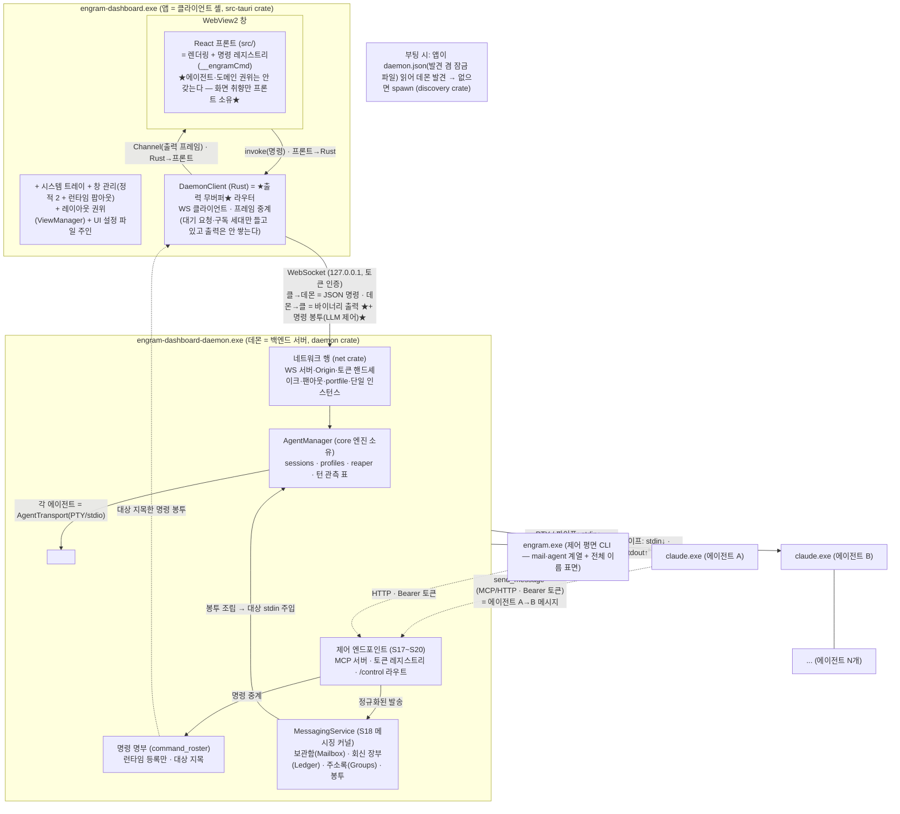
```mermaid
flowchart TD
  subgraph APP["engram-dashboard.exe (앱 = 클라이언트 셸, src-tauri crate)"]
    direction TB
    subgraph WV["WebView2 창"]
      WVc["React 프론트 (src/)<br/>= 렌더링 + 명령 레지스트리(__engramCmd)<br/>★에이전트·도메인 권위는 안 갖는다 — 화면 취향만 프론트 소유★"]
    end
    EXTRA["+ 시스템 트레이 + 창 관리(정적 2 + 런타임 팝아웃)<br/>+ 레이아웃 권위(ViewManager) + UI 설정 파일 주인"]
    DC["DaemonClient (Rust) = ★출력 무버퍼★ 라우터<br/>WS 클라이언트 · 프레임 중계<br/>(대기 요청·구독 세대만 들고 있고 출력은 안 쌓는다)"]
    WV -->|"invoke(명령) · 프론트→Rust"| DC
    DC -->|"Channel(출력 프레임) · Rust→프론트"| WV
  end

  subgraph DAEMON["engram-dashboard-daemon.exe (데몬 = 백엔드 서버, daemon crate)"]
    direction TB
    AM["AgentManager (core 엔진 소유)<br/>sessions · profiles · reaper · 턴 관측 표"]
    NET["네트워크 행 (net crate)<br/>WS 서버·Origin·토큰 핸드셰이크·팬아웃·portfile·단일 인스턴스"]
    CTL["제어 엔드포인트 (S17~S20)<br/>MCP 서버 · 토큰 레지스트리 · /control 라우트"]
    ROSTER["명령 명부 (command_roster)<br/>런타임 등록만 · 대상 지목"]
    MSGK["MessagingService (S18 메시징 커널)<br/>보관함(Mailbox) · 회신 장부(Ledger) · 주소록(Groups) · 봉투"]
    CTL -->|"정규화된 발송"| MSGK
    MSGK -->|"봉투 조립 → 대상 stdin 주입"| AM
    CTL -->|"명령 중계"| ROSTER
    AM -->|"각 에이전트 = AgentTransport(PTY/stdio)"| TR[" "]
  end

  DC -->|"WebSocket (127.0.0.1, 토큰 인증)<br/>클→데몬 = JSON 명령 · 데몬→클 = 바이너리 출력 ★+ 명령 봉투(LLM 제어)★"| NET
  NET --> AM
  ROSTER -.->|"대상 지목한 명령 봉투"| DC
  DAEMON -->|"PTY / 파이프: stdin↓ · stdout↑"| A1["claude.exe (에이전트 A)"]
  DAEMON -->|"PTY / 파이프: stdin↓ · stdout↑"| A2["claude.exe (에이전트 B)"]
  A2 --- AN["... (에이전트 N개)"]
  A1 -.->|"send_message (MCP/HTTP · Bearer 토큰)<br/>= 에이전트 A→B 메시지"| CTL
  CLI["engram.exe (제어 평면 CLI — mail·agent 계열 + 전체 이름 표면)"] -.->|"HTTP · Bearer 토큰"| CTL

  BOOT["부팅 시: 앱이 daemon.json(발견 겸 잠금 파일) 읽어 데몬 발견 → 없으면 spawn (discovery crate)"]
```

결정: 출력 무버퍼 중계·데몬 단일 주인 = ADR-0029 / ADR-0046 · 제어 엔드포인트 = ADR-0086 · 메시징 커널 = ADR-0103 / ADR-0110 · 명령 하행·대상 지목 = ADR-0154/0155.

**점선 화살표가 둘이다.** A→CTL은 **에이전트 간 메시징** — 에이전트가 데몬 안 제어 엔드포인트로 되전화를 걸면 데몬이 그 메시지를 브로커에 넘겨 형제 에이전트에게 넣는다(잠들었으면 맡아 뒀다가 그가 등장할 때, 없는 이름이면 그 자리에서 반려). ROSTER→DC는 **명령 하행** — 데몬이 자기 표로 대상을 지목해 명령 봉투를 앱에 배달하면 앱이 실행해 프론트 명령 레지스트리에 닿는다. 이게 「LLM-우선 제어」의 실물 배선이다. 실선(WS·PTY)은 기존 뼈대.

## 상태는 누가 갖나 — 소유권 지도

시스템을 이해하는 가장 빠른 길: **"이 상태는 누구 것인가"**. 헷갈리면 흐름을 못 따라간다.

| 상태 | 소유자 | 비고 |
|------|--------|------|
| 에이전트 생사·세션 | 데몬 `AgentManager` | 단일 출처 |
| 출력 버퍼(replay) | 데몬 `OutputCore` 링 | 클라이언트는 미러 안 함 |
| 프로필 영속(session-id·트리 부모·표시 이름) | 데몬 `ProfileRegistry` → agents.json | 세이브데이터 · **종료해도 보존(시체)**, ADR-0083. ★화신 표식(`epoch`)의 값은 여기 안 실린다★ — 읽기는 건너뛰고 쓰기는 `0` 자리채움이라, 이 비대칭이 의도인 이유는 [§용어 사전](#용어-사전-혼동쌍-고정)(ADR-0163) |
| 제어 토큰((AgentId, 화신 표식)별) | 데몬 `ControlRegistry` | 스폰 시 발급 · 화신 교체(표식 재발급)·kill 시 폐기 (S17) |
| 턴 관측(busy) 명단 | 데몬이 아니라 **코어** (분류는 backend seam 뒤) | 메시징 커널은 이 사실을 포트로 받아 쓴다 · 정리 지점은 `finish` + `emit` 둘뿐, ADR-0127 |
| 에이전트 간 메시지(보관함·회신 장부·주소록) | 데몬 메시징 커널 `MessagingService` (S18) | **인메모리** — 데몬 재시작 시 소실(영속화 없음, ADR-0103) |
| 데몬 발견 정보(포트·토큰) | `daemon.json` — 발견 파일 **겸 단일 인스턴스 잠금 파일**(ADR-0135) | 휘발(매 기동 재발행) · 위치는 릴리스에서 실행 폴더 하위 `engram-data`(ADR-0134/0136) |
| replay 진도·dedup·gen | **프론트 뷰(viewId)** | Rust 출력 행은 무상태 |
| 레이아웃(창·탭·슬롯) | 셸 `src-tauri` `layout::ViewManager` | 데몬은 View를 모른다 · **디스크 영속 없음**(인메모리 — 클라 재시작 시 초기화), ADR-0035/0057 |
| 테마·UI 설정 | 디스크 `ui-settings.json` (읽기 주인 = 셸) | **창별 값** · `ui.refresh`가 다시 읽는다 · 프론트 Zustand는 화면 반영 미러(저장 안 함), ADR-0166/0167 |
| 챗 렌더 스타일(간격·폰트) | 프론트 Zustand + localStorage | 프론트 전용 권위 — 이 문서에서 localStorage에 실리는 유일한 항목, ADR-0051 |

결정: 미러 제거 = ADR-0046 · 레이아웃 권위 = ADR-0035/0057 · UI 설정 파일 = ADR-0166 · 창별 테마 = ADR-0167 · data_dir 단일결정 = discovery `default_data_dir`(위치 결정은 ADR-0134/0136이 정본 — 0024의 데이터 위치 조항은 폐기) · 시체 보존 = ADR-0083 · 제어 토큰 = ADR-0086 · 메시징 인메모리 = ADR-0103.

## 읽기 경로 — 뭘 고치러 왔나

세부는 PART 2에 있다. 목적별 진입점:

- **출력이 안 나온다/깨진다** → PART 2 [출력 흐름](#출력-흐름-메인-claude--앱) + [프론트 상태기계](#프론트-제어표면--protocolclient-상태기계) + E2E [출력 시나리오](#출력-에이전트--여러-슬롯)
- **리로드하면 이력이 안 돌아온다** → PART 2 [replay 상태기계](#프론트-제어표면--protocolclient-상태기계) + E2E [리로드 시나리오](#리로드--재구독--전체-replay)
- **스폰/kill 생사가 이상하다** → PART 2 [죽음 흐름](#죽음-흐름-종료--정리) + [핵심 불변식](#핵심-불변식-서버--클라이언트) + E2E [스폰 시나리오](#스폰-ui-클릭--에이전트-생성)
- **에이전트끼리 메시지가 안 간다** → PART 2 [제어 채널](#제어-채널-에이전트-간-메시지--s17)(입구·인증) + [에이전트 간 메시징](#에이전트-간-메시징-브로커--s18)(배달·장부·그룹) + E2E [메시지 시나리오](#메시지-에이전트-a--에이전트-b)
- **새 백엔드/전송을 붙인다** → PART 2 [seam](#seam-교체점) + [crate 계층](#crate-계층-의존-아래위)

**여기까지가 조감도다.** 아래 PART 2는 필요할 때 찾아보는 레퍼런스다.

---

# PART 2 — 심화 레퍼런스 (유지보수자용)

> **범례.** ★ = **seam(교체점)** — trait로 구현된 경계, 코어는 이 뒤를 절대 안 본다. Mermaid 화살표는 데이터 흐름 방향(산문·표에선 화살표 기호를 안 쓴다).

## 프로세스 경계와 통신 수단

**경계마다 통신 수단이 다르다.** 이걸 헷갈리면 흐름을 못 따라간다.

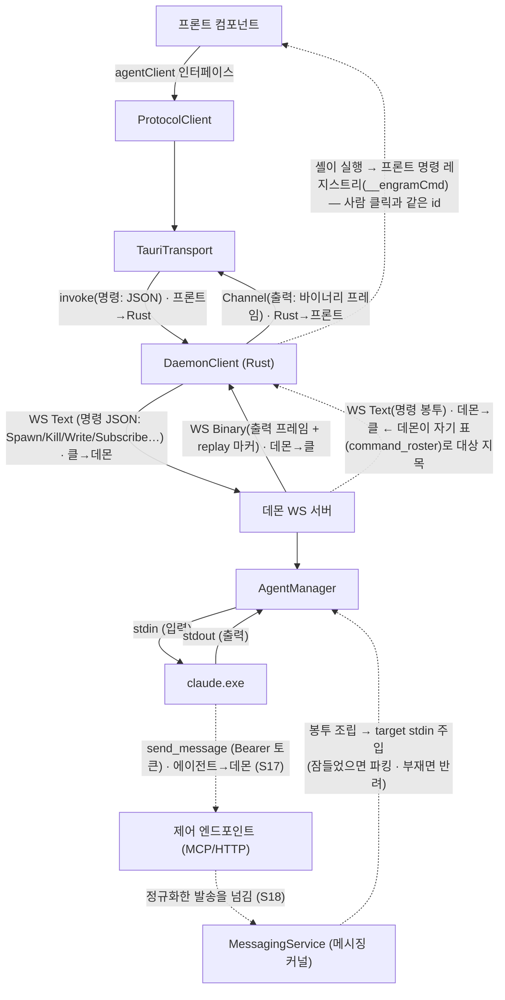
```mermaid
flowchart TD
  FC["프론트 컴포넌트"]
  PC["ProtocolClient"]
  TT["TauriTransport"]
  DC["DaemonClient (Rust)"]
  WSS["데몬 WS 서버"]
  AM["AgentManager"]
  CTL["제어 엔드포인트 (MCP/HTTP)"]
  MSGK["MessagingService (메시징 커널)"]
  CL["claude.exe"]

  FC -->|"agentClient 인터페이스"| PC
  PC --> TT
  TT -->|"invoke(명령: JSON) · 프론트→Rust"| DC
  DC -->|"Channel(출력: 바이너리 프레임) · Rust→프론트"| TT
  DC -->|"WS Text (명령 JSON: Spawn/Kill/Write/Subscribe…) · 클→데몬"| WSS
  WSS -->|"WS Binary(출력 프레임 + replay 마커) · 데몬→클"| DC
  WSS -.->|"WS Text(명령 봉투) · 데몬→클 ← 데몬이 자기 표(command_roster)로 대상 지목"| DC
  DC -.->|"셸이 실행 → 프론트 명령 레지스트리(__engramCmd) — 사람 클릭과 같은 id"| FC
  WSS --> AM
  AM -->|"stdin (입력)"| CL
  CL -->|"stdout (출력)"| AM
  CL -.->|"send_message (Bearer 토큰) · 에이전트→데몬 (S17)"| CTL
  CTL -.->|"정규화한 발송을 넘김 (S18)"| MSGK
  MSGK -.->|"봉투 조립 → target stdin 주입<br/>(잠들었으면 파킹 · 부재면 반려)"| AM
```

| 경계 | 수단 | 방향 | 싣는 것 |
|------|------|------|---------|
| 컴포넌트 ↔ agentClient | 함수 호출(TS 인터페이스) | 양방향 | 제어표면 |
| 프론트 ↔ 클라이언트(Rust) | `invoke` / Tauri `Channel` | 명령 프론트→Rust · 출력 Rust→프론트 | JSON 명령 / 바이너리 프레임 |
| 클라이언트 ↔ 데몬 | WebSocket | 명령 **양방향** · 출력 데몬→클 | 명령 JSON(클→데몬 = 사람·프론트 발 · 데몬→클 = 에이전트/LLM 발 · ADR-0154/0155) / 출력·마커 |
| 데몬 ↔ 에이전트 (기존) | PTY(ConPTY) 또는 파이프 | stdin↓ · stdout↑ | raw 바이트 / (json)NDJSON |
| **에이전트 → 데몬 (S17~S20)** | **MCP 또는 CLI — 스폰 시 capability로만 갈린다(런타임 폴백 없음, ADR-0128)** | 에이전트→데몬 (업링크) | 우편(`send_message`·`messages`) + 에이전트 제어(`/control/agent`) + **명령 중계**(`/control/commands`·`/control/call` — ADR-0160/0161) · Bearer 토큰 인증 |

결정: 제어표면 단일화 = ADR-0011 · 제어 채널 = ADR-0086 · 메시징 브로커 = ADR-0103(0105/0107/0111 부분 폐기) · 명령 하행(앱 = 데몬의 명령 수신 peer) = ADR-0081 → **ADR-0155가 결정 1·2 대체**.

> **주의 — 통신선이 두 개다.** 기존 PTY(데몬이 에이전트를 *부리는* 선)와, S17 제어선(에이전트가 데몬으로 *되전화하는* 선)은 물리적으로 다르다. 전자는 데몬→에이전트 stdin, 후자는 에이전트→데몬 MCP/HTTP. 헷갈리면 흐름을 반대로 읽는다.

## 서버측 — 데몬 + core 엔진

### crate 계층 (의존 아래→위)

**실행 산출 = `engram-dashboard-daemon.exe` + `engram`(제어 평면 CLI bin)** — 나머지는 그것들이 쓰는 라이브러리다. `engram`의 표면은 셋이다: 닫힌 계열 **`mail`**(우편 — `send`·`status`·`pending`)과 **`agent`**(에이전트 제어 — `list`·`spawn`·`new`·`rename`·`move`. 짝이 되는 MCP 툴이 **없다**. 제어를 CLI로만 내는 것이 ADR-0132), 그리고 **전체 이름**(`<계열>.<동사>`, 예 `agent.new` — 데몬이 런타임에 내려 주는 표를 그대로 친다. 그래서 계열 파서를 안 고쳐도 새 명령·새 인자가 즉시 도달한다. 발견은 `engram commands` — ADR-0155/0156). 계열 이름엔 점이 없고 명령 이름엔 늘 있어 분기가 모호하지 않다. `mail` 계열의 **노출은 조건부**다 — 스폰 때 심은 표식이 도움말에서만 가리고 동사 자체는 그대로 데몬에 나간다(거절을 관측 가능하게 만드는 것이 데몬 몫 — ADR-0133). (앱 exe는 src-tauri crate 산출 — 그래서 우리 실행파일은 앱·데몬·engram 3개. 데몬 crate는 `test-harness` feature 뒤에 하네스 bin을 더 갖지만 배포물이 아니다.)

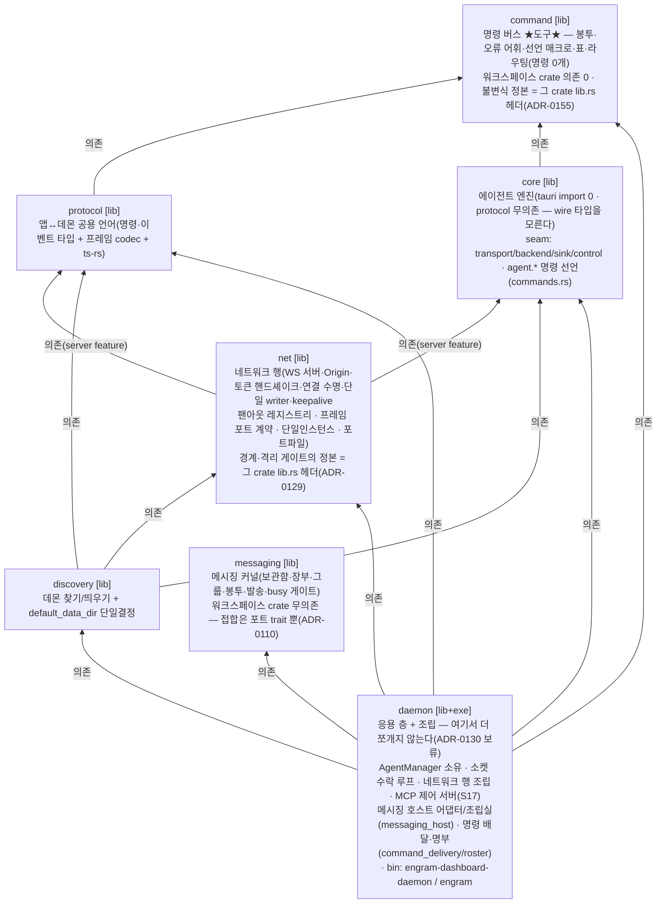
```mermaid
flowchart BT
  command["command [lib]<br/>명령 버스 ★도구★ — 봉투·오류 어휘·선언 매크로·표·라우팅(명령 0개)<br/>워크스페이스 crate 의존 0 · 불변식 정본 = 그 crate lib.rs 헤더(ADR-0155)"]
  protocol["protocol [lib]<br/>앱↔데몬 공용 언어(명령·이벤트 타입 + 프레임 codec + ts-rs)"]
  core["core [lib]<br/>에이전트 엔진(tauri import 0 · protocol 무의존 — wire 타입을 모른다)<br/>seam: transport/backend/sink/control · agent.* 명령 선언(commands.rs)"]
  discovery["discovery [lib]<br/>데몬 찾기/띄우기 + default_data_dir 단일결정"]
  messaging["messaging [lib]<br/>메시징 커널(보관함·장부·그룹·봉투·발송·busy 게이트)<br/>워크스페이스 crate 무의존 — 접합은 포트 trait 뿐(ADR-0110)"]
  net["net [lib]<br/>네트워크 행(WS 서버·Origin·토큰 핸드셰이크·연결 수명·단일 writer·keepalive<br/>팬아웃 레지스트리 · 프레임 포트 계약 · 단일인스턴스 · 포트파일)<br/>경계·격리 게이트의 정본 = 그 crate lib.rs 헤더(ADR-0129)"]
  daemon["daemon [lib+exe]<br/>응용 층 + 조립 — 여기서 더 쪼개지 않는다(ADR-0130 보류)<br/>AgentManager 소유 · 소켓 수락 루프 · 네트워크 행 조립 · MCP 제어 서버(S17)<br/>메시징 호스트 어댑터/조립실(messaging_host) · 명령 배달·명부(command_delivery/roster)<br/>· bin: engram-dashboard-daemon / engram"]

  protocol -->|"의존"| command
  core -->|"의존"| command
  net -->|"의존(server feature)"| protocol
  net -->|"의존(server feature)"| core
  discovery -->|"의존"| protocol
  discovery -->|"의존"| core
  discovery -->|"의존"| net
  daemon -->|"의존"| core
  daemon -->|"의존"| protocol
  daemon -->|"의존"| command
  daemon -->|"의존"| net
  daemon -->|"의존"| discovery
  daemon -->|"의존"| messaging
```

- **멤버 목록의 정본은 루트 `Cargo.toml`의 `[workspace] members`** (위 그래프는 lib 계층만 그린 것 — 앱 exe를 내는 src-tauri는 여기 없다). S17 제어 채널은 새 crate가 아니라 **core에 seam(`ControlChannel`) 정의 + daemon에 구현(MCP 서버·토큰 레지스트리·`engram` bin)** 으로 들어갔다. 새 의존성 = `rmcp`(공식 Rust MCP SDK) + `axum`(daemon 한정). 이후 명령 버스(ADR-0155)가 둘을 더 들였다 — `inventory`(선언 링커 수집. S20 Step 1의 **유일한 신규 서드파티 crate**이고 `core`를 타고 릴리즈 바이너리에 링크된다)와, `core`의 **production** 의존이 된 `ts-rs`(선언 매크로가 인자·반환 struct에 `TS` derive를 단다 — 코어가 TS 생성 도구를 운영 그래프에 안고 있다는 뜻이다).
- **command(2026-08-14 · ADR-0155)** 는 명령 버스 **도구**만 담고 명령은 0개다 — 어휘는 생산자 옆에서 선언한다(`core` = `agent.*`, `src-tauri` = `window/tab/slot`). **화살표는 들어오는 쪽 한 방향뿐**이고, 그중 `core → command`가 **코어의 첫 워크스페이스 의존**이다(그래도 `core → protocol`은 여전히 없다 — 도구 crate가 그 유입을 막는 것이 이 분리의 요점). 워크스페이스 의존 0·명령 0개는 CI 의존 상한 게이트가 지키고, 불변식 정본은 그 crate `src/lib.rs` 헤더다.
- **messaging(2026-07-28 · ADR-0110)** 은 위 그래프에서 나가는 화살표가 없다 — 워크스페이스의 어느 crate 도 의존하지 않는다(core 조차, 컴파일러 강제 벽). 데몬만 그쪽으로 의존하고, `AgentManager`·`OutputSink`·`ControlRegistry` 를 커널 포트에 꽂는 어댑터는 데몬 `messaging_host.rs` 가 소유한다. 안에서 무슨 정책이 도는지는 [에이전트 간 메시징](#에이전트-간-메시징-브로커--s18).
- **net(2026-08-05 · ADR-0129 슬라이스 1)** 은 데몬 crate `src/` 에서 로직·모듈명·타입명 무변경으로 **그대로 이사**한 네트워크 행이다. 프레임에 실린 것이 명령인지 출력인지 메시징인지를 **타입으로도** 모르고 위층과는 `frame_port` 계약으로만 만난다 — 그 무지의 범위와 근거는 `crates/engram-dashboard-net/src/lib.rs` 헤더에 있다. **소켓 수락 루프 자체는 아직 데몬 조립부**(`run_accept_loop`)라 경계가 "소켓 수락 **뒤**" 다(ADR-0129 슬라이스 3의 이동 대상이었으나 **ADR-0130 으로 보류** — 옮기지 않는다). 격리 게이트와 의존 상한 **규칙**(열거가 아니라 규칙)도 같은 헤더와 그 crate `Cargo.toml` 이 정본이다. 그 뒤 0-4가 핸드셰이크 프레임을 이 crate 소유(`auth::AuthFrame`)로 옮기면서 `discovery → net` 간선이 생겼다 — **기본 feature(비어 있음)로만 쓴다**(`server`를 켜면 동기 crate인 discovery가 async 런타임을 진다).
- **daemon(2026-08-05 · ADR-0130)** 은 응용 층(연결 코어 · 연결 어댑터 · 상태 팬아웃 · 메시징 호스트 · 제어 평면)과 조립을 **한 crate 로 유지**한다. ADR-0129 는 이 crate 를 다시 "에이전트 시스템 lib + 얇은 조립 바이너리" 로 가르려 했으나 **그 결정 2·3 은 보류됐다** — 재사용 목적은 net 분리로 달성·측정됐고(측정치와 재확인 명령 = ADR-0130 §근거 ①), 나머지 두 덩어리엔 따로 쓸 소비자가 없으며, 벽 없이도 production 의존 그래프가 이미 단방향이다. **재개 조건은 ADR-0130 §영향**(그 조건이 관측되기 전까지 이 crate 를 더 쪼개지 않는다). 한편 **데몬 살림의 *구현*은 이 crate 에 없다** — 단일 인스턴스 가드와 portfile 은 net 이 소유하고, 여기 남은 것은 그것들을 부르는 순서다(`run()`).

### core 클래스 구조 (소유 관계)

**데몬이 `AgentManager` 하나를 소유하고, 그 아래 에이전트마다 세션 조립체가 달린다.**

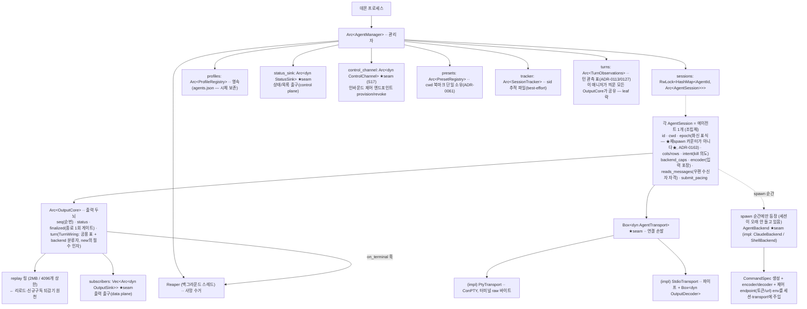
```mermaid
flowchart TD
  DP["데몬 프로세스"]
  AM["Arc&lt;AgentManager&gt; ·· 관리자"]
  DP --> AM
  AM --> SES["sessions: RwLock&lt;HashMap&lt;AgentId, Arc&lt;AgentSession&gt;&gt;&gt;"]
  AM --> PR["profiles: Arc&lt;ProfileRegistry&gt; ·· 영속(agents.json — 시체 보존)"]
  AM --> SS["status_sink: Arc&lt;dyn StatusSink&gt; ★seam<br/>상태/목록 출구(control plane)"]
  AM --> CC["control_channel: Arc&lt;dyn ControlChannel&gt; ★seam (S17)<br/>인바운드 제어 엔드포인트 provision/revoke"]
  AM --> RP["Reaper (백그라운드 스레드) ·· 사망 수거"]
  AM --> PS["presets: Arc&lt;PresetRegistry&gt; ·· cwd 북마크 단일 소유(ADR-0061)"]
  AM --> TR["tracker: Arc&lt;SessionTracker&gt; ·· sid 추적 파일(best-effort)"]
  AM --> TT["turns: Arc&lt;TurnObservations&gt; ·· 턴 관측 표(ADR-0113/0127)<br/>이 매니저가 띄운 모든 OutputCore가 공유 — leaf 락"]

  AS["각 AgentSession = 에이전트 1개 (조립체)<br/>id · cwd · epoch(화신 표식 — ★재spawn 카운터가 아니다★, ADR-0163) · cols/rows · intent(kill 의도)<br/>backend_caps · encoder(입력 포장) · reads_messages(우편 수신자 자격) · submit_pacing"]
  SES -.-> AS

  AS --> OC["Arc&lt;OutputCore&gt; ·· 출력 두뇌<br/>seq(순번) · status · finalized(종료 1회 게이트) · turn(TurnWiring: 공용 표 + backend 분류자, new의 필수 인자)"]
  OC --> RING["replay 링 (2MB / 4096개 상한)<br/>← 리로드·신규구독 되감기 원천"]
  OC --> SUB["subscribers: Vec&lt;Arc&lt;dyn OutputSink&gt;&gt; ★seam<br/>출력 출구(data plane)"]
  OC -->|"on_terminal 훅"| RP

  AS --> TRANS["Box&lt;dyn AgentTransport&gt; ★seam ·· 연결 손발"]
  TRANS --> PTY["(impl) PtyTransport ·· ConPTY, 터미널 raw 바이트"]
  TRANS --> STDIO["(impl) StdioTransport ·· 파이프 + Box&lt;dyn OutputDecoder&gt;"]

  BK["spawn 순간에만 등장 (세션이 오래 안 들고 있음)<br/>AgentBackend ★seam (impl: ClaudeBackend / ShellBackend)"]
  BK --> BKspec["CommandSpec 생성 + encoder/decoder + 제어 endpoint(토큰/url) env를 세션·transport에 주입"]
  AS -.->|"spawn 순간"| BK
```

★ **코어 seam**: `AgentTransport`(전송) · `AgentBackend`(모델 — `turn_classifier` 포함) · `OutputSink`/`StatusSink`(출력·상태 출구) · `ControlChannel`(인바운드 제어, S17) · `AgentCommandHost`(`agent.*` 핸들러 주입, ADR-0155 — 링커가 담는 것은 `CommandSpec`까지고 실물은 `make_table(deps)`가 꽂는다). 코어는 이 뒤를 절대 안 본다 → tauri-free · 교체 가능 · headless 테스트. 상세는 아래 [seam](#seam-교체점).

### 출력 흐름 (메인: claude → 앱)

**claude stdout → 펌프 → OutputCore → sink → 앱.** 코어는 raw만 알고 wire는 모른다.

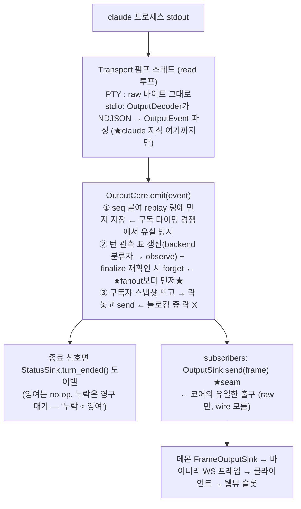
```mermaid
flowchart TD
  SO["claude 프로세스 stdout"]
  PUMP["Transport 펌프 스레드 (read 루프)<br/>PTY : raw 바이트 그대로<br/>stdio: OutputDecoder가 NDJSON → OutputEvent 파싱 (★claude 지식 여기까지만)"]
  EMIT["OutputCore.emit(event)<br/>① seq 붙여 replay 링에 먼저 저장 ← 구독 타이밍 경쟁에서 유실 방지<br/>② 턴 관측 표 갱신(backend 분류자 → observe) + finalize 재확인 시 forget ← ★fanout보다 먼저★<br/>③ 구독자 스냅샷 뜨고 → 락 놓고 send ← 블로킹 중 락 X"]
  BELL["종료 신호면 StatusSink.turn_ended() 도어벨<br/>(잉여는 no-op, 누락은 영구 대기 — '누락 &lt; 잉여')"]
  SUB["subscribers: OutputSink.send(frame) ★seam<br/>← 코어의 유일한 출구 (raw만, wire 모름)"]
  WSSINK["데몬 FrameOutputSink → 바이너리 WS 프레임 → 클라이언트 → 웹뷰 슬롯"]

  SO --> PUMP --> EMIT --> SUB --> WSSINK
  EMIT --> BELL
```

②의 순서가 load-bearing이다 — 통지를 받은 소비자가 곧바로 표를 조회하므로, fanout·통지보다 표 갱신이 늦으면 그 조회가 갱신 전 값을 본다.

결정: 락 순서 = ADR-0006 · OutputSink wire 무지 = ADR-0003 · 턴 관측 표(사실은 코어, 분류는 backend seam 뒤) = ADR-0113/0127.

### 입력 흐름 (사용자/LLM → claude)

**입력은 세션이 encoder로 포장해 transport로만 나간다.** 다만 두 진입 경로는 ★같은 동사를 타지 않는다★ — 본문 write는 공유하되 **제출(submit)은 우편 배달 쪽에만 붙는다**:

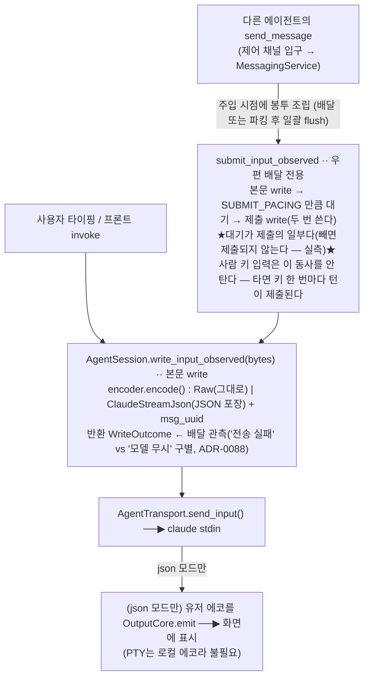
```mermaid
flowchart TD
  IN1["사용자 타이핑 / 프론트 invoke"]
  IN2["다른 에이전트의 send_message<br/>(제어 채널 입구 → MessagingService)"]
  WI["AgentSession.write_input_observed(bytes) ·· 본문 write<br/>encoder.encode() : Raw(그대로) | ClaudeStreamJson(JSON 포장) + msg_uuid<br/>반환 WriteOutcome ← 배달 관측('전송 실패' vs '모델 무시' 구별, ADR-0088)"]
  SUBMIT["submit_input_observed ·· 우편 배달 전용<br/>본문 write → SUBMIT_PACING 만큼 대기 → 제출 write(두 번 쓴다)<br/>★대기가 제출의 일부다(빼면 제출되지 않는다 — 실측)★<br/>사람 키 입력은 이 동사를 안 탄다 — 타면 키 한 번마다 턴이 제출된다"]
  SI["AgentTransport.send_input() ──▶ claude stdin"]
  ECHO["(json 모드만) 유저 에코를 OutputCore.emit ──▶ 화면에 표시<br/>(PTY는 로컬 에코라 불필요)"]

  IN1 --> WI
  IN2 -->|"주입 시점에 봉투 조립 (배달 또는 파킹 후 일괄 flush)"| SUBMIT
  SUBMIT --> WI
  WI --> SI
  SI -->|"json 모드만"| ECHO
```

결정: json 모드 배선 = ADR-0044 · 메시지 시맨틱 = ADR-0087 · 주입 타이밍(idle 게이트·일괄 flush) = ADR-0104 · 배달 계측·제출 경계 = ADR-0088.

### 죽음 흐름 (종료 → 정리)

**종료는 딱 한 번만 확정되고(finalize 1회), 수거는 Reaper 단일 소비자가 한다. 그리고 이제 시체는 안 지운다(ADR-0083).**

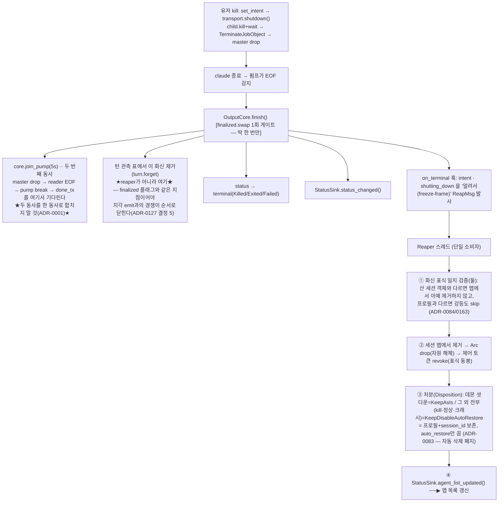
```mermaid
flowchart TD
  KILL["유저 kill: set_intent → transport.shutdown()<br/>child.kill+wait → TerminateJobObject → master drop"]
  DIE["claude 종료 → 펌프가 EOF 감지"]
  FIN["OutputCore.finish() [finalized.swap 1회 게이트 — 딱 한 번만]"]
  JOIN["core.join_pump(5s) ·· 두 번째 동사<br/>master drop → reader EOF → pump break → done_tx 를 여기서 기다린다<br/>★두 동사를 한 동사로 합치지 말 것(ADR-0001)★"]
  TURN["턴 관측 표에서 이 화신 제거(turn.forget)<br/>★reaper가 아니라 여기★ — finalized 플래그와 같은 지점이어야<br/>지각 emit과의 경쟁이 순서로 닫힌다(ADR-0127 결정 5)"]
  ST["status → terminal(Killed/Exited/Failed)"]
  SC["StatusSink.status_changed()"]
  HOOK["on_terminal 훅: intent · shutting_down 을 '얼려서(freeze-frame)' ReapMsg 발사"]
  REAPER["Reaper 스레드 (단일 소비자)"]
  R1["① 화신 표식 일치 검증(둘): 산 세션 객체와 다르면 맵에서 아예 제거하지 않고,<br/>프로필과 다르면 강등도 skip (ADR-0084/0163)"]
  R2["② 세션 맵에서 제거 → Arc drop(자원 해제) → 제어 토큰 revoke(표식 동봉)"]
  R3["③ 처분(Disposition): 데몬 셧다운=KeepAsIs / 그 외 전부(kill·정상·크래시)=KeepDisableAutoRestore<br/>= 프로필+session_id 보존, auto_restore만 끔 (ADR-0083 — 자동 삭제 폐지)"]
  R4["④ StatusSink.agent_list_updated() ──▶ 앱 목록 갱신"]

  KILL --> DIE
  DIE --> FIN
  FIN --> JOIN
  FIN --> TURN
  FIN --> ST
  FIN --> SC
  FIN --> HOOK
  HOOK --> REAPER
  REAPER --> R1 --> R2 --> R3 --> R4
```

- **핵심 변경(ADR-0083):** 옛 reaper는 "유저 의도 kill이면 프로필 삭제"를 했으나, 이제 **어떤 종료도 프로필을 지우지 않는다.** 모든 종료가 "시체"(session_id 보존 · auto_restore off)로 남는다. 진짜 삭제는 사용자의 명시적 `DeleteProfile` 명령으로만. → 목록에 종료된 에이전트가 쌓이는 게 정상(의도).
- **epoch-guard(ADR-0084/0163):** 재활성화(resume)로 화신 표식이 갈린 뒤 늦게 도착한 옛 사망 메시지가 산 세션을 강등하지 못하게, **표식 일치**를 확인한다.
- **등록 순서(ADR-0019):** `sessions.insert`가 pump 시작보다 **먼저**다 — 뒤집히면 즉시 종료하는 세션이 명부에 오르기 전에 끝나 수거되지 않는다. 런타임엔 아무 신호도 없고 reaper 테스트가 그 회귀를 잡는다.
- **턴 관측 정리는 두 지점뿐(ADR-0127):** `finish`와 `emit`의 finalize 재확인. 세 번째 호출자를 늘리면 인과가 갈라진다. 빠지면 턴 중 죽은 에이전트가 "진행 중"으로 남아 소비자(우편 파킹)가 상한이 풀 때까지 막힌다.

결정: kill 인과 2동사 = ADR-0001 · finalize 1회 = ADR-0005 · 종료 분류·freeze-frame 수거 = ADR-0019 · 시체 보존 = ADR-0083 · epoch-guard = ADR-0084 · 턴 관측 정리 지점 = ADR-0127.

### 세션 복원 / 활성화 (resume 전용 — ADR-0082)

**spawn 시 `--session-id`로 sid를 우리가 통제 → `--resume` 무손실 복원.** 복원 정확성은 이 sid에만 의존한다(추적 파일은 best-effort).

- **활성화(activate) = 이어받기(resume) 전용이다 (ADR-0082).** 종료된 에이전트를 다시 켜면 그 session_id로 resume한다.
- **fresh fallback 폐지:** 옛 설계는 "resume 실패 시 새 대화(fresh)를 만든다"였으나 이제 **하지 않는다.** resume가 실패/조기종료하면 → **관측된 종료 상태 그대로 종점 직행** + 시체 보존 + 실패 원인 기록(자동 재spawn 없음). 복구는 사람/LLM 판단 — 자동으로 새 세션을 파지 않는다(무손실 원칙 우선).
- ★**그 종점은 `Failed`가 아니라 `Exited`다**★ — 상태 매핑은 `TerminalReason` 하나로만 갈리고(`OutputCore::finish`), resume 경로엔 상태를 쓰는 줄이 없다. 그래서 대개 `Exited{code≠0}`이고 **code 0 조기종료도 `Exited`**다. `AgentStatus::Failed`는 `TerminalReason::Error` 전용 = 사실상 pump 패닉 전용이다. resume 실패는 상태 축이 아니라 **활성화 결과** 축(`RestoreOutcome::Failed`)과 프로필의 「마지막 실패」(ADR-0172)에 선다 — ADR-0082 본문도 "종점(주로 Exited code≠0)"이라 적는다. ★CLAUDE.md 「세션 복원」의 "`Failed`로 직행"은 이 축을 혼동한 표현이니 그 문장을 근거로 삼지 말 것★.
- **재활성화도 맵 교체 = 화신 표식 재발급 (ADR-0084/0163):** resume respawn은 같은 AgentId의 세션 객체를 갈아끼우므로 표식을 **다시 뽑는다**(증분이 아니다 — 발급 단일점 = `ProfileRegistry::epoch_for_spawn`). 그 표식의 비교·저장 규약은 [§용어 사전](#용어-사전-혼동쌍-고정)이 한 번만 정의한다. 프론트 구독 deps에는 이 값을 넣지 않는다(ADR-0164).

결정: resume 전용·fresh 폐지 = ADR-0082(Supersedes 0077, Amends 0008) · sid 통제 = ADR-0008 · 실패 기록 = ADR-0172 · 화신 표식 = ADR-0163.

## 제어 채널 (에이전트 간 메시지 — S17)

**S17에서 에이전트(그 안의 LLM)가 다른 에이전트에게 메시지를 보내는 길이 뚫렸다.** 이건 기존 출력/입력 흐름과 별개의 인바운드 경로다 — 에이전트가 데몬으로 *되전화*해서 형제의 stdin에 글을 넣는다. 이 절은 그 **입구와 신원**만 다룬다. 입구를 통과한 뒤의 배달·보관·장부는 다음 절 [에이전트 간 메시징](#에이전트-간-메시징-브로커--s18)이다.

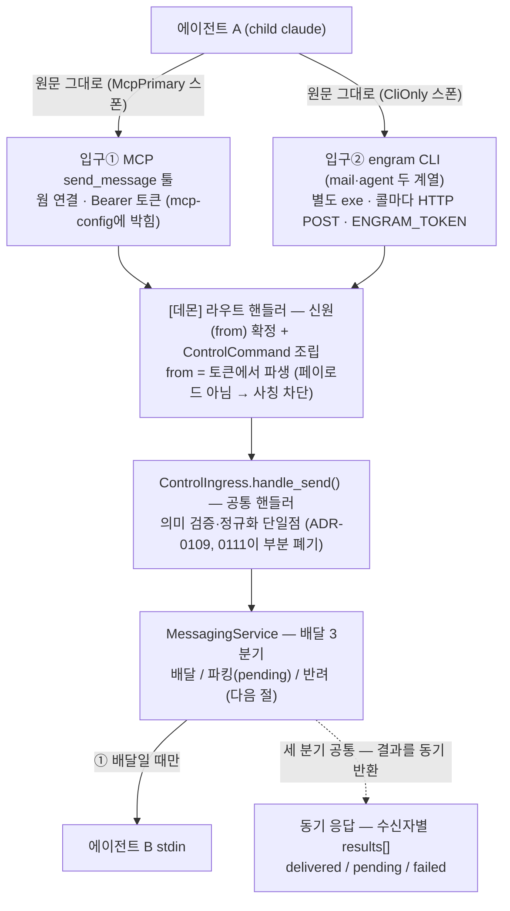
```mermaid
flowchart TD
  A["에이전트 A (child claude)"]
  MCP["입구① MCP send_message 툴<br/>웜 연결 · Bearer 토큰 (mcp-config에 박힘)"]
  CLI["입구② engram CLI (mail·agent 두 계열)<br/>별도 exe · 콜마다 HTTP POST · ENGRAM_TOKEN"]
  CI["[데몬] 라우트 핸들러 — 신원(from) 확정 + ControlCommand 조립<br/>from = 토큰에서 파생 (페이로드 아님 → 사칭 차단)"]
  VAL["ControlIngress.handle_send() — 공통 핸들러<br/>의미 검증·정규화 단일점 (ADR-0109, 0111이 부분 폐기)"]
  DELIV["MessagingService — 배달 3분기<br/>배달 / 파킹(pending) / 반려 (다음 절)"]
  B["에이전트 B stdin"]
  ACK["동기 응답 — 수신자별 results[]<br/>delivered / pending / failed"]

  A -->|"원문 그대로 (McpPrimary 스폰)"| MCP --> CI
  A -->|"원문 그대로 (CliOnly 스폰)"| CLI --> CI
  CI --> VAL --> DELIV
  DELIV -->|"① 배달일 때만"| B
  DELIV -.->|"세 분기 공통 — 결과를 동기 반환"| ACK
```

- **입구는 원문을 나르고, 계약은 데몬이 만든다.** MCP 툴과 CLI(`engram mail` — 별도 exe라 HTTP로 붙는다)는 요청을 **그대로** 넘기고, `ControlCommand` 조립과 **의미 검증·정규화**(수신자 · 회신 계약 인자 · 멤버명 분해·트림)는 데몬 공유 핸들러 한 곳에서만 한다. 그래서 두 입구의 응답 JSON이 바이트 동일하고, 그 아래는 어느 입구로 들어왔는지 모른다(entrance-agnostic — ADR-0109). 입구별 인자 표면의 정본은 `crates/engram-dashboard-daemon/src/bin/engram.rs` 헤더다. **CLI는 계열이 둘이다** — `mail`(우편)과 `agent`(제어). agent 계열엔 **짝이 되는 MCP 툴을 의도적으로 두지 않았다**(제어는 빈도가 낮아 상주 연결이 아깝다 — ADR-0132).
- **노출 표면 = 메시징 2툴(`send_message` 발송 · `messages` 상태·미결 조회) + 진단 `engram_ping`.** 그룹 관리 툴은 사용자 정의 그룹과 함께 폐지됐다(ADR-0111 결정 4) — CLI에도 `group` 동사가 없고 회귀 가드 테스트가 부활을 막는다. 이름이 닮은 Claude Code 내장 `SendMessage` 툴은 메시징 스폰에서 deny로 막는다(오발 방지 — ADR-0106).
- **스폰 때 입구를 깔아 준다:** 에이전트별 `mcp-config`와 `--settings` 조각(전역 차단 설정을 세션 한정으로 우회 — 인라인 JSON이 아니라 **파일 경로**)을 만들어 주고, **프라이밍**이 "너는 팀의 한 명이고 이 툴로 동료에게 말을 건다"를 시스템 프롬프트에 얹는다(ADR-0092 · 0099는 0126/0128이 부분 폐기 · 0109는 0111이 부분 폐기).
- ★**한 에이전트에게 열리는 입구는 하나다**★ — 스폰 시 capability로만 갈리고 **런타임 폴백이 없다**(ADR-0126이 우회 교육을 폐지, ADR-0128이 물리 배선까지 등호로 묶었다). 그래서 CliOnly 스폰의 프라이밍엔 `send_message`라는 낱말 자체가 없고, 안 깐 입구는 거절 응답에서도 **대안 채널을 알리지 않는다**(ADR-0133). 위 다이어그램의 두 화살표는 한 에이전트가 아니라 **두 스폰 모드**다.

> 응답은 수신자별 행이고 어휘는 **`delivered`·`pending`·`failed`** 3종이다(ADR-0125). `delivered`는 **stdin에 썼고 전량 수용됐다**는 뜻이지 수신 LLM이 읽었다는 뜻이 아니다 — 읽음 증거는 어느 모드에도 없다(ADR-0121 결정 3). `pending`은 큐에 남았다는 뜻이고, `failed`는 큐 적재 전 판정이다.

### 인증 — 신원은 토큰에서만 나온다

- **토큰 단위 = (AgentId, 화신 표식).** 같은 에이전트라도 표식이 다르면 다른 토큰이다. **화신 회전(재활성화/재시작)·kill = 구 토큰 즉시 폐기** → 죽은/낡은 신원으로는 메시지 못 보냄 (ADR-0084/0163 연동 — ★ADR-0007의 「맵 교체마다 +1」 조항은 0163이 **폐기**했다★).
- **`from`은 항상 토큰에서 파생.** 페이로드의 발신자 필드는 무시한다 → 프롬프트 주입/오작동 에이전트의 사칭 차단(같은 OS 유저라 하드 격리는 불가 — 최종 방어는 데몬측 검증 단일점).
- MCP = mcp-config에 토큰을 박아 연결 시 1회 바인딩(`Mcp-Session-Id`↔신원 고정). CLI = 콜마다 env 토큰 제시.

결정: 채널 아키텍처 = ADR-0086 · `send_message` 시맨틱 = ADR-0087(부분 폐기 by 0088) · 배달 관측 seam = ADR-0088(부분 폐기 by 0091) · 입구 단일화 = ADR-0126/0128(0099 부분 폐기) · CLI 계열·거절 정책 = ADR-0132/0133.

## 에이전트 간 메시징 (브로커 — S18)

**S17이 입구를 뚫었다면 S18은 그 뒤에 브로커를 놓았다.** 예전엔 "지금 살아 있고 지금 한가한" 상대에게만 글이 들어갔지만, 이제 데몬이 못 넣는 메시지를 **맡아 뒀다가** 받을 수 있게 될 때 넣는다. 목표는 *데몬이 살아 있는 동안 메시지는 확실히 간다*(ADR-0103)이되, 그 "확실히"에는 경계가 있다 — **없는 이름·동명 모호는 발송 즉시 실패**하고, 자리가 없으면 반려하며, 오래 못 나간 파킹분은 TTL로 **만료**된다. 접수돼 보관된 것이 데몬 생존 중 조용히 사라지지 않는다는 뜻이지, 모든 발송이 반드시 도달한다는 뜻이 아니다.

### 배달 3분기 — 배달 / 파킹 / 반려

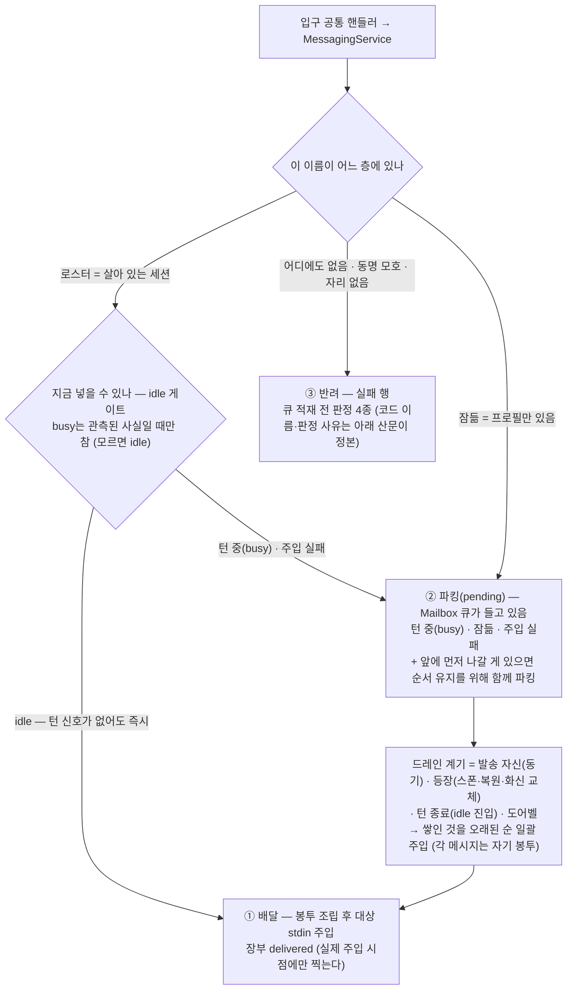
```mermaid
flowchart TD
  SEND["입구 공통 핸들러 → MessagingService"]
  Q1{"이 이름이 어느 층에 있나"}
  Q2{"지금 넣을 수 있나 — idle 게이트<br/>busy는 관측된 사실일 때만 참 (모르면 idle)"}
  D1["① 배달 — 봉투 조립 후 대상 stdin 주입<br/>장부 delivered (실제 주입 시점에만 찍는다)"]
  D2["② 파킹(pending) — Mailbox 큐가 들고 있음<br/>턴 중(busy) · 잠듦 · 주입 실패<br/>+ 앞에 먼저 나갈 게 있으면 순서 유지를 위해 함께 파킹"]
  D3["③ 반려 — 실패 행<br/>큐 적재 전 판정 4종 (코드 이름·판정 사유는 아래 산문이 정본)"]
  FL["드레인 계기 = 발송 자신(동기) · 등장(스폰·복원·화신 교체)<br/>· 턴 종료(idle 진입) · 도어벨<br/>→ 쌓인 것을 오래된 순 일괄 주입 (각 메시지는 자기 봉투)"]

  SEND --> Q1
  Q1 -->|"로스터 = 살아 있는 세션"| Q2
  Q2 -->|"idle — 턴 신호가 없어도 즉시"| D1
  Q2 -->|"턴 중(busy) · 주입 실패"| D2
  Q1 -->|"잠듦 = 프로필만 있음"| D2
  Q1 -->|"어디에도 없음 · 동명 모호 · 자리 없음"| D3
  D2 --> FL --> D1
```

- **파킹(parking)** = "지금 못 넣는 메시지를 데몬이 들고 있는 것". 사유는 셋 — **턴 중(busy)** · **잠듦(프로필은 있고 세션은 없음)** · **주입 실패**. 셋이 같은 `pending` 어휘를 쓴다(상태 발명 금지).
- **없는 이름은 파킹하지 않는다.** 로스터에도 프로필에도 없으면 발송 즉시 `RECIPIENT_NOT_FOUND` 실패 행이다 — 오타를 TTL까지 묵히지 않고 그 자리에서 알린다(ADR-0111 결정 1 → ADR-0117 결정 1이 범위를 좁힘). **프로필 없는 이름에게 미리 보내 두기만 미지원**이고, 잠든 이름 앞 선지시는 정식 파킹 수용이다. 파킹분의 TTL은 24h(ADR-0105).
- **주입 타이밍 = idle 게이트 + 일괄 flush**(ADR-0104). 그 위에 **발송 호출 자신이 자기 턴에 그 수신자 큐를 앞에서부터 동기 드레인**한다(직발송 지름길 폐지 — ADR-0125). 그래서 한가한 상대에게는 같은 호출 안에서 나간다. 턴 진행 중에 stdin으로 밀면 CLI 내부 큐로 넘어가 데몬이 순서·시점을 잃는다. 대신 턴이 끝나는 순간 쌓인 것을 **한꺼번에** 넣어, 수신 LLM이 메일함 열듯 전체를 보고 우선순위·모순을 스스로 정리한다(한 건씩 드리블 = 메시지당 턴 하나 = N배 비용).
- **busy는 관측된 사실일 때만 참이다**(positive-knowledge-only) — 모르면 idle = 즉시 주입. 반대로 하면 관측 불가 백엔드·관측이 아직 시작되지 않은 창에서 배달이 영구 대기한다("늦게 가는 것"보다 "안 가는 것"이 나쁘다).
- **잠든 수신자를 깨우지 않는다** — 파킹해 두고 그가 등장할 때 내보낸다(wake 연기. ADR-0104 → ADR-0112가 반려로 뒤집었다가 ADR-0116이 파킹으로 되돌렸다). **부재와 같은 취급이 아니다** — 없는 이름은 반려고, 잠듦은 파킹이다.
- **잠듦 층에도 동명 차단이 걸린다** — 같은 이름의 잠든 프로필이 둘 이상이면 파킹하지 않고 `RECIPIENT_AMBIGUOUS`다(이름 키 파킹은 "먼저 복원된 쪽이 조용히 받는" 경로를 만든다). 층이 겹친 동명은 **로스터 층이 이긴다**(ADR-0116 결정 1 · ADR-0120).
- **잠듦 파킹의 만료는 조용하다** — 복원되지 않으면 24h TTL로 `expired`되고 발신자 능동 통지는 없다(파킹 사유별 예외를 만들지 않는다 — ADR-0116 결정 6).
- **주기 sweep은 배달 재시도가 아니다.** sweep이 하는 일은 TTL 지난 파킹분을 `expired`로 걷어내고 기한 넘긴 request의 notice를 발행하는 것뿐이다 — 잠든 수신자 앞 메일은 **그가 등장할 때** 나가거나 TTL로 만료되지, 주기적으로 재시도되지 않는다. 타이머가 도어벨을 울리는 경로는 busy 관측이 비정상적으로 오래 남았을 때 그 주인을 깨우는 fail-open 안전 밸브 하나뿐이다 — 그때도 **공용 관측 표는 건드리지 않는다**(`TurnFacts`는 읽기 전용). 커널이 자기 상한 판정 장부에 "잔해"로 적고 도어벨만 울린다(ADR-0127 결정 4 — 상한이 공용 표를 지우면 그 결정 위반).
- **반려(실패)는 큐 적재 전 판정 4종이다** — ★이 절에서 코드 이름을 적는 자리는 여기 하나다★(위 그림은 갈래만 그린다). 이름 없음(`RECIPIENT_NOT_FOUND`) · 동명 모호(`RECIPIENT_AMBIGUOUS`) · 보관함 초과(`MAILBOX_FULL`) · 회신 계약 초과(`REQUEST_CAPACITY`). 넷 다 큐에 넣기 전에 갈리므로 발신자에게 즉답한다. **`REQUEST_CAPACITY`는 전역 512 슬롯**이고 TTL도 취소도 없어, 차면 데몬 재시작 전까지 새 request가 전부 막힌다(ADR-0108 → ADR-0114가 반려 층위 확정).
- **통지(notice) 레인은 반려하지 않는다** — 꽉 차면 가장 오래된 통지를 은퇴시키고 새 것을 받는다(수신자당 `NOTICE_CAP` 64 — ADR-0107 → ADR-0114 결정 1이 20에서 상향). 은퇴분은 장부에 `skipped`로 남는다.
- **`RECIPIENT_DELETED`는 장부 전용 종점**이다 — 프로필 삭제 정리가 *이미 파킹된* 레코드를 사후 종결하는 유일 경로라 `pending → failed` 간선을 이 경로 한정으로 쓴다(`delivered → failed`는 여전히 불법 — ADR-0116 결정 4).

### 회신 계약(request) + 장부

- **request** — 발송을 `request`로 표시하면 데몬 `Ledger`에 회신 빚이 열린다. 봉투에 `id`와 `reply-by`(기한)가 실려 수신 LLM이 무엇에 답해야 하는지 본다. 계약은 배달이든 파킹이든 **수용되는 순간** 열린다 — 반대로 **배달되지 못한 수신자**(입구 반려·`MAILBOX_FULL`·`REQUEST_CAPACITY`)의 계약은 **열지 않는다**.
- **회신 판정 = `in_reply_to` 필드의 엄격 매칭** — 타입이 아니다. 그 id를 정확히 가리킬 때만 닫힌다(관대 매칭 = 우연 닫힘 오발이라 거부).
- **회신의 결말은 셋이다**(ADR-0116 결정 2 · 접합 = ADR-0118). 회신이 **수용**(`delivered`|`pending`)되면 `replied`로 닫는다 — **파킹도 수용이다**("꽂으면 계약 완료"). **`RECIPIENT_NOT_FOUND`만** `reply_failed` 실패 종결(갈 곳이 없다 — 오픈 목록·기한 스윕·512 계수에서 빠지고 이력만 남는다). 그 밖의 실패는 **무동작 = 오픈 유지**이고 재시도가 정상 경로로 닫는다.
- **기한 초과 ≠ 종결**(ADR-0108) — 기한이 지나면 데몬이 **발신자에게** `<notice>`를 보내지만(수신자 재촉이 아니다) 계약은 열려 있고 미결 조회에 계속 보인다. 전역 상한이 차면 "발신자에게 알릴 약속이 안 남은" 계약 중 최고령부터 은퇴시킨다.
- **요청자 프로필 삭제도 종결 계기다** — 그가 요청자인 오픈 계약은 `reply_failed`로 닫힌다(이미 `replied`인 것과 회신자 쪽이 삭제된 계약은 건드리지 않는다 — ADR-0116 결정 3).
- **장부는 이력도 갖는다** — 전 메시지의 상태 전이(`pending → delivered → replied` / `expired` / `failed` / `skipped`)와 시각. **`skipped`는 그룹 멤버 skip이 아니라 notice 레인 초과로 은퇴된 통지를 가리킨다**(그룹 전용 배달 규칙 폐지 후 뜻이 갈아끼워졌다 — ADR-0111 결정 4). 다중 수신자 발송은 메시지 1건 : 수신자별 행 N건.

### 그룹(@) 발송 — 주소록 매크로

- **그룹은 전용 경로가 아니라 해석 매크로다**(ADR-0111 결정 4). `@`주소는 명단을 펼쳐 **다중 수신자 직접 발송**에 태울 뿐이고, 전용 배달 규칙(죽은 멤버 skip·화신 결박)은 폐지됐다. 펼쳐진 멤버는 개인 편지와 **똑같은 3분기**를 탄다 — 그래서 장부는 메시지 1건 : 수신자별 행 N건이다.
- **내장 어휘 둘뿐이다**(사용자 정의 그룹·`group` 관리 툴은 제거 — 저장형 그룹이 필요해지는 시점에 재설계한다).
  - **`@all`** = 명부 전원(산 것 + 잠든 것) **− 발신자**. 잠든 몫은 파킹됐다가 그 에이전트가 등장할 때 나간다.
  - **`@here`** = 지금 살아 있는 전원 **− 발신자**.
  - **발신자 제외는 두 어휘 공통**이고 그 조항의 정본은 ADR이 아니라 **spec §4**다(ADR-0121 결정 1 — 0111만 읽고 구현하면 빠뜨린다).
- **수신자 해석은 로스터 스냅샷 한 장으로 전원 일괄**한다 — 해석 도중 명단이 변해 반쪽 판정이 나는 것을 막는다(옛 그룹 스냅샷 원칙에서 이 조각만 존치, ADR-0111 결정 2).
- 그룹 해석은 여전히 **seam**(`GroupSource`)이라 새 소스가 생겨도 발송 파이프라인은 안 건드린다. 오늘 구현체는 `BuiltinGroups` 하나다.

### 봉투는 "주입 시점"에 딱 한 곳에서 조립한다

수신 LLM이 실제로 보는 텍스트(`<message …>` / 데몬 전용 `<notice>`)는 `envelope`의 `wrap_message`/`wrap_notice` **두 함수에서만** 만들어진다(단일 wrap point — ADR-0086 §7이 원류, ADR-0096/0103이 이어받음). 조립 시점은 park이 아니라 **주입**이다: 파킹은 감싸지 않은 본문 + 재료만 들고 있다가 넣는 순간 *현재* 포맷으로 감싼다 → 즉시 배달과 늦은 배달의 봉투가 같다. `<notice>`는 데몬만 만들 수 있고 발신 인자에 타입 문자열 자체가 없어서, 에이전트는 어느 입구로도 통지를 사칭할 수 없다(구조적 차단).

### 구조 — 커널 lib + 데몬 어댑터 (ADR-0110)

**정책은 커널에, 실물은 데몬에.** 메시징 커널은 워크스페이스의 어떤 crate에도 의존하지 않는 독립 lib이라 `AgentManager`·`TurnObservations`·`ControlRegistry`를 **타입으로도 모른다**. 접합은 커널이 소유한 포트 trait으로만 뚫리고, 그 구멍에 실물을 꽂는 어댑터는 데몬 `messaging_host.rs`가 소유한다.

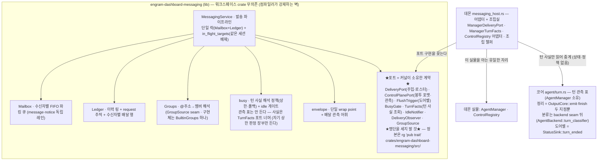
```mermaid
flowchart TD
  subgraph K["engram-dashboard-messaging (lib) — 워크스페이스 crate 무의존 (컴파일러가 강제하는 벽)"]
    SVC["MessagingService · 발송 파이프라인<br/>단일 락(Mailbox+Ledger) + in_flight_targets(같은 세션 배제)"]
    MB["Mailbox · 수신자별 FIFO 파킹 큐 (message·notice 독립 레인)"]
    LG["Ledger · 이력 링 + request 추적 + 수신자별 배달 행"]
    GR["Groups · @주소→멤버 해석 (GroupSource seam · 구현체는 BuiltinGroups 하나)"]
    BZ["busy · 턴 사실 해석 정책(상한·폴백) + idle 게이트<br/>관측 표는 안 든다 — 사실은 TurnFacts 포트 너머 (자기 상한 판정 장부만 든다)"]
    EN["envelope · 단일 wrap point + 배달 관측 어휘"]
    PORT["★포트 = 커널이 소유한 계약★<br/>DeliveryPort(주입·로스터) · ControlPlanePort(봉투 포맷·관측) · FlushTrigger(도어벨)<br/>BusyGate · TurnFacts(턴 사실 조회) · IdleNotifier · DeliveryObserver · GroupSource<br/>★명단을 세지 말 것★ — 정본은 rg 'pub trait' crates/engram-dashboard-messaging/src/"]
    SVC --> MB
    SVC --> LG
    SVC --> GR
    SVC --> BZ
    SVC --> EN
    SVC --> PORT
  end

  HOST["데몬 messaging_host.rs — 어댑터 + 조립실<br/>ManagerDeliveryPort · ManagerTurnFacts · ControlRegistry 어댑터 · 조립 헬퍼"]
  REAL["데몬 실물: AgentManager · ControlRegistry"]
  CORE["코어 agent/turn.rs — 턴 관측 표(AgentManager 소유)<br/>정리 = OutputCore::emit·finish 두 지점뿐<br/>분류는 backend seam 뒤(AgentBackend::turn_classifier)<br/>도어벨 = StatusSink::turn_ended"]

  HOST -->|"포트 구현을 꽂는다"| PORT
  HOST -->|"이 실물을 아는 유일한 자리"| REAL
  HOST -->|"턴 사실만 읽어 중계 (상태·정책 없음)"| CORE
```

- **규약이 아니라 벽인 이유:** 이 코드베이스는 작업마다 다른 코더 세션이 짜므로, 경계를 문서·리뷰로만 지키면 세션이 갈릴 때마다 부식될 수 있다. crate 경계는 컴파일러가 강제하므로 커널에서 `AgentManager`를 부르려는 시도는 컴파일 에러가 된다 — 그 멈춤이 "포트를 새로 정의하거나 설계 판단을 받아야 한다"는 신호로 설계됐다(ADR-0110).
- **백엔드 지식의 자리:** "어떤 출력 이벤트가 턴 진행이고 어떤 게 턴 종료인가"는 claude stream-json 지식이라 커널이 아니라 **코어의 `backend/` seam 뒤**가 안다(`AgentBackend::turn_classifier` — ADR-0004와 같은 결, ADR-0127 결정 2). 데몬 어댑터는 얇게, 정책은 커널에 — busy 불변식을 어댑터에서 재구현하지 않는다.
- **턴 관측을 정리하는 자리는 둘뿐이다** — `OutputCore::emit`의 finalize 재확인과 `OutputCore::finish`의 `turn.table.forget`. `emit` 안에서 그 갱신은 **replay-push와 fanout 사이**에 놓이고 그 순서가 load-bearing이다. ★세 번째 호출자를 늘리면 인과가 갈라진다★(ADR-0127).
- **빠뜨리면 우편이 막힌다.** 턴 도중 죽은 에이전트가 "진행 중"으로 남으면 그 앞 배달이 도어벨마다 접히고, **30분 상한(`BUSY_MAX_TURN`)이 fail-open으로 풀 때까지** 아무것도 못 나간다 — 그 뒤엔 TTL 만료다. 그래서 상한은 최적화가 아니라 **마지막 안전 밸브**이고, 풀 때도 **공용 관측 표는 건드리지 않는다**(`TurnFacts`는 읽기 전용 — ADR-0127 결정 4).
- **격리 게이트는 둘이다.** ① 소스 참조: `rg "engram_dashboard_(core|daemon|protocol|discovery|command)" crates/engram-dashboard-messaging/src/` → 0줄. ② 의존 상한: `cargo tree -p engram-dashboard-messaging --depth 1 --prefix none -e normal,dev,build --target all --all-features | rg "^engram-dashboard" | sort -u` → 정확히 1줄(자기 자신). ①은 **소스 텍스트**만 봐서 따옴표·`[build-dependencies]`·rename에 뚫리고, 알파벳을 손으로 박아 둬 **새 crate는 누가 이름을 더할 때까지 안 보인다** — ②가 해석된 의존 그래프로 그 구멍을 덮는다(`command` 추가가 ②를 세운 계기다). 외부 의존도 `uuid`·`tracing` 둘로 고정돼 있다.
- **부수 이득:** `cargo test -p engram-dashboard-messaging` 하나로 claude 바이너리·실 PTY 없이 3분기·flush·sweep·계약을 결정적으로 단언한다 — 가짜 포트를 끼우고, `mailbox`·`ledger`·`groups`는 로직 안에서 현재 시각을 직접 읽지 않고 시계를 **인자로 주입**받는다(그 세 모듈의 순수성 불변식). `busy`도 **시계를 읽지 않는다** — 상한 비교는 `now`를 인자로 받는 sweep 안에서만 하고 조회(`is_busy`)는 그 판정 장부를 볼 뿐이다. 그래서 판정 시점이 sweep 주기에 고정돼 **관측 가능한 동작이 결정적이다**.
- **동시성 축은 둘이다**(ADR-0142). 호스트의 배달 레인은 **도어벨 AgentId**로 갈라 서로 다른 키를 병렬로 돌리고(처리량 축 — 정합성 보장은 하지 않는다), 커널은 **해석된 대상 세션 id**(`in_flight_targets`)로 같은 세션 배제를 진다. 분할 키가 실제 주입 대상이 아니기 때문이다 — 산 에이전트 개명 + 그 빈 이름 인계로 **두 이름 큐가 한 세션에 수렴**할 수 있고, 이름 키 가드는 그 축을 구조적으로 못 본다.

### v1 경계 — 정직하게

- **영속화 없음.** 보관함·장부가 전부 인메모리다 — **데몬을 재시작하면 파킹된 메시지도 미결 계약도 통째로 사라진다**(`messaging` crate에 serde·persist 0줄). 영속화는 에이전트 시스템 메모리 설계 때로 유예됐다(ADR-0103).
- **UI 표면 없음.** 대시보드에 메시지함·미결 목록 화면이 없다. 관측 수단은 에이전트가 부르는 조회 툴(`messages`)과 데몬 로그뿐이다.
- **개발 중 — 기준선은 S18이고 그 뒤 개편이 여러 겹 쌓였다.** 발송 개편(ADR-0111/0112), 입구 3분기 재편(ADR-0116/0117), 동기 드레인(ADR-0125), `@all`/`@here` 분리(ADR-0121), 배달 병렬화(ADR-0142)가 v1 위에 얹혔다. 이 절을 읽을 때 **S18 spec 단독을 정본으로 삼지 말 것** — 위 ADR들이 spec 조항을 개정한다. 남은 측정·비채택 항목은 spec과 step-log 백로그가 추적한다.

결정: v1 본체 = ADR-0103/0104(각각 0107·0111 / 0112로 부분 폐기) · 발송 개편 = ADR-0111(0117/0121로 범위 축소)·0112 · 입구 3분기 = ADR-0116(정본 — 0120/0121이 부분 폐기)·0117 · 계약 수명 = ADR-0108 → 0114 → 0118 · 동기 드레인 = ADR-0125(0124 폐기) · 그룹 어휘 = ADR-0121 · 병렬화 = ADR-0142 · 구조 = ADR-0110(0127로 부분 폐기).

구현 계약 정본(필드·에러 어휘·수용 기준)은 `docs/process/S18-messaging-v1/spec/messaging-v1-spec.md`. 관련 ADR은 이 절 안에서 인용된다(대개 절 끝 `결정:` 줄이지만 본문에만 있는 것도 있다 — 봉투 wrap seam이 그 예다). 폐기 도장까지 붙은 전수 목록은 `docs/decisions/README.md`다([ADR 근거 맵](#adr-근거-맵-더-파려면-여기)이 그 이유를 적는다).

## 클라이언트측 — src-tauri 셸 + 프론트

### 프론트 레이어 스택 + 컴포넌트 트리 (상→하)

> 프론트(웹뷰 안 React)를 위에서 아래로 **4겹**으로 본다: **UI → 커맨드 → 상태 → 제어 표면**, 그 아래가 출력 무상태 라우터(다음 절).

**레이어 스택** — 아래로 갈수록 좁아져 `ProtocolClient` 하나로 모이고, 그 밑 `TauriTransport`만 갈면 전송 경로가 바뀐다. 프론트는 렌더링과 명령 레지스트리를 갖되 **에이전트·도메인 권위는 갖지 않는다** — 제어의 권위는 백엔드측이 쥔다(CLAUDE.md 「LLM-우선 제어」). 프론트 전용 권위로 남은 화면 취향의 명단은 아래 「권위는 백엔드」 항목이 갖는다.

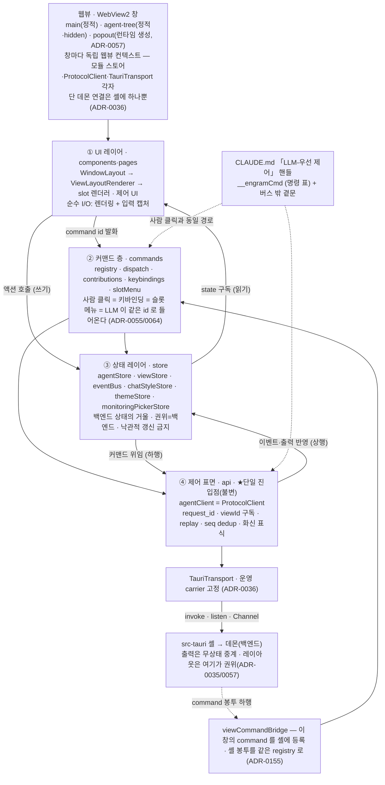
```mermaid
flowchart TD
  WV["웹뷰 · WebView2 창<br/>main(정적) · agent-tree(정적·hidden) · popout(런타임 생성, ADR-0057)<br/>창마다 독립 웹뷰 컨텍스트 — 모듈 스토어·ProtocolClient·TauriTransport 각자<br/>단 데몬 연결은 셸에 하나뿐(ADR-0036)"]
  UI["① UI 레이어 · components·pages<br/>WindowLayout → ViewLayoutRenderer → slot 렌더러 · 제어 UI<br/>순수 I/O: 렌더링 + 입력 캡처"]
  CMD["② 커맨드 층 · commands<br/>registry · dispatch · contributions · keybindings · slotMenu<br/>사람 클릭 = 키바인딩 = 슬롯 메뉴 = LLM 이 같은 id 로 들어온다 (ADR-0055/0064)"]
  BR["viewCommandBridge — 이 창의 command 를 셸에 등록 · 셸 봉투를 같은 registry 로 (ADR-0155)"]
  ST["③ 상태 레이어 · store<br/>agentStore · viewStore · eventBus · chatStyleStore · themeStore · monitoringPickerStore<br/>백엔드 상태의 거울 · 권위=백엔드 · 낙관적 갱신 금지"]
  CS["④ 제어 표면 · api · ★단일 진입점(불변)<br/>agentClient = ProtocolClient<br/>request_id · viewId 구독 · replay · seq dedup · 화신 표식"]
  TT["TauriTransport · 운영 carrier 고정 (ADR-0036)"]
  BE["src-tauri 셸 → 데몬(백엔드)<br/>출력은 무상태 중계 · 레이아웃은 여기가 권위(ADR-0035/0057)"]
  LLM["CLAUDE.md 「LLM-우선 제어」 핸들<br/>__engramCmd (명령 표) + 버스 밖 곁문"]

  WV --> UI
  UI -->|"command id 발화"| CMD
  UI -->|"액션 호출 (쓰기)"| ST
  ST -->|"state 구독 (읽기)"| UI
  CMD --> ST
  CMD --> CS
  BR --> CMD
  ST -->|"커맨드 위임 (하행)"| CS
  CS -->|"이벤트·출력 반영 (상행)"| ST
  CS --> TT
  TT -->|"invoke · listen · Channel"| BE
  BE -.->|"command 봉투 하행"| BR
  LLM -.->|"사람 클릭과 동일 경로"| CMD
  LLM -.-> CS
```

**UI 컴포넌트 트리** — 라우트별 페이지에서 창 레이아웃(`WindowLayout`)을 거쳐 슬롯 렌더러까지. 슬롯은 에이전트 capability로 렌더러를 고른다(출력 종류 가정 안 함).

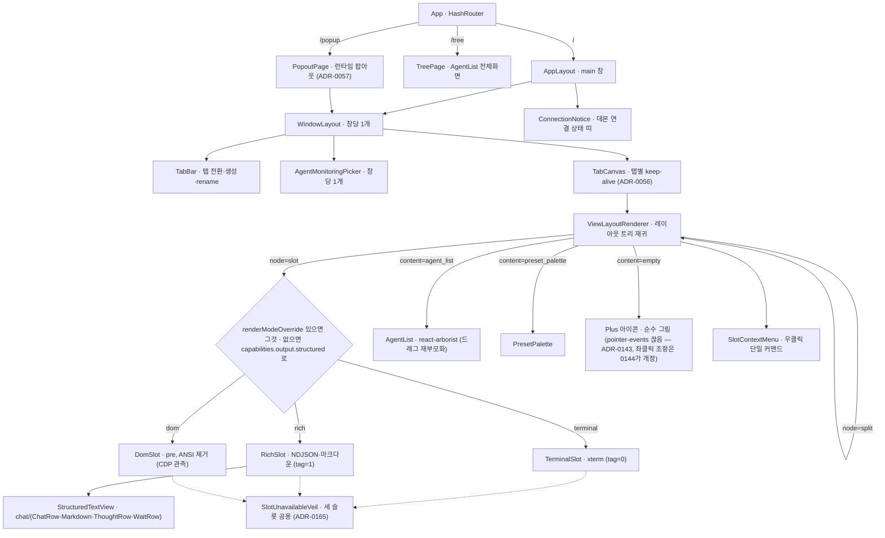
```mermaid
flowchart TD
  App["App · HashRouter"]
  App -->|"/"| AL0["AppLayout · main 창"]
  App -->|"/tree"| TP["TreePage · AgentList 전체화면"]
  App -->|"/popup"| PO["PopoutPage · 런타임 팝아웃 (ADR-0057)"]

  AL0 --> WLnode["WindowLayout · 창당 1개"]
  PO --> WLnode
  WLnode --> TB["TabBar · 탭 전환·생성·rename"]
  WLnode --> AMP["AgentMonitoringPicker · 창당 1개"]
  WLnode --> TC["TabCanvas · 탭별 keep-alive (ADR-0056)"]
  TC --> VLR["ViewLayoutRenderer · 레이아웃 트리 재귀"]
  VLR -->|"node=split"| VLR
  VLR -->|"node=slot"| CAP{"renderModeOverride 있으면 그것 · 없으면 capabilities.output.structured 로"}
  CAP -->|"terminal"| TS["TerminalSlot · xterm (tag=0)"]
  CAP -->|"rich"| RS["RichSlot · NDJSON·마크다운 (tag=1)"]
  CAP -->|"dom"| DS["DomSlot · pre, ANSI 제거 (CDP 관측)"]
  RS --> STV["StructuredTextView · chat/(ChatRow·Markdown·ThoughtRow·WaitRow)"]
  TS -.-> VEIL2["SlotUnavailableVeil · 세 슬롯 공용 (ADR-0165)"]
  RS -.-> VEIL2
  DS -.-> VEIL2
  AL0 --> CN["ConnectionNotice · 데몬 연결 상태 띠"]
  VLR -->|"content=agent_list"| ALa["AgentList · react-arborist (드래그 재부모화)"]
  VLR -->|"content=preset_palette"| PP["PresetPalette"]
  VLR -->|"content=empty"| EMPTY["Plus 아이콘 · 순수 그림 (pointer-events 끊음 — ADR-0143, 좌클릭 조항은 0144가 개정)"]
  VLR --> SCM["SlotContextMenu · 우클릭 단일 커맨드"]
```

- **렌더러 선택:** 1차 축은 `renderModeOverride`고(있으면 caps를 아예 안 본다), 없을 때만 `agent.capabilities.output.structured`로 `RichSlot`/`TerminalSlot`을 가른다. `renderModeOverride`로 terminal·rich·dom 셋 중 무엇이든 강제 가능(프론트 전용 — wire는 이 개념을 모른다). (ADR-0044, 통로 무정제 조항은 0045가 폐기)
- **구독 키 = viewId(슬롯 id)**, agentId 아님 — 같은 에이전트를 두 슬롯에 띄우면 독립 진도 2개. (ADR-0046)
- **구독 수명:** `eventBus`는 `agentClient`의 **추상 구독**만 소유한다. 백엔드가 권위인 표면은 Tauri `listen`을 직접 걸되 **거는 쪽이 자기 disposer를 진다**. ★등록 주체를 세지 말 것★ — 늘어난다. 찾는 법 = `rg "from '@tauri-apps/api/event'" src/`.
- **권위는 백엔드** — 스토어는 거울, 낙관적 갱신 금지. 프론트 전용 예외 = `renderModeOverride` · `chatStyleStore`(ADR-0051) · `monitoringPickerStore`(ADR-0067). ★`themeStore`는 예외가 아니라 **반쯤 셸 소유**★ — 부팅값·`ui.refresh`는 디스크(`ui-settings.json`)가 정하고, 프론트에서 바꾼 값은 저장되지 않아 다음 refresh가 덮는다. (ADR-0035, 탭 소유 모델은 ADR-0057)

결정: 제어표면 단일(agentClient) = ADR-0011 · carrier 고정 = ADR-0036 · 렌더 분기 = ADR-0044 · 뷰 직결 replay = ADR-0046(단 재연결 계기 조항은 ADR-0164가 폐기 — 계기는 권위 명부) · 레이아웃 권위 = ADR-0035(탭 소유 모델은 ADR-0057로 갱신).

### src-tauri = 출력 무상태 라우터 (단, 레이아웃은 여기가 권위다)

**미러 버퍼·per-view 커서는 전부 제거됐다 — 단 그것은 출력 중계 행 한 줄의 이야기다.** Rust는 프레임 헤더만 보고 창별 Channel로 중계한다. 반면 **레이아웃·뷰·탭·슬롯·포커스는 셸이 권위로 소유한다**(`layout::ViewManager`, ADR-0035/0057) — UI 설정(`ui-settings.json`)·트레이·창별 command 버스도 같다. "무상태"는 출력 경로에만 붙는 수식어지 셸 전체의 성질이 아니다.

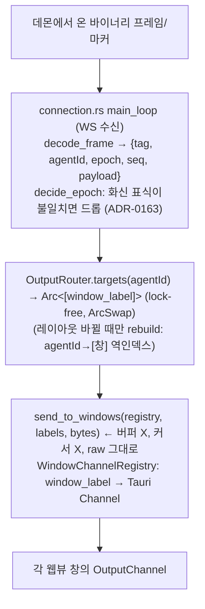
```mermaid
flowchart TD
  IN["데몬에서 온 바이너리 프레임/마커"]
  ML["connection.rs main_loop (WS 수신)<br/>decode_frame → {tag, agentId, epoch, seq, payload}<br/>decide_epoch: 화신 표식이 불일치면 드롭 (ADR-0163)"]
  RT["OutputRouter.targets(agentId) → Arc&lt;[window_label]&gt; (lock-free, ArcSwap)<br/>(레이아웃 바뀔 때만 rebuild: agentId→[창] 역인덱스)"]
  STW["send_to_windows(registry, labels, bytes) ← 버퍼 X, 커서 X, raw 그대로<br/>WindowChannelRegistry: window_label → Tauri Channel"]
  OUT["각 웹뷰 창의 OutputChannel"]

  IN --> ML --> RT --> STW --> OUT
```

- **출력 경로엔 상태 없음:** 진도·dedup·replay는 전부 웹뷰가 소유. Rust는 "누구 프레임을 어느 창으로" 라우팅 + single-flight replay 세대만 관리한다. **레이아웃 상태는 이 행 밖, `layout::LayoutState`에 있다.**
- **replay 세대(single-flight):** 프론트가 `request_replay(agentId)` invoke → Rust가 데몬에 Subscribe 발사(진행 중이면 병합) → 완료 시 **tag=255 마커**를 프레임과 **같은 Channel 경로로** 보냄(순서 보존).
- **프론트 직접 Subscribe 금지:** `forward_daemon_command`가 Subscribe/Unsubscribe를 차단(BLOCK-1). 구독은 layout/replay 경로로만.

결정: 출력 무상태 중계 = ADR-0046 · 프론트 직접 Subscribe 금지 = ADR-0041 · 레이아웃 권위 = ADR-0035/0057 · UI 설정 파일 = ADR-0166/0167.

### 프론트 제어표면 + protocolClient 상태기계

**컴포넌트는 `agentClient` 인터페이스에만 의존하고, 구독 키는 agentId가 아니라 viewId(슬롯 id)다.**

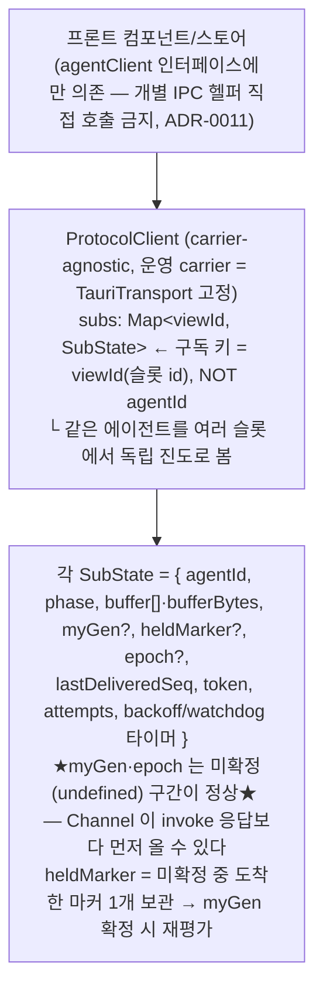
```mermaid
flowchart TD
  FC["프론트 컴포넌트/스토어<br/>(agentClient 인터페이스에만 의존 — 개별 IPC 헬퍼 직접 호출 금지, ADR-0011)"]
  PC["ProtocolClient (carrier-agnostic, 운영 carrier = TauriTransport 고정)<br/>subs: Map&lt;viewId, SubState&gt; ← 구독 키 = viewId(슬롯 id), NOT agentId<br/>└ 같은 에이전트를 여러 슬롯에서 독립 진도로 봄"]
  SS["각 SubState = { agentId, phase, buffer[]·bufferBytes, myGen?, heldMarker?, epoch?,<br/>lastDeliveredSeq, token, attempts, backoff/watchdog 타이머 }<br/>★myGen·epoch 는 미확정(undefined) 구간이 정상★ — Channel 이 invoke 응답보다 먼저 올 수 있다<br/>heldMarker = 미확정 중 도착한 마커 1개 보관 → myGen 확정 시 재평가"]

  FC --> PC --> SS
```

**뷰별 replay 상태기계 (phase):**

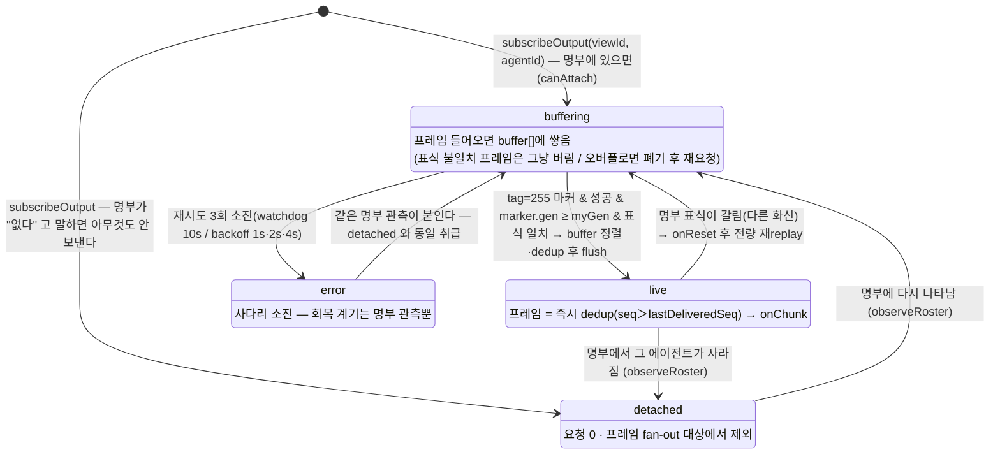
```mermaid
stateDiagram-v2
  [*] --> buffering : subscribeOutput(viewId, agentId) — 명부에 있으면(canAttach)
  [*] --> detached : subscribeOutput — 명부가 "없다" 고 말하면 아무것도 안 보낸다
  detached : detached
  detached : 요청 0 · 프레임 fan-out 대상에서 제외
  buffering : buffering
  buffering : 프레임 들어오면 buffer[]에 쌓음
  buffering : (표식 불일치 프레임은 그냥 버림 / 오버플로면 폐기 후 재요청)
  live : live
  live : 프레임 = 즉시 dedup(seq＞lastDeliveredSeq) → onChunk
  error : error
  error : 사다리 소진 — 회복 계기는 명부 관측뿐

  buffering --> live : tag=255 마커 & 성공 & marker.gen ≥ myGen & 표식 일치 → buffer 정렬·dedup 후 flush
  buffering --> error : 재시도 3회 소진(watchdog 10s / backoff 1s·2s·4s)
  live --> detached : 명부에서 그 에이전트가 사라짐 (observeRoster)
  detached --> buffering : 명부에 다시 나타남 (observeRoster)
  error --> buffering : 같은 명부 관측이 붙인다 — detached 와 동일 취급
  live --> buffering : 명부 표식이 갈림(다른 화신) → onReset 후 전량 재replay
```

- **gen 펜스(핵심):** replay 요청마다 고유 `myGen`(BigInt) 발급. 도착한 마커의 `gen`이 내 `myGen`보다 작으면 **무시**(옛/남의 replay가 dedup 하한선을 오염시키는 것 차단). `gen ≥ myGen`이고 화신 표식이 일치할 때만 buffering→live 전환.
- **팬아웃:** 한 agentId 프레임 → 그 agentId를 보는 **모든 viewId**에 각자 dedup 후 전달.
- **재부착 계기는 소켓이 아니라 권위 명부다(ADR-0164).** 소켓 재연결·remount가 아니라 `observeRoster` 한 곳이 부착·화신 회전·error 회복을 전부 낸다 — 계기가 둘이면 같은 질문에 두 답이 생긴다. 그래서 구독 effect deps는 `[viewId, agentId]`뿐이고 ★표식을 넣지 말 것★ — 넣으면 replay 도착 전에 화면이 지워지고 표식까지 잃어 회전 판정이 못 선다.

결정: 구독 키=viewId·gen 펜스 = ADR-0046(재연결 계기 조항은 ADR-0164가 폐기) · **재부착 계기 = ADR-0164** · 화신 표식 비교 규약 = ADR-0163 · carrier 고정 = ADR-0036 · 제어표면 단일 = ADR-0011.

### 슬롯 렌더 분기

**렌더러 선택보다 앞서는 갈래가 둘이다** — caps가 아직 안 왔나, 에이전트가 명부에서 수거됐나. 그 둘을 지난 뒤에야 override·capability로 렌더러를 고른다(출력 종류를 가정하지 않는다).

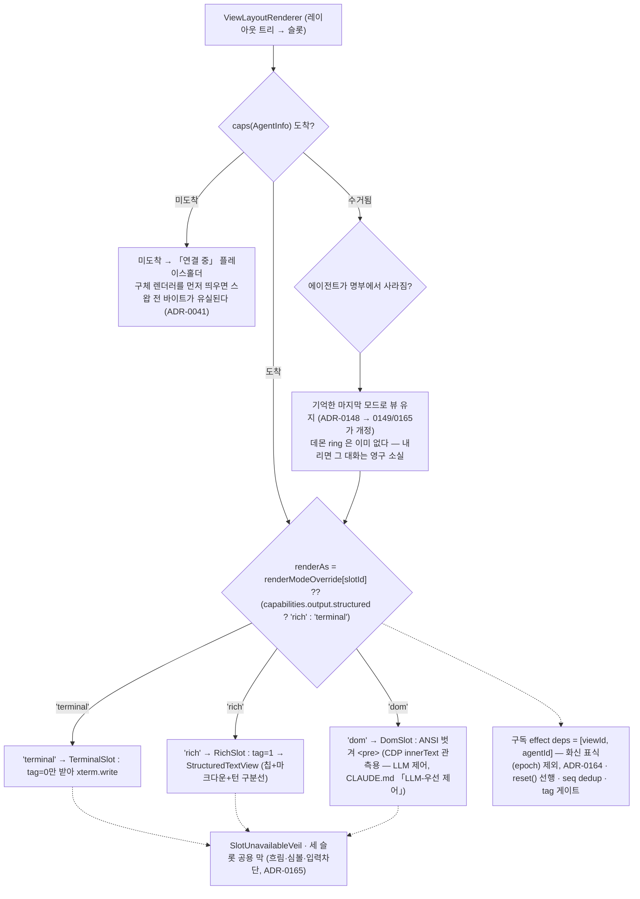
```mermaid
flowchart TD
  VLR["ViewLayoutRenderer (레이아웃 트리 → 슬롯)"]
  CAPS{"caps(AgentInfo) 도착?"}
  PH["미도착 → 「연결 중」 플레이스홀더<br/>구체 렌더러를 먼저 띄우면 스왑 전 바이트가 유실된다 (ADR-0041)"]
  KEPT{"에이전트가 명부에서 사라짐?"}
  KEEP["기억한 마지막 모드로 뷰 유지 (ADR-0148 → 0149/0165가 개정)<br/>데몬 ring 은 이미 없다 — 내리면 그 대화는 영구 소실"]
  MODE{"renderAs = renderModeOverride[slotId] ?? (capabilities.output.structured ? 'rich' : 'terminal')"}
  TS["'terminal' → TerminalSlot : tag=0만 받아 xterm.write"]
  RS["'rich' → RichSlot : tag=1 → StructuredTextView (칩+마크다운+턴 구분선)"]
  DS["'dom' → DomSlot : ANSI 벗겨 &lt;pre&gt; (CDP innerText 관측용 — LLM 제어, CLAUDE.md 「LLM-우선 제어」)"]
  VEIL["SlotUnavailableVeil · 세 슬롯 공용 막 (흐림·심볼·입력차단, ADR-0165)"]
  NOTE["구독 effect deps = [viewId, agentId] — 화신 표식(epoch) 제외, ADR-0164 · reset() 선행 · seq dedup · tag 게이트"]

  VLR --> CAPS
  CAPS -->|"미도착"| PH
  CAPS -->|"도착"| MODE
  CAPS -->|"수거됨"| KEPT
  KEPT --> KEEP --> MODE
  MODE -->|"'terminal'"| TS
  MODE -->|"'rich'"| RS
  MODE -->|"'dom'"| DS
  TS -.-> VEIL
  RS -.-> VEIL
  DS -.-> VEIL
  MODE -.-> NOTE
```

## 엔드투엔드 흐름 (4 시나리오)

### 스폰 (UI 클릭 → 에이전트 생성)

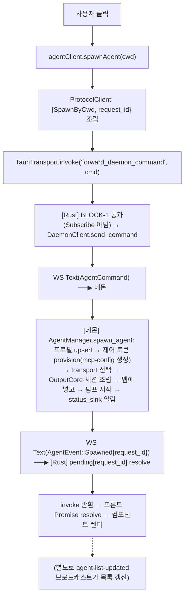
```mermaid
flowchart TD
  S1["사용자 클릭"]
  S2["agentClient.spawnAgent(cwd)"]
  S3["ProtocolClient: {SpawnByCwd, request_id} 조립"]
  S4["TauriTransport.invoke('forward_daemon_command', cmd)"]
  S5["[Rust] BLOCK-1 통과(Subscribe 아님) → DaemonClient.send_command"]
  S6["WS Text(AgentCommand) ──▶ 데몬"]
  S7["[데몬] AgentManager.spawn_agent: 프로필 upsert → 제어 토큰 provision(mcp-config 생성)<br/>→ transport 선택 → OutputCore·세션 조립 → 맵에 넣고 → 펌프 시작 → status_sink 알림"]
  S8["WS Text(AgentEvent::Spawned{request_id}) ──▶ [Rust] pending[request_id] resolve"]
  S9["invoke 반환 → 프론트 Promise resolve → 컴포넌트 렌더"]
  S10["(별도로 agent-list-updated 브로드캐스트가 목록 갱신)"]

  S1 --> S2 --> S3 --> S4 --> S5 --> S6 --> S7 --> S8 --> S9
  S9 -.-> S10
```

### 출력 (에이전트 → 여러 슬롯)

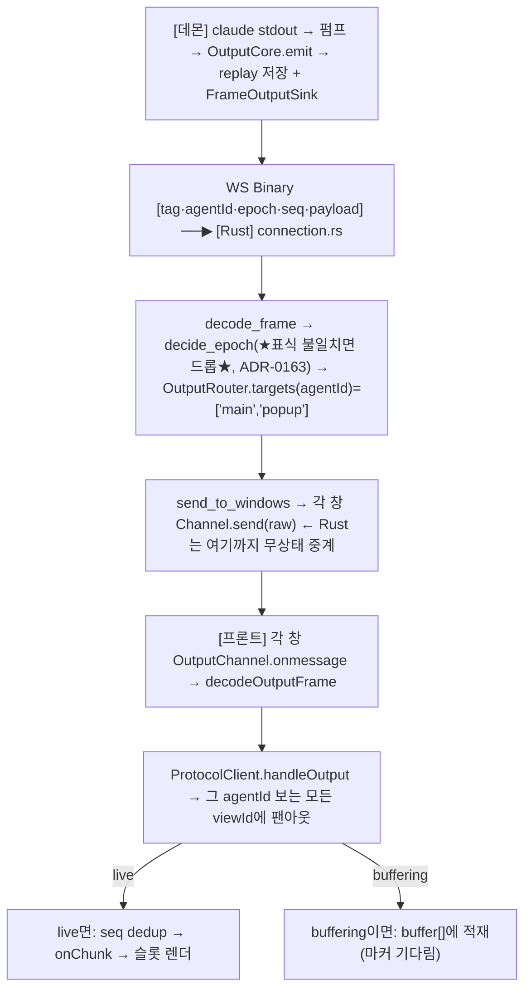
```mermaid
flowchart TD
  O1["[데몬] claude stdout → 펌프 → OutputCore.emit → replay 저장 + FrameOutputSink"]
  O2["WS Binary [tag·agentId·epoch·seq·payload] ──▶ [Rust] connection.rs"]
  O3["decode_frame → decide_epoch(★표식 불일치면 드롭★, ADR-0163) → OutputRouter.targets(agentId)=['main','popup']"]
  O4["send_to_windows → 각 창 Channel.send(raw) ← Rust는 여기까지 무상태 중계"]
  O5["[프론트] 각 창 OutputChannel.onmessage → decodeOutputFrame"]
  O6["ProtocolClient.handleOutput → 그 agentId 보는 모든 viewId에 팬아웃"]
  OL["live면: seq dedup → onChunk → 슬롯 렌더"]
  OB["buffering이면: buffer[]에 적재(마커 기다림)"]

  O1 --> O2 --> O3 --> O4 --> O5 --> O6
  O6 -->|"live"| OL
  O6 -->|"buffering"| OB
```

### 리로드 → 재구독 + 전체 replay

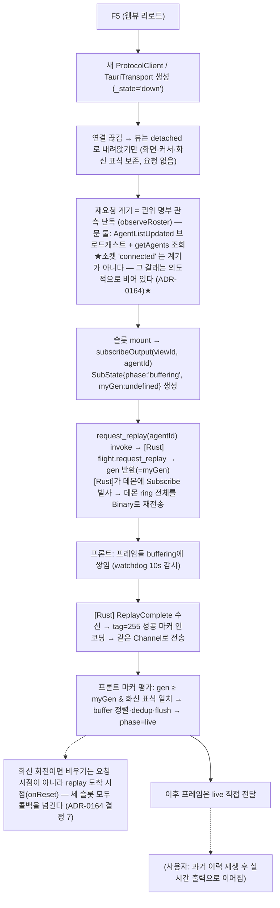
```mermaid
flowchart TD
  R1["F5 (웹뷰 리로드)"]
  R2["새 ProtocolClient / TauriTransport 생성 (_state='down')"]
  R3["연결 끊김 → 뷰는 detached 로 내려앉기만 (화면·커서·화신 표식 보존, 요청 없음)"]
  R3b["재요청 계기 = 권위 명부 관측 단독 (observeRoster) — 문 둘: AgentListUpdated 브로드캐스트 + getAgents 조회<br/>★소켓 'connected' 는 계기가 아니다 — 그 갈래는 의도적으로 비어 있다 (ADR-0164)★"]
  R4["슬롯 mount → subscribeOutput(viewId, agentId)<br/>SubState{phase:'buffering', myGen:undefined} 생성"]
  R5["request_replay(agentId) invoke → [Rust] flight.request_replay → gen 반환(=myGen)<br/>[Rust]가 데몬에 Subscribe 발사 → 데몬 ring 전체를 Binary로 재전송"]
  R6["프론트: 프레임들 buffering에 쌓임 (watchdog 10s 감시)"]
  R7["[Rust] ReplayComplete 수신 → tag=255 성공 마커 인코딩 → 같은 Channel로 전송"]
  R8["프론트 마커 평가: gen ≥ myGen & 화신 표식 일치 → buffer 정렬·dedup·flush → phase=live"]
  R8b["화신 회전이면 비우기는 요청 시점이 아니라 replay 도착 시점(onReset) — 세 슬롯 모두 콜백을 넘긴다 (ADR-0164 결정 7)"]
  R9["이후 프레임은 live 직접 전달"]
  R10["(사용자: 과거 이력 재생 후 실시간 출력으로 이어짐)"]

  R1 --> R2 --> R3 --> R3b --> R4 --> R5 --> R6 --> R7 --> R8 --> R9
  R8 -.-> R8b
  R9 -.-> R10
```

> S16의 "리로드 시 새 창 replay 미검증" 열린 이슈는 **해소됐다** — StrictMode 이중구독 버퍼 유실 수정(`ca3f325`) + 뷰 직결 replay(ADR-0046) 구현·QA 통과로 원인이 제거됐다 — 단 그 뒤 같은 경로에서 결함이 두 번 더 났다(겹친 `request_id`로 연결이 끊긴 건 2026-08-18 · 거절당한 구독이 슬롯을 못 풀어 출력이 두절된 건 2026-08-19). 각각 `daemon_client_pending`·`daemon_client_replay`가 회귀망이다.

### 메시지 (에이전트 A → 에이전트 B)

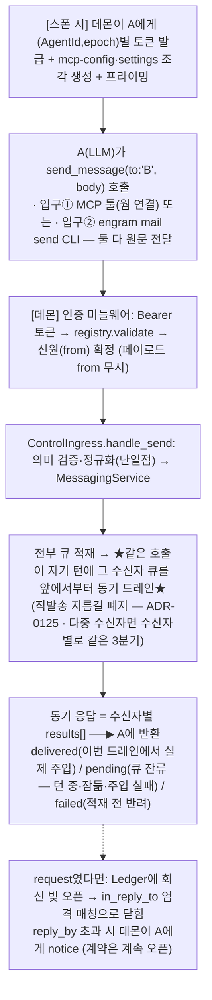
```mermaid
flowchart TD
  M1["[스폰 시] 데몬이 A에게 (AgentId,epoch)별 토큰 발급 + mcp-config·settings 조각 생성 + 프라이밍"]
  M2["A(LLM)가 send_message(to:'B', body) 호출<br/>· 입구① MCP 툴(웜 연결) 또는 · 입구② engram mail send CLI — 둘 다 원문 전달"]
  M3["[데몬] 인증 미들웨어: Bearer 토큰 → registry.validate → 신원(from) 확정 (페이로드 from 무시)"]
  M4["ControlIngress.handle_send: 의미 검증·정규화(단일점) → MessagingService"]
  M5["전부 큐 적재 → ★같은 호출이 자기 턴에 그 수신자 큐를 앞에서부터 동기 드레인★<br/>(직발송 지름길 폐지 — ADR-0125 · 다중 수신자면 수신자별로 같은 3분기)"]
  M6["동기 응답 = 수신자별 results[] ──▶ A에 반환<br/>delivered(이번 드레인에서 실제 주입) / pending(큐 잔류 — 턴 중·잠듦·주입 실패) / failed(적재 전 반려)"]
  M7["request였다면: Ledger에 회신 빚 오픈 → in_reply_to 엄격 매칭으로 닫힘<br/>reply_by 초과 시 데몬이 A에게 notice (계약은 계속 오픈)"]

  M1 --> M2 --> M3 --> M4 --> M5 --> M6
  M6 -.-> M7
```

> **읽는 법:** M1~M7 **전부 구현돼 있다**. B가 잠들어 있거나(프로필만 있음) 턴 중이면 메시지는 보관함에서 기다렸다가 B가 받을 수 있게 될 때 들어간다. 단 **B라는 이름이 어디에도 없으면 파킹이 아니라 그 자리에서 반려**고, 자리가 없어도 반려되며, 오래 못 나간 파킹분은 TTL로 만료되고, **데몬이 재시작하면 보관분은 사라진다**(인메모리). M5의 3분기 규칙·방송(@) 확장은 [에이전트 간 메시징](#에이전트-간-메시징-브로커--s18)에 한 번만 적혀 있다.

## seam (교체점)

**seam = trait로 끊은 교체 경계.** 코어는 이 뒤를 안 보므로 구현만 갈아끼우면 새 전송·백엔드·제어 경로가 흡수된다. ★**개수를 세지 말 것 — 늘어난다**★(옛 문장의 "5대"는 적힌 그 시점에 이미 틀렸고, 그 뒤 `command`·`net` crate 신설이 더 얹었다 — 새 숫자를 대신 박아도 같은 길로 썩는다). 아래는 **핵심 발췌**이고, 전수는 `rg "pub trait" crates/`가 낸다. 맨 아래 `(프론트) transport`만 코어 밖 가문이다.

| seam(trait) | 무엇을 끊나 | 성격 | 현재 구현 | 미래 확장 |
|-------------|-------------|------|-----------|-----------|
| `AgentTransport` | 전송 방식(물리) | 출력·입력 손발 | PtyTransport / StdioTransport | ApiTransport(골격만 · 미배선 — HTTP 코드 0줄) / 원격 transport |
| `AgentBackend` | 백엔드 프로그램(claude 인자·스키마 + 턴 분류 — `TurnClassifier`는 `OutputCore::new` 필수 인자로 이 seam 뒤에 산다, ADR-0127) | spawn 순간 | ClaudeBackend / ShellBackend | CodexBackend·GeminiBackend(골격만 · 미배선 — CLI 미실측이고 `AgentCommand`에 variant 자체가 없다) |
| `OutputSink` | 출력이 나가는 wire | data plane 출구 | 데몬 FrameOutputSink(`agent_conn`) / 테스트 sink | 새 전송 경로 |
| `StatusSink` | 상태·목록 알림 | control plane 출구 | 데몬 broadcast | — |
| `ControlChannel` (S17) | 인바운드 제어 엔드포인트 | spawn=provision · terminal=revoke | DaemonControlChannel(MCP) / NoopControlChannel | 새 입구·명령 |
| (프론트) transport | carrier | 코어 밖·별개 | TauriTransport 고정 | WsTransport(테스트/직결) |

- **`ControlChannel`의 성격이 다른 이유:** 나머지 코어 seam이 *출력·상태를 코어 밖으로 흘리는* 출구라면, `ControlChannel`은 *에이전트가 되전화할 인바운드 엔드포인트를 스폰 때 세우고 종료 때 거두는* 생명주기 seam이다. 코어는 `ControlEndpoint`(url·token·config 경로 문자열)만 나르고 rmcp/axum/HTTP를 모른다(ADR-0003 idiom 동형).
- **코어 안 나머지:** `AgentCommandHost`·`RosterChanged`(명령 버스가 `AgentManager` 전체 대신 좁게 잡는 주입점 — ADR-0155) · `PresetStore`·`ProfileStore`(영속 교체점).
- **신설 crate가 들인 seam:** `command` = `CommandLink`·`InboundCommands`·`OwnerLookupSource`·`CommandHandler`(ADR-0155) · `net` = `FrameSink`·`FrameFanout`·`ConnectionHandler`·`ConnectionHandlerFactory`(ADR-0129). 둘 다 워크스페이스 crate 의존 0이 벽이고, **`core`가 `command`를 의존한다 — 코어의 첫 워크스페이스 의존이다.**
- **메시징 포트는 이 표에 없다 — 다른 가문이다.** 위 표는 *코어*가 소유한 seam이고, `DeliveryPort`·`ControlPlanePort`·`FlushTrigger`·`BusyGate`·`TurnFacts`·`IdleNotifier`·`DeliveryObserver`·`GroupSource`는 *메시징 커널 lib*이 소유한 포트다(구현은 데몬 `messaging_host.rs` · **명단을 세지 말 것 — 정본은 `rg "pub trait" crates/engram-dashboard-messaging/src/`**). 옛 `TapHost` 포트는 ADR-0127이 폐지했다 — 턴 관측 명단은 코어로 올라갔다. 방향은 같은 idiom(정책이 실물을 모른다)이지만 소유자와 crate가 다르므로 섞지 않는다. 상세는 [에이전트 간 메시징](#에이전트-간-메시징-브로커--s18).

**설계 지향(CLAUDE.md 「LLM-우선 제어」):** UI 컴포넌트는 store 액션 호출만, 그 액션을 LLM도 동일하게 부르는 단일 control surface로 모은다.
- **백엔드 제어 — "누가" 제어하나로 갈린다.** ① 스폰·kill·write 등은 **클라이언트 제어 표면(invoke)** 으로 LLM 제어 가능(앱을 부리는 주체 경로). ② 워커(child 에이전트)도 제어 채널로 **우편 말고 제어를 함께 쥔다** — ★"메시징 2툴만"이 아니다★. 실제 표면은 셋이다:
  - **MCP 툴 3종** — `send_message`(발송) · `messages`(조회) + 진단 `engram_ping`. 여기까지가 MCP가 내는 전부다(`group` 툴은 ADR-0111이 폐지).
  - **`agent` 계열 5동사**(`/control/agent` — `list`·`spawn`·`new`·`rename`·`move`). ★**형제 스폰이 여기 든다**★ — 있는 에이전트 깨우기와 새로 만들어 띄우기 둘 다다. **짝이 되는 MCP 툴을 의도적으로 두지 않아** CLI(`engram agent …`)로만 나가고, 이 라우트는 **스폰 모드와 무관하게 전원 개방**이다(제어는 빈도가 낮아 상주 연결이 아깝다 — ADR-0132 결정 5·6). 입구가 capability로 갈리는 것은 **우편 축뿐**이고 그쪽 거절은 데몬이 자격증명으로 한다(ADR-0133).
  - **전체 이름 호출**(`/control/commands` 발견 + `/control/call` 호출 — ADR-0160/0161). 데몬 자기 표(`agent.*`)뿐 아니라 **붙어 있는 클라이언트가 등록한 창·탭·슬롯 명령까지** 같은 입구로 닿는다. 즉 에이전트는 형제와 함께 **화면 레이아웃도** 부린다.

  ★어느 표면에도 없는 것은 `kill`·`rm` 둘뿐이고, 그것도 미구현이 아니라 **보류된 결정**이다★ — 트리에서 지우는 것이 에이전트의 생을 끝내는가(ADR-0122)가 코드와 아직 어긋나 있어 얹지 않았다. 그 조항의 정본은 `CLI_AGENT_VERBS` 주석이다. ★따라서 이 자리를 "least-privilege라서 형제를 못 건드린다"로 읽지 말 것★ — 그 서술은 MCP가 유일한 입구였던 시절(ADR-0086)의 잔재다.
- **UI/레이아웃 제어 = 구현 완료.** ADR-0081의 결정 1·2는 **ADR-0155(통합 command 버스)** 가 대체했다 — 선언은 생산자 옆, 배달은 홉마다 같은 3단계, 명부는 런타임 등록만. 실물 = `src-tauri/src/layout/commands.rs`(창·탭·슬롯 선언) + 인바운드 수신기 + 프론트 `src/commands/`(registry/dispatch/contributions + 버스 다리)와 `window.__engramCmd`(ADR-0055/0064 — 0055의 곁문 유지 조항은 0169가, 0064의 메뉴 스키마는 0065/0140이 부분 폐기). ★**"없으니 만들어야 한다"고 읽고 두 번째 표면을 짓지 말 것**★ — CLAUDE.md 「LLM-우선 제어」가 정본이고, 남은 갭의 명단도 거기가 갖는다(여기 베끼지 않는다 — 낡은 명단은 없는 갭을 지키게 만든다).

## 핵심 불변식 (서버 + 클라이언트)

**변경 금지.** 정본은 CLAUDE.md 「핵심 불변식 (변경 금지)」이고 어긋나면 CLAUDE.md가 이긴다.

**이 절은 한자리 점검표다** — 흩어져 있는 불변식을 *한 번에 훑기* 위해 있고, 각 줄은 **지켜야 할 것 + 근거 ADR**만 남긴다. *왜·어떻게*는 PART 2가 이미 그림과 함께 펴 놓았으므로 여기서 다시 적지 않고 그 절로 링크한다. 링크가 없는 줄은 이 자리가 그 조항의 유일한 서술이라는 뜻이다.

- **kill 2동사:** `transport.shutdown()` → `core.join_pump(5s)`, **순서 뒤집으면 hang**. ★두 동사를 한 동사로 합치지 말 것★ (ADR-0001 · 인과 전개 = [죽음 흐름](#죽음-흐름-종료--정리))
- **finalize 1회:** `OutputCore.finalized.swap(AcqRel)` — terminal 전이·알림 정확히 1회, **pump 단독**. (ADR-0005 · [죽음 흐름](#죽음-흐름-종료--정리))
- **등록 순서:** sessions insert가 pump 시작보다 **먼저**. (ADR-0019 · [죽음 흐름](#죽음-흐름-종료--정리))
- **락 순서:** sessions RwLock은 Arc clone 후 즉시 해제 → 그 뒤 내부 접근. status lock 보유 중 외부 호출 금지. emit은 subscribers 스냅샷 후 락 미보유 send. **subscribe만 예외로 두 락을 순서대로 잡는다 — `subscribers` → `replay`**(그 보유 중 replay를 내보내 replay→live 역전을 막는다. 프론트 seq dedup이 나머지 절반이다). ★데드락 부재는 "어느 락을 쥐었나"가 아니라 **취득 순서**에 달려 있다 — 순서를 빼면 이 예외가 왜 안전한지가 사라진다★. (ADR-0006 · emit 쪽 = [출력 흐름](#출력-흐름-메인-claude--앱))
- **상태 알림 분담:** 과도기 `Exiting`=manager, terminal(`Killed`/`Exited`/`Failed`)=pump 단독. ★프론트는 `status_changed`로 terminal 판정 금지★ → `agent-list-updated`로 판정. (ADR-0005 · [죽음 흐름](#죽음-흐름-종료--정리))
- **sink 2평면:** `OutputSink`(고빈도·구독단위 출력 = data plane) ≠ `StatusSink`(저빈도·전역 상태/목록 = control plane). (ADR-0003/0005 · [seam](#seam-교체점))
- **턴 관측 정리 = 두 지점뿐:** `OutputCore::finish` + `emit`의 finalize 재확인. ★세 번째 호출자를 늘리지 말 것 — 인과가 갈라진다★. 명단은 코어 소유, 분류는 `backend` seam 뒤, 데몬은 중계만. (ADR-0127 · 승격 전 = 0113 · 빠뜨리면 무엇이 막히나 = [에이전트 간 메시징](#에이전트-간-메시징-브로커--s18))
- **화신 표식(필드명은 아직 `epoch`):** 화신마다 새로 뽑는 32비트 난수 · **비교는 일치/불일치만** · 발급 단일점 = `ProfileRegistry::epoch_for_spawn` · 디스크는 읽기 건너뜀·쓰기 `0` 자리채움(★이 비대칭은 의도★). (ADR-0163 · 규약 전문 = [§용어 사전](#용어-사전-혼동쌍-고정))
- **재부착 계기 = 권위 명부 관측 단독:** 소켓 전이가 아니다. 끊기면 뷰는 `detached`로 내려앉기만 하고 화면·커서·표식을 보존한다. 구독 effect deps = `[viewId, agentId]` — ★표식을 넣지 말 것★. (ADR-0164 · [프론트 제어표면](#프론트-제어표면--protocolclient-상태기계))
- **소유권 분할:** transport=master/writer/child/shutdown/job · core=subscribers/replay/seq/status/finalized/drain_handle · session=id/cwd/epoch/cols/rows. ([core 클래스 구조](#core-클래스-구조-소유-관계))
- **freeze-frame 수거:** 사망 순간의 intent·shutting_down을 얼려 판정 → 크래시↔kill 오분류 경쟁 차단. (ADR-0019 · [죽음 흐름](#죽음-흐름-종료--정리))
- **시체 보존:** 어떤 종료도 프로필을 지우지 않는다 — 전부 `KeepDisableAutoRestore`, 삭제는 명시적 `DeleteProfile`뿐. (ADR-0083 · [죽음 흐름](#죽음-흐름-종료--정리))
- **활성화 = resume 전용:** fresh fallback 폐지 — resume가 실패해도 새 세션을 만들지 않는다. (ADR-0082 · 종점이 어느 축에 서나 = [세션 복원](#세션-복원--활성화-resume-전용--adr-0082))
- **제어 토큰 수명 = (AgentId, 화신 표식):** 화신 회전·kill = 즉시 폐기 · `from`은 토큰에서만 파생(사칭 차단) · stale revoke는 현재 표식이 일치할 때만. (ADR-0086/0084/0163 · [인증](#인증--신원은-토큰에서만-나온다))
- **봉투 단일 wrap point:** `wrap_message`/`wrap_notice` 두 함수에만 있고, 조립 시점은 park이 아니라 **주입**이다. (ADR-0086/0096/0103 · [봉투 조립](#봉투는-주입-시점에-딱-한-곳에서-조립한다))
- **`delivered` = 실제 주입 시점:** busy는 **관측된 사실**일 때만 참(모르면 idle = 즉시 주입). (ADR-0104 · 동기 드레인 재확립 = 0125 · [배달 3분기](#배달-3분기--배달--파킹--반려))
- **메시징 커널은 워크스페이스 crate를 모른다:** 접합은 커널 소유 포트 trait으로만 — 컴파일 에러 = 설계된 멈춤. (ADR-0110 · [구조](#구조--커널-lib--데몬-어댑터-adr-0110))
- **백엔드 격리:** claude 전용 인자·JSON 스키마는 `backend/claude.rs`에만. session=encoder 태그만, transport=스키마 모르는 "바보 파이프". (ADR-0004 · [seam](#seam-교체점))
- **capability 합성:** `Capabilities::compose(transport, backend)` — input/output/control은 transport, session/model은 backend가 소유(타입으로 강제). (ADR-0002/0030 · [seam](#seam-교체점))

## ADR 근거 맵 (더 파려면 여기)

> **인덱스가 정본이다**(`docs/decisions/README.md`) — 전수 목록도 폐기 도장도 거기가 갖는다. 개수를 세지 않는다.

**여기 손으로 베낀 색인을 두지 않는다.** 베낀 목록은 인덱스보다 먼저 낡고, 낡은 목록은 폐기된 결정을 살아 있는 근거처럼 보이게 한다. 이 문서가 기댄 ADR은 **각 절이 그 자리에서** 인용하므로(대개 절 끝 `결정:` 줄이지만 본문 안에만 있는 것도 많다) 절을 읽으면 근거가 따라온다 — 번호로 거슬러 찾을 땐 `rg "ADR-0NNN" docs/reference/`.

남기는 것은 아래뿐이다 — **어느 흐름 그림에도 걸리지 않아 `결정:` 줄이 인용할 자리가 없지만**, 이 문서 전체의 모양을 정한 진입점들.

- **0012 — 모듈 격리·TDD.** 모든 모듈이 외부 의존을 seam으로 끊고 단독 검증된다는 전제. 이 문서의 [seam 지도](#seam-교체점)와 crate별 격리 게이트가 전부 여기서 나온다.
- **0151 — crate 분리 판정 기준 = "독립적으로 쓸 수 있는가".** [crate 계층](#crate-계층-의존-아래위)이 왜 지금 모양인지, 다음 분리를 언제 할지의 기준(ADR-0130의 판정 기준을 대체).
- **0171 — 상태의 거처는 "누가 보나 · 언제까지 사나"로 정한다.** PART 1 [소유권 지도](#상태는-누가-갖나--소유권-지도)의 각 행이 왜 그 소유자로 갔는지의 규칙.

## 용어 사전 (혼동쌍 고정)

이 문서(및 프로젝트)에서 자주 뒤섞이는 이름을 못박는다. 헷갈리면 여기로 돌아온다.

**프로세스·창 3층 (맨 자주 헷갈림):**
- **에이전트(agent)** = claude(추후 codex/API) 프로세스. 우리가 관리하는 대상. "에이전트 재시작" = **화신 교체**(표식 재발급).
- **클라이언트(client)** = src-tauri 셸(앱 exe). 데몬에 붙는 손님. "클라이언트 재시작" = 앱 창 재실행.
- **데몬(daemon)** = 에이전트 호스팅 서버(`engram-dashboard-daemon.exe`). 생사·출력·상태의 주인. "데몬 재시작" = 서버 프로세스 교체.
- **웹뷰(webview)** = 창(WebView2). **프론트 컴포넌트** = 웹뷰 안 React 부품. **슬롯(slot)** = 레이아웃 한 칸(viewId).

**전송·백엔드:**
- **transport(전송)** = 물리 연결(PTY/파이프/WS). **backend(백엔드)** = 프로그램 지식(claude 인자).
- **OutputSink**(출력 출구, 고빈도) ≠ **StatusSink**(상태 출구, 저빈도).
- **`ControlChannel`(제어 seam, S17)** = 에이전트가 되전화할 인바운드 엔드포인트를 세우고 거두는 seam. 위 두 출구 sink와 방향이 반대(인바운드).

**출력·복원:**
- **replay** = 데몬 ring 되감기(리로드·신규구독 복원). **gen 펜스** = 옛/남의 replay 무시하는 세대 검사.
- **epoch**(필드명 · 뜻은 「화신 표식」) = 화신마다 새로 뽑는 **32비트 난수**. 낡은 프레임·지각한 사망 메시지·죽은 신원의 토큰을 거르는 기준이고, **이 문서에서 표식을 말하는 모든 자리가 이 정의를 쓴다** — 다른 절은 여기를 가리킬 뿐 규약을 다시 적지 않는다. (전부 ADR-0163)
  - ★**카운터가 아니다 — 비교는 일치/불일치만이고 대소로 「더 새 것」을 유도하지 않는다**★. 난수라 순서가 없다: 대소로 지각 신호를 거르던 옛 방식은 난수로 바뀐 뒤 **절반의 확률로 그냥 통과했다**.
  - 보장은 **직전 화신과 다르다**는 인접 보장 하나뿐. 발급 단일점 = `ProfileRegistry::epoch_for_spawn`.
  - **디스크는 비대칭이다 — 읽기는 건너뛰고 쓰기는 `0` 자리채움**(앞 릴리스 리더 보호). ★이 비대칭은 의도★ — 그래서 `agents.json`에 적힌 값은 신원이 아니다.
  - 프론트 구독 effect deps에는 넣지 않는다(ADR-0164).
- **화신(incarnation)** = 한 AgentId 아래에서 프로세스가 새로 서는 사건. 옛 문서의 "epoch 교체"가 이것이다. 소비자 가드 = reap epoch-guard·제어 채널 토큰·턴 관측 표·프론트 재부착 회전 판정.
- **권위 명부(roster)** = 데몬이 말하는 "지금 있는 에이전트" 목록. 재부착 계기의 단일 출처다(소켓 상태가 아니다 — ADR-0164).
- **detached** = 연결이 끊겨 파이프만 사라진 뷰 상태. 화면·진도 커서·화신 표식을 그대로 들고 아무 요청도 내지 않는다.
- **freeze-frame** = 사망 순간의 판정 재료(intent·shutting_down)를 얼려 나중 오분류 차단.

**생명주기(S17):**
- **활성화(activate)** = 종료된 에이전트를 그 session_id로 **resume(이어받기)** 하는 것. fresh(새 대화)는 안 만든다(ADR-0082).
- **시체(corpse)** = 종료됐지만 프로필·session_id가 보존된 에이전트(auto_restore off). 목록에 남는 게 정상(ADR-0083).

**제어 채널(S17) · 메시징(S18):**
- **제어 채널(control channel)** = 에이전트↔에이전트 메시지의 **입구**(에이전트→데몬 MCP/HTTP). 기존 출력/입력 경로와 별개의 인바운드.
- **send_message** = 발송 명령(조회는 `messages`). MCP 툴은 이 둘뿐 — `group` 관리 툴은 폐지됐다(ADR-0111). 입구 = MCP 툴 또는 `engram mail send` CLI.
- **토큰((AgentId,epoch))** = 발신자 신원의 단일 출처. 페이로드 from은 무시(사칭 차단).
- **보관함(Mailbox)** = 지금 못 넣는 메시지를 데몬이 들고 있는 수신자별 **유계 2레인** 큐(메시지/통지, 인메모리 — ADR-0107, 상한은 0114).
- **파킹(parking)** = 그 큐에 넣어 두는 것(상태 = `pending`).
- **flush(도어벨)** = 큐에 쌓인 것을 오래된 순으로 주입하는 것. 방아쇠 = **발송 자신의 동기 드레인**(주 경로 — ADR-0125) · 등장 · 턴 종료(idle 진입). 주기 sweep은 여기 안 든다.
- **sweep** = TTL 만료분을 걷고 기한 넘긴 request의 notice를 발행하는 주기 작업(배달 재시도가 아니다).
- **idle 게이트** = 수신자가 턴 중이면 주입을 미루는 규칙(busy는 관측된 사실일 때만 참).
- **장부(Ledger)** = 메시지 이력 + request 회신 빚 + 수신자별 배달 행(다중 수신자 발송 = 메시지 1건 : 행 N건).
- **봉투(envelope)** = 수신 LLM이 보는 `<message>` / `<notice>` 텍스트.
- **방송(@here / @all)** = 발송 순간 명단을 펼치는 주소록 확장. 사용자 정의 그룹·전용 배달 규칙은 폐지됐고, 펼쳐진 멤버는 개인 편지와 같은 경로를 탄다(ADR-0111, 부분 폐기 by 0117/0121). 둘의 명단 차이는 ADR-0121.
- **skipped** = ★뜻이 갈아끼워진 어휘★ — 옛 뜻(그룹 멤버 skip)은 폐지됐고, 지금은 **notice 레인 초과로 은퇴된 통지**를 가리킨다(ADR-0111 결정 4).
- **메시징 커널** = `engram-dashboard-messaging` lib(정책). 데몬 `messaging_host.rs` = 그 포트에 실물을 꽂는 어댑터·조립실.

**명령 버스(S20):**
- **명령 버스(command bus)** = 선언은 생산자 옆, 배달은 홉마다 같은 3단계, 명부는 런타임 등록만(ADR-0155, 부분 폐기 by 0150: 주인 토큰 산출). 도구 crate = `engram-dashboard-command`(워크스페이스 의존 0·명령 0개), 프론트 대응 = `src/commands/` + `window.__engramCmd`.
