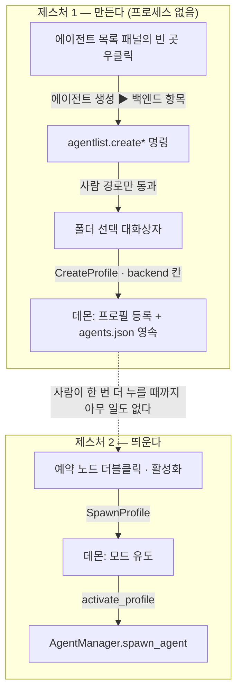
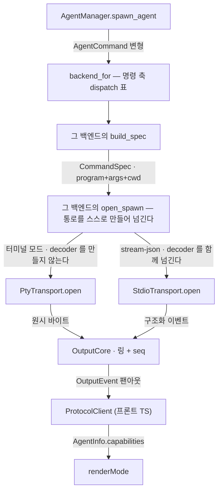
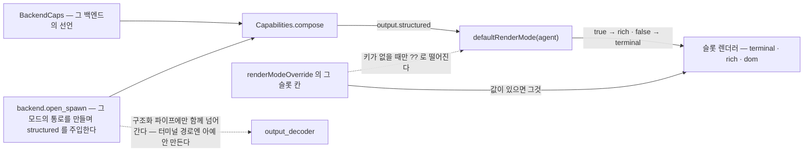
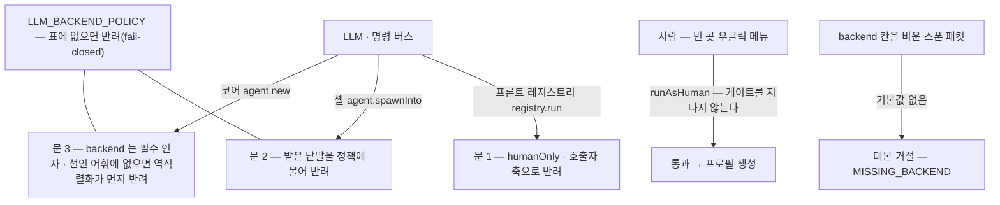

# 에이전트 백엔드 구조

> **실시간 설명 문서다.** 물어볼 때마다 답을 여기 적어 넣는다 — 완성본을 겨냥하지 않고, 제대로 정리하는 것은 사용자가 요청할 때 한다.
>
> **재사용 부품이다.** 브리핑·덱·TRD 가 여기를 **가리키고 베끼지 않는다** — 같은 그림을 두 곳에 두면 한쪽이 조용히 낡는다.
>
> **진화형 캐논이라 제자리 수정한다.** step 스냅샷이 아니다 — 코드가 움직이면 이 파일을 고친다.
>
> **주제는 확장 축이지 벤더가 아니다.** 셋째 백엔드는 **파일이 아니라 열 하나가 는다** — 새 파일을 만들지 말고 아래 (B) 의 표에 열을 더한다.
>
> **기준 스탬프:** 브랜치 `v0.3.0/feat/codex-backend` · 코드 실측 2026-09-08 · 범위 = codex Phase 1(띄우기까지).
>
> ★**근거 앵커는 파일·심볼 이름까지만 적는다**★ — 줄번호를 적으면 인용될 때마다 낡는다(실증: TRD §2.5 의 그림 7 장이 착지 하루 만에 낡았다).

**전체 그림** = `docs/reference/architecture-overview.md`

---

# (A) 백엔드 중립 척추

에이전트를 띄우는 배관은 하나다. claude 든 codex 든 gemini 든 **같은 파이프를 타고**, 백엔드마다 다른 것은 그 파이프 입구에 무엇을 밀어 넣느냐뿐이다. 그래서 아래 네 절은 **백엔드 이름이 나오지 않아도 성립한다** — 새 백엔드가 들어와도 이 절은 한 줄도 바뀌지 않고, 바뀌는 것은 (B) 의 표뿐이다.

## 두 제스처 — 만들기와 띄우기가 갈려 있다

에이전트를 **만드는 것**과 실제로 **프로그램을 띄우는 것**은 클릭 두 번으로 갈려 있다. 첫 클릭은 폴더를 고른 뒤 명부에 「예약」 항목만 적어 둘 뿐이라 이 시점에는 프로세스가 없다. 트리에 뜬 그 예약 노드를 더블클릭하거나 「활성화」를 눌러야 비로소 실제 CLI 가 뜬다. 갈라 둔 이유는 **폴더를 고르는 일과 프로그램을 띄우는 일이 서로 다른 실패를 하기** 때문이다 — 붙여 두면 폴더를 잘못 골랐을 때 프로세스까지 함께 치워야 한다.

우클릭 자리는 **에이전트 목록 패널의 빈 곳(pane 배경)** 이고 **행 우클릭 메뉴가 아니다.** 행을 우클릭하면 행 메뉴가 이겨서 상위 슬롯 메뉴가 아예 뜨지 않으므로(ADR-0064), 이 구분을 뭉개면 메뉴를 못 찾는다.

**앵커** — `src/commands/agentCommands.ts`(`registerSlotMenu('agent_list', …)` · createReserved) · `src/components/agent/AgentList.tsx`(파일 헤더의 버블 규칙 · `onContextMenu` 의 `stopPropagation` · activateReserved) · `crates/engram-dashboard-daemon/src/connection_core.rs`(CreateProfile · SpawnProfile 처리)

## 스폰 사슬 — CLI 한 줄이 슬롯에 닿기까지

「어느 프로그램을 어떤 인자로 띄우나」를 아는 코드는 백엔드별 폴더 하나에 갇혀 있다. 그 폴더가 명령줄 한 벌을 만들어 넘기면, 그 아래로는 아무도 백엔드를 모른다 — 통로(transport)는 바이트만 나르고, 코어는 그 바이트에 번호를 붙여 링에 쌓고, 데몬은 구독자에게 뿌리고, 프론트는 받아 그린다. **백엔드 이름이 실제로 적히는 자리는 등록부와 두 개의 갈림 표뿐이다.**

★**「백엔드 전용 코드는 `build_spec` 안에서 끝난다」고 적지 말 것 — 거짓이다**★. 같은 파일이 `assigns_session_id`·`can_resume_stored_session`·`supports_control_channel`·`accepts_mcp_config`·`writes_mcp_config_file`·`reads_messages`·`uses_mail`·`capabilities` 도 선언하고, 백엔드에 따라 `transport_shape`·`output_decoder` 까지 선언한다. 끝나는 것은 그 **함수**가 아니라 그 **폴더**다(ADR-0004).

**앵커** — `crates/engram-dashboard-agent/src/backend/mod.rs`(파일 헤더 · backend_for · backend_for_encoder · `open_spawn` 기본값과 `SpawnParts` · 트립와이어) · `crates/engram-dashboard-agent/src/backend/claude/mod.rs`(`open_spawn` — 통로 실물이 갈리는 유일한 자리) · `crates/engram-dashboard-agent/src/transport/pty.rs`

## 렌더 분기 — override 가 먼저, 그다음 capability

슬롯에 무엇을 그릴지는 두 층으로 정해진다. **먼저** 그 슬롯에 사람이나 LLM 이 걸어 둔 강제값(`renderModeOverride`)이 있는지 보고, **없을 때만** 에이전트가 신고한 capability 한 칸으로 떨어진다. 그 칸이 「출력이 구조화되어 있나」이고, 구조화면 챗 형태(rich), 아니면 터미널(xterm)이다. 렌더러는 백엔드 이름을 **한 번도 보지 않는다** — 그래서 새 백엔드가 들어와도 프론트는 안 바뀐다.

두 가지를 자주 틀린다. 첫째, **렌더 모드는 셋이다** — `terminal|rich|dom`. 이분법으로 적으면 dom 이 사라진다. 둘째, **rich 로 가는 축은 decoder 가 아니다.** 출력 형식(claude 면 `--output-format stream-json`)이 구조화를 고르고 **decoder 는 그 갈래에만 붙는다** — 그 백엔드의 `open_spawn` 이 구조화 파이프를 만드는 바로 그 자리에서 decoder 를 함께 넘기고, 터미널 갈래는 애초에 만들지 않는다(ADR-0191 이후 **버려지는 자리 자체가 없다**). 「decoder 를 선언하면 오른쪽으로 간다」는 인과가 뒤집힌 서술이다.

★**ADR-0044 를 렌더 모드 우선순위의 근거로 인용하지 말 것 — 거짓이다**★. 그 ADR 은 JSON 모드 배선·`StdioTransport` 신설 결정이고 `override` 라는 낱말이 한 번도 안 나온다(실측: 0 건).

**앵커** — 우선순위 정본 = **ADR-0078** + `src/store/viewStore.ts` 의 `renderModeOverride` 필드 JSDoc · 실물 판정 지점 = `src/components/layout/LayoutLeaf.tsx` 의 `SlotBody`(`renderModeOverride[node.id] ?? defaultRenderMode(agent)`) · 모드 어휘 = `src/components/slot/renderMode.ts`(`RENDER_MODES`) · `src/api/types.ts`

## 닫힌 문 — 사람은 통과, LLM 은 정책이 닫는다

에이전트를 만드는 입구가 여럿이라, 「어느 백엔드를 만들 수 있나」를 입구마다 따로 적으면 반드시 어긋난다. 그래서 **정책은 표 한 장**이고 입구 셋이 그 표를 함께 본다. 표에 이름이 없는 백엔드는 열린 게 아니라 **막힌 것**이다(fail-closed) — 새 백엔드가 정책을 안 적고 조용히 열려 버리는 사고를 막는 쪽으로 기본값을 잡았다.

문 하나는 낱말로 닫을 수 없다. 프론트 레지스트리에 오른 항목은 **사람 클릭과 LLM 호출이 같은 등록물**이라, 낱말로 닫으면 사람 길까지 함께 닫힌다. 그래서 그 문만 **호출자 축**으로 갈랐다 — 사람 경로는 게이트를 지나지 않고, LLM 경로만 사유를 실은 오류로 반려된다.

반려 문구에는 **사유와 여는 시점을 항상 함께 적는다** — 코드가 그렇게 못 박아 뒀다(`LlmBackendPolicy.refusal` 의 doc). 반년 뒤 그 거절을 만난 사람이 무엇을 기다리는지 문구 하나로 알아야 한다는 뜻이다. 그리고 「모르는 낱말」과 「아는데 이 표면이 안 만든다」는 다른 축이라 한 문구로 뭉치지 않는다 — 뭉치면 호출자가 있지도 않은 오탈자를 고치려 든다.

**앵커** — `crates/engram-dashboard-agent/src/commands.rs`(LLM_BACKEND_POLICY · llm_creation_refusal · NO_POLICY_DECLARED) · `src-tauri/src/layout/apply.rs`(parse_backend · gate_backend) · `src/commands/registry.ts`(`humanOnly` 칸 doc · run vs runAsHuman) · `crates/engram-dashboard-daemon/src/connection_core.rs`(MISSING_BACKEND)

---

# (B) 백엔드별 칸

여기가 백엔드가 갈리는 유일한 자리다. **새 백엔드는 아래 표에 열 하나를 더하면 흡수되고 (A) 는 안 바뀐다.** gemini 는 폴더와 stub 이 이미 서 있지만 명령 변형이 없어 dispatch 에 배선되지 않았다 — 그래서 「미배선」 열로 함께 적는다.

## argv 템플릿

실제로 띄우는 명령줄이다. 우리가 붙이는 인자와 호출자가 넘긴 `extra_args` 의 **순서**가 백엔드마다 다른데, 그것은 취향이 아니라 각 CLI 의 인자 문법에 딸린 결과다.

| 백엔드 | 실행 파일 | 우리가 붙이는 인자 | `extra_args` 자리 |
|---|---|---|---|
| `claude` (터미널) | `claude` — Windows 는 `cmd.exe /c` 한 겹 | `--session-id <sid>`(Fresh) / `--resume <sid>`(Resume) · 제어 채널 있으면 `--mcp-config <path>` · grant 있으면 `--allowedTools <패턴>…` | 우리 인자보다 **먼저** 소진 — `--allowedTools` 가 variadic 이라 그 그룹을 맨 끝에 둔다 |
| `claude` (stream-json) | 같음 | `-p --input-format stream-json --output-format stream-json --verbose` + 위 세션·MCP·grant 인자 | 같음 |
| `codex` (터미널) | `codex` — 같은 `cmd.exe /c` 한 겹 | Resume 이면 **맨 앞**에 `resume <thread id>` 하위 명령(★플래그가 아니다★ — 뒤로 밀리면 clap 이 루트의 `[PROMPT]` 로 읽는다) · `--cd <폴더> -s workspace-write -a on-request` · 제어 채널 있으면 패스스루 **뒤**에 `-c mcp_servers.engram={…}`(우편 입구)와 `-c developer_instructions=…`(프라이밍) | 우리 인자 **뒤**, 단 그 `-c` 오버라이드들보다는 **앞** — 같은 설정 키를 `-c` 로 두 번 넘기면 마지막이 이기므로(실측 0.155.0) 우편 입구를 패스스루 한 줄에 지우지 못하게 뒤에 싣는다 |
| `codex` (app-server) | 같음 | `app-server --stdio` + 제어 채널 있으면 `-c mcp_servers.engram={…}` — 작업 폴더·샌드박스·승인 정책은 argv 가 아니라 `thread/start` 파라미터로 간다(`cwd`·`sandbox`·`approvalPolicy`). ★터미널 모드의 락 폴링은 이 모드엔 없다★ — 세션 id 를 통로가 `thread/start` 응답으로 직접 받아 온다(터미널 모드가 왜 그 응답 대신 락 홀더를 보나 = 아래 「세션 id 회수」) | 같음 — ★단 두 모드의 옵션 집합이 달라 대화형 CLI 를 보고 적은 인자는 여기서 거절될 수 있다★(모드별로 거르지 않는 것은 결정이다 — 코드 주석이 정본) |
| `gemini` (미배선) | `gemini` — ★best-guess, CLI spike 전★ | stub(세션 플래그도 best-guess) | 미확정 |

Windows 에서 한 겹 더 씌우는 이유는 PATH 에 있는 그 이름이 실제 실행파일이 아니라 `.cmd` shim 이라서다 — 직접 띄우면 error 193 으로 죽는다. 실 경로를 찾아 부르지 않는 이유는 그 경로가 버전에 묶여 있고 CLI 가 스스로 업데이트해 옮기기 때문이다.

★**codex 는 「우리가 발급한 sid 를 넘기지 않는다」**★ — 「argv 에 절대 안 실린다」가 아니다. `extra_args` 는 그대로 통과하므로 호출자가 넣으면 실린다. 전용 테스트가 단언하는 것은 **빈 extras 기준**으로 sid·`--session-id`·`--resume`·`--session` 이 조립되지 않는다는 것이다. ★위 `resume <thread id>` 를 이 문장의 반례로 읽지 말 것★ — 그 자리에 실리는 것은 **codex 가 발급해 우리가 받아 적어 둔** 값이지 우리가 뽑은 sid 가 아니다(두 값이 다른 칸인 이유 = 아래 두 세션 축).

★**안 고친 한계 — `%VAR%` 확장**★ — `cmd.exe` 는 따옴표 안에서도 `%NAME%` 을 환경변수로 편다. 폴더 이름에 `%` 로 감싼 낱말이 실제로 들어 있으면 CLI 는 **다른 폴더**를 받는다. 고치려면 claude 와 공용인 조립 지점을 건드려야 하고 틀리면 모든 스폰이 죽는다 — 사유와 필요한 실측은 코드 주석이 정본이다.

**앵커** — `crates/engram-dashboard-agent/src/backend/claude/mod.rs`(CLAUDE_PROGRAM · build_spec) · `crates/engram-dashboard-agent/src/backend/codex/mod.rs`(CODEX_PROGRAM · CD_FLAG · SANDBOX_FLAG · APPROVAL_FLAG · RESUME_SUBCOMMAND · CONFIG_OVERRIDE_FLAG · `MCP_SERVER_OVERRIDE_PREFIX` · `mcp_attachment`(`-c mcp_servers.engram={…}` 한 값을 조립하는 유일한 자리 · 결과 타입 `McpAttachment`) · `DEVELOPER_INSTRUCTIONS_KEY` · `backend/codex/thread_lock.rs`(락 홀더 판정 + 폴링) · `src/platform/file_holders.rs`(Restart Manager 질의) · `src/platform/process_tree.rs`(우리 프로세스 나무) · 조립 지점 `%VAR%` 주석 · argv 단위 테스트) · `crates/engram-dashboard-agent/src/backend/gemini/mod.rs`(GEMINI_PROGRAM · best-guess 주석) · `crates/engram-dashboard-agent/src/backend/mod.rs`(console_command)

★**`mcp_server_override` 는 앵커로 쓰지 말 것 — 그런 심볼은 없다**★(실측 2026-09-21 · 저장소 전체 검색에서 정의 0 건). 여기 그 이름이 적혀 있었고 가리킬 대상이 없었다. 실물은 접두 상수와 조립 함수로 갈려 있어 **위 두 이름이 정본**이다. ★같은 이름이 `backend/codex/mod.rs` 의 rustdoc 링크 두 곳에 아직 살아 있다★ — 그쪽은 코드라 여기서 안 고쳤다(끊어진 intra-doc 링크).

## 세션 id 회수 (codex 터미널 모드)

codex 는 세션 id 를 스스로 발급하고 터미널 모드에는 그것을 우리에게 말해 주는 응답 채널이 없다. 그래서 **OS 에 묻는다** — codex 가 `$CODEX_HOME/thread-writer-locks/<thread id>.lock` 을 열어 쥔 채로 돌고, 그 파일을 **누가 쥐고 있나**를 Windows Restart Manager 로 물어 **우리 프로세스 나무 안**의 것을 고른다. 파일 이름이 곧 스레드 id 다. (ADR-0218)

★**대조 상대는 우리가 쥔 PID 하나가 아니라 그 PID 를 뿌리로 하는 나무 전부다 — 이걸 한 칸으로 줄이면 회수가 영영 안 된다**★. Windows 스폰은 `cmd.exe /c codex …` 한 겹을 지나므로 통로가 돌려주는 PID 는 **그 래퍼**이고, 락을 쥐는 것은 그 아래 `codex.exe` 다. 래퍼 PID 만 대조하면 일치가 한 번도 안 나는데 **오류도 로그도 없다** — 스레드가 에이전트 수명 내내 빈손으로 돈다(실발생 2026-09-21). 나무는 바퀴마다 다시 푼다: shim 이 codex 를 늦게 띄우고 codex 가 또 도구를 띄우므로 굳혀 두면 늦게 뜬 codex 를 못 본다.

- **판정은 PID 와 프로세스 시작시각이 둘 다 맞아야 한다.** PID 는 재사용되므로 PID 단독 일치는 남의 스레드를 우리 손잡이에 적는다 — 그 고장은 조용하고 다음 재개가 남의 대화를 연다.
- ★**후손은 부모보다 먼저 태어날 수 없다 — 먼저 태어난 것은 버린다**★. 이게 없으면 남이 우리 나무에 들어온다: 사용자가 손으로 띄운 `codex.exe` 가 고아가 되어 기록된 ppid `P` 를 그대로 달고 남고, Windows 가 `P` 를 우리 래퍼에 재사용하면 프로세스 열거가 그 남을 우리 자식으로 돌려준다. 그 남은 자기 락의 홀더와 자기 신원이 당연히 맞으므로, **우리 codex 가 락을 만들기 전 구간에 유일한 후보**가 되어 모호 판정조차 안 뜨고 채택된다. (같은 눈금에 뜬 자식은 통과시킨다 — 막는 것은 먼저 태어난 것뿐이다.)
  - ★**이 규칙은 「전수」가 아니다 — 받아들인 잔여 셋이 코드에 박혀 있다(다시 논쟁하지 말 것 · 2026-09-21 결정)**★. ① **열거와 시작시각 읽기 사이의 PID 재사용** — 열거가 준 번호의 주인이 우리가 읽기 전에 죽어 번호가 넘어가면, 우리가 읽는 시작시각은 **새 주인의 것**이다. 열거와 조회가 별개 syscall 이라 원자적으로 고칠 수단이 없고 창은 마이크로초 단위다. ② **같은 눈금(`==`)** — 바로 위에서 통과시킨 그것. ③ **명시 부모 지정** — Windows 는 `PROC_THREAD_ATTRIBUTE_PARENT_PROCESS` 로 부모를 박아 프로세스를 만들 수 있어, 그렇게 태어난 남은 우리 뿌리보다 **뒤**에 태어나고도 우리 뿌리의 PID 를 ppid 로 달아 이 비교를 지난다. ★그래도 규칙의 값어치는 그대로다★ — 흔한 경로(그것을 낳은 프로세스가 쥐고 있던 번호가 죽은 뒤 우리 뿌리에 재사용되는 경우)는 전부 닫히고, ③ 이 **실제 오검출**이 되려면 그 남이 우리 `CODEX_HOME` 아래 `<uuid>.lock` 까지 쥐고 있어야 한다. 정본 = `platform/process_tree.rs` 의 `subtree` doc.
- **세는 것은 락 파일이 아니라 「맞은 홀더」다.** 한 락을 우리 프로세스 둘이 함께 쥐고 있으면 그 락이 누구 것인지가 아직 안 좁혀진 상태다 — 파일만 세면 그 상태가 채택으로 통과한다. 대가는 핸들을 물려받은 자식이 있는 동안 채택이 미뤄지는 것이고, 폴링이 멈추지 않으므로 그 자식이 끝나면 다음 바퀴에 잡는다(핸들 상속이 실제로 일어나는지는 미측정).
  - ★**이 줄은 닫힌 결정이 아니라 보류다 — 코드도 그렇게 적혀 있다**★. 반론 = 「둘 다 **우리** 프로세스면 그 락은 우리 것이 맞으니 채택이 옳다」이고, 그러면 셈 단위가 다시 파일로 돌아간다. **뒤집으려면 핸들 상속이 실재하는지를 먼저 재고 ADR-0218 결정 3 을 그 측정 위에서 다시 열 것** — 여기서 조용히 갈아치우지 말 것.
- **파일 이름은 정규형 uuid(하이픈 36자)만 받는다.** 하이픈 없는 32자·중괄호·`urn:uuid:` 까지 받아 주면 우리가 만들지 않은 파일 하나가 후보 수를 늘려 판정을 모호로 뒤집고 회수가 통째로 멈춘다. 대소문자는 안 가린다.
- **후보가 둘 이상이면 이번 바퀴에 아무것도 채택하지 않는다 — 그런데 멈추지는 않는다.** 한 codex 프로세스가 락을 둘 이상 쥐는 경우가 있는지 미측정이라 추측 대신 거절하되, 겹침이 한때뿐일 수 있으므로 폴링은 이어 간다(거기서 끝내면 짧은 중첩 하나가 그 에이전트의 회수를 영영 끝낸다).
- **fresh 화신에서만 돈다.** 이어받기 화신은 id 를 이미 argv 로 들고 나갔다.
- **기다림은 시간창이 아니라 폴링이다.** 멈추는 것은 둘뿐 — 잡았거나, 자식이 죽었거나. 상한 시각은 없다. 판정이 시각이 아니라 소유권이라 오래 기다려도 오검출이 늘지 않는다. 한 바퀴가 후보 파일마다 Restart Manager 세션 하나를 열므로 대기는 0.5 초에서 두 배씩 늘어 15 초에서 멈춘다.
- **파일 내용은 읽지 않는다** — 0바이트이고, 읽기 시작하면 벤더 저장 포맷 의존이 된다(ADR-0203).
- **Windows 전용이다.** 다른 OS 에는 이 질문을 할 수단을 두지 않았고, 거기서의 실패 모드는 **「못 받음」**이지 오검출이 아니다.
- **쓰는 길은 `SessionIdSink` 하나다** — 조립점이 화신 표식을 묶어 건넨 그 동사. 프로필을 직접 만지는 둘째 경로를 만들면 그 가드를 우회한다.
- **`CODEX_INTERNAL_ORIGINATOR_OVERRIDE` 표식은 회수에 안 쓴다** — 진단용으로만 남는다(ADR-0218 결정 8). 읽어서 대조하는 자리는 없다.

★**회수한 값을 되쓸 때의 가드**★ — `codex resume <값>` 은 **틀려도 실패하지 않는다**: 스레드 id 로 못 읽는 문자열을 받으면 그것을 **세션 이름**으로 재해석해 조용히 새 세션을 만들고 종료 코드 `0` 으로 끝나며 턴이 과금된다(실측 2026-09-21). 즉 잘못된 값의 대가가 「오류」가 아니라 「사용자가 이어받았다고 믿는 새 대화」다. 그래서 실을 수 없는 손잡이면 하위 명령 자체를 안 낸다(새 대화 argv 로 떨어지고 그 퇴행은 활성화 입구가 신고한다). ★claude 와 합치지 말 것★ — 그쪽 `--resume` 는 모르는 값에 정직하게 실패하므로 이 가드가 필요 없고, 공용 자리로 올리면 한 백엔드의 상류 버그가 전원의 조립 규칙이 된다.

**앵커** — `crates/engram-dashboard-agent/src/backend/codex/thread_lock.rs` · `crates/engram-dashboard-agent/src/platform/file_holders.rs`(Restart Manager 질의) · `crates/engram-dashboard-agent/src/platform/process_tree.rs`(우리 프로세스 나무) · `crates/engram-dashboard-agent/src/backend/codex/mod.rs`(`open_spawn` 터미널 갈래 + `terminal_capture_wiring` 실 프로세스 배선 시험)

## capability 선언

기능이 「빠진」 게 아니라 **백엔드가 스스로 없다고 신고**하고, 코어가 그 신고대로 배관을 잠근다. 그래서 이 표의 `false` 칸이 대체로 다음 단계에 열 항목의 목록이 된다. ★단 모든 `false` 를 「아직 안 연 것」으로 읽지 말 것★ — `writes_mcp_config_file` 의 `false` 는 미배선이 아니라 **디스크에 비밀을 안 쓰겠다는 결정**이다(그 행의 마지막 칸이 정본). 새 변형을 배선하면 트립와이어들이 컴파일 에러로 이 신고를 강제한다 — 기본값이 fail-open 인 축은 선언을 빠뜨리면 조용히 초록이 되기 때문이다. ★두 세션 축은 그 부류가 아니다★: trait 에 기본값이 없어 **새 백엔드**는 값을 적을 수밖에 없고, 대신 **새 출력 모드**를 컴파일러가 못 보므로 그쪽을 모드별 트립와이어(`backend::tests::expected_session_axes`)가 맡는다.

| 선언 | `claude` | `codex` | `gemini` (미배선) | 코어가 그 값으로 잠그는 것 |
|---|---|---|---|---|
| `assigns_session_id` | `true`(두 모드) | `false`(두 모드) | `true`(best-guess stub) | **우리가** sid 를 뽑아 spec 에 넘기나. `true` 면 manager 가 발급해 **첫 제출 때 영속**하고(그 전엔 메모리에만 — 첫 제출 래치, ADR-0226) watcher 의 기준값으로도 쓴다. `false` 를 「세션이 없다」로 읽지 말 것 — 그 프로그램이 자기 id 를 스스로 발급하는 쪽일 수 있다 |
| `can_resume_stored_session` | `true`(두 모드) | `true`(두 모드 — 이어받는 **수단**만 갈린다) | `true`(best-guess stub) | 저장된 backend sid 로 **이어받을 수 있나**. 발급 주체는 묻지 않는다. 부팅 복원과 활성화 입구 둘이 `backend::can_resume_profile`(이 축 ∧ sid 존재) 하나로 함께 판정한다 — `false` 면 sid 가 남아 있어도 Fresh. ★예외 하나★: WS `SpawnProfile{resume:true}` 는 그 판정을 **우회해** Resume 으로 간다(`resume \|\| can_resume_profile(…)`) |
| `reads_messages` | `true`(trait 기본) | `true` | `true`(trait 기본 — 선언 안 함) | `false` 면 우편 **수신자 명단에서 제외**. 바쁨 게이트가 fail-open 이라 턴 신호 없는 백엔드는 늘 한가한 것으로 읽혀 생각 도중에 편지가 꽂힌다 — 그 대가는 ADR-0116 결정 7 이 명시로 수용했다 |
| `supports_control_channel` | `true` | `true` | `false` | `true` 면 manager 가 spawn 전에 provision 을 부른다(토큰 + CLI 입구 발급). `false` 면 provision 을 **아예 건드리지 않는다**. ★mcp-config **파일**까지 이 칸이 부르는 것으로 읽지 말 것★ — 그 write 는 아래 `writes_mcp_config_file` 이 따로 가른다 |
| `accepts_mcp_config` | `true`(`--mcp-config <path>`) | `true`(`-c mcp_servers.engram={…}`) | `false` | 프라이밍 **적재 여부**(싣느냐 마느냐 — 변형 축이 아니다. CLI 판은 `2ef6902` 에서 삭제됐다)와 **우편 채널 판정**이 이 값으로 갈린다(데몬이 `uses_mail` 과 함께 `mail_allowed` 한 값을 파생한다). ★이름대로 「우리 mcp-config **파일**을 먹나」로 읽으면 틀린다★ — 오늘 이 칸이 실질적으로 묻는 것은 「이 스폰이 MCP 로 우편을 쓰나」이고, 파일 축은 아래 행이 진다. 강제는 데몬 거절 하나뿐 |
| `writes_mcp_config_file` | `true` | `false` | `false`(trait 기본) | 데몬이 이 스폰에 **평문 Bearer 토큰 JSON 을 디스크에 쓸까**. `true` 면 mcp-config 파일과 세션 설정 조각을 쓰고 그 파일의 write 실패는 **fail-closed**(스폰 중단) — 그 backend 는 파일이 없으면 MCP 입구가 물리적으로 사라져 제어 채널 없이 도는 에이전트가 되기 때문이다. `false` 면 둘 다 안 만들고 endpoint 의 두 칸이 `None` 으로 나간다. ★위 칸에서 파생하지 말 것★ — 겸직하던 동안 codex 는 우편 축을 맞추려 위 칸을 켜는 것만으로 **아무도 안 여는 평문 토큰 파일**을 스폰마다 받았고, 그 fail-closed 가 **안 읽는 파일 때문에 스폰을 끊을 수 있었다**. 기본값 `false` 는 fail-open 인 우편 두 축과 방향이 반대인데 재는 것이 달라서다 — 틀린 `false` 의 대가는 시끄러운 파일 부재이고 틀린 `true` 의 대가는 조용한 평문 토큰이다 |
| `output_decoder` | stream-json 에만 `Some` | app-server 에만 `Some`(터미널은 `None`) | 없음(trait 기본 `None`) | 구조화 이벤트의 유무 → (A) 「렌더 분기」의 갈래 |
| `transport_shape` | stream-json → `StdioNdjson` · 터미널 → `Pty` | app-server → `StdioBidiJson` · 터미널 → `Pty` | `Pty`(trait 기본) | ★**신고값일 뿐 통로를 고르지 않는다**★ — 실물은 `open_spawn` 이 만들고 그 안에서 이 값을 되읽지 않는다(ADR-0191). 오늘 이 값을 읽는 곳은 선언 표 트립와이어(`tests::expected_codec_axis`) 하나뿐이라, 신고와 실물이 어긋나도 아무 게이트가 못 본다 |
| `capabilities().session.resume` | `true` | `true`(두 모드) | `false`(보수적 stub) | 무손실 복원 가능 여부. ★위 `can_resume_stored_session` 과 **같은 술어로 함께 켠다**★ — 갈리면 이어받지 않는 스폰이 이어받는다고 신고되거나 그 반대가 된다 |

★**MCP 두 칸을 한 칸으로 접지 말 것 — 그 겸직은 실제 결함이었다**★. `accepts_mcp_config` 는 이름과 달리 오늘 **「이 스폰이 MCP 로 우편을 쓰나」**를 뜻하고(데몬이 거기서 우편 가부를 파생한다), **「우리가 디스크에 평문 Bearer 토큰 JSON 을 쓸까」**를 묻는 것은 `writes_mcp_config_file` 하나뿐이다. codex 가 그 둘이 갈리는 실물이다 — MCP 는 붙지만(`-c mcp_servers.engram={…}` 한 값 단독 · 토큰은 argv 가 아니라 **그 토큰이 든 env 변수 이름**으로 간다) 우리가 쓴 **파일**을 가리킬 플래그는 없다(실측 0.155.0 — `--mcp-config` 도 `--settings` 도, 설정 파일을 가리키는 `--config <파일>` 도 없다). 겸직하던 동안 codex 는 우편 축을 맞추려 앞 칸을 켜는 것만으로 아무도 안 여는 평문 토큰 파일을 스폰마다 받았고, 그 write 가 fail-closed 라 **안 읽는 파일 때문에 스폰이 끊길 수 있었다**.

★**그래서 「codex 는 MCP 가 아직 배선되지 않았다」·「codex 는 우편 평면 밖이다」로 적힌 자리를 만나면 낡은 것이다**★ — 배선은 섰고 기제가 claude 와 다를 뿐이며, 받기(`reads_messages`)와 보내기(`uses_mail`)가 **둘 다** 켜져 있다. 그 둘이 함께 서야 「받기 먼저」 순서를 지킨다 — 한쪽만 되돌리면 보내기만 열린 비대칭이 살아난다(ADR-0209 결정 4).

★**세션 축들을 「발급 주체 = 복원 가능 여부」로 읽지 말 것**★ — 그 등식은 ADR-0185 가 폐기했고, 위 두 행이 갈라져 있는 것이 그 폐기의 실물이다. 지금 불변식은 **「복원은 프로필에 저장된 backend sid 단독에 의존하고, 발급 주체는 백엔드가 정한다」**이다. codex 가 그 등식의 반례다 — 발급은 codex 가 하는데(`assigns_session_id: false`) 이어받기는 우리가 연다. ADR-0185 결정 2 의 Phase 2 요구사항 셋(역할 분리 · 활성화 입구 가드 · 수령 배선)에 **`thread/resume` 까지 착지했다**: `open_spawn` 이 조립점에게서 「이어받을 저장된 sid」를 받아, 있으면 통로가 `thread/start` 대신 `thread/resume` 을 낸다. ★**「남은 것은 `thread/resume` 하나다」·「수령 배선이 없다」로 적힌 자리를 만나면 낡은 것이다**★. 축의 불변식·상태 매핑 정본 = `docs/reference/architecture-overview.md` 「세션 복원 / 활성화」.

★**codex 의 두 세션 칸은 이제 모드를 안 가른다 — 갈리는 것은 이어받는 「수단」이다**★. 여기 있던 판독은 「터미널 모드에는 이어받을 식별자 자체가 없다」였는데 **틀렸다**: 그 모드는 `codex resume <thread id>` **하위 명령**(플래그가 아니다)으로 이어받고, 그 손잡이는 **그 자식이 쥔 writer 락의 파일 이름**으로 회수해 프로필에 적어 둔다(ADR-0218 — 위 「세션 id 회수」. 그 자리를 한때 `SessionStart` 훅이(ADR-0208) 그다음 TUI 상태줄 스크래핑이(ADR-0216) 맡았고, 둘 다 저장소에서 걷혔다). app-server 모드는 같은 값으로 `thread/resume` 을 낸다. ★**터미널 모드가 `false` 로 적힌 자리를 만나면 낡은 것이다**★. 선언 표(`tests/backend_contract.rs`)의 그 두 칸은 여전히 통로별 튜플 모양이지만 **오늘은 양쪽이 같은 값**이다 — 모양을 안 되돌리는 것은 갈릴 날을 위한 자리이지 지금 갈려 있다는 뜻이 아니다.

이 행에서 **실제로 갈리는 것은 통로가 아니라 두 축이다** — 발급은 codex 가 하고(`assigns_session_id: false`) 이어받기는 우리가 연다(`can_resume_stored_session: true`). ★두 칸 중 한 칸만, 또는 두 모드 중 한 모드만 켜지 말 것★ — 새 스레드가 「이어받음」으로 보고되거나 그 반대가 된다.

★**거절당한 이어받기는 새 스레드로 되돌아가지 않는다(ADR-0082)**★ — 세션은 그대로 끝나고 프로필의 손잡이는 보존된다. codex 쪽 보강 사유 하나: 이 프로토콜의 `-32600` 은 뜻이 하나가 아니다 — 모르는 메서드·중복 `initialize`·설정 오류가 전부 그 코드로 온다(실측 0.154.0 — 정본은 `backend/codex/protocol.rs` 와 그 통로 시험대). 그 코드로 「모르는 스레드」를 갈라 폴백하면 아직 멀쩡한 손잡이를 무관한 실패에서 덮어쓴다.

비슷한 오독이 모델 선택 칸에도 있다. codex 에는 `-m` 이 있는데도 `false` 인데, 이 칸은 **그 프로그램이 할 수 있는 것**이 아니라 **이 스폰이 실제로 쓰는 것**을 신고하기 때문이다.

★**여기 있던 예측은 실측으로 틀린 것이 됐다 — 되살리지 말 것**★. 그 문장은 「codex 의 상주 JSON-RPC(`codex app-server`)가 서면 이 표의 여러 칸이 한꺼번에 열린다 — 턴을 관측할 수 있게 되는 순간 세션 복원·턴 관측·구조화 챗이 같은 문으로 들어온다」였다. **세 축은 이제 전부 열렸다. 그런데 그 문으로 들어온 것은 하나뿐이다** — `output_decoder`(구조화 챗 = 턴 관측). 나머지 둘은 각자 **다른 배선**으로 열렸고, 거기가 이 예측이 틀린 지점이다.

- **세션 복원 — 열렸지만 「한 문」이 아니었다.** ADR-0185 결정 2 의 요구사항 넷이 **커밋 세 개에 걸쳐 따로** 착지했고(역할 분리 · 활성화 입구 가드 → 수령 배선 → `thread/resume`), 그 뒤 **터미널 모드가 상주 서버와 무관한 경로로 따로 열렸다** — `codex resume <id>` 가 쓸 id 를 우리가 따로 회수한다(오늘 그 회수는 락 홀더다 — ADR-0218 · 위 「세션 id 회수」. 그 자리를 훅과 상태줄 스크래핑이 차례로 맡았다가 걷혔다 — ADR-0208·0216). 각 단계가 앞 단계의 값을 **일부러 그대로 두고** 지나갔다는 것이 이 항목이 남기는 사실이다: 배선 없이 칸만 먼저 켜면 새 스레드가 「이어받음」으로 보고된다.
- **우편 — 열렸는데 상주 서버가 연 것이 아니다.** ★**「`reads_messages` 는 여전히 `false` 다」로 적힌 자리를 만나면 낡은 것이다**★ — 받기와 보내기(`uses_mail`)가 둘 다 `true` 다. 열린 사유는 턴 신호가 생겨서가 아니라 **「관측할 수 없으니 배달할 수 없다」는 전제가 기각됐기** 때문이다(ADR-0116 결정 7 — 턴 신호가 없으면 게이트 없이 즉시 주입한다. 그 CLI 자신의 입력 큐가 게이트라서 우리가 idle 을 관측할 이유가 없다). 그 기각의 근거는 **신호가 0 인 터미널 claude 가 정확히 같은 자리에서 이미 받고 있었다**는 것이고, 그래서 decoder 가 없는 codex 터미널 모드까지 함께 열렸다. 대가(봉투가 턴 한가운데 꽂힐 수 있고 TUI 모달 위젯이 그것을 먹을 수 있다)는 그 결정이 명시로 수용했다. ★옛 서술의 「여는 조건 = 이 축을 모드별로 가르는 것」은 죽었다★ — 가르지 않고 열었다.

★**그래서 「뿌리가 같으니 문도 하나」를 다시 세우지 말 것**★. 세 축이 상주 스트림이라는 뿌리를 공유한다고 읽은 것부터가 과했다 — 그 뿌리를 실제로 요구한 것은 구조화 챗 하나뿐이고, 나머지 둘은 각자 **자기 배선**을 따로 요구했다(훅 회수 · 배달 정책 결정). 이 예측이 셋을 한 번 뭉쳤고 틀렸다 — 같은 낙관을 다시 유도하지 않으려고 실패한 채로 적어 둔다.

**앵커** — `crates/engram-dashboard-agent/src/backend/mod.rs`(`AgentBackend` trait 의 기본값 · 트립와이어 `tests::expected_channel_matrix` · `tests::expected_session_axes`) · 각 `backend/<이름>/mod.rs`(그 백엔드의 선언과 사유 주석) · `crates/engram-dashboard-agent/src/types.rs`(`ControlChannelNeeds` — 세 칸이 데몬으로 건너가는 모양) · `crates/engram-dashboard-daemon/src/control/mod.rs`(`DaemonControlChannel::provision` — `mail_allowed`·`wants_priming`·mcp-config write 를 파생하는 유일한 자리) · `crates/engram-dashboard-agent/tests/backend_contract.rs`(선언 표 실물)

## LLM 창구 정책

「LLM 이 이 백엔드를 만들 수 있나」는 입구마다 다르게 닫힌다. 그 차이가 중요한 것은, 어느 문을 열려고 할 때 **무엇을 손대야 하는지가 문마다 다르기** 때문이다.

| 창구 | 어디 | `claude` | `codex` | `gemini` (미배선) |
|---|---|---|---|---|
| 사람 메뉴 — claude 계열 셋(`agentlist.createAgent`·`createTerminal`·`createJson`) | `src/commands/agentCommands.ts` | 만든다 — `createReservedProfile` → `createClaudeProfile` 로 claude 가 코드에 박혀 있다 | **못 고른다**(그 낱말을 받는 칸이 없다) | 항목 없음 |
| 사람 메뉴 — codex 항목 둘(`agentlist.createCodex`·`createCodexJson` — 대화형 TUI / 상주 JSON 서버) | 같음 | — | 만든다 — **사람 클릭만** | 항목 없음 |
| LLM · 프론트 레지스트리(`registry.run`) | `src/commands/registry.ts` | 위 셋 그대로 통과 | 통과 — `humanOnly` 는 2026-09-22 에 걷혔다(ADR-0219) | — |
| LLM · 셸 `agent.spawnInto` | `src-tauri/src/layout/apply.rs` | 통과 | 통과 — 낱말을 **받아서** `gate_backend` 로 가고 정책이 그것을 연다 | wire enum 에 낱말이 없어 `parse_backend` 가 먼저 반려 |
| LLM · 코어 `agent.new` | `crates/engram-dashboard-agent/src/commands.rs` | 통과 — `backend` 는 **필수 인자**(미지정 반려) | 통과 — 선언 어휘 `AgentBackend` 에 `Codex` 가 있고 정책도 열려 있다 | 같음 |
| LLM · `agent.spawn`(cwd 즉시 스폰) | `src/commands/agentCommands.ts` | `'claude'` 가 코드에 박혀 있다 | **못 고른다** | **못 고른다** |

★**「못 고른다」와 「골라도 정책이 닫는다」는 다른 축이다**★ — 뭉개면 어느 문을 열 때 무엇을 손대야 하는지가 사라진다. `agent.spawnInto` 는 낱말을 받고 정책이 판정하는 쪽(오늘은 열어 준다), `agent.spawn` 은 낱말을 받는 칸이 아예 없는 쪽이다.

★**codex 는 2026-09-22 에 LLM 표면에서도 열렸다(ADR-0219)**★ — ~~codex 는 처음 보는 폴더에서 자기 신뢰 확인 모달을 띄우는데 사람이 아닌 호출자는 그 모달을 못 지난다. 여는 시점 = Phase 2~~ 는 그날 죽은 서술이다. 실측(codex-cli 0.155.1)에서 `app-server` 통로는 **한 번도 본 적 없는 폴더**에 `thread/start` 를 약 338 ms 만에 성공으로 돌려주고(오류 없음 · 인바운드 신뢰 요청 없음) 그 폴더를 자기 `config.toml` 에 `trust_level = "trusted"` 로 스스로 적는다. **폴더 신뢰 모달은 TUI 전용 장치**였고, 그 모드에서는 모달이 화면에 보여 사람이 답한다. 사유·여는 시점의 정본은 여전히 코드(`commands::LLM_BACKEND_POLICY`)이고 번복의 정본은 ADR-0219 다.

**오늘 이 정책 표는 아무 낱말도 안 닫는다.** 그래서 `agent.new` 의 정책 팔도 셸 `gate_backend` 의 정책 팔도 발화하지 않는다 — 닿지 않는 **사유**가 갈렸을 뿐이다(전에는 선언 어휘가 표보다 좁아서, 지금은 어휘와 표가 여는 집합이 같고 표가 아무것도 안 닫아서). ★그래도 지우지 말 것★ — 그 팔이 막는 편집은 「어휘를 넓히면서 정책 표는 안 넓히는 것」이고, 그 조합이 오는 날 유일한 런타임 방어가 된다. 표 자체도 남는다: 「선언 없음 = 닫힘」(`NO_POLICY_DECLARED`)이 다음 백엔드를 fail-closed 로 받는다.

**앵커** — (A) 「닫힌 문」의 앵커와 같다 + `src/commands/agentCommands.ts`(`agent.spawn` 의 하드코딩 주석). ★한때 여기 있던 `CODEX_HUMAN_ONLY` 앵커는 지웠다 — 그 상수는 2026-09-22 에 삭제됐다(그 이름으로 찾지 말 것).★

## wire 변형

백엔드를 하나 늘리면 낱말이 **네 곳**에 각각 서야 한다. 코어의 실행 명령 변형, 소켓으로 흐르는 wire 낱말, LLM 입구의 선언 어휘, 그리고 dispatch 배선이다. 넷 중 하나만 넓히면 나머지가 그 낱말을 모르는 채로 남는다.

| 축 | `claude` | `codex` | `gemini` (미배선) |
|---|---|---|---|
| 코어 `AgentCommand` 변형 — `#[serde(tag = "kind")]` 라 `agents.json` 에 그대로 앉는다 | `Claude { extra_args, output_format }` | `Codex { extra_args, output_format }` | 없음(변형 미신설) |
| wire `AgentSpawnCommand` 변형 — 위 변형의 미러(소켓으로 흐르는 명부가 이 모양이다) | `Claude { extra_args, output_format }` | `Codex { extra_args, output_format }` | 없음 |
| wire `AgentBackendKind` 낱말 — `rename_all = "lowercase"` | `claude` | `codex` | 없음 |
| 선언 어휘 `AgentBackend`(`agent.new` 입구) | `Claude` | `Codex`(2026-09-22 · ADR-0219) | 없음 |
| dispatch 배선(`backend_for`) | 있음 | 있음 | **없음** — 변형이 없어 이 backend 로 라우팅되지 않는다(구조 확보용 stub) |

**`PROTOCOL_VERSION = 6`.** 6 은 이 작업 뒤 대기 입력 목록 명령이 올렸다(ADR-0231 — 사유 = `crates/engram-dashboard-protocol/src/lib.rs` 의 v6 항목). 이 작업은 4·5 로 두 번 올렸고 **사유가 서로 다르다**. 4 = 스폰 명령이 `kind` 태그로 갈리는 열거형이라 변형 추가가 경성 파손인 축 — 모르는 변형은 무시되지 않고 역직렬화 실패가 된다. 5 = codex 출력 모드가 wire 를 건너는 축인데, 이쪽은 **모양이 안 깨진다**(새 칸이 `#[serde(default)]` 라 양쪽 다 살아서 파싱된다). ★그래서 「모양이 깨질 때만 올린다」는 기준이 아니다★ — 올리는 기준은 **조용한 오작동**이고, 그 값을 버리는 옛 데몬은 「코덱스 JSON」 라벨 뒤에서 대화형 TUI 를 띄우면서 악수를 통과한다. 데몬이 셸 재빌드보다 오래 사는 것은 설계라서 「릴리스 상대가 없다」가 두 실패를 다 막아 주지 않는다. 버전별 사유의 정본 = 그 상수의 doc.

★**살아있는 데몬의 버전 불일치는 discovery 가 거부한다 — 조용한 오작동이 아니다**★. `daemon.json` 의 `protocol_version` 이 이 클라이언트와 다르고 적힌 pid 가 **살아있으면**, 판정은 그 데몬을 spawn 으로 덮지 않고 `DiscoveryError::VersionMismatch { daemon, expected }` 로 실패한다. pid 가 이미 죽었으면 그 기록은 버전과 무관하게 stale 이라 거부 대상이 아니다 — 새 데몬을 띄운다. 판정이 보는 것은 같은지 다른지뿐이라 어느 쪽이 새것인지는 묻지 않는다. **두 인상의 값어치가 여기다 — 「분명한 거부」.** 안 올렸으면 두 빌드가 악수를 지나 서로 다른 낱말·다른 모드를 같은 것으로 읽었을 자리다.

파싱 실패 이야기는 **그 뒤**의 축, 곧 디스크다. 프로필 파일은 한 번에 통째로 파싱되므로 모르는 `kind` 가 한 건이라도 있으면 그 한 건이 아니라 **파싱 전체가 실패**하고, 파일을 `.corrupt` 로 밀어낸 뒤 **빈 명부로 부팅**한다 — 새 백엔드로 띄운 에이전트 하나가 나머지 전부를 데리고 사라진다. 그래서 어휘를 넓히는 것은 「변형 하나 더」가 아니라 디스크 호환을 깨는 이주다. 이 하위호환은 개발 중이라 수용했고, 재도입 트리거는 「그 `kind` 가 실린 빌드가 릴리스로 나가는 순간」으로 추적표에 걸려 있다(`docs/tracking.md` T-33 — 그때의 선택지 셋도 거기 있다).

두 가지가 더 결정으로 박혀 있다. **backend 칸은 필수다** — 빈 칸을 데몬이 거절하고 어느 칸을 채우라는 문구까지 데몬이 낸다. 「안 적으면 claude」 같은 조용한 기본값을 두면 **고르지 않은 것과 claude 를 고른 것이 구별되지 않기** 때문이다. 그리고 **`claude_session_id` → `backend_session_id` 는 shim 없는 하드 rename** 이다(디스크·wire·API 동시) — 이름이 더 이상 「누가 id 를 발급하나」를 말하지 않게 하려는 것으로, claude 는 우리 것을 받고 codex 는 자기가 만들어 알려 준다.

**앵커** — `crates/engram-dashboard-protocol/src/domain.rs`(AgentBackendKind · 부재=오류 주석) · `crates/engram-dashboard-protocol/src/messages.rs` · `crates/engram-dashboard-protocol/src/lib.rs`(PROTOCOL_VERSION · 체인지로그) · `crates/engram-dashboard-agent/src/profile.rs`(AgentCommand · `serde(tag = "kind")`) · `crates/engram-dashboard-discovery/src/lib.rs`(check_acceptable · DiscoveryError::VersionMismatch) · `crates/engram-dashboard-agent/src/persistence/mod.rs`(FileProfileStore::load) · `docs/tracking.md` T-33

---

## 무엇이 미검인가

**구조에 달린 한계.** `%VAR%` 가 든 폴더 경로는 여전히 다른 폴더로 새고, 알려진 해법이 일반적인 이스케이프가 아니라 미이식 상태다. 위 디스크 하위호환을 잡아 줄 **미지 `kind` 회귀 테스트가 없다.** 그리고 **실 모델 턴이 측정되지 않았다** — 계약 시험대의 상시 레인은 선언표 대조뿐이고, 실 CLI 를 띄우는 레인은 `#[ignore]` 라 부를 때만 돈다.

**기록 부채.** 이 작업의 굵은 결정 다섯에 **ADR 이 없다** — `PROTOCOL_VERSION` 4 인상 · **5 인상**(사용자 결정 2026-09-13) · wire enum 신설 · `backend_session_id` 하드 rename · 「사람만」 예외(`humanOnly`). 밀어 둔 **CI 의 결론도 확인되지 않았고**, **step-log 에도 등재되지 않았다.**

## 어디서 왔나

- **설계 근거·거부한 대안** = `docs/process/S21-codex-backend/trd.md` — ★그 문서 §2.5 의 그림은 **2026-09-07 판독 스냅샷**이라 줄번호가 낡았다★.
- **착지 브리핑** = `docs/process/S21-codex-backend/briefing.html`
- **그림 위주 읽기 표면** = `agent-backend.html`(이 폴더) — 같은 구조를 mermaid 그림으로 먼저 보여 주는 프레젠테이션이다. ★**「그 당시 문서」가 아니다 — 실제로 다시 쓰인다**★(가장 최근 = 2026-09-14, 커밋 `f9749b3`). ★**옛 문장 「그 페이지는 구조가 바뀔 때마다 갱신하지 않는다」를 되살리지 말 것**★ — 그것이 살아 있는 동안 **두 파일이 서로를 「낡은 쪽」으로 지목하는** 상태가 됐다(그쪽은 이 파일을 정본으로 적고 있었다).
  - **가름은 「최신 대 구본」이 아니라 「무엇을 싣나」다.** 그림·골자·한눈 대조는 그쪽이 낫고, **슬라이드가 못 싣는 디테일은 이 파일에만 산다** — argv 템플릿 · wire 변형 축 · 디스크 하위호환 · 「무엇이 미검인가」. 그래서 **디테일이 칸 단위로 어긋나면 이 파일이 정본**이다.
  - ★**둘을 항상 나란히 고치겠다는 약속을 여기 적지 않는다**★ — 그것을 강제할 게이트가 어느 쪽에도 없다. 못 지킬 약속을 적어 두면 다음 세션이 안 맞는 쪽을 맞다고 읽는다.
